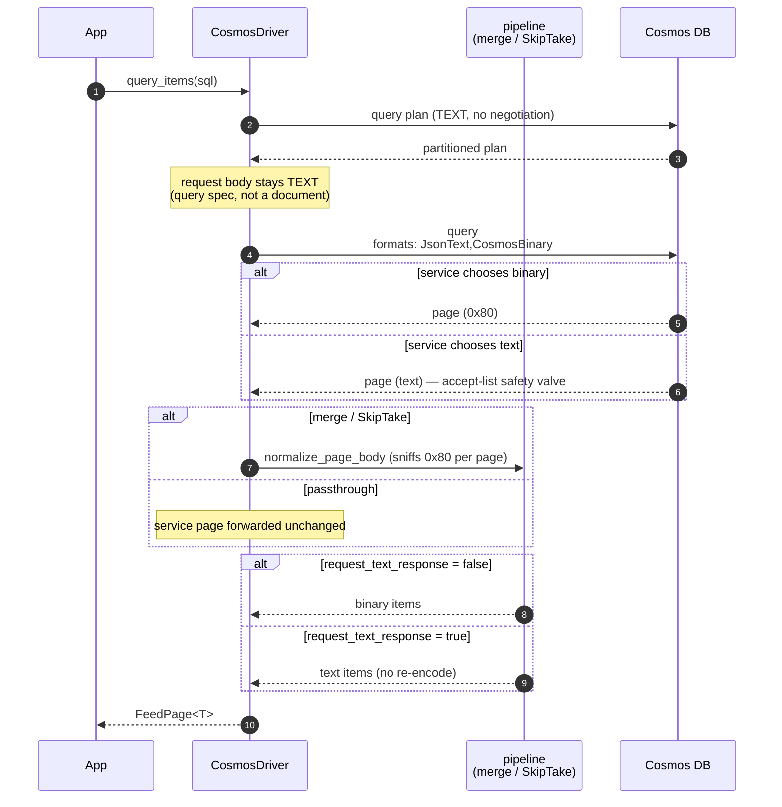

# Add binary encoding support for queries

Extends Cosmos binary JSON (the `0x80`-preamble wire format) from point operations to the query path. Previously a `query_items` call always received **text** pages, even with binary encoding enabled — so queries kept the integral-`Double` → integer deserialization divergence (#5028) that binary encoding exists to fix.

Opt-in and off by default; with the flag unset, behavior is byte-for-byte unchanged.

## Why

Binary encoding compresses *structure* — property names, numbers, booleans — not string contents. Measured against text on a live account, rotation-corrected runs:

| Query shape | response bytes | RU |
| --- | --- | --- |
| `SELECT *` (passthrough) | −43% | **−12.5%** |
| `ORDER BY` (streaming merge) | −45% | **−9.9%** |
| `TOP` (SkipTake) | −41% | −6.1% |
| `OFFSET` / `LIMIT` (SkipTake) | −32% | −5.2% |
| Projection | −40% | −0.4% |

RU savings on the heavier shapes are the headline: they scale with result-set size and are billed. Point operations (already binary before this PR) appear under [Measurements](#measurements) as baseline context.

Correctness matters as much as cost. The service's text JSON renders integral values as `Double`, so a wide integer can fail typed deserialization. Binary carries the integer tag, and this PR extends that guarantee to queries.

## What changed

**Negotiation.** Queries advertise `x-ms-cosmos-supported-serialization-formats: JsonText,CosmosBinary`, set once at the `plan_operation` choke point every per-page request flows through. An explicitly caller-set header is never clobbered, and `request_text_response` still yields text to the caller. The query *request* body stays text by design — `application/query+json` is a query spec, not a document.

The accept-list (rather than `CosmosBinary` alone) preserves .NET's safety valve: a service version or query shape that cannot produce binary answers in text and the query still succeeds. See [Known limitations](#known-limitations) for what that costs.

**All three query pipelines handle binary pages:**

| Pipeline | Change |
| --- | --- |
| Passthrough (single + cross-partition) | binary flows through `into_single` |
| Streaming `ORDER BY` | `parse_envelope_page` decodes binary envelopes; merged items emitted as binary |
| `OFFSET` / `LIMIT` / `TOP` | `split_feed_envelope` splits binary pages into per-document binary |

`OFFSET`/`LIMIT`/`TOP` was a **blocker**: cross-partition skip/take failed outright on binary pages before this.

Emitting merged `ORDER BY` items *as binary* is semantically load-bearing, not cosmetic. The binary deserializer coerces a service-echoed integral `Double` into an integer target; the text deserializer hard-fails on it. Emitting text would reintroduce the exact divergence for `ORDER BY` that passthrough queries no longer have.

## How a binary query page flows

The query-plan fetch is a separate text request, which is why the measured binary share of responses tops out in the 87–95% range across profiles rather than 100% — expected, not a leak.

`request_text_response` keeps the wire binary while handing back text, for text-only FFI hosts. This PR fixes a guard that previously made that mode skip negotiation entirely; it now matches the pure-binary arm byte-for-byte on every measured column.

## Testing

| Shape | Fuzzer | Emulator | Split-resume | Live A/B |
| --- | --- | --- | --- | --- |
| `SELECT *` (passthrough) | ✅ | ✅ | — | ✅ |
| `ORDER BY` (asc/desc, multi-column, string keys) | ✅ | ✅ | ✅ | ✅ |
| `OFFSET` / `LIMIT` | — | ✅ | ✅ | ✅ |
| `TOP` | — | ✅ | ✅ | ✅ |
| Projection | — | — | — | ✅ |
| Point read / create / replace / upsert / delete | ✅ | ✅ | — | ✅ |

- **Round-trip fuzzer** — 1000 real corpus documents × 3 encodings × (4 point ops + 2 queries: single-partition and full-container `ORDER BY`), all canonical-equal.
- **Negotiation matrix** — 6 emulator tests pinning the header→format contract, covering binary and text query responses, text fallback, and a text read of a binary-written item.
- **Number fidelity** — the service's rendering of a stored integral `Double` was measured directly against a live account before this change, reading one document over both encodings on the point-read, passthrough-query, and `ORDER BY` paths and requiring strict `serde_json::Value` equality. All paths agree, and the emulator's text branch was corrected to match what it measured. (Measurement harness not included in this PR.)
- **Live A/B** — 5 rounds × 3 arms (`text`, `binary`, `binary+text_resp`) across two document profiles; all three encodings agreed on every shape.
- Driver unit 2752 · emulator 156 (driver) + 78 (SDK) · native 105 — all green.

## Measurements

Live account, `corpus` profile (real documents, p50 310 B), 5 rounds × 200 ops:

| Workload | response B/op | request B/op | RU/op |
| --- | --- | --- | --- |
| `query_select_all` | −43.7% | — | −13.7% |
| `query_order_by` | −45.3% | — | −10.8% |
| `query_top` | −45.3% | — | −16.1% |
| `query_order_by_offset_limit` | −32.2% | — | −5.2% |
| `query_projection` | −40.0% | — | −0.4% |
| `point_read` | −46.6% | — | 0% |
| `point_create` / `replace` / `upsert` | — | −41.9% | −0.6% to −1.2% |

The `simple` profile (small flat documents, the worst case for binary) still returns −40% to −45% on query response bytes and −9.9% to −12.5% RU, with request bytes −25.9%.

## Known limitations

1. **A text fallback loses number fidelity.** If the service answers a query in text, the page is parsed by `serde_json` and the integer tag is lost, reintroducing #5028 for that response. This applies to *all* query shapes: passthrough forwards the service page untouched, and on the merge path `normalize_page_body` is a no-op on text (`build_page` has already re-encoded through `serde_json`). Point operations are unaffected — they demand `CosmosBinary` outright. Not observed in any measured run (the service chose binary every time), but it is reachable, and there is currently **no diagnostics signal** distinguishing "binary negotiated" from "binary received".

2. **Latency figures are directional only.** The A/B harness ran its arms in fixed order, so the last arm inherited a warm-up advantage — visible as a ~4% delta on `point_delete`, whose arms send byte-identical HTTP and therefore serve as a natural noise floor. This PR rotates arm order per round, dropping that to <1%. Post-fix, point operations show a small binary *cost* (+0.5% to +4.3%) that the old ordering had masked: the transcode is not free. One sample per cell; treat single-digit deltas as directional.

3. **Compression is untested.** Neither arm sends `Accept-Encoding: gzip`. Gzip would narrow the byte gap by an unmeasured amount, since text JSON compresses well. The byte savings above are uncompressed.

4. **Multi-item response iteration is not exposed over the C ABI**, so FFI hosts cannot reach individual query items regardless of encoding. Pre-existing and tracked in the `driver_native` README; noted here because the binary flag's documentation describes item-level decoding.

## Follow-ups

- Diagnostics signal for negotiated-vs-received format (addresses limitation 1's observability half).
- Binary-aware `parse_envelope_page` to skip the text intermediate.
- `delete` negotiation parity.
