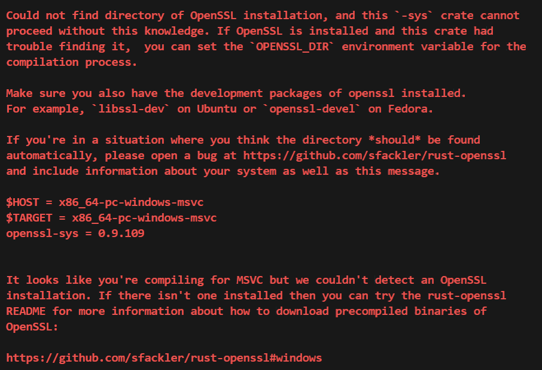
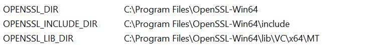

### Running Live Tests for Azure Data Cosmos
1. Create an account (and optionally a database). When using the emulator, the test framework automatically creates a default database (`emulator-test-db`) if one does not already exist. For cloud accounts you can create a database using:
   * [Azure Portal](https://portal.azure.com).
   * [Azure CLI](https://learn.microsoft.com/cli/azure).
   * [Azure ARM](https://learn.microsoft.com/azure/cosmos-db/quick-create-template).
1. Optionally set the `DATABASE_NAME` environment variable to the name of the database to use. If not set, it defaults to `emulator-test-db`.
1. Set the `RUSTFLAGS` environment variable to `"--cfg=test_category=\"emulator\" --cfg=test_category=\"multi_write\""`
1. Set the `RUST_TEST_THREADS` environment variable to `1` to ensure tests run serially.
1. Set the `AZURE_COSMOS_CONNECTION_STRING` environment variable to your Cosmos DB connection string.
1. Set the `ACCOUNT_HOST` environment variable to your Cosmos DB account host.
1. Run the tests using the following command:
`cargo +nightly test --lib --bins --tests --examples --package azure_data_cosmos --all-features --no-fail-fast -- --format json -Z unstable-options --nocapture`

### Common Issues
Using Windows, you might run into OpenSSL errors like the ones outlined below:

Ensure you have a proper installation of OpenSSL and that the relevant environment variables are populated like below:

### Useful commands to run before submitting a PR
* `cargo fmt --all`: This will format the code according to Rust's standard formatting guidelines.
* `cargo clippy --workspace --all-features --all-targets --keep-going --no-deps`: This will run Clippy, a linter for Rust code, to catch common mistakes and improve code quality.