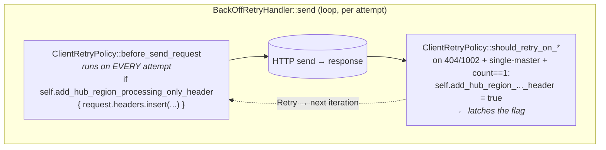

# Hub-Region Processing-Only Header Spec for `azure_data_cosmos`

**Status:** Draft / Iterating
**Confidence:** Medium — call graph for `ClientRetryPolicy` (single-master read budget, `before_send_request`/`should_retry_on_session_not_available` flow, `GlobalEndpointManager` → `LocationCache` mutex layering) is traced and verified against `main`; the backend's case-sensitivity for the `x-ms-cosmos-hub-region-processing-only` header value is **assumed** to match .NET's `bool.TrueString` (`"True"`) and is not verified against a backend contract reference.
**Date:** 2026-04-29
**Authors:** (team)
**Crate:** `azure_data_cosmos`
**Tracks:** [#4303](https://github.com/Azure/azure-sdk-for-rust/issues/4303)
**Mirrors:** [Azure/azure-cosmos-dotnet-v3#5447](https://github.com/Azure/azure-cosmos-dotnet-v3/pull/5447)

---

## Table of Contents

1. [Goals & Motivation](#1-goals--motivation)
2. [Architectural Overview](#2-architectural-overview)
3. [Behavior Specification](#3-behavior-specification)
4. [Code Changes](#4-code-changes)
5. [Side Effects & Risk](#5-side-effects--risk)
6. [Alternatives Considered](#6-alternatives-considered)
7. [Testing Strategy](#7-testing-strategy)
8. [Open Questions & Future Work](#8-open-questions--future-work)

---

## 1. Goals & Motivation

### Problem Statement

On a **single-master** Cosmos DB account using **Session** consistency, a region failover or
failback opens a catch-up window during which a satellite read region may not yet have applied
the latest writes. A read against the lagging region returns `404` with sub-status
`1002` (`READ_SESSION_NOT_AVAILABLE`).

Today the Rust `ClientRetryPolicy`'s session-not-available path for read requests on a
single-master account allows **one retry total** and routes that retry via write locations
(`retry_request_on_preferred_locations: false`) rather than rotating preferred read regions.
Concretely, in `should_retry_on_session_not_available` the counter is incremented at entry,
and the `!can_use_multiple_write_locations` branch returns `DoNotRetry` once
`session_token_retry_count > 1`. That single client-side reroute cannot ask the backend to
*guarantee* it serves the request from the hub (write) region, nor can it latch that
requirement across whatever retries do follow within the same operation, so the current
behavior offers no parity with the .NET fix described below.

The .NET SDK ([azure-cosmos-dotnet-v3#5447](https://github.com/Azure/azure-cosmos-dotnet-v3/pull/5447))
shipped a fix: when a 404/1002 fires inside a single-master operation, the SDK attaches a new
request header — `x-ms-cosmos-hub-region-processing-only: True` — to the retry and every
subsequent retry within the same operation. The backend honors the header by serving the
request from the hub (write) region, which is guaranteed to be current. .NET also retries
across all read endpoints (`sessionTokenRetryCount > ReadEndpoints.Count`) which gives the
header more attempts to ride on; Rust's existing single-retry budget gives the header exactly
one ride. This spec brings header-emission parity within Rust's current budget; extending the
budget for full retry-count parity is captured under [Future Work](#future-work). Issue
[#4303](https://github.com/Azure/azure-sdk-for-rust/issues/4303) tracks the parity work.

### Goals

1. **Header-emission parity with .NET, within Rust's existing retry budget.** Mirror .NET's
   gate (single-master only) and trigger (any 404/1002 on the path) such that whatever retries
   the existing Rust budget does permit carry the header. We do **not** extend the read-retry
   budget in this work item; see [Future Work](#future-work) and [ALT-5](#alt-5--extend-rusts-read-retry-budget-to-match-nets-readendpointscount-bound).
2. **Surgical, additive change.** No public-API change, no error-type change, no new options
   surfaced to callers. The feature is fully automatic.
3. **Forward-compatible on the wire.** Older backend builds that do not yet honor the header
   ignore it; behavior degrades gracefully to today's baseline.
4. **Contained blast radius.** All logic lives inside `ClientRetryPolicy`; existing retry
   budgets, delays, and status-code routing are unchanged.

### Non-Goals (This Spec)

- The 403/3 (`NotWriteRegion`) **skip-set rotation** flow described in the issue text. The
  .NET PR did not implement it; mirroring .NET is the explicit constraint of this work item.
  See [§6 Alternatives Considered](#6-alternatives-considered) for why this is intentional.
- A user-facing toggle to disable the header. The feature mirrors .NET's "always on for
  single-master" contract.
- Backend rollout coordination. The header is forward-compatible; older backends ignore it.
- Multi-master account behavior. Multi-master accounts never emit the header.

### Primary Target

Single-master Session-consistency reads during a region failover or failback catch-up window.
Specifically: any `read_item` / `query` / point-read on a single-master account where a
satellite region briefly lags behind the hub.

---

## 2. Architectural Overview

The Rust pipeline is shaped almost identically to .NET. The two relevant hooks already exist on
`ClientRetryPolicy`:

| .NET (`ClientRetryPolicy.cs`)         | Rust (`client_retry_policy.rs`)                      | Role |
|---------------------------------------|------------------------------------------------------|------|
| `OnBeforeSendRequest`                 | `before_send_request` (line ~150)                    | Sole pre-flight mutation hook for outbound headers / endpoint routing. |
| `ShouldRetryInternalAsync` — 404/1002 | `should_retry_on_session_not_available` (line ~267)  | Decides whether to retry a session-not-available failure and how many regions remain. |

The change introduces a single boolean field on `ClientRetryPolicy` — the *latch* — that is set
inside `should_retry_on_session_not_available` and consumed inside `before_send_request`. The
retry handler (`BackOffRetryHandler`) re-enters `before_send_request` for every attempt, which
is the property that lets the latched flag persist onto subsequent retries automatically.



`ClientRetryPolicy` is constructed once per top-level operation by
`retry_handler::retry_policy_for_request`. The latch's lifetime is therefore naturally bounded
to a single user-visible operation — see [§5 Side Effects & Risk](#5-side-effects--risk) for the
verification step required in implementation.

---

## 3. Behavior Specification

### 3.1 Trigger

The latch flips to `true` when **all** of the following hold inside a single
`ClientRetryPolicy` instance:

1. `should_retry_on_session_not_available` is invoked (i.e., the response was `404` with
   sub-status `1002 / READ_SESSION_NOT_AVAILABLE`).
2. `enable_endpoint_discovery` is `true`. (When discovery is disabled, the policy returns
   `DoNotRetry` and the latch is not touched.)
3. The **account** is single-master. Source the gate from
   `LocationCache::can_use_multiple_write_locations()` via the `GlobalEndpointManager`'s
   location cache — *not* from `ClientRetryPolicy.can_use_multiple_write_locations` and *not*
   from `GlobalEndpointManager::can_use_multiple_write_locations(request)`. Both of the
   latter are computed per request and return `false` for **all** read operations regardless
   of account topology, so they cannot serve as a single-master gate.
4. `self.session_token_retry_count == 1` after the increment at the top of
   `should_retry_on_session_not_available` — i.e., the call that is about to return `Retry`
   for the *first* permitted retry. Latching here, rather than at .NET's "second-or-later"
   point, is required because the existing single-master budget returns `DoNotRetry` once
   `session_token_retry_count > 1`; if we waited for the second 1002 the latch would flip on
   the same call that ends the operation and the header would never reach the wire.
   Consequence: this is a **deliberate parity gap** with .NET, which would have allowed the
   first retry to go without the header. It is the cost of staying inside Rust's current
   retry budget; full retry-count parity is captured in
   [ALT-5](#alt-5--extend-rusts-read-retry-budget-to-match-nets-readendpointscount-bound) and
   [Future Work](#future-work).

Once latched, the flag is **never reset** within the policy. .NET uses a single `volatile bool`
field with the same semantics. In Rust, plain `bool` is correct: `ClientRetryPolicy` is mutated
through `&mut self` for the duration of an operation (no concurrent access), so no atomicity
is required. This assumption must be preserved by future refactors and is recorded as part of
the SE-003 acceptance gate in [§7.4](#74-acceptance-gates-implementation-pr).

### 3.2 Outbound effect

On every subsequent attempt within the same operation, `before_send_request` checks the latch.
When set, it adds:

```text
x-ms-cosmos-hub-region-processing-only: True
```

to the outgoing `CosmosRequest`. The header value is the literal `"True"` (capitalized) — see
[§4.2(b)](#42-sdkcosmosazure_data_cosmossrcretry_policiesclient_retry_policyrs) for the wire-format rationale.
The header rides along on retries triggered by **any** status code that does still fall within
the policy's budget — connection failures (which are tracked under a separate budget,
`MAX_RETRY_COUNT_ON_CONNECTION_FAILURE`, rather than the `session_token_retry_count` budget),
endpoint-failure failovers, and any future status codes that produce additional attempts —
until the operation terminates.

### 3.3 What stays unchanged

- Retry budgets, delays, and status-code routing in `should_retry_on_*`.
- Client-side region selection in `RetryContext`. The header is a *backend* routing hint;
  Rust continues to drive its own region rotation through the existing failover ladder.
- Session-token propagation, partition-key handling, consistency-level handling.
- The existing inline `request.headers.insert(constants::ALLOW_TENTATIVE_WRITES, "true")` on
  `before_send_request` — that line stays exactly where it is and is the structural precedent
  the new header follows. The new header's *value* uses `"True"` to match .NET wire format
  (see [§4.2(b)](#42-sdkcosmosazure_data_cosmossrcretry_policiesclient_retry_policyrs)); the
  divergence from `ALLOW_TENTATIVE_WRITES`'s `"true"` is intentional.

### 3.4 Worked example

Single-master account, Session consistency, preferred regions `[East US 2, Central US]`,
write region `East US 2`.

| Attempt | Targeted region | Server response | Header on **this** attempt | Notes |
|---|---|---|---|---|
| 1 | East US 2 (write region, per `retry_request_on_preferred_locations: false`) | `404` / `1002` | _absent_ | First 404/1002. Counter goes 0→1. The call latches `add_hub_region_processing_only_header = true` *and* returns `Retry`. The retry it returns will carry the header. |
| 2 | East US 2 (same write region; client-side region rotation is unaffected by the header) | `200` ✓ | **`True`** | `before_send_request` reads the latch and emits the header. Backend honors hub-region-only processing. Operation completes. |

If attempt 2 were to fail with another `404 / 1002`, the existing single-master budget returns
`DoNotRetry` (`session_token_retry_count > 1`) and the operation surfaces the error to the
caller. This is the deliberate parity gap noted in [§3.1](#31-trigger): the header reached the
wire on the one retry the current budget allows, but Rust does not retry across additional
read endpoints the way .NET does. Extending the budget would close the gap; that is captured
in [ALT-5](#alt-5--extend-rusts-read-retry-budget-to-match-nets-readendpointscount-bound) and
deferred to Future Work.

---

## 4. Code Changes

### 4.1 `sdk/cosmos/azure_data_cosmos/src/constants.rs`

Add **one** entry to the existing `cosmos_headers!` macro invocation, adjacent to
`ALLOW_TENTATIVE_WRITES`:

```rust
cosmos_headers! {
    // ... existing entries ...
    ALLOW_TENTATIVE_WRITES => "x-ms-cosmos-allow-tentative-writes",
    SHOULD_PROCESS_ONLY_IN_HUB_REGION => "x-ms-cosmos-hub-region-processing-only",
    // ... existing entries ...
}
```

The macro auto-defines the constant via `HeaderName::from_static` *and* auto-registers it in
`COSMOS_ALLOWED_HEADERS` (used by the default logging policy). Do **not** define the constant
outside the macro and do **not** hand-edit `COSMOS_ALLOWED_HEADERS`.

### 4.2 `sdk/cosmos/azure_data_cosmos/src/retry_policies/client_retry_policy.rs`

**(a) Add the latch field.** Insert into the `ClientRetryPolicy` struct alongside the other
retry-state counters:

```rust
/// Latched flag indicating that subsequent attempts in this operation must carry
/// the `x-ms-cosmos-hub-region-processing-only` header. Set in
/// `should_retry_on_session_not_available` for single-master accounts on the
/// first 404/1002 within the operation (`session_token_retry_count == 1` after
/// the increment); never reset within the policy. Mirrors the
/// `addHubRegionProcessingOnlyHeader` field added in .NET PR #5447. Plain `bool`
/// is correct because `ClientRetryPolicy` is mutated through `&mut self` for
/// the duration of an operation; no atomicity is required.
add_hub_region_processing_only_header: bool,
```

Initialize to `false` in `ClientRetryPolicy::new`.

**(b) Apply the header.** In `before_send_request`, after the existing routing logic and
**immediately adjacent** to the existing `ALLOW_TENTATIVE_WRITES` line (currently around
line 168), add:

```rust
if self.add_hub_region_processing_only_header {
    request
        .headers
        .insert(constants::SHOULD_PROCESS_ONLY_IN_HUB_REGION, "True");
}
```

The literal must be `"True"` (capitalized first letter). .NET writes `bool.TrueString`, which
is `"True"`, and that is the wire value the backend has been validated against. The adjacent
`ALLOW_TENTATIVE_WRITES` line uses lowercase `"true"`, but that is a different header with its
own (independent) backend parser; we cannot assume the new header's parser is case-insensitive
without a contract reference. Do **not** use `"true"` (lowercase) or `"True".to_string()`.

**(c) Set the latch.** In `should_retry_on_session_not_available`, after the
discovery-enabled early return (`if !self.enable_endpoint_discovery { return DoNotRetry }`)
and the counter increment around line 268, but **before** the budget/gating
conditionals that decide `Retry` vs `DoNotRetry`:

```rust
if !self.add_hub_region_processing_only_header
    && self.session_token_retry_count == 1
    && !self.global_endpoint_manager.account_supports_multi_write()
{
    self.add_hub_region_processing_only_header = true;
    debug!(
        "latched x-ms-cosmos-hub-region-processing-only for single-master \
         session retry"
    );
}
```

Notes on the gate:

- The single-master check goes through a new forwarding accessor on
  `GlobalEndpointManager`, **not** a borrow of the `LocationCache` itself: the
  `location_cache` field is `Mutex<LocationCache>` (`global_endpoint_manager.rs:31`),
  so any accessor that returned `&LocationCache` would not be lifetime-compatible
  with method chaining behind the lock guard. Add this method to
  `GlobalEndpointManager`:

  ```rust
  pub(crate) fn account_supports_multi_write(&self) -> bool {
      self.location_cache
          .lock()
          .unwrap()
          .can_use_multiple_write_locations()
      // (.unwrap() is consistent with existing callers at lines 354 and 283
      // that .lock().unwrap() the same mutex.)
  }
  ```

  This wraps `LocationCache::can_use_multiple_write_locations()`
  (`location_cache.rs:381`), which is account-level (`write_endpoints().len() > 1`).
  Do **not** use `self.can_use_multiple_write_locations` on the policy — that field
  is populated from `GlobalEndpointManager::can_use_multiple_write_locations(request)`
  (line 242) which returns `false` for all read operations regardless of account
  topology, and would cause the latch to fire for every read on a multi-master
  account too.
- The trigger uses `== 1` (exact equality), matching the boundary that pins this
  latch to Rust's existing single-master read-retry budget. See
  [§3.1](#31-trigger) for the parity-gap rationale.
- The condition uses `!self.global_endpoint_manager.account_supports_multi_write()`
  (logical negation) rather than `... == false`, which clippy's `bool_comparison`
  lint flags. §7.3 enforces `cargo clippy -- -D warnings`, so the example must
  match the lint policy.

Also, at the increment site itself (`self.session_token_retry_count += 1;`, line 268), add a
short inline comment cross-referencing this spec so a future refactor that moves the
increment doesn't silently flip the trigger boundary:

```rust
// HUB_REGION_PROCESSING_HEADER_SPEC.md §3.1: the latch trigger pins to
// session_token_retry_count == 1 *after* this increment. Moving the
// increment changes the trigger boundary.
self.session_token_retry_count += 1;
```

Extend the existing `use tracing::error;` import to `use tracing::{debug, error};`.

**(d) Doc-comment hygiene (opportunistic).** The surrounding doc comments on
`should_retry_on_session_not_available` and `should_retry_on_http_status` cite "404.1022" for
session-not-available; the actual sub-status is `1002` (`READ_SESSION_NOT_AVAILABLE`).
`PARTITION_KEY_RANGE_GONE` is sub-status `1002` of status `410`, not `404`. Correct in the
same edit.

### 4.3 `sdk/cosmos/azure_data_cosmos/CHANGELOG.md`

A `## 0.32.0 (Unreleased)` block already exists at the top of `main` with a
`### Breaking Changes` subsection. **Do not** create a new version block. Instead, insert a
new `### Features Added` subsection above the existing `### Breaking Changes`, matching the
`Features Added → Breaking Changes → Other Changes` ordering used in `0.31.0`:

```markdown
## 0.32.0 (Unreleased)

### Features Added

- Added `x-ms-cosmos-hub-region-processing-only` request header on retries after
  `404`/`1002` for single-master accounts, opting the retry into hub-region processing
  during failover/failback windows. ([#NNNN](https://github.com/Azure/azure-sdk-for-rust/pull/NNNN))

### Breaking Changes

- _(existing entries — leave unchanged)_
```

The `(#NNNN)` suffix is mandatory; replace with the implementation PR number once opened.
The implementer should re-verify the block is still `(Unreleased)` immediately before opening
the PR; if it has been cut to a release in the interim, create a new `## 0.33.0 (Unreleased)`
block above it.

### 4.4 No changes required

- No `Cargo.toml` change.
- No public API, options, or builder change.
- No change to `request_options.additional_headers`, `COSMOS_ALLOWED_HEADERS` (the macro
  handles it), or `cosmos_pipeline.rs`.
- No integration-test fixture change.

---

## 5. Side Effects & Risk

| ID     | Severity        | Description | Mitigation |
|--------|-----------------|-------------|------------|
| SE-001 | 🟡 Potential    | Backend rollout asymmetry — older regions ignore the header; behavior reverts to today's baseline (no recovery during failback). | Forward-compatible by design. Document graceful degradation in CHANGELOG. No code mitigation required. |
| SE-002 | 🟡 Potential    | Future backend mis-routing if header were honored on multi-master accounts. | Latch is gated by the **account-level** check `LocationCache::can_use_multiple_write_locations()`; the per-request fields are explicitly avoided. Asserted in unit test ([§7.1](#71-unit-tests) AC-4). |
| SE-003 | 🔴 Breaking — accepted via AG-1..AG-4 | Latch correctness depends on `ClientRetryPolicy` being constructed fresh per top-level operation. If the policy is ever pooled or reused across operations, the latch leaks and the header attaches to unrelated requests. | **Promoted to a hard acceptance gate** for the implementation PR — see [§7.4](#74-acceptance-gates-implementation-pr). The plain `bool` field choice ([§3.1](#31-trigger)) further depends on `&mut self`-only access being preserved by future refactors. |
| SE-004 | 🟢 Minor        | Spec deviation: the issue text describes a 403/3 "skip-set rotation" flow. The .NET PR did not implement it; we mirror .NET. | Documented in [§6](#6-alternatives-considered) (ALT-4) and [§8](#8-open-questions--future-work) (OQ-1). Existing `should_retry_on_endpoint_failure` already rotates on 403/3 and the latched header rides along. |
| SE-005 | 🟢 Minor        | Pre-existing inline doc-comment typo `404.1022 → 404.1002 (READ_SESSION_NOT_AVAILABLE)`. | Fixed opportunistically in §4.2(d). |

### Cross-cutting concerns touched

- **Retry logic & policies** — direct change site; additive only.
- **Telemetry / tracing** — one new `debug!` event when the latch flips. Low cost, high
  diagnostic value during failover events.
- **Wire format** — one additive forward-compatible outbound header. No request body or
  response handling change.
- **Consistency level handling** — 404/1002 is a Session-consistency symptom; backend
  honors the header for consistency `< Strong`. We trigger purely on response code, matching
  .NET — no client-side consistency-level branching.
- **Cross-region failover & preferred locations** — touched **by association**. The header
  is a backend routing hint, not a client-side region change. Client-side region selection in
  `ClientRetryPolicy` is unchanged.

### Cross-cutting concerns NOT touched

Authentication / token refresh, connection pooling, session token propagation, partition key
handling, configuration / initialization, async execution / cancellation,
serialization / response parsing.

---

## 6. Alternatives Considered

### ALT-1 — Reuse the existing `RetryContext.route_to_hub` field

**Verdict:** Rejected.
The existing `route_to_hub` field on `RetryContext` controls *client-side* routing (via
`request_context.route_to_location_endpoint(hub_uri)`), not header emission. Conflating the
two would force every latched retry to be sent directly to the local hub URI — which is **not**
what .NET does. .NET keeps the existing client-side failover ladder and lets the *backend*
re-route via the header. Adding a separate boolean keeps the two concerns orthogonal and
preserves .NET parity.

### ALT-2 — Set the header directly in `should_retry_on_session_not_available`, no latch

**Verdict:** Rejected.
A latch is still preferable even though, under Rust's current single-master budget, only one
post-1002 retry exists today. The latch keeps the wire-emission decision in
`before_send_request` (the canonical outbound-mutation hook), separates "trigger" from
"emission" so future budget extensions ([ALT-5](#alt-5--extend-rusts-read-retry-budget-to-match-nets-readendpointscount-bound))
slot in without restructuring, and matches .NET's shape (`addHubRegionProcessingOnlyHeader`
field) at zero extra cost.

### ALT-3 — Plumb the latch through `RequestContext` (per-request) instead of `ClientRetryPolicy`

**Verdict:** Rejected.
`RequestContext` is reset per attempt; the latch state would have to be re-derived on every
retry, requiring the policy to inspect history each time. State on the policy mirrors .NET
exactly and matches Rust's lifetime model — `ClientRetryPolicy` is per-operation, giving the
latch a natural and bounded scope at no extra plumbing cost.

### ALT-4 — Implement the full issue-text spec, including the 403/3 NotWriteRegion skip-set rotation

**Verdict:** Rejected for this work item.
The user explicitly directed mirroring .NET PR #5447, which did **not** implement the
skip-set rotation. The existing `should_retry_on_endpoint_failure` already rotates on 403/3,
and the latched header rides along on the rotated retry — producing observably equivalent
behavior to the more elaborate flow described in the issue. If a future work item proves a
dedicated rotation is required, file a follow-up. See OQ-1 in [§8](#8-open-questions--future-work).

### ALT-5 — Extend Rust's read-retry budget to match .NET's `ReadEndpoints.Count` bound

**Verdict:** Rejected for this work item; captured as [Future Work](#future-work).
True observable parity with .NET PR #5447 — header rides every read endpoint until the budget
is exhausted, including the latch-on-second-1002 trigger point .NET uses — requires changing
the `else if self.session_token_retry_count > 1 { return DoNotRetry; }` branch in
`should_retry_on_session_not_available` (around line 294 of `client_retry_policy.rs`) to bound
on `global_endpoint_manager.read_endpoints().len()` and to retry across preferred read regions
rather than via write locations. That is a semantic change to the single-master read retry
contract that affects every read in the SDK, not just 404/1002. Bundling it with header
injection couples two unrelated risks. Day 1 ships header-emission parity within the existing
budget; if post-rollout telemetry shows the single retry is insufficient, file a follow-up
that adopts the .NET budget and at the same time moves this latch's trigger to
`session_token_retry_count >= 2` for full parity.

---

## 7. Testing Strategy

### 7.1 Unit Tests

Add new `#[tokio::test] async fn` entries inside the existing
`#[cfg(test)] mod tests` block in `client_retry_policy.rs`, immediately following
`test_should_retry_session_not_available_single_write` (~line 1037). Use the local
`test_*` naming prefix to match the file's existing convention (the global copilot
guidance to omit `test_` does **not** apply here — every test in this file uses the prefix).

| ID    | Name (suggested)                                                | Asserts |
|-------|-----------------------------------------------------------------|---------|
| AC-1  | `test_session_not_available_no_header_before_first_retry`       | Single-master, fresh policy, before any 404/1002 → `before_send_request` does NOT emit the header. |
| AC-2  | `test_session_not_available_emits_header_on_first_retry`        | Single-master, drive one 404/1002 through `should_retry_on_session_not_available` → next `before_send_request` DOES emit `x-ms-cosmos-hub-region-processing-only: True` (capitalized, exact wire value). |
| AC-3  | `test_session_not_available_latch_pins_to_counter_eq_1`         | Boundary regression. Pre-set `session_token_retry_count = 0` and call into the latch path → latch flips ON and `before_send_request` emits the header. Pre-set `session_token_retry_count = 1` (so the increment at line 268 takes it to 2) → policy returns `DoNotRetry` and the latch does NOT flip. Protects the trigger from silent breakage if the increment is ever moved. |
| AC-4  | `test_session_not_available_no_header_for_multi_master`         | Multi-master account (mock `LocationCache::can_use_multiple_write_locations()` to return `true`), any number of 404/1002 invocations → header NEVER emitted. Pin specifically to the **account-level** gate, not to `ClientRetryPolicy.can_use_multiple_write_locations`. |
| AC-5  | `test_session_not_available_no_header_when_discovery_disabled`  | `enable_endpoint_discovery = false` → policy returns `DoNotRetry`, latch never set. |
| AC-6  | `test_hub_region_header_persists_across_connection_failure`     | After AC-2 latches the flag, drive a connection failure that takes the same-endpoint retry path (tracked under `MAX_RETRY_COUNT_ON_CONNECTION_FAILURE`, separate from the `session_token_retry_count` budget) → `before_send_request` STILL emits the header. Confirms the latch survives intervening attempts that exist under the current budget. |

The earlier AC-3 / AC-6 / AC-7 tests covering "post-latch retry on 503" and "post-latch retry
on 410/1022" have been intentionally **dropped**: under Rust's current single-master read
budget, a second 404/1002 returns `DoNotRetry` and there is no further attempt for the header
to ride on. Re-adding those tests is part of the work captured in
[ALT-5](#alt-5--extend-rusts-read-retry-budget-to-match-nets-readendpointscount-bound) /
[Future Work](#future-work) (extending the budget).

Test mechanics follow the existing pattern: build a `ClientRetryPolicy` with a mocked
`GlobalEndpointManager`, call `policy.should_retry(...)` with a synthetic 404/1002, then call
`policy.before_send_request(&mut request)` and assert
`request.headers.get(constants::SHOULD_PROCESS_ONLY_IN_HUB_REGION)` is `Some("True")` or `None`
as appropriate. Note the value is `"True"` (capitalized), not `"true"` — see
[§4.2(b)](#42-sdkcosmosazure_data_cosmossrcretry_policiesclient_retry_policyrs).

### 7.2 Integration Tests

No new recorded integration tests are required for this work item. Existing emulator-backed
fault-injection coverage in
`sdk/cosmos/azure_data_cosmos/tests/multi_write_tests/cosmos_multi_write_fault_injection.rs`
exercises 404/1002 paths and is expected to remain green; those tests assert on retry counts /
regions, not on outbound headers, so the additive header does not flip them. Phase 3+ may
optionally add a single recorded scenario asserting the header on a captured retry request.

### 7.3 Validation Gates

Before opening the PR:

```text
cargo fmt -p azure_data_cosmos
cargo clippy -p azure_data_cosmos --all-features -- -D warnings
cargo build -p azure_data_cosmos --all-features
cargo test  -p azure_data_cosmos --all-features
```

All four must pass with no diff (fmt) and no warnings (clippy).

### 7.4 Acceptance gates (implementation PR)

These gates promote SE-003 (latch lifetime) and the threading-model assumption from §3.1 from
"side effects" to **blocking** items for the implementation PR. They are intentionally
out-of-scope for this spec PR but must all hold before code review can be requested:

1. **AG-1: Per-operation construction.** Verify in `BackOffRetryHandler::retry_policy_for_request`
   (or the equivalent constructor of `ClientRetryPolicy` used by the retry handler) that a
   *fresh* policy is constructed per top-level operation, with the source-line anchor cited in
   the PR description. If the policy is reused across operations, this design is invalid as
   written and must add an explicit reset hook at the operation boundary.
2. **AG-2: Cross-operation isolation test.** Add a unit test that constructs two policies
   sequentially, latches the first, and asserts the second policy's
   `add_hub_region_processing_only_header` is `false` on a fresh request.
3. **AG-3: Within-operation persistence test.** Confirm AC-6 (above) covers the assertion that
   the latch survives intervening retries (connection failure, endpoint failure) within the
   same operation.
4. **AG-4: Threading-model invariant.** Spot-check that no path mutates `ClientRetryPolicy`
   from anything other than `&mut self` (no `Arc<Mutex<...>>` wrapping, no shared clones) for
   the duration of an operation. The plain `bool` ([§3.1](#31-trigger)) is correct only under
   this invariant.

---

## 8. Open Questions & Future Work

### OQ-1 — Skip-set rotation parity *(resolved: Day 1 = .NET parity, no broader rotation)*

Issue [#4303](https://github.com/Azure/azure-sdk-for-rust/issues/4303) gestures at a broader
region-rotation flow (skip-set rotation on 403/3 NotWriteRegion) that .NET PR
[#5447](https://github.com/Azure/azure-cosmos-dotnet-v3/pull/5447) deliberately did not
implement. **Decision (owner-confirmed):** Day 1 ships .NET parity only — the
`x-ms-cosmos-hub-region-processing-only` header and its latch. Skip-set rotation is
explicitly out of scope for this work item. Rationale:

1. The header alone resolves the 404/1002 failback storm in .NET production telemetry; that
   is the validated fix, and parity with that fix is what #4303 is asking for on Day 1.
2. Skip-set rotation is a net-new design that touches `LocationCache` / preferred-region
   state and the `should_retry_on_endpoint_failure` path. Bundling that with header
   injection couples two unrelated risks in a single PR.
3. The latch introduced in §4.2 is the exact hook any future rotation logic would attach to,
   so deferring rotation is reversible at zero cost to this design.

Rotation is captured below under **Future Work** for a possible follow-up if post-rollout
telemetry shows the header alone is insufficient.

### OQ-2 — CHANGELOG version block *(resolved: append under existing `0.32.0 (Unreleased)`)*

Verified on `main` at spec time: the CHANGELOG already has an open
`## 0.32.0 (Unreleased)` block with a `### Breaking Changes` subsection. **Resolution:** add a
new `### Features Added` subsection above the existing `### Breaking Changes` (matching the
`Features Added` → `Breaking Changes` → `Other Changes` ordering used in `0.31.0`). Do not
introduce a new version block. Implementer should re-verify the block is still
`(Unreleased)` immediately before opening the PR; if the block has been cut to a release in
the interim, create a new `## 0.33.0 (Unreleased)` block above it.

### Future Work

- **Extend single-master read retry budget for full .NET parity ([ALT-5](#alt-5--extend-rusts-read-retry-budget-to-match-nets-readendpointscount-bound)).**
  Day 1 ships header-emission parity within Rust's existing one-retry budget. .NET's
  observable parity additionally retries across all read endpoints
  (`sessionTokenRetryCount > ReadEndpoints.Count`) and uses a "second-or-later" trigger.
  Reaching that requires changing the `else if session_token_retry_count > 1 { DoNotRetry }`
  branch in `should_retry_on_session_not_available` and rotating preferred read regions
  rather than retrying via write locations, and the latch's trigger would then move from
  `== 1` back to `>= 2`. File a follow-up if post-rollout telemetry shows the single retry
  is insufficient, or if maintainers decide retry-count parity is required up front.
- **Dedicated 403/3 skip-set rotation.** Day 1 explicitly ships .NET parity only. If
  post-rollout telemetry shows the header alone is insufficient — i.e. failback storms
  persist after the latched hub-targeted retry — file a follow-up to add an explicit
  skip-set in `should_retry_on_endpoint_failure`. The latch added in §4.2 is the intended
  hook point.
- **Diagnostics surface.** Surface "hub-region-only retry" as a first-class field on the
  Cosmos diagnostics object once the broader diagnostics design (see
  [Feed Operations Spec](https://github.com/Azure/azure-sdk-for-rust/pull/4261)) lands.
- **Backend rollout dashboarding.** Coordinate with service partners on a metric for
  header-honored vs. header-ignored response distributions during failover events.
