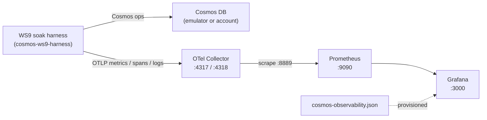

<!--
Copyright (c) Microsoft Corporation. All rights reserved.
Licensed under the MIT License.
-->

# WS9 soak runbook — Cosmos Rust SDK client observability

This runbook shows how to exercise the Azure Cosmos DB Rust SDK's client-side
observability layer (WS9 / [PR #4789](https://github.com/Azure/azure-sdk-for-rust/pull/4789))
under a long-running soak, view the signals in Grafana, and judge them against
the **R1** acceptance criteria: *quiet at steady state, rich on error*.

It has three moving parts:

1. The **WS9 soak harness** — a long-running load generator that drives Cosmos
   operations and, mid-run, injects a 5–10 minute fault window. Built in parallel
   on branch [`cosmos-ws9-harness`](https://github.com/Azure/azure-sdk-for-rust/tree/cosmos-ws9-harness);
   that branch's `README` is the source of truth for its exact CLI/flags.
2. The **local telemetry stack** — an OpenTelemetry Collector, Prometheus, and
   Grafana, defined by the [`observability/`](../observability) docker-compose.
3. The **dashboard** — [`dashboards/cosmos-observability.json`](../dashboards/cosmos-observability.json),
   auto-provisioned into Grafana.



## What the SDK emits (recap)

The observability layer is **additive and off by default**. The soak turns it on
and registers the built-in handlers; see the
[diagnostics contract](../../azure_data_cosmos_driver/DIAGNOSTICS-CONTRACT.md)
for the full mapping. The three signals:

- **Metrics** (always-on, low cardinality) — the dashboard's fuel. Primary series
  is the stable `db.client.operation.duration` histogram (seconds). Opt-in dev
  metrics: `azure.cosmosdb.client.operation.request_charge` (RU) and
  `db.client.response.returned_rows`.
- **Traces** — tail-sampled, backdated spans. A completed operation emits a span
  **only** when it fails or crosses a latency/RU threshold (a fast 5 ms point read
  emits nothing).
- **Logs** — rate-limited sampling-log lines, emitted on the same failure /
  threshold gate and capped per interval so an error storm stays bounded.

## Prerequisites

- Docker + Docker Compose (for the telemetry stack).
- A Rust toolchain matching the repo `rust-toolchain.toml` (to build/run the
  harness).
- A Cosmos DB target. Either the local emulator (see the repo `sdk/cosmos`
  emulator docs) or a real account; the harness reads a standard
  `AZURE_COSMOS_CONNECTION_STRING` / endpoint + credential.

## Step 1 — Start the telemetry stack

```bash
cd sdk/cosmos/azure_data_cosmos_benchmarks/observability
docker compose up -d
docker compose ps        # all three services should be "running"/"healthy"
```

Endpoints:

- Grafana — <http://localhost:3000> (login `admin` / `admin`). The
  **Cosmos WS9** folder already contains the imported dashboard.
- Prometheus — <http://localhost:9090>.
- OTLP ingest — `localhost:4317` (gRPC) and `localhost:4318` (HTTP), for the
  harness to export to.

Sanity-check the Collector is receiving nothing yet but is healthy:

```bash
docker compose logs --tail=20 otel-collector
curl -s http://localhost:8889/metrics | head        # empty until the harness runs
```

## Step 2 — Configure and run the WS9 soak harness

The harness lives on `cosmos-ws9-harness`. Check that branch out (or its merge
into the combined WS9 branch) and follow its `README`; the pieces this runbook
depends on are:

### 2a. Enable the SDK observability layer

The OTel handlers are behind the crate's `metrics` and `distributed_tracing`
features and are registered on the client builder. Conceptually:

```rust
use std::sync::Arc;
use azure_data_cosmos::diagnostics::{CosmosMetricsHandler, MetricsOptions};

// Opt into the dev metrics + extended attributes so every dashboard panel and
// the $region template variable have data. Drop these toggles to soak the
// stable, low-cardinality default instead.
let metrics = MetricsOptions::default()
    .with_request_charge_metric(true)
    .with_returned_rows_metric(true)
    .with_extended_attributes(true);

let client = CosmosClientBuilder::new(endpoint, credential)
    .with_diagnostics_handler(Arc::new(CosmosMetricsHandler::with_options(metrics)))
    // ... plus the tracing + sampling-log handlers, per the harness README ...
    .build()?;
```

> **Install the OTel meter provider *before* constructing `CosmosMetricsHandler`.**
> The handler captures a `Meter` at construction; one obtained while the global
> provider is still the no-op default stays a no-op, and metrics are silently
> dropped.

### 2b. Export OTLP to the Collector

The harness installs an OTLP metrics (and, for traces, span) exporter pointed at
the local Collector. Standard OpenTelemetry environment variables:

```bash
export OTEL_SERVICE_NAME=cosmos-ws9-soak
export OTEL_EXPORTER_OTLP_ENDPOINT=http://localhost:4318
export OTEL_EXPORTER_OTLP_PROTOCOL=http/protobuf
export OTEL_METRIC_EXPORT_INTERVAL=5000        # ms; align with Prometheus scrape
```

### 2c. Run the soak with a fault window

Start a long steady-state run, then inject a **5–10 minute** fault window partway
through (the harness exposes this; typical shape below):

```bash
# Long steady-state soak (hours) with a fault window injected mid-run.
cargo run -p <ws9-harness-crate> --release -- \
    --duration 12h \
    --workload mixed-point-and-query \
    --target-rps 500 \
    --fault-start 2h --fault-duration 8m \
    --fault-kind throttling+timeouts        # 429 / 503 / injected latency
```

Note the wall-clock start/end of the fault window — you'll line it up against the
dashboard.

## Step 3 — Confirm data is flowing

```bash
# SDK series now present at the Collector's Prometheus endpoint:
curl -s http://localhost:8889/metrics | grep db_client_operation_duration_seconds | head

# Same series visible in Prometheus:
#   http://localhost:9090/graph?g0.expr=db_client_operation_duration_seconds_count
```

In Grafana, open **Cosmos WS9 -> Azure Cosmos DB — Rust SDK Client Observability
(WS9)**. Pick the Prometheus datasource if prompted; leave `operation` and
`region` on *All*.

## Step 4 — Interpret the dashboard

### Steady state — "quiet"

During the non-fault portion of the soak:

- **Throughput (ops/sec)** — steady, matching `--target-rps`.
- **Error rate** — pinned at ~0%; the *Errors* row panels are flat/empty.
- **Duration P50/P95/P99** — low and stable (point reads in the low-ms range);
  no sustained upward drift.
- **Request charge (RU)** — a stable band on the heatmap; RU quantiles flat.
- **Active client instances** — the client count (or *No data*; see the note in
  Step 4's caveats).
- **Off the dashboard:** span emission is **near zero** (tail sampling skips fast
  successes) and sampling-log output is **near zero**. Watch the Collector debug
  log — at steady state it should be almost entirely metric data points, with
  essentially no spans or log records. Host CPU for the SDK/telemetry path stays
  bounded and flat.

This is R9 in action: no per-fast-op lock/log/span cost. If you see a steady
stream of spans or log lines during quiet operation, the tail-sampling thresholds
are mis-tuned — that is a finding.

### Fault window — "rich on error"

Line the panels up with the injected 5–10 minute window:

- **Error rate** jumps off zero; **Errors/sec by status code** shows the injected
  codes (e.g. `429`, `503`); **Errors/sec by error.type** mirrors them
  (`error.type` carries the status-code string, or `_OTHER` when none is
  available).
- **Duration P95/P99** climb (retries + injected latency); **P95 by operation**
  and **by server.address** localize *which* operation/endpoint degraded.
- **Request charge** may rise if throttling triggers retries.
- **Throughput** may dip as operations back off.
- **Off the dashboard:** a **bounded burst** of tail-sampled spans appears for the
  failing/slow operations (backdated over each operation's real time window), and
  the sampling-log handler emits a **capped** number of failure lines per interval
  plus a single `"suppressed N until reset"` line per window — the storm is
  visible but never unbounded (R5). Each emitted span/log carries the sampling
  reason (`failure`, `point_latency`, `non_point_latency`, `request_charge`).

Together the three signals root-cause the window: **metrics** say *what and when*
(which status, which operation, how bad, how long), a **few spans** show the
*per-attempt* shape of representative failures (regions contacted, sub-status,
retry tree), and the **rate-limited logs** give a bounded textual trail — without
pegging CPU.

### Caveats when reading panels

- **Opt-in metrics read *No data* by default.** RU and returned-rows panels need
  `with_request_charge_metric(true)` / `with_returned_rows_metric(true)`. The
  `$region` variable needs `with_extended_attributes(true)`.
- **`active_instance.count` is deferred** — not emitted by the SDK yet (pending
  client-lifecycle wiring, PR #4789), so that panel stays *No data*. It's kept so
  the dashboard is complete the moment the instrument lands.
- **Region vs. endpoint.** `azure.cosmosdb.operation.contacted_regions` is an
  opt-in, array-valued attribute and may be flattened by the exporter; the
  always-on, scalar **`server.address`** breakdown ("P95 by server.address") is
  the reliable locational view.

## Step 5 — R1 acceptance criteria

R1: *a long-running (10–12 h) benchmark must be quiet at steady state and rich on
error — enough to root-cause a 5–10 minute error window.* Score the soak against
this checklist:

| # | Criterion | How to verify | Pass looks like |
| -- | --------- | ------------- | --------------- |
| 1 | Near-zero telemetry **noise** at steady state | Collector debug log + span/log exporters during the quiet phase | No per-fast-op spans or log lines; only low-cardinality always-on metric points |
| 2 | **Bounded CPU** at steady state | Host/process CPU (or the benchmark's own CPU sampling) over the quiet phase | Flat, bounded overhead; no growth over hours |
| 3 | Metrics **coverage** | Dashboard populated across the whole run | Latency, throughput, error-rate panels continuously populated from the stable duration metric |
| 4 | **Full root-cause signal** during the fault window | Errors row + spans + logs, aligned to the injected window | Status/error.type visible in metrics; a few tail-sampled spans for representative failures; rate-limited failure logs |
| 5 | **Bounded under storm** | Span/log volume during the fault window | Emission capped per interval with a `"suppressed N"` summary; no unbounded artifact even under a 429/503 storm |
| 6 | Signal is **sufficient to root-cause** | Attempt an RCA of the injected fault from the dashboard + a handful of spans/logs alone | The window's operation, status, timing, and blast radius are identifiable without a full-verbosity trace of every op |

If steady state is noisy (criteria 1–2) the tail-sampling thresholds or
rate-limit are mis-tuned; if the fault window is *thin* (criteria 4–6) they are
too aggressive. R1 is the balance between the two.

## Teardown

```bash
cd sdk/cosmos/azure_data_cosmos_benchmarks/observability
docker compose down            # keep Prometheus/Grafana volumes
docker compose down -v         # also drop stored metrics + Grafana state
```

## Troubleshooting

- **Grafana panels all say *No data*.** Confirm the harness is running and
  exporting; `curl -s http://localhost:8889/metrics | grep db_client_operation`
  should be non-empty. If empty, the SDK meter provider was installed *after* the
  handler was built (metrics silently dropped) — install it first.
- **Only latency panels populate.** Expected on the default `MetricsOptions`;
  enable the opt-in metrics (Step 2a) for RU / returned-rows / `$region`.
- **`$region` is empty.** Enable extended attributes; otherwise use the
  always-on `server.address` panels.
- **Prometheus target down.** Check `http://localhost:9090/targets`; the
  `cosmos-sdk` job scrapes `otel-collector:8889` on the compose network.
- **Duplicate/renamed series.** The exporter normalizes OTel names (dots ->
  `_`, `_seconds` suffix on the duration histogram). Query the normalized names
  from the [dashboards README](../dashboards/README.md) mapping table.

## References

- [Diagnostics contract & OTel mapping](../../azure_data_cosmos_driver/DIAGNOSTICS-CONTRACT.md)
- [Dashboard README](../dashboards/README.md)
- [Local telemetry stack](../observability)
- WS9 soak harness — branch `cosmos-ws9-harness`
