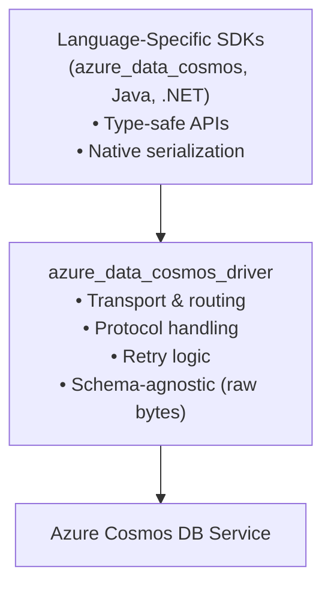

# Azure Cosmos DB Driver

Core implementation layer for Azure Cosmos DB, providing transport, routing, and protocol handling.

## Purpose

The Azure Cosmos DB Driver is a foundational library that implements the core transport, routing, and protocol handling for Azure Cosmos DB. It is designed to be used by language-specific SDKs (e.g., `azure_data_cosmos`) which provide type-safe, idiomatic APIs and handle serialization/deserialization of Cosmos DB resources.

## Support Model

**Applications which use an SDK built on the driver** (e.g., `azure_data_cosmos`) are **fully covered** by Microsoft Support SLAs,
even when issues are ultimately traced to the driver layer. The driver is an implementation detail of the SDK and is supported as part of the overall SDK support.

The Cosmos DB Driver is an internal component shared across several SDKs and is not intended for direct use by most developers.
Applications which use the driver **directly** are **not covered by Microsoft Support SLAs** and receive only community support through GitHub issues and pull requests.
Any driver APIs which are re-exported through the public SDK (e.g., `azure_data_cosmos`) are considered part of the supported public API and are covered by Microsoft Support SLAs when used through the SDK. However, direct usage of the driver APIs that are not re-exported by the SDK is not supported.

## Key Features

### Schema-Agnostic Data Plane

The driver is intentionally ignorant of document/item schemas. Data plane operations:

- Accept raw bytes (`&[u8]`) for request bodies
- Return buffered responses (`Vec<u8>`) for items (≤16MB payload limit)
- Support both UTF-8 JSON and Cosmos DB binary encoding (detected automatically)

**Serialization is handled by the consuming SDK** using native language APIs.

### Independent Versioning

This crate follows **strict semantic versioning** but can move to new major versions more frequently than `azure_data_cosmos`. Breaking changes in the driver do not force SDK version bumps because the SDK uses adapter patterns to maintain backward compatibility.

### Error Backtraces

`CosmosError` can carry a stack backtrace captured at construction. Capture is **opt-in** (matching idiomatic Rust): off by default, on whenever the stdlib `RUST_LIB_BACKTRACE` / `RUST_BACKTRACE` environment variables ask for it, and always overridable programmatically. When enabled, two independent rolling-1-second limiters keep the cost predictable under error storms — so unlike `RUST_BACKTRACE=1` (process-wide, unconditional, all-or-nothing) the driver can be left with backtraces *on* in production without paying the cost on every error.

**Two-tier cost model.**

- **Capture** runs on every `CosmosError` constructed while the capture throttle has budget, and is microseconds — only the call-stack instruction pointers are recorded. Symbols are not resolved at this point. When capture is disabled (no env var asking for it and no programmatic override), the stack is never walked and no IP vector is allocated.
- **Symbol resolution** (turning an IP into `module::function (file:line)`) is deferred until the first call to `error.backtrace()` → `Display`. Resolved frames are cached process-wide by IP, so repeat captures of the same call site only pay the resolution cost once per process lifetime.

**Two production-safety knobs (independent rolling-1-second limiters).**

| Knob              | `BacktraceOptions` field     | Env var                                         | Default when backtraces enabled | Default when disabled | What it bounds                                                                                              |
| ----------------- | ---------------------------- | ----------------------------------------------- | ------------------------------- | --------------------- | ----------------------------------------------------------------------------------------------------------- |
| Capture throttle  | `max_captures_per_second`    | `AZURE_COSMOS_BACKTRACE_CAPTURES_PER_SECOND`    | `1_000`                         | `0` (disabled)        | Hard ceiling on stack walks per second, regardless of cache state.                                          |
| Resolution budget | `max_resolutions_per_second` | `AZURE_COSMOS_BACKTRACE_RESOLUTIONS_PER_SECOND` | `5`                             | `0` (disabled)        | How many backtraces may perform *fresh* symbol resolution per second. Cache hits do **not** consume budget. |

Both fields take `u32`. Setting either to `0` fully disables that limiter; setting both to `0` fully disables backtrace capture.

**Configuration precedence (highest priority first).**

For each of the two knobs the active value is resolved from the first source below that provides a value:

1. **Programmatic** — the most recent call to `azure_data_cosmos_driver::error::set_backtrace_options(BacktraceOptions { … })`. Last-writer-wins; later calls replace earlier ones. **This always wins, including over an env var that explicitly disables backtraces** — e.g. `RUST_BACKTRACE=0` plus a non-zero programmatic call gives you backtraces, and a non-zero `RUST_BACKTRACE` plus a programmatic call with `max_captures_per_second: 0` disables them.
2. **Cosmos-specific env var** — `AZURE_COSMOS_BACKTRACE_CAPTURES_PER_SECOND` / `AZURE_COSMOS_BACKTRACE_RESOLUTIONS_PER_SECOND`. **Trumps `RUST_BACKTRACE` / `RUST_LIB_BACKTRACE` in both directions** — set them when the stdlib env vars do not match what you want for the Cosmos SDK specifically (e.g. `RUST_BACKTRACE=0` but `AZURE_COSMOS_BACKTRACE_CAPTURES_PER_SECOND=1000` → you get Cosmos backtraces capped at 1000/s).
3. **Stdlib `RUST_LIB_BACKTRACE` / `RUST_BACKTRACE`-keyed default** — when neither of the above is supplied, the SDK consults the stdlib env vars using stdlib precedence (`RUST_LIB_BACKTRACE` takes priority over `RUST_BACKTRACE`; for each, anything other than unset / empty / `"0"` enables). When enabled, the defaults from the "enabled" column above apply; otherwise both caps are `0`.

The env-var-derived default is computed lazily on the first error construction and is suppressed once any programmatic call to `set_backtrace_options` has run.

**When to adjust which.**

- **Resolution budget** — raise when you want richer backtraces in development or when investigating a specific recurring failure (resolved frames are cached forever, so a one-time spike costs nothing long-term). Lower (or set to `0`) when symbol resolution is dominating CPU during incident debugging; backtraces will still capture and can be resolved later once the budget is restored.
- **Capture throttle** — lower (or set to `0`) when profiling shows raw stack-walk cost is dominating during a same-call-site error storm (e.g. a sustained 429 storm where every backtrace is a cache hit and the resolution limiter is never consulted). Raise (or leave at the generous default) when you want maximum diagnostic coverage and capture cost is not a concern.

When the resolution budget is exhausted but the cache covers every frame, backtraces render at full fidelity for free. When the budget is exhausted *and* there is a cache-missed frame, the render returns `None` — partial / `<unresolved> @ 0xIP` renders are never produced.

**Tuning programmatically.**

```rust,ignore
use azure_data_cosmos_driver::error::{set_backtrace_options, BacktraceOptions};

// Start from the env-var-derived default (`RUST_LIB_BACKTRACE` /
// `RUST_BACKTRACE`-keyed) and only override the fields you care about.
let mut opts = BacktraceOptions::default();
opts.max_captures_per_second = 500;     // cap raw captures
opts.max_resolutions_per_second = 50;   // richer rendering budget
set_backtrace_options(opts);

// Or fully disable, overriding any env var that asked for backtraces:
set_backtrace_options(BacktraceOptions {
    max_captures_per_second: 0,
    max_resolutions_per_second: 0,
    ..BacktraceOptions::default()
});
```

**Reading a backtrace.**

```rust,ignore
if let Err(err) = driver.execute_operation(op, options).await {
    if let Some(bt) = err.backtrace() {
        eprintln!("{bt}");
    }
}
```

## Architecture



## Usage

```rust,no_run
use azure_data_cosmos_driver::{CosmosDriverRuntime, options::DriverOptions};
use azure_data_cosmos_driver::models::AccountReference;
use azure_identity::DeveloperToolsCredential;
use url::Url;

#[tokio::main]
async fn main() -> Result<(), Box<dyn std::error::Error>> {
    // Use logged-in developer credentials (Azure CLI, azd, etc.)
    let credential = DeveloperToolsCredential::new(None)?;

    let account = AccountReference::with_credential(
        Url::parse("https://myaccount.documents.azure.com:443/").unwrap(),
        credential,
    );

    // Create the runtime
    let runtime = CosmosDriverRuntime::builder().build().await?;

    // Get or create a driver for the account (singleton per endpoint)
-    let driver = runtime.get_or_create_driver(account, None).await?;
+    let driver = runtime.create_driver(DriverOptions::builder(account).build()).await?;

    // Driver operations work with raw bytes
    // let response = driver.execute_operation(operation, options).await?;

    Ok(())
}
```

## Module Organization

- **`diagnostics`**: Operational telemetry (RU consumption, retry counts, timing information)
- **`driver`**: Core transport, routing, and protocol handling
- **`models`**: Resource types, partition keys, status codes, and request metadata
- **`options`**: Configuration types (driver options, connection pool settings, diagnostics)
- **`system`**: System-level utilities (CPU/memory monitoring, VM metadata)

Internal modules (pipeline, routing, handlers) have `pub(crate)` visibility.

## Contributing

This project welcomes contributions and suggestions. Most contributions require you to agree to a Contributor License Agreement (CLA) declaring that you have the right to, and actually do, grant us the rights to use your contribution. For details, visit [https://cla.microsoft.com](https://cla.microsoft.com).

When you submit a pull request, a CLA-bot will automatically determine whether you need to provide a CLA and decorate the PR appropriately (e.g., label, comment). Simply follow the instructions provided by the bot. You'll only need to do this once across all repos using our CLA.

This project has adopted the [Microsoft Open Source Code of Conduct](https://opensource.microsoft.com/codeofconduct/). For more information, see the [Code of Conduct FAQ](https://opensource.microsoft.com/codeofconduct/faq/) or contact [opencode@microsoft.com](mailto:opencode@microsoft.com) with any additional questions or comments.
