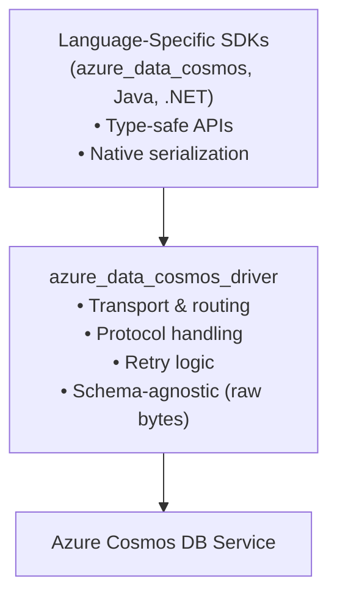

# Azure Cosmos DB Driver

Core implementation layer for Azure Cosmos DB, providing transport, routing, and protocol handling.

## Purpose

`azure_data_cosmos_driver` is designed for:

- **Cross-language SDK reuse**: Provides a common implementation that can be reused across language SDKs
- **Advanced scenarios**: Direct use by developers who need fine-grained control over Cosmos DB operations
- **Internal implementation**: Used internally by `azure_data_cosmos` (the primary Rust SDK)

## Support Model

**Applications which use an SDK built on the driver** (e.g., `azure_data_cosmos`) are **fully covered** by Microsoft Support SLAs,
even when issues are ultimately traced to the driver layer. The driver is an implementation detail of the SDK and is supported as part of the overall SDK support.

The Cosmos DB Driver is an internal component shared across several SDKs and is not intended for direct use by most developers.
Applications which use the driver **directly** are **not covered by Microsoft Support SLAs** and receive only community support through GitHub issues and pull requests.

## Key Features

### Schema-Agnostic Data Plane

The driver is intentionally ignorant of document/item schemas. Data plane operations:

- Accept raw bytes (`&[u8]`) for request bodies
- Return buffered responses (`Vec<u8>`) for items (≤16MB payload limit)
- Support both UTF-8 JSON and Cosmos DB binary encoding (detected automatically)

**Serialization is handled by the consuming SDK** using native language APIs.

### Independent Versioning

This crate follows **strict semantic versioning** but can move to new major versions more frequently than `azure_data_cosmos`. Breaking changes in the driver do not force SDK version bumps because the SDK uses adapter patterns to maintain backward compatibility.

### Error Backtraces

Every `Error` carries a stack backtrace captured at construction. Unlike `RUST_BACKTRACE=1` (process-wide, unconditional, all-or-nothing), the driver is designed to keep backtraces *on* in production without paying the cost on every error.

**Two-tier cost model.**

- **Capture** runs on every `Error` (subject to the safety guards below) and is microseconds — only the call-stack instruction pointers are recorded. Symbols are not resolved at this point.
- **Symbol resolution** (turning an IP into `module::function (file:line)`) is deferred until the first call to `error.backtrace()` → `Display`. Resolved frames are cached process-wide by IP, so repeat captures of the same call site only pay the resolution cost once per process lifetime.

**Two production-safety knobs (independent rolling-1-second limiters).**

| Knob              | Builder method                                    | Env var                                         | Default | What it bounds                                                                                              |
| ----------------- | ------------------------------------------------- | ----------------------------------------------- | ------- | ----------------------------------------------------------------------------------------------------------- |
| Resolution budget | `with_max_error_backtrace_resolutions_per_second` | `AZURE_COSMOS_BACKTRACE_RESOLUTIONS_PER_SECOND` | `5`     | How many backtraces may perform *fresh* symbol resolution per second. Cache hits do **not** consume budget. |
| Capture throttle  | `with_max_error_backtrace_captures_per_second`    | `AZURE_COSMOS_BACKTRACE_CAPTURES_PER_SECOND`    | `1000`  | Hard ceiling on stack walks per second, regardless of cache state.                                          |

Both knobs take `NonZeroU32`; backtrace capture cannot be disabled. `build()` rejects `0` from the env-var fallback with a validation error.

**Auto-disable on resolution pressure.** The moment the resolution limiter denies a request, `Backtrace::capture()` short-circuits to `None` for the rest of that 1-second window (the resulting `Error` carries no backtrace). The window naturally re-opens every second, and any subsequent resolution grant clears the flag immediately — so the system can never get stuck in the disabled state.

**When to adjust which.**

- **Resolution budget** — raise when you want richer backtraces in development or when investigating a specific recurring failure (resolved frames are cached forever, so a one-time spike costs nothing long-term). Lower when symbol resolution is dominating CPU during incident debugging.
- **Capture throttle** — lower when profiling shows raw stack-walk cost is dominating during a same-call-site error storm (e.g. a sustained 429 storm where every backtrace is a cache hit and the resolution limiter is never consulted). Raise (or leave at the generous default) when you want maximum diagnostic coverage and capture cost is not a concern.

When the resolution budget is exhausted but the cache covers every frame, backtraces render at full fidelity for free. When the budget is exhausted *and* there is a cache-missed frame, the render returns `None` — partial / `<unresolved> @ 0xIP` renders are never produced.

**Tuning.**

```rust,ignore
use std::num::NonZeroU32;

let runtime = CosmosDriverRuntimeBuilder::new()
    // Raise the per-second resolution budget. Backtrace capture cannot
    // be disabled; the API takes `NonZeroU32` and `build()` rejects `0`
    // from the env-var fallback with a validation error.
    .with_max_error_backtrace_resolutions_per_second(NonZeroU32::new(50).unwrap())
    // Cap raw captures to avoid CPU pressure on same-call-site storms.
    .with_max_error_backtrace_captures_per_second(NonZeroU32::new(500).unwrap())
    .build();
```

**Reading a backtrace.**

```rust,ignore
if let Err(err) = driver.execute_operation(op, options).await {
    if let Some(bt) = err.backtrace() {
        eprintln!("{bt}");
    }
}
```

## Architecture



## Usage

```rust,no_run
use azure_data_cosmos_driver::{CosmosDriverRuntime, options::DriverOptions};
use azure_data_cosmos_driver::models::AccountReference;
use azure_identity::DeveloperToolsCredential;
use url::Url;

#[tokio::main]
async fn main() -> azure_core::Result<()> {
    // Use logged-in developer credentials (Azure CLI, azd, etc.)
    let credential = DeveloperToolsCredential::new(None)?;

    let account = AccountReference::with_credential(
        Url::parse("https://myaccount.documents.azure.com:443/").unwrap(),
        credential,
    );

    // Create the runtime
    let runtime = CosmosDriverRuntime::builder().build().await?;

    // Get or create a driver for the account (singleton per endpoint)
    let driver = runtime.get_or_create_driver(account, None).await?;

    // Driver operations work with raw bytes
    // let response = driver.execute_operation(operation, options).await?;

    Ok(())
}
```

## Module Organization

- **`diagnostics`**: Operational telemetry (RU consumption, retry counts, timing information)
- **`driver`**: Core transport, routing, and protocol handling
- **`models`**: Resource types, partition keys, status codes, and request metadata
- **`options`**: Configuration types (driver options, connection pool settings, diagnostics)
- **`system`**: System-level utilities (CPU/memory monitoring, VM metadata)

Internal modules (pipeline, routing, handlers) have `pub(crate)` visibility.

## Contributing

This project welcomes contributions and suggestions. Most contributions require you to agree to a Contributor License Agreement (CLA) declaring that you have the right to, and actually do, grant us the rights to use your contribution. For details, visit [https://cla.microsoft.com](https://cla.microsoft.com).

When you submit a pull request, a CLA-bot will automatically determine whether you need to provide a CLA and decorate the PR appropriately (e.g., label, comment). Simply follow the instructions provided by the bot. You'll only need to do this once across all repos using our CLA.

This project has adopted the [Microsoft Open Source Code of Conduct](https://opensource.microsoft.com/codeofconduct/). For more information, see the [Code of Conduct FAQ](https://opensource.microsoft.com/codeofconduct/faq/) or contact [opencode@microsoft.com](mailto:opencode@microsoft.com) with any additional questions or comments.
