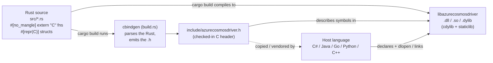
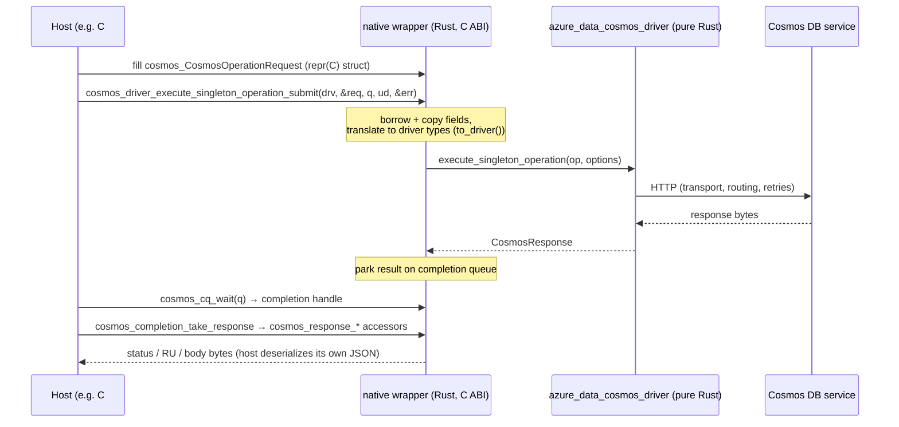
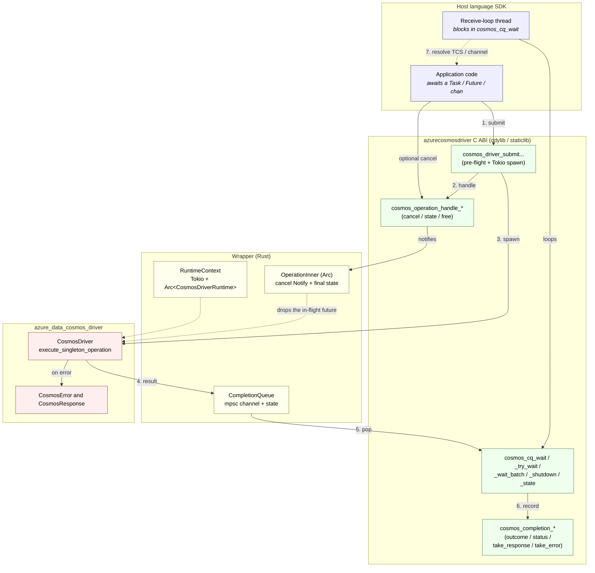
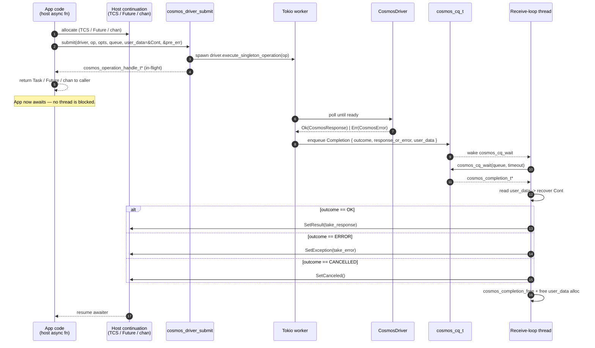
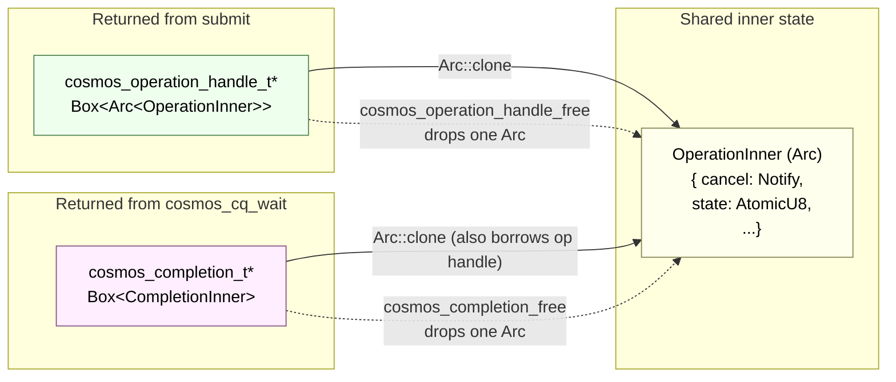
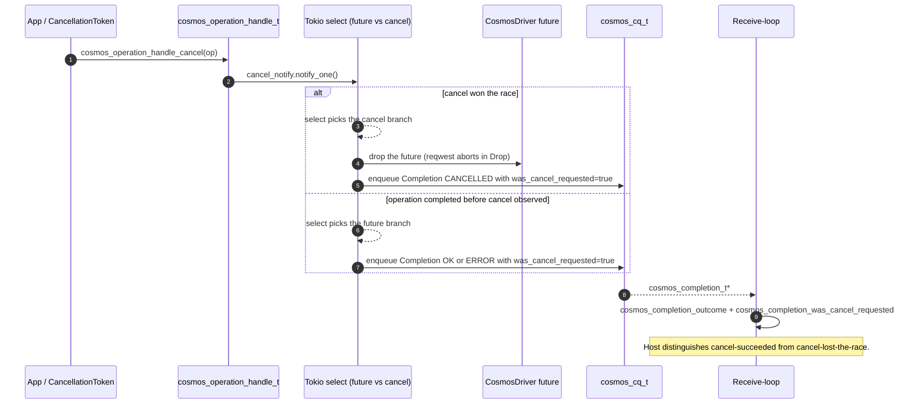
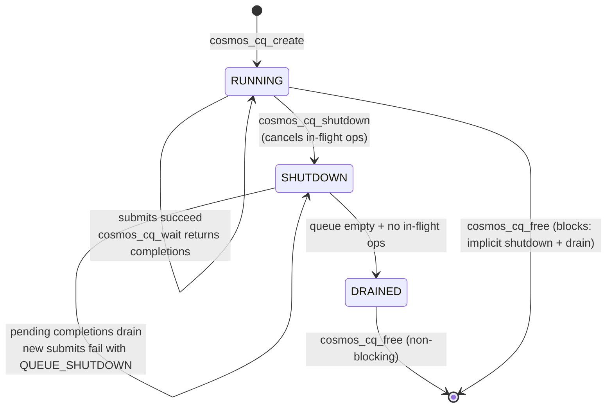
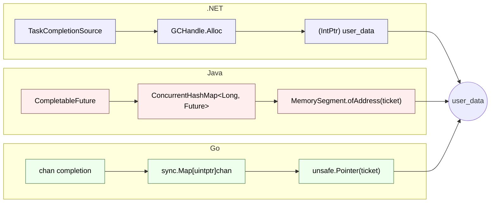

# Async invocation architecture — `azure_data_cosmos_driver_native`

This is a visual companion to [`NATIVE_WRAPPER_SPEC.md`](https://github.com/Azure/azure-sdk-for-rust/blob/main/sdk/cosmos/azure_data_cosmos_driver/docs/NATIVE_WRAPPER_SPEC.md).
The spec is the source of truth; this doc is the picture-first overview that
host-SDK authors (.NET, Java, Go, Python, native C/C++) can read in five
minutes before diving into the C API surface.

If you only read one section, read [section 2 — The submission and
completion lifecycle](#2-the-submission-and-completion-lifecycle).

---

## 0. What "C wrapper" means (there is no C code)

A common first question is: *if this is a "C wrapper", where is the C
code?* The short answer is that the **"C" refers to the ABI
(Application Binary Interface) — the binary calling convention —
not the implementation language.** The crate is written 100% in Rust. The
only hand-written C in the repo lives under
[`c_tests/`](https://github.com/Azure/azure-sdk-for-rust/tree/main/sdk/cosmos/azure_data_cosmos_driver_native/c_tests), and that is a
**test harness** that *consumes* the library to prove the ABI is callable
from real C; it is not part of the shipped artifact.

So "C bindings" here means *a binary that any C-compatible
language can bind to*, not *a binary written in C*.

### The four pieces that make it work



**End-to-end call flow for one operation.**



1. **Rust functions wearing a C costume.** Every public entry point is a
   normal Rust function annotated to speak C:

   ```rust
   #[no_mangle]                          // export the literal symbol name
   pub extern "C" fn cosmos_bytes_len(b: *const CosmosBytes) -> usize { ... }
   ```

   - `extern "C"` — use the C calling convention (how arguments and
     return values are passed in registers / on the stack).
   - `#[no_mangle]` — suppress Rust name-mangling so the exported
     symbol is exactly `cosmos_bytes_len`, findable by `dlsym` /
     `GetProcAddress` / `[DllImport]`.
   - `#[repr(C)]` on structs (e.g. `CosmosBytes`, `CosmosOperationRequest`)
     — lay fields out in memory exactly as a C compiler would, so a C#
     `[StructLayout(Sequential)]` mirror or a Go `C.struct_...` lines up
     byte-for-byte.

   `crate-type = ["cdylib", "staticlib"]` in `Cargo.toml` turns this into a
   `.dll` / `.so` / `.dylib` (and a static archive) full of C-callable
   symbols, named `azurecosmosdriver`.

2. **cbindgen auto-generates the C header.** A C / C# / Go caller needs a
   *declaration* of each function and struct. Rather than hand-write that,
   [`build.rs`](https://github.com/Azure/azure-sdk-for-rust/blob/main/sdk/cosmos/azure_data_cosmos_driver_native/build.rs) runs
   **cbindgen** on every `cargo build`: it parses the `extern "C"` functions
   and `#[repr(C)]` types and writes
   [`include/azurecosmosdriver.h`](https://github.com/Azure/azure-sdk-for-rust/blob/main/sdk/cosmos/azure_data_cosmos_driver_native/include/azurecosmosdriver.h).
   The `rename` map + `prefix = "cosmos_"` in `build.rs` is cosmetic —
   it turns the Rust type name `RuntimeContext` into the spec C name
   `cosmos_runtime_t`.

3. **The header is checked into git.** So a Java / Go / Python team can
   vendor `azurecosmosdriver.h` *without installing a Rust toolchain*. It is
   the contract.

4. **Host languages bind at the ABI.** No language-specific glue is compiled
   into the crate — each host declares the symbols its own way and the
   OS loader connects them:

   | Host | Binding mechanism |
   |---|---|
   | C / C++ | `#include "azurecosmosdriver.h"` + link `-lazurecosmosdriver` (this is what `c_tests/` does via CMake + corrosion) |
   | C# | `[DllImport("azurecosmosdriver")]` + `[StructLayout(Sequential)]` struct mirror |
   | Java 22+ | `java.lang.foreign` FFM API (`SymbolLookup` + `downcallHandle`) |
   | Go | `cgo` (`import "C"`) |
   | Python | `ctypes.CDLL(...)` |

### So, to summarize

- **Why "C wrapper" with no C code?** Because it exposes a **C ABI**, the
  lingua franca of cross-language interop. The implementation is Rust; the
  *interface* is C.
- **Are there C bindings?** Yes — the binding is the **checked-in C
  header** (`azurecosmosdriver.h`) plus the C-ABI symbols in the compiled
  `.dll` / `.so` / `.dylib`. The only actual C *source* is the test harness
  in `c_tests/`, which exists purely to validate that a genuine C program can
  drive the library.

The rest of this document (section 1 onward) assumes this foundation and
focuses on the *async* shape layered on top of these C-ABI symbols.

---

## 1. Where the wrapper sits

The wrapper is a thin C ABI in front of the
[`azure_data_cosmos_driver`](https://github.com/Azure/azure-sdk-for-rust/tree/main/sdk/cosmos/azure_data_cosmos_driver) crate. It owns an internal Tokio runtime and
a multi-producer / single-consumer completion-queue abstraction; host SDKs
get a non-blocking C API and reuse their own native async primitive
(`Task`/`CompletableFuture`/`chan`/...) on top.



**Read this picture as "three independent threading planes":**

| Plane | Who owns the thread | What runs there |
|---|---|---|
| Application | Host SDK | The `async` method that submits and `await`s. Never blocks — the submit returns immediately. |
| Receive loop | Host SDK | One dedicated thread per `cosmos_cq_t` that blocks in `cosmos_cq_wait` and dispatches completions to the host's native async primitive. |
| Tokio | Wrapper (runtime owned by `cosmos_runtime_t`) | The driver future for each in-flight op. The host never touches these threads. |

The receive-loop thread is the **only** place the wrapper surfaces results
back to host code — cleanly decoupling the host's threading model from
Tokio's.

---

## 2. The submission and completion lifecycle

This is the canonical happy-path flow, end-to-end. Everything else
(cancellation, queue shutdown, pre-flight rejection) is a variation on it.



**Key invariants of this flow:**

1. **No host thread is parked inside Tokio.** Submit returns immediately
   with a handle.
2. **`user_data` is the per-call correlator.** The wrapper round-trips it
   verbatim. The host owns its lifetime.
3. **Exactly one completion lands per successful submit.** Including the
   cancelled case (see section 4) — there is no "silent drop"
   path.
4. **Pre-flight rejection (`*out_pre_error != SUCCESS`, return value
   `NULL`) does NOT post a completion.** The host's exception path runs
   synchronously inside the submit wrapper.

See [section 3.6.1](https://github.com/Azure/azure-sdk-for-rust/blob/main/sdk/cosmos/azure_data_cosmos_driver/docs/NATIVE_WRAPPER_SPEC.md#361-cosmos_completion_t) of the
spec for the C API surface of every box in this diagram.

---

## 3. The two-handle ownership model

The operation handle (returned by submit) and the completion record (returned
by `cosmos_cq_wait`) are **independent FFI handles** that share an internal
`Arc<OperationInner>`. They have overlapping lifetimes; either can outlive
the other.



**Consequences for host SDKs:**

| Scenario | What the host does |
|---|---|
| Fire-and-forget submit, no cancel, no diagnostics polling | Free `cosmos_operation_handle_t*` immediately after submit. The completion still arrives; the receive loop reaches the same `OperationInner` via `cosmos_completion_op_handle`. |
| Wants cancel propagation (`.NET CancellationToken`, `Go ctx.Done()`, `Java CompletableFuture.cancel`) | Stash the handle alongside the continuation. Cancel from the app side. Free from the receive loop after the completion is observed. |
| Wants `cosmos_operation_handle_state` polling without draining the queue | Keep the handle. State remains observable after `cosmos_completion_free` because the handle's own `Arc` keeps the inner state alive. |

Freeing the handle **never** cancels the op — it only drops the
producer's reference. See
[section 3.6.2](https://github.com/Azure/azure-sdk-for-rust/blob/main/sdk/cosmos/azure_data_cosmos_driver/docs/NATIVE_WRAPPER_SPEC.md#362-cosmos_operation_handle_t) for the
exact contract.

---

## 4. Cancellation flow

Cancellation lives entirely in the wrapper layer because the driver doesn't
yet accept a `CancellationToken` on its execute methods. The wrapper drives
the driver future inside a `tokio::select!` against a per-operation
`Notify`; `cosmos_operation_handle_cancel` signals the `Notify`, the future
is dropped, and a `CANCELLED` completion is synthesized.



**Caveats** — flagged here for visibility, fully documented in
[section 3.6.3](https://github.com/Azure/azure-sdk-for-rust/blob/main/sdk/cosmos/azure_data_cosmos_driver/docs/NATIVE_WRAPPER_SPEC.md#363-cancellation):

- Granularity is "drop at the next await point", not
  "check a token every operation". A future parked inside a
  non-cancellable syscall (e.g. `getaddrinfo`) cancels only when control
  returns to the reactor — usually within a few milliseconds.
- In-flight requests are not actively aborted on the wire. Dropping the
  `reqwest` future closes the TCP connection but does not send a
  protocol-level cancel; the gateway may still execute the request.
- Cancelled completions carry **no** response and **no** diagnostics —
  the driver's partial `DiagnosticsContext` is dropped with the future.

---

## 5. Queue lifecycle and back-pressure



Submits against a queue at hard capacity
(`cosmos_cq_options.max_capacity > 0`) fail pre-flight with
`COSMOS_ERROR_CODE_QUEUE_FULL`. Use `cosmos_cq_wait_writable(queue, ms)` to
block until space is available. The default queue is unbounded — only
opt into capacity caps for bulk-import / fan-out workloads where a stuck
consumer would otherwise grow memory without bound.

---

## 6. Per-language pinning patterns

The receive loop needs a stable correlator that survives the round-trip
across the FFI. The wrapper does **no** lifecycle management on
`user_data` — the host pins the continuation on submit and frees it
in the receive loop. The pinning trick differs per language because
managed-pointer rules differ:



| Language | Pinning strategy | Why |
|---|---|---|
| .NET | `(IntPtr)GCHandle.Alloc(tcs)` — pins the TCS directly | Managed-pointer story works; the GC respects the pinning until `Free()`. |
| Java | Ticket -> `ConcurrentHashMap<Long, CompletableFuture>` | JNI / panama forbid live Java refs across native calls; the map keys give us a stable handle. |
| Go | Ticket -> `sync.Map[uintptr]chan` | cgo's `checkptr` rules forbid handing the C side a live `*T` whose lifetime crosses cgo boundaries. |
| Python / Node | Same ticket-map pattern as Java/Go | `asyncio.Future` / `Promise` resolvers; the receive thread bridges back via `loop.call_soon_threadsafe` / `napi_async_work`. |

Full code examples for all three are in
[section 3.1 of the spec](https://github.com/Azure/azure-sdk-for-rust/blob/main/sdk/cosmos/azure_data_cosmos_driver/docs/NATIVE_WRAPPER_SPEC.md#31-invocation-model--completion-queues).

---

## 7. Threading and ordering rules at a glance

| Object | Multi-producer? | Multi-consumer? | Ordered? |
|---|---|---|---|
| `cosmos_runtime_t` | Yes, but typically one per process | Yes | n/a |
| `cosmos_cq_t` | **Yes** — any thread holding the pointer may submit | **No** — only one thread at a time may call `cosmos_cq_wait` (v1) | FIFO from a given producer; no global ordering across producers |
| `cosmos_operation_handle_t` | n/a | `_cancel` / `_state` / `_free` callable from any thread | n/a |
| `cosmos_completion_t` | n/a | Single-threaded use (the receive loop) | n/a |

If you want work-stealing across multiple consumer threads, create
**one queue per consumer**. The wrapper does not coordinate cross-thread
fairness inside a single queue. See [section 9 Q12](https://github.com/Azure/azure-sdk-for-rust/blob/main/sdk/cosmos/azure_data_cosmos_driver/docs/NATIVE_WRAPPER_SPEC.md#9-open-questions)
of the spec for whether MPMC will land in a future revision.

---

## 8. Where to look next

- [`NATIVE_WRAPPER_SPEC.md` section 3.1](https://github.com/Azure/azure-sdk-for-rust/blob/main/sdk/cosmos/azure_data_cosmos_driver/docs/NATIVE_WRAPPER_SPEC.md#31-invocation-model--completion-queues) — full invocation model + per-language call sites.
- [`NATIVE_WRAPPER_SPEC.md` section 3.5](https://github.com/Azure/azure-sdk-for-rust/blob/main/sdk/cosmos/azure_data_cosmos_driver/docs/NATIVE_WRAPPER_SPEC.md#35-error-model) — error model (`cosmos_error_code_t` + `cosmos_error_t`).
- [`NATIVE_WRAPPER_SPEC.md` section 3.6](https://github.com/Azure/azure-sdk-for-rust/blob/main/sdk/cosmos/azure_data_cosmos_driver/docs/NATIVE_WRAPPER_SPEC.md#36-completion-records--operation-handles) — completion record / operation handle accessors.
- [`NATIVE_WRAPPER_SPEC.md` section 8](https://github.com/Azure/azure-sdk-for-rust/blob/main/sdk/cosmos/azure_data_cosmos_driver/docs/NATIVE_WRAPPER_SPEC.md#8-phased-implementation-plan) — phased rollout (Phase 0 scaffolding through Phase 10 advanced surface).
- [`NATIVE_WRAPPER_SPEC.md` section 6](https://github.com/Azure/azure-sdk-for-rust/blob/main/sdk/cosmos/azure_data_cosmos_driver/docs/NATIVE_WRAPPER_SPEC.md#6-error-semantics) — how the merged driver's `CosmosError` maps onto the coarse `cosmos_error_code_t`.
