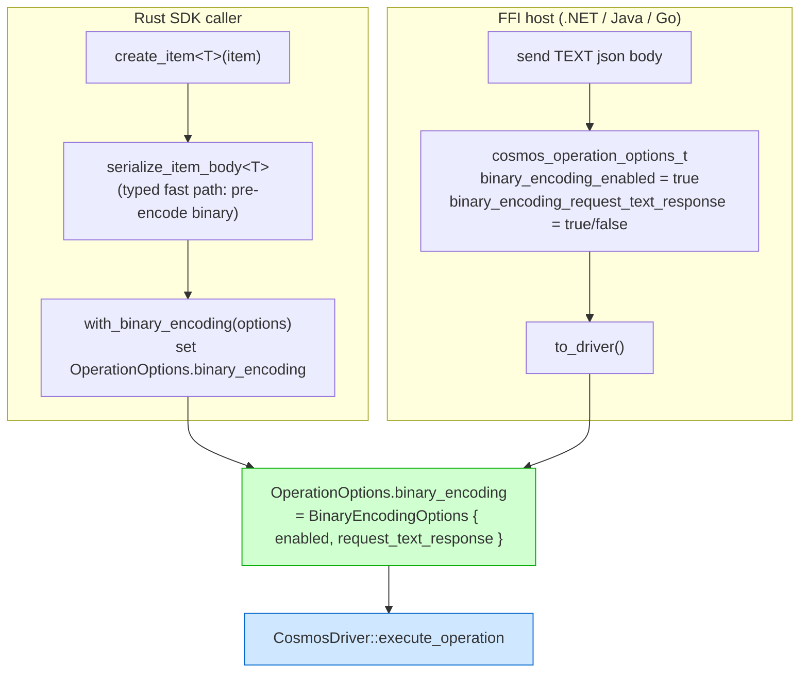
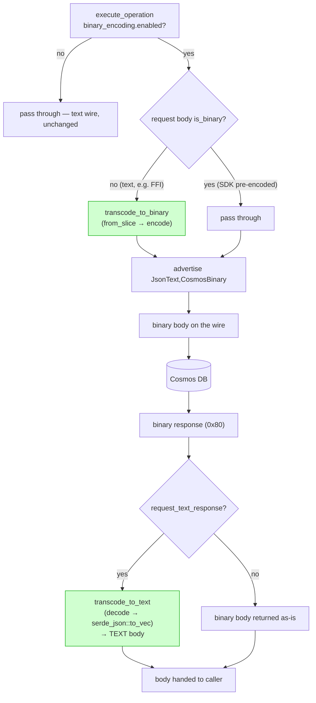
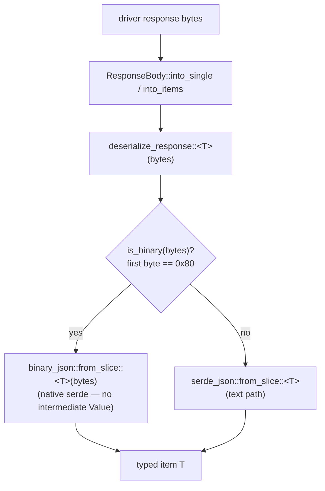
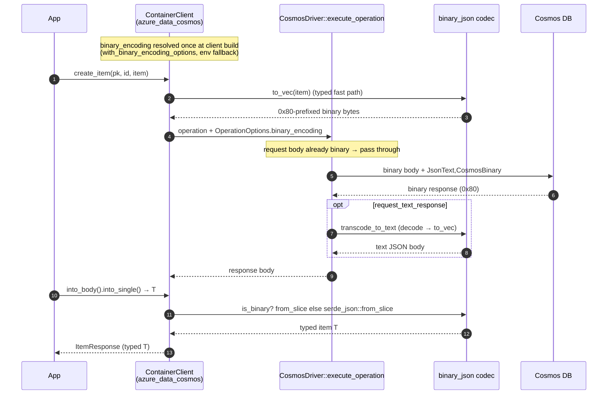
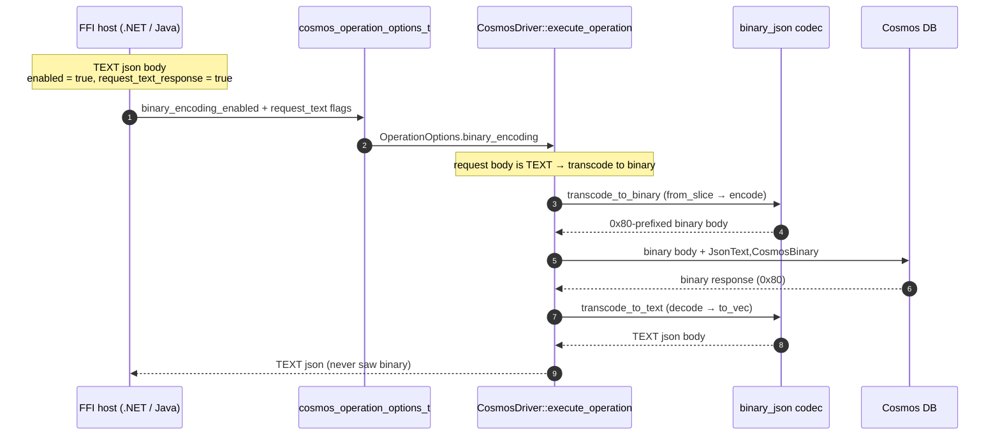

# Binary Encoding — High-Level Design (HLD)

This document is the high-level design for Cosmos **binary JSON** encoding in the
Rust SDK and driver. It captures the goals, the wire/transcoding model, the
component layout, testing, and the intentionally deferred work.

For the phased implementation plan and low-level wire details, see
[`BINARY_ENCODING_SPEC.md`](./BINARY_ENCODING_SPEC.md).

---

## Summary

Adds first-class support for **Cosmos binary JSON** to the Rust SDK and driver. Cosmos binary JSON is a tagged byte stream the service can persist and transmit in place of UTF-8 text JSON; it is more compact and cheaper to (de)serialize.

This design delivers a **complete decoder** and a **native serde codec**, and makes binary encoding a **driver capability** on `OperationOptions.binary_encoding` so it is shared by every consumer of the driver — the Rust SDK **and** any FFI-based SDK (.NET, Java, Go, …). It is opt-in (`CosmosClientBuilder::with_binary_encoding_options`, with an `AZURE_COSMOS_BINARY_ENCODING_ENABLED` environment-variable fallback). When the option is off, every request and response is **byte-for-byte unchanged** — the binary code is inert.

Because the option lives on the driver and is schema-agnostic, the driver performs the byte-level transcoding **both ways** when needed:

* an opt-in **text-response** mode (`BinaryEncodingOptions::request_text_response`) keeps the wire binary in both directions (efficient RUs and bandwidth) while the driver transcodes the binary **response** back to text JSON;
* a caller that deals only in **text** (most importantly an FFI host) can enable binary and the driver transcodes its text **request** body to binary — so it gets a fully binary wire **without encoding anything itself**.

A self-contained, in-tree **end-to-end validation loop** is included via the in-memory emulator (no Docker, no live account, no external test vectors).

> **Scope:** item operations (`create` / `replace` / `upsert` / `read`). Query, patch, transactional batch, and bulk are intentionally deferred (see [Deferred work](#deferred-work)).

---

## Why binary JSON?

* **Smaller payloads** — tagged binary is more compact than text JSON.
* **Cheaper (de)serialization** — typed markers avoid text parsing/formatting.
* **Wire-compatible negotiation** — the client advertises what it accepts; the service chooses. Mixed text/binary deployments interoperate transparently.

The design follows the driver's **schema-agnostic data-plane** principle: the codec operates purely on bytes (and, for the reference oracle, `serde_json::Value`) and knows nothing about item schemas.

---

## How it works

### The `0x80` preamble — unambiguous auto-detection

Every binary buffer begins with the preamble byte `0x80`. Because `0x80` is a UTF-8 *continuation* byte, **no valid text JSON document can start with it**. This single-byte test (`binary_json::is_binary`) lets the decode path detect binary independently of any HTTP header, so responses decode correctly even if content negotiation headers are absent or unexpected.

### Native serde codec (no intermediate `Value`)

* **Read path** — binary responses deserialize straight into `T: Deserialize` via the native serde deserializer `binary_json::from_slice`, with no intermediate `serde_json::Value` on the common path. The complete `binary_json::decode` (binary → `Value`) is retained as the reference oracle for parity/fuzz tests and as the fallback the deserializer uses for the rare exotic wire forms (reference/compressed/GUID strings, binary blobs, uniform number arrays).
* **Write path** — item bodies serialize straight from `T: Serialize` to Cosmos binary JSON via the native serde serializer `binary_json::to_vec`, again with no intermediate `Value`. The serializer emits a correct (verbose-but-valid) buffer — it skips the size optimizations a writer *may* apply (reference-string dedup, compression, uniform arrays), all of which the decoder still accepts.

### Enablement (driver option, resolved once)

Binary encoding is a driver option: `OperationOptions.binary_encoding: Option<BinaryEncodingOptions>` (driver-owned type). The Rust SDK **re-exports** `BinaryEncodingOptions` and resolves enablement **once at client build** via `resolve_binary_encoding(Option<BinaryEncodingOptions>)`, storing it on the client context — there is no per-request lookup. It prefers the explicit `CosmosClientBuilder::with_binary_encoding_options(..)` option and falls back to the `AZURE_COSMOS_BINARY_ENCODING_ENABLED` environment variable (truthy: `1` / `true` / `yes` / `on`, case-insensitive). Each item operation carries the resolved options onto its `OperationOptions` (via a `with_binary_encoding` helper).

FFI hosts set the equivalent flat fields on the C ABI `cosmos_operation_options_t` (`binary_encoding_enabled`, `binary_encoding_request_text_response`), which convert to the same driver option — so no SDK code is involved.

### Two transcodes, both in the driver (schema-agnostic)

When `binary_encoding.enabled` is set, `CosmosDriver::execute_operation` owns the wire format both ways:

* **Request** (`apply_request_binary_encoding`) — transcodes a **text** request body to Cosmos binary JSON via `binary_json::transcode_to_binary` (`serde_json::from_slice` → `encode`) and advertises `JsonText,CosmosBinary`. An **already-binary** or empty body passes through unchanged, so a caller that pre-encoded pays nothing.
* **Response** (when `request_text_response` is set) — transcodes the binary response back to text JSON via `binary_json::transcode_to_text` (`decode` → `serde_json::to_vec`). The wire stays binary in both directions.

This keeps transcoding in the **driver** (not the backend) and, because it is schema-agnostic, lets a text-only FFI host get an efficient binary wire without any encoding on its side.

### Rust SDK typed fast path (optimization)

The Rust SDK keeps a typed fast path: `serialize_item_body` encodes `T: Serialize` straight to binary via `binary_json::to_vec` (skipping the text intermediate). The driver's request-side transcode then sees an **already-binary** body and passes it through unchanged — so the SDK pays no double work while sharing the exact same driver option surface as FFI callers.

### Negotiation header

When binary is enabled, item operations set:

```
x-ms-cosmos-supported-serialization-formats: JsonText,CosmosBinary
```

The value matches the .NET reference (`string.Join(",", JsonText, CosmosBinary)` — no space). The request `Content-Type` stays `application/json`; the service detects the binary body from its first byte. The **driver** sets this header whenever `binary_encoding.enabled` is set — including under `request_text_response`, where the wire stays binary and the driver transcodes the response (see above).

---

## Flow diagrams

Binary encoding lives on the driver's `OperationOptions.binary_encoding`. Both
the Rust SDK and FFI hosts set that option; the **driver** owns the wire format
and the two transcodes. The only difference is *how the request body arrives*:
the Rust SDK may pre-encode typed `T` to binary (an optimization), while an FFI
host sends plain text and lets the driver transcode.

### Where the option comes from (Rust SDK vs FFI)



### Driver request + response path (owns both transcodes)



### Rust SDK response decode (typed)

After the driver returns the body, the Rust SDK deserializes it. Auto-detection
by the `0x80` preamble means the decode path is correct whether the body came
back binary or was transcoded to text by the driver.



---

## Sequence diagrams

### Rust SDK — write then read (binary enabled)

The SDK pre-encodes typed `T` to binary; the driver sees an already-binary body
and passes it through. When `request_text_response` is set, the driver transcodes
the response back to text and the SDK's decode takes the text branch.



### FFI host — text in, text out, binary wire

The FFI host deals only in text. It sets two flags; the driver transcodes the
text request to binary and the binary response back to text. The host never
touches binary.



When the option is **off**, both paths collapse to the existing text behavior —
`serde_json` on the way out and back, byte-for-byte unchanged.

---

## Key components

| Component | File | Role |
|---|---|---|
| `binary_json` module | `azure_data_cosmos_driver/src/binary_json/` | The codec (schema-agnostic) |
| `markers` | `binary_json/markers.rs` | Type-marker constants, transcribed byte-for-byte from .NET `JsonBinaryEncoding.TypeMarker.cs` |
| `system_strings` | `binary_json/system_strings.rs` | 32-entry system-string dictionary (byte-exact vs .NET) |
| `decode` / `Reader` | `binary_json/reader.rs` | **Complete** decoder → `serde_json::Value` (reference oracle + exotic-form fallback) |
| `from_slice` / `de` | `binary_json/de.rs` | Native serde **deserializer** (`binary` → `T`), the production read path |
| `to_vec` / `ser` | `binary_json/ser.rs` | Native serde **serializer** (`T` → `binary`), the production write path |
| `encode` | `binary_json/writer.rs` | `Value` → `binary` reference encoder (parity oracle + shared emit helpers) |
| `is_binary` / `PREAMBLE` / `transcode_to_text` / `transcode_to_binary` | `binary_json/mod.rs` | First-byte (`0x80`) auto-detection + the two schema-agnostic transcoding primitives (binary→text, text→binary) |
| `deserialize_response` / `ResponseBody::transcode_to_text` | `models/response_body.rs` | Decode choke point for `into_single` / `into_items`; in-place binary→text conversion |
| `BinaryEncodingOptions` | `azure_data_cosmos_driver/src/options/binary_encoding.rs` | **Driver-owned** options (`enabled`, `request_text_response`), on `OperationOptions.binary_encoding`; the SDK re-exports it |
| `OperationOptions.binary_encoding` | `driver/options/operation_options.rs` | Layered option carrying binary encoding to every consumer (SDK + FFI) |
| `execute_operation` / `apply_request_binary_encoding` | `driver/cosmos_driver.rs` | Driver owns the wire: transcodes text→binary request, advertises `CosmosBinary`, transcodes binary→text response |
| `CosmosResponse::transcode_body_to_text` | `models/cosmos_response.rs` | Applies driver-side response transcoding |
| `resolve_binary_encoding` / `with_binary_encoding` | `azure_data_cosmos/src/clients/{mod,container_client}.rs` | SDK: resolve enablement once; set the option on `OperationOptions` per item op |
| `serialize_item_body` | `azure_data_cosmos/src/clients/container_client.rs` | SDK typed fast path: pre-encode `T` to binary (driver passes it through) |
| `cosmos_operation_options_t.binary_encoding_*` | `driver_native/src/op_request.rs` | FFI: flat `binary_encoding_enabled` / `binary_encoding_request_text_response` flags → driver option |
| In-memory emulator binary support | `in_memory_emulator/{dispatch,response,operations}.rs` | Decodes binary requests, replies binary on negotiation — enables the E2E loop |

---

## Testing

* **Decoder** — golden-vector parity corpus; per-form unit tests across every marker family.
* **Encoder** — `encode → decode` round-trip tests (numbers across all widths, strings incl. unicode/escapes/boundary lengths, nested containers, empties).
* **Robustness (P4)** — deterministic fuzz suite asserting the decoder *always* terminates with `Ok | Err` on untrusted input: never panics on random / truncated / single-byte-corrupted buffers, never over-allocates on adversarial length prefixes (`u32::MAX` errors in O(1)), and rejects deep nesting with `DepthLimitExceeded` instead of a stack overflow.
* **End-to-end (in-memory emulator)** — `binary_round_trip.rs`:
  * `binary_encoding_item_write_read_round_trips` — create / read / upsert / replace through the full SDK → driver → emulator binary loop, including a unicode payload (`"café ☃ binary"`).
  * `binary_and_text_clients_interoperate` — a binary-written document reads back through a text client and vice-versa.
  * `request_text_response_keeps_wire_binary_and_returns_data` — with `request_text_response`, a `RequestObserver` confirms every item request advertised `CosmosBinary` (wire stayed binary) while the typed document still round-trips (driver transcoded to text).
* **Response-format negotiation** — `binary_response_format.rs` sends a binary request through the emulator and inspects the **raw** response bytes for each negotiation (`CosmosBinary` → binary, `JsonText` → text, none → text); `dispatch.rs` unit tests cover the emulator's `binary_response` decision.
* **Transcoding** — `binary_json::transcode_to_text` **and** `transcode_to_binary` unit tests (round-trip equivalence, binary/text/empty passthrough, malformed-input errors); `ResponseBody::transcode_to_text` tests.
* **Driver option + request encode** — `OperationOptions.binary_encoding` builder/layered-resolution tests; `apply_request_binary_encoding` tests (text→binary + header, already-binary passthrough, invalid-text error).
* **FFI** — `cosmos_operation_options_t` conversion tests: `binary_encoding_enabled` + `request_text_response` build the driver option (enabled+text, enabled-only, disabled-yields-none).
* **Benchmarks** — `azure_data_cosmos_benchmarks`'s `binary_encode` / `binary_decode` compare text, the retired via-`Value` path, and the shipped native codec on small and ~1.7 MB items.

Validation sweep (per the cosmos contributing guidelines): `cargo fmt`, `clippy` (driver `--all-features`; SDK default features), `cargo doc -D warnings` (driver), `cspell`, and the driver lib + SDK test suites — all clean.

Run the E2E loop locally:

```bash
cargo test -p azure_data_cosmos --features __internal_in_memory_emulator \
    --test in_memory_emulator binary_round_trip
```

---

## Enabling binary encoding

Binary is **off by default**. To opt in for item operations, set it on the client builder:

```rust
use azure_data_cosmos::options::BinaryEncodingOptions;

let client = CosmosClientBuilder::new()
    .with_binary_encoding_options(BinaryEncodingOptions::new().with_enabled(true))
    .build(account, routing_strategy)
    .await?;
```

To keep the wire binary but receive text-JSON responses (driver transcodes):

```rust
let options = BinaryEncodingOptions::new()
    .with_enabled(true)
    .with_request_text_response(true);
let client = CosmosClientBuilder::new()
    .with_binary_encoding_options(options)
    .build(account, routing_strategy)
    .await?;
```

As a fallback (e.g. for enabling encoding without a code change), the same enablement is read from an environment variable when the builder option is not set:

```bash
AZURE_COSMOS_BINARY_ENCODING_ENABLED=true
```

The explicit builder option takes precedence; the flag is resolved once at client build.

### From an FFI host (text in, text out)

An FFI-based SDK sets two flat flags on `cosmos_operation_options_t` — no
encoding on its side. It sends a plain **text** JSON body; the driver puts binary
on the wire and (with `request_text_response`) transcodes the response back to
text:

```c
cosmos_operation_options_t opts = cosmos_operation_options_default();
opts.binary_encoding_enabled = 2;                  /* tri-state: 2 = true */
opts.binary_encoding_request_text_response = 2;    /* 2 = true  */
/* request.body = plain TEXT JSON bytes; request.options = &opts */
```

---

## Backward compatibility & safety

* **Off by default.** With the flag unset, requests and responses are byte-for-byte identical to current behavior; the text path is unchanged.
* **Response decode is always on but inert.** `is_binary` only triggers on a `0x80` first byte, which the service emits solely when it has negotiated binary — so enabling decode cannot affect existing text responses.
* **No model sharing across crates.** The SDK consumes the driver's codec via its public `binary_json` API. `BinaryEncodingOptions` is a **driver** type the SDK re-exports (like `Region` / `ConsistencyLevel`), because binary encoding is a wire/driver concern shared with FFI hosts; no item/document models cross the boundary.
* **No `CHANGELOG` entry yet** — this is a gated feature with no user-facing default change. The entry lands when the feature graduates.

---

## Deferred work

* **Query binary negotiation** — the request-body encoding + negotiation for query pages is still deferred. Binary encoding now lives on `OperationOptions.binary_encoding`, so a driver-minted page operation *can* carry it; what remains is confirming query-body semantics (`application/query+json`) and the native cross-partition query engine's handling of binary item bytes. The query *response* decode already works via the shared choke point.
* **Binary feed responses** — the feed splitter scans **text** JSON, so binary `Documents` envelopes cannot be sliced yet; making it binary-aware is a prerequisite for any feed/query binary negotiation.
* **`patch`** — excluded from binary encoding for now (the driver's request-side encode intentionally skips patch); transactional `batch` / `bulk` are deferred by spec.
* **Cross-implementation vectors** — validate against captured real .NET / Java binary output.

---

## Reference

* Design + phased plan: [`BINARY_ENCODING_SPEC.md`](./BINARY_ENCODING_SPEC.md)
* Wire constants transcribed from .NET `Microsoft.Azure.Cosmos/src/Json/JsonBinaryEncoding.*`
