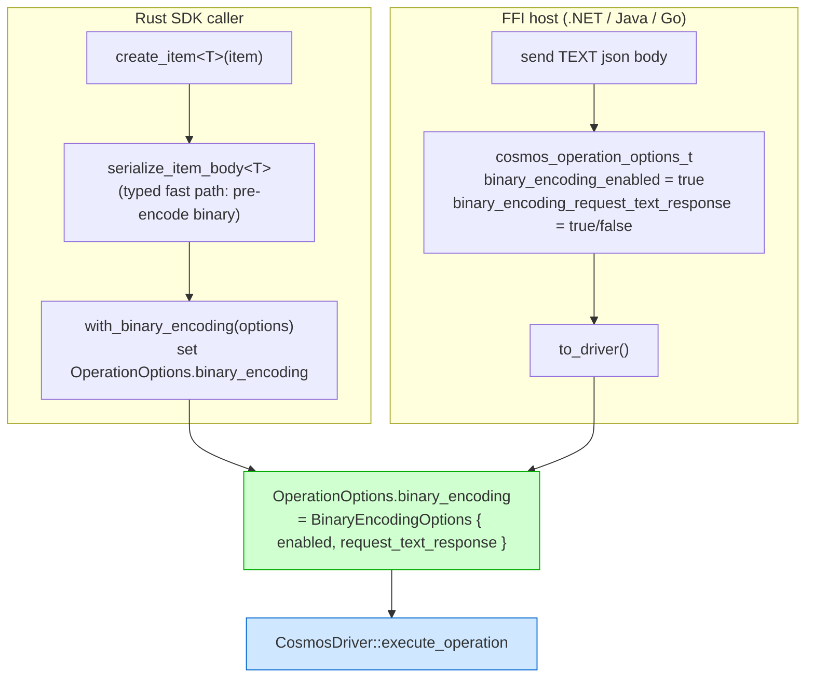
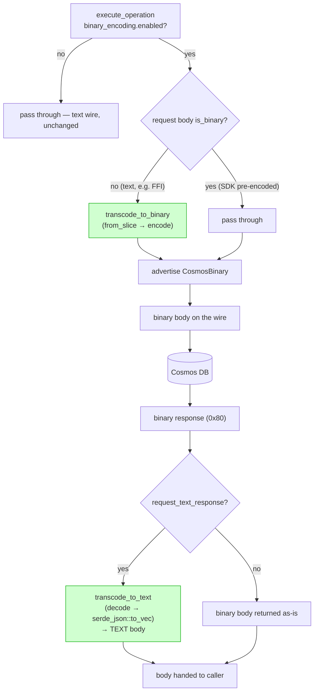
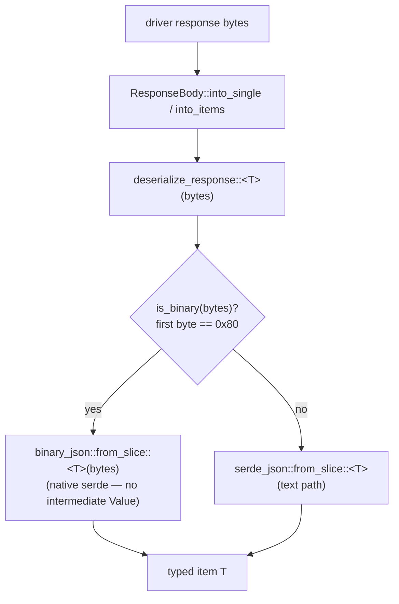
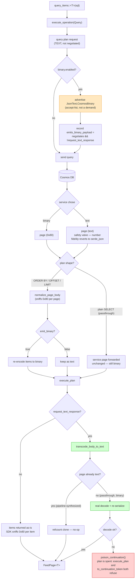
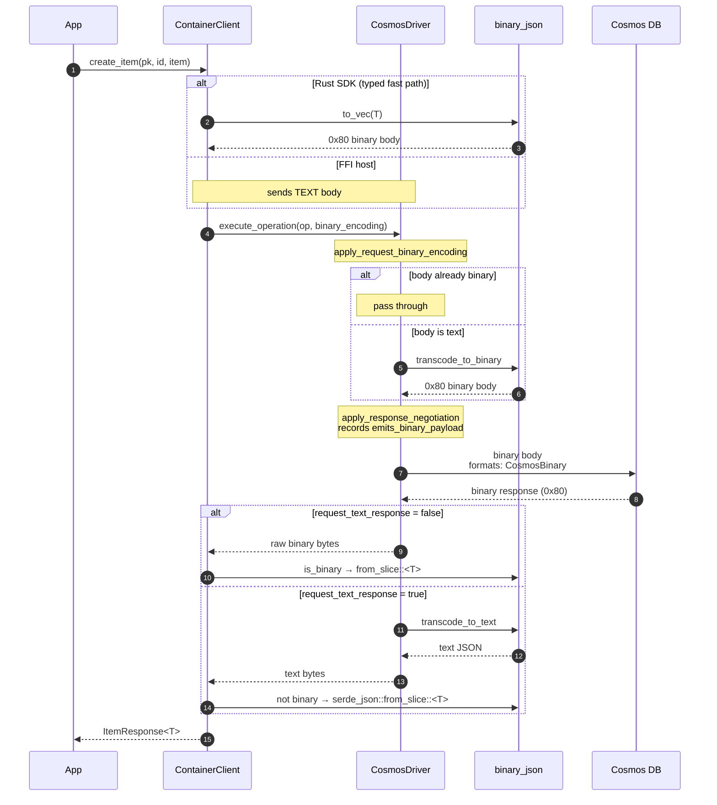
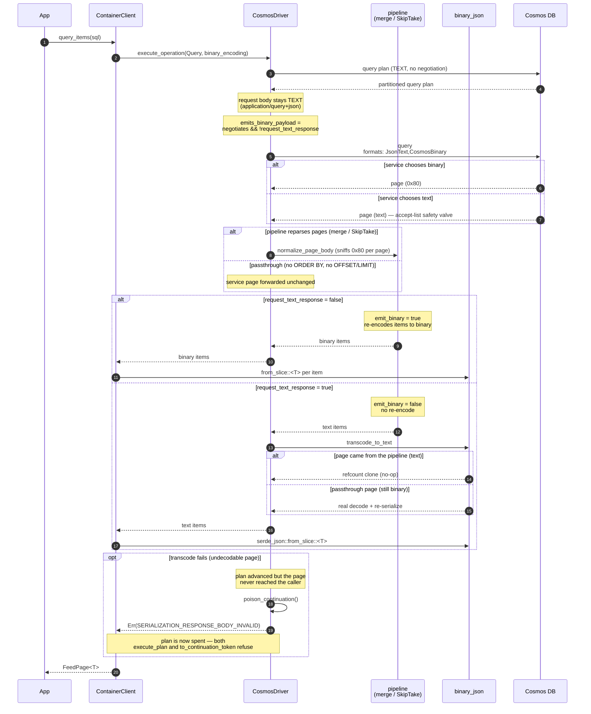

# Binary Encoding — High-Level Design (HLD)

This document is the high-level design for Cosmos **binary JSON** encoding in the
Rust SDK and driver. It captures the goals, the wire/transcoding model, the
component layout, testing, and the current support status.

For the phased implementation plan and low-level wire details, see
[`BINARY_ENCODING_SPEC.md`](https://github.com/Azure/azure-sdk-for-rust/blob/main/sdk/cosmos/azure_data_cosmos_driver/docs/BINARY_ENCODING_SPEC.md).

---

## Summary

Adds first-class support for **Cosmos binary JSON** to the Rust SDK and driver. Cosmos binary JSON is a tagged byte stream the service can persist and transmit in place of UTF-8 text JSON; it is more compact and cheaper to (de)serialize.

This design delivers a **complete decoder** and a **native serde codec**, and makes binary encoding a **driver capability** on `OperationOptions.binary_encoding` so it is shared by every consumer of the driver — the Rust SDK **and** any FFI-based SDK (.NET, Java, Go, …). It is enabled by default and can be disabled with `CosmosClientBuilder::with_binary_encoding_options`, a per-operation override, or `AZURE_COSMOS_BINARY_ENCODING_ENABLED=false`. When the option is off, every request and response is **byte-for-byte unchanged** — the binary code is inert.

Because the option lives on the driver and is schema-agnostic, the driver performs the byte-level transcoding **both ways** when needed:

* an opt-in **text-response** mode (`BinaryEncodingOptions::request_text_response`) keeps the wire binary in both directions (efficient RUs and bandwidth) while the driver transcodes the binary **response** back to text JSON;
* a caller that deals only in **text** (most importantly an FFI host) can enable binary and the driver transcodes its text **request** body to binary — so it gets a fully binary wire **without encoding anything itself**.

A self-contained, in-tree **end-to-end validation loop** is included via the in-memory emulator (no Docker, no live account, no external test vectors).

> **Scope:** item operations (`create` / `replace` / `upsert` / `read`) encode request bodies and decode responses; `query` negotiates a binary response (its `application/query+json` request body stays text). Patch, transactional batch, and bulk are intentionally excluded (see [Binary encoding support status](#binary-encoding-support-status)).

---

## Why binary JSON?

* **Smaller payloads** — tagged binary is more compact than text JSON.
* **Cheaper (de)serialization** — typed markers avoid text parsing/formatting.
* **Wire-compatible negotiation** — the client advertises what it accepts; the service chooses. Mixed text/binary deployments interoperate transparently.

The design follows the driver's **schema-agnostic data-plane** principle: the codec operates purely on bytes (and, for the reference oracle, `serde_json::Value`) and knows nothing about item schemas.

---

## How it works

### The `0x80` preamble — unambiguous auto-detection

Every binary buffer begins with the preamble byte `0x80`. Because `0x80` is a UTF-8 *continuation* byte, **no valid text JSON document can start with it**. This single-byte test (`binary_json::is_binary`) lets the decode path detect binary independently of any HTTP header, so responses decode correctly even if content negotiation headers are absent or unexpected.

### Native serde codec (no intermediate `Value`)

* **Read path** — binary responses deserialize straight into `T: Deserialize` via the native serde deserializer `binary_json::from_slice`, with no intermediate `serde_json::Value` on the common path. The complete `binary_json::decode` (binary → `Value`) is retained as the reference oracle for parity/fuzz tests and as the fallback the deserializer uses for the rare exotic wire forms (reference/compressed/GUID strings, binary blobs, uniform number arrays).
* **Write path** — item bodies serialize straight from `T: Serialize` to Cosmos binary JSON via the native serde serializer `binary_json::to_vec`, again with no intermediate `Value`. The serializer emits a correct (verbose-but-valid) buffer — it skips the size optimizations a writer *may* apply (reference-string dedup, compression, uniform arrays), all of which the decoder still accepts.

### Enablement (driver option, resolved once)

Binary encoding is a driver option: `OperationOptions.binary_encoding: Option<BinaryEncodingOptions>` (driver-owned type). The Rust SDK **re-exports** `BinaryEncodingOptions` and resolves enablement **once at client build** via `resolve_binary_encoding(Option<BinaryEncodingOptions>)`, storing it on the client context — there is no per-request lookup. It prefers the explicit `CosmosClientBuilder::with_binary_encoding_options(..)` option, then the `AZURE_COSMOS_BINARY_ENCODING_ENABLED` environment variable (truthy: `1` / `true` / `yes` / `on`, case-insensitive), and defaults to enabled when neither is set. Each item operation carries the resolved options onto its `OperationOptions` (via a `with_binary_encoding` helper).

FFI hosts set the equivalent flat fields on the C ABI `cosmos_operation_options_t` (`binary_encoding_enabled`, `binary_encoding_request_text_response`), which convert to the same driver option — so no SDK code is involved. Two ABI-specific details:

* Both fields are **tri-state** (`0` unset / `1` false / `2` true), not plain bools. `unset` inherits a lower layer, while an explicit `false` forces binary **off** for the operation regardless of any account or runtime default — a distinction the Rust `Option<BinaryEncodingOptions>` surface expresses with `None` vs `Some(..with_enabled(false))`.
* `binary_encoding_request_text_response` defaults to **false**. A host that sets only `binary_encoding_enabled` gets a binary wire *and* binary response bodies — including query result items — and must decode them itself, detecting via the `0x80` preamble. Text-in / text-out requires setting **both** flags.

### Two transcodes, both in the driver (schema-agnostic)

When `binary_encoding.enabled` is set, the driver owns the wire format both ways — the request side in `execute_operation`, the response side in `execute_plan`:

* **Request** (`apply_request_binary_encoding`) — transcodes a **text** request body to Cosmos binary JSON via `binary_json::transcode_to_binary` (`serde_json::from_slice` → `encode`). An **already-binary** or empty body passes through unchanged, so a caller that pre-encoded pays nothing. Response negotiation is a separate step (`apply_response_negotiation`) and advertises `CosmosBinary`.
* **Response** (when `request_text_response` is set) — transcodes the binary response back to text JSON via `binary_json::transcode_to_text` (`decode` → `serde_json::to_vec`). The wire stays binary in both directions. This lives in `execute_plan`, which **every** operation type funnels through — point ops, queries, and change feed alike — so the contract holds uniformly. A page that is already text transcodes as a refcount clone, so plans that never negotiated binary pay nothing. Note this is a genuine transcode on the query passthrough path: a plain `SELECT * FROM c` forwards the service's binary page verbatim, so nothing has converted it before `execute_plan` sees it. Only pages the pipeline synthesized (`ORDER BY`, `OFFSET`/`LIMIT`) are already text by then.

This keeps transcoding in the **driver** (not the backend) and, because it is schema-agnostic, lets a text-only FFI host get an efficient binary wire without encoding anything on its side. Note the two transcodes are independently controlled: enabling binary buys the request-side transcode unconditionally, but the host still receives **binary** responses unless it also sets `request_text_response`.

### Rust SDK typed fast path (optimization)

The Rust SDK keeps a typed fast path: `serialize_item_body` encodes `T: Serialize` straight to binary via `binary_json::to_vec` (skipping the text intermediate). The driver's request-side transcode then sees an **already-binary** body and passes it through unchanged — so the SDK pays no double work while sharing the exact same driver option surface as FFI callers.

### Negotiation header

When binary is enabled, the negotiation header is set per operation type,
matching .NET:

```
point ops: x-ms-cosmos-supported-serialization-formats: CosmosBinary
query:     x-ms-cosmos-supported-serialization-formats: JsonText,CosmosBinary
```

A query advertises an **accept-list** and lets the service choose, preserving
.NET's safety valve: a service version or query shape that cannot produce binary
answers in text and the query still succeeds. Nothing downstream requires the
format to be uniform across a result set — the pipeline paths that reparse a page
sniff the `0x80` preamble per page (`normalize_page_body`) and the emitted
encoding is a property of the operation (`emits_binary_payload`), not of any
absorbed page, so a merge over mixed binary and text source pages already
normalizes them. Point ops force `CosmosBinary` — a single body with no pipeline
behind it has nothing to gain from a per-response choice. Both constants are
documented in `driver/cosmos_driver.rs`.

**What a text answer costs.** The accept-list keeps the query *working*, but the
fallback is not free and it is not only a diagnosability gap:

* The RU and bandwidth saving is silently forfeited, with no signal distinguishing
  "binary negotiated" from "binary received". Today the only way to observe it is
  to count bytes, as the A/B harness does.
* **Number fidelity reverts to the text path.** A text page is parsed by
  `serde_json`, so an integral value the service would have tagged as an integer
  in binary becomes an `f64` — reintroducing the integral-`Double`→integer
  divergence (#5028) that motivated this feature. Typed deserialization into an
  integer field can then fail.

That second cost applies to **every** query shape, not just the ones that reparse
pages. `normalize_page_body` is reached only from `parse_envelope_page` (the
`ORDER BY` merge) and `skip_take_page`, and `build_sequential_drain` wraps the
fan-out in `SkipTake` only when `skip > 0 || take.is_some()` — so a plain
`SELECT * FROM c` hands the service's page back untouched. On the merge path the
page is not rescued either: `normalize_page_body` is a no-op on text, and
`build_page` re-encodes through `serde_json`, so the value has already lost its
integer tag. Point ops are unaffected, since they demand `CosmosBinary` outright.

The request `Content-Type` stays `application/json`; the service detects the binary body from its first byte.

The **driver** owns this header, and sets it only when all of the following hold:

* `binary_encoding.enabled` is set;
* the operation negotiates a binary response (`binary_negotiates_response` — `Document` plus a point item op or query; change feed is excluded);
* the caller has not already set the header itself.

`request_text_response` deliberately does **not** suppress negotiation, for any operation type. The flag describes the payload handed back to the caller, not the encoding on the wire: the wire stays binary and `execute_plan` transcodes the response before returning it. Suppressing negotiation would silently forfeit the bandwidth saving that enabling binary was meant to buy.

One consequence is worth stating plainly: text handed back under `request_text_response` is **re-serialized by the driver**, not the service's original bytes. Values are preserved, but object keys are emitted in sorted order (`serde_json::Map` is a `BTreeMap`) and numbers use Rust's shortest round-trip rendering (`1e20` → `1e+20`). Callers needing byte-exact service output should leave binary encoding disabled.

### Wire format vs emitted format

These are two different questions, and `request_text_response` is exactly where they diverge:

* `CosmosOperation::negotiates_binary_response()` — what the **service** was asked to send. Drives the request header.
* `CosmosOperation::emits_binary_payload()` — what the **caller** receives. Equals `negotiates_binary_response() && !request_text_response`.

Pipeline nodes that synthesize a page (`StreamingOrderedMerge`, `SkipTake`) derive `emit_binary` from the second. Deriving it from the first would have them re-encode every item to binary only for `execute_plan` to decode it straight back — a wasted round trip per item on the `ORDER BY` and `OFFSET`/`LIMIT` paths. The flag is recorded on the operation at negotiation time (`apply_response_negotiation`), so the planner does not need the options view threaded through it.

---

## Flow diagrams

Binary encoding lives on the driver's `OperationOptions.binary_encoding`. Both
the Rust SDK and FFI hosts set that option; the **driver** owns the wire format
and the two transcodes. The only difference is *how the request body arrives*:
the Rust SDK may pre-encode typed `T` to binary (an optimization), while an FFI
host sends plain text and lets the driver transcode.

The first four diagrams follow a **point operation**, where a single body goes
out and a single body comes back. [Query](#query-end-to-end-pages-pipeline-and-the-accept-list)
is diagrammed separately, because its request body never becomes binary, its
response format is a service *choice* rather than a demand, and a pipeline sits
between the service page and the caller.

### End-to-end request + response (both paths, unified)

This single view follows an item write/read all the way through: how the body
arrives (Rust SDK typed fast path vs FFI text), the driver's schema-agnostic
request-side gate/transcode, the service round-trip, and the two response
outcomes (raw bytes for the SDK to decode by `0x80` sniffing, or a driver
binary&rarr;text transcode for text-only FFI hosts).

```mermaid
flowchart TD
    subgraph RUST["Rust SDK (azure_data_cosmos)"]
        RA["create/replace/upsert_item&lt;T&gt;(item)"]
        RS["serialize_item_body(item, binary)"]
        RA --> RS
        RS -->|binary=true| rust_binary["binary_json::to_vec(T)<br/>&rarr; already 0x80 binary"]
        RS -->|binary=false| rust_text["serde_json::to_vec(T)<br/>&rarr; text JSON"]
    end

    subgraph FFI["FFI / text hosts (driver_native)"]
        FA["create_item(bytes)"]
        FA --> ffi_text["raw text JSON bytes"]
    end

    rust_binary --> DRV
    rust_text --> DRV
    ffi_text --> DRV

    subgraph DRIVER_REQ["Driver — request side (schema-agnostic)"]
        DRV["execute_operation"]
        DRV --> GATE{"binary_encodes_request_body?<br/>(Document + point op)<br/>AND binary.enabled"}
        GATE -->|no| PLAN
        GATE -->|yes| APPLY["apply_request_binary_encoding<br/>(body transcode only)"]
        APPLY --> CHK{"body already binary?"}
        CHK -->|yes / empty| PASS["pass through unchanged"]
        CHK -->|no = text| TRANS["transcode_to_binary(bytes)"]
        PASS --> PLAN
        TRANS --> PLAN["plan_operation →<br/>apply_response_negotiation"]
        PLAN --> NEG{"binary_negotiates_response?<br/>(point op + query)<br/>AND binary.enabled"}
        NEG -->|no| WIRE["send request to Cosmos"]
        NEG -->|yes| HDR["advertise CosmosBinary<br/>(supported-serialization-formats header)"]
        HDR --> WIRE
    end

    WIRE --> COSMOS[("Cosmos DB service")]
    COSMOS --> RESP["response body<br/>(binary 0x80 or text,<br/>per negotiation)"]

    subgraph DRIVER_RESP["Driver — response side (schema-agnostic)"]
        RESP --> RT{"request_text_response?<br/>(binary.enabled &&<br/>request_text_response)"}
        RT -->|yes = FFI/text host| to_text["transcode_body_to_text<br/>(binary &rarr; text bytes)"]
        RT -->|no = Rust SDK| raw_out["return raw response bytes"]
    end

    to_text --> FRET["FFI: text JSON bytes<br/>back to native caller"]
    raw_out --> sdk_decode["SDK: deserialize_item_body&lt;T&gt;"]

    subgraph sdk_response_decode["Rust SDK — response decode"]
        sdk_decode --> is_binary{"first byte == 0x80?"}
        is_binary -->|yes| decode_binary["binary_json::from_slice::&lt;T&gt;"]
        is_binary -->|no| decode_text["serde_json::from_slice::&lt;T&gt;"]
        decode_binary --> TYPED["typed T returned to caller"]
        decode_text --> TYPED
    end

    style TRANS fill:#d0ffd0,stroke:#0a0
    style to_text fill:#d0ffd0,stroke:#0a0
    style rust_binary fill:#d0e8ff,stroke:#06c
    style GATE fill:#ffe8c0,stroke:#e80
```



### Where the option comes from (Rust SDK vs FFI)



### Driver request + response path (owns both transcodes)



### Rust SDK response decode (typed)

After the driver returns the body, the Rust SDK deserializes it. Auto-detection
by the `0x80` preamble means the decode path is correct whether the body came
back binary or was transcoded to text by the driver.



### Query end-to-end (pages, pipeline, and the accept-list)

The request-side gate is absent — a query spec is not a document, so the body
stays text and only the **response** is negotiated. Three things then vary that a
point op never has to consider: the service *chooses* the page format, the plan
shape decides whether a page is reparsed or forwarded untouched, and
`emits_binary_payload` decides whether pipeline-synthesized pages are re-encoded.



Two edges are worth reading off the diagram directly. `passthrough` &rarr;
`real_transcode` is the common case a plain `SELECT * FROM c` takes under
`request_text_response`, and it is a **full** transcode — the "already text, so
cloning" shortcut applies only to pages the pipeline built. And `page_text` is
reachable at the service's discretion on any query, so a text page is a normal
outcome rather than a failure; what it costs is described under
[What a text answer costs](#negotiation-header).

---

## Sequence diagrams

Two shapes matter, and each behaves differently under `request_text_response`, so
both settings are shown inline as branches.

### Point operation (`create` / `read` / `replace` / `upsert`)

The request body is encoded and the response is negotiated as `CosmosBinary`
outright. `request_text_response` changes only the final hop — the wire is
identical in both branches.



### Query

Three things differ from the point op. The request body is always text
(`application/query+json` is a query spec, not a document), so only the response
is negotiated. The header is an **accept-list**, so the service's choice is a real
branch. And `request_text_response` changes the work the pipeline does, not just
the final hop: it flips `emit_binary` on the nodes that synthesize pages, so
`ORDER BY` and `OFFSET`/`LIMIT` skip re-encoding every item to binary only for the
driver to decode it straight back.



**When a page cannot be transcoded.** The failure is specific to queries,
because only a query has a resume position to lose. By the time
`transcode_body_to_text` runs, the pipeline has already advanced every node past
that page. Returning the error alone would leave the plan claiming progress the
caller never received, so the next page fetched would be the page *after* the
lost one and a minted token would resume past it — in both cases silently.

The plan therefore poisons itself and closes both exits: `execute_plan` refuses
to fetch again, and `to_continuation_token` refuses to mint
(`CLIENT_CONTINUATION_TOKEN_AFTER_TRANSCODE_FAILURE`). This mirrors `SkipTake`,
which poisons on the same reasoning one layer down, and it is durable rather
than per-call: replaying the page fails identically, so retrying is futile. The
recovery is to re-run from the last token captured successfully, or with binary
disabled.

The query-plan fetch is a separate text request, which is why `binary%` in the A/B
harness tops out around 87–94% rather than 100% — expected, not a leak.

When the option is **off**, both paths collapse to the existing text behavior —
`serde_json` on the way out and back, byte-for-byte unchanged.

---

## Key components

| Component | File | Role |
|---|---|---|
| `binary_json` module | `azure_data_cosmos_driver/src/binary_json/` | The codec (schema-agnostic) |
| `markers` | `binary_json/markers.rs` | Type-marker constants, transcribed byte-for-byte from .NET `JsonBinaryEncoding.TypeMarker.cs` |
| `system_strings` | `binary_json/system_strings.rs` | 32-entry system-string dictionary (byte-exact vs .NET) |
| `decode` / `Reader` | `binary_json/reader.rs` | **Complete** decoder → `serde_json::Value` (reference oracle + exotic-form fallback) |
| `from_slice` / `de` | `binary_json/de.rs` | Native serde **deserializer** (`binary` → `T`), the production read path |
| `to_vec` / `ser` | `binary_json/ser.rs` | Native serde **serializer** (`T` → `binary`), the production write path |
| `encode` | `binary_json/writer.rs` | `Value` → `binary` reference encoder (parity oracle + shared emit helpers) |
| `is_binary` / `PREAMBLE` / `transcode_to_text` / `transcode_to_binary` | `binary_json/mod.rs` | First-byte (`0x80`) auto-detection + the two schema-agnostic transcoding primitives (binary→text, text→binary) |
| `deserialize_response` / `ResponseBody::transcode_to_text` | `models/response_body.rs` | Decode choke point for `into_single` / `into_items`; in-place binary→text conversion |
| `BinaryEncodingOptions` | `azure_data_cosmos_driver/src/options/binary_encoding.rs` | **Driver-owned** options (`enabled`, `request_text_response`), on `OperationOptions.binary_encoding`; the SDK re-exports it |
| `OperationOptions.binary_encoding` | `driver/options/operation_options.rs` | Layered option carrying binary encoding to every consumer (SDK + FFI) |
| `execute_operation` / `apply_request_binary_encoding` | `driver/cosmos_driver.rs` | Driver owns the wire: transcodes text→binary request, advertises `CosmosBinary`, transcodes binary→text response |
| `CosmosResponse::transcode_body_to_text` | `models/cosmos_response.rs` | Applies driver-side response transcoding |
| `resolve_binary_encoding` / `with_binary_encoding` | `azure_data_cosmos/src/clients/{mod,container_client}.rs` | SDK: resolve enablement once; set the option on `OperationOptions` per item op |
| `serialize_item_body` | `azure_data_cosmos/src/clients/container_client.rs` | SDK typed fast path: pre-encode `T` to binary (driver passes it through) |
| `cosmos_operation_options_t.binary_encoding_*` | `driver_native/src/op_request.rs` | FFI: flat `binary_encoding_enabled` / `binary_encoding_request_text_response` flags → driver option |
| In-memory emulator binary support | `in_memory_emulator/{dispatch,response,operations}.rs` | Decodes binary requests, replies binary on negotiation — enables the E2E loop |

---

## Testing

* **Decoder** — golden-vector parity corpus; per-form unit tests across every marker family.
* **Encoder** — `encode → decode` round-trip tests (numbers across all widths, strings incl. unicode/escapes/boundary lengths, nested containers, empties).
* **Robustness (P4)** — deterministic fuzz suite asserting the decoder *always* terminates with `Ok | Err` on untrusted input: never panics on random / truncated / single-byte-corrupted buffers, never over-allocates on adversarial length prefixes (`u32::MAX` errors in O(1)), and rejects deep nesting with `DepthLimitExceeded` instead of a stack overflow.
* **Nesting depth is symmetric.** `reader::MAX_DEPTH` (256, mirroring .NET's `JsonObjectState.JsonMaxNestingDepth`) bounds both directions. `transcode_to_binary` cannot simply use `serde_json::from_slice`, whose recursion guard stops at 128: the driver would then accept a document on the way in that it could not re-encode on the way out, and a legal service document would fail mid-pipeline (the ORDER BY merge re-encodes every item). `binary_json::parse_text_json` therefore bounds nesting with a non-recursive byte scan first, and only then disables `serde_json`'s own guard — the scan replaces it rather than removing it, so adversarial input still cannot exhaust the stack.
* **End-to-end (in-memory emulator)** — `binary_round_trip.rs`:
  * `binary_encoding_item_write_read_round_trips` — create / read / upsert / replace through the full SDK → driver → emulator binary loop, including a unicode payload (`"café ☃ binary"`).
  * `binary_and_text_clients_interoperate` — a binary-written document reads back through a text client and vice-versa.
  * `request_text_response_keeps_wire_binary_and_returns_data` — with `request_text_response`, a `RequestObserver` confirms every item request advertised `CosmosBinary` (wire stayed binary) while the typed document still round-trips (driver transcoded to text).
* **Response-format negotiation** — `binary_response_format.rs` sends a binary request through the emulator and inspects the **raw** response bytes for each negotiation (`CosmosBinary` → binary, `JsonText` → text, none → text); `dispatch.rs` unit tests cover the emulator's `binary_response` decision.
* **Transcoding** — `binary_json::transcode_to_text` **and** `transcode_to_binary` unit tests (round-trip equivalence, binary/text/empty passthrough, malformed-input errors); `ResponseBody::transcode_to_text` tests.
* **Driver option + request encode** — `OperationOptions.binary_encoding` builder/layered-resolution tests; `apply_request_binary_encoding` tests (text→binary + header, already-binary passthrough, invalid-text error).
* **FFI** — `cosmos_operation_options_t` conversion tests: `binary_encoding_enabled` + `request_text_response` build the driver option (enabled+text, enabled-only, explicit disable preserved).
* **Benchmarks** — `azure_data_cosmos_benchmarks`'s `binary_encode` / `binary_decode` compare text, the retired via-`Value` path, and the shipped native codec on small and ~1.7 MB items.

Validation sweep (per the cosmos contributing guidelines): `cargo fmt`, `clippy` (driver `--all-features`; SDK default features), `cargo doc -D warnings` (driver), `cspell`, and the driver lib + SDK test suites — all clean.

Run the E2E loop locally:

```bash
cargo test -p azure_data_cosmos --features __internal_in_memory_emulator \
    --test in_memory_emulator binary_round_trip
```

---

## Configuring binary encoding

Binary is **on by default**. To disable it for a client, set explicit options on the client builder:

```rust
use azure_data_cosmos::options::BinaryEncodingOptions;

let client = CosmosClientBuilder::new()
    .with_binary_encoding_options(BinaryEncodingOptions::new().with_enabled(false))
    .build(account, routing_strategy)
    .await?;
```

To keep the wire binary but receive text-JSON responses (driver transcodes):

```rust
let options = BinaryEncodingOptions::new()
    .with_enabled(true)
    .with_request_text_response(true);
let client = CosmosClientBuilder::new()
    .with_binary_encoding_options(options)
    .build(account, routing_strategy)
    .await?;
```

When the builder option is not set, the default can also be overridden with an environment variable:

```bash
AZURE_COSMOS_BINARY_ENCODING_ENABLED=false
```

The explicit builder option takes precedence; the flag is resolved once at client build.

### From an FFI host (text in, text out)

An FFI-based SDK sets two flat flags on `cosmos_operation_options_t` — no
encoding on its side. It sends a plain **text** JSON body; the driver puts binary
on the wire and (with `request_text_response`) transcodes the response back to
text:

```c
cosmos_operation_options_t opts = cosmos_operation_options_default();
opts.binary_encoding_enabled = 2;                  /* tri-state: 2 = true */
opts.binary_encoding_request_text_response = 2;    /* 2 = true  */
/* request.body = plain TEXT JSON bytes; request.options = &opts */
```

---

## Backward compatibility & safety

* **Explicit opt-out.** `BinaryEncodingOptions::with_enabled(false)` or `AZURE_COSMOS_BINARY_ENCODING_ENABLED=false` preserves the text-only behavior; requests and responses are byte-for-byte unchanged by the binary codec.
* **Response decode is always on but inert.** `is_binary` only triggers on a `0x80` first byte, which the service emits solely when it has negotiated binary — so enabling decode cannot affect existing text responses.
* **No model sharing across crates.** The SDK consumes the driver's codec via its public `binary_json` API. `BinaryEncodingOptions` is a **driver** type the SDK re-exports (like `Region` / `ConsistencyLevel`), because binary encoding is a wire/driver concern shared with FFI hosts; no item/document models cross the boundary.
* **Changelog entries are present** in both the SDK and driver for the user-facing default change.

---

## Binary encoding support status

Legend: **Done** shipped · **Pending** actionable follow-up · **Blocked** waits on
non-binary work · **N/A** out of scope by design.

### By operation

| Area | Request encode | Response negotiate | Response decode | Status |
|---|:--:|:--:|:--:|---|
| Point item ops (`create` / `read` / `replace` / `upsert`) | Yes | Yes | Yes | **Done** |
| `delete` | — (no body) | No | — | **Pending** — .NET negotiates it; see parity #2 |
| Query — single-partition | text by design | Yes | Yes | **Done** |
| Query — passthrough cross-partition | text by design | Yes | Yes | **Done** |
| Query — streaming ORDER BY (scalar keys) | text by design | Yes | Yes | **Done** |
| Query — `OFFSET` / `LIMIT` / `TOP` (SkipTake) | text by design | Yes | Yes | **Done** |
| Query — aggregate / GROUP BY / DISTINCT | — | — | — | **Blocked** — engine absent |
| `patch` | No | No | Yes | **N/A** — client-side RMW; its inner read/replace are encoded |
| Change feed / `ReadFeed` | No | No | capable, unused | **N/A** — backend does not honor the header |
| Transactional `batch` / `bulk` / stored procedures / control-plane | No | No | — | **N/A** — deferred by spec |

### Pending work

| # | Item | Why it matters | Size |
|---|---|---|---|
| 1 | **Gateway 2.0 / thin client** — carry `SupportedSerializationFormats` as an RNTBD metadata token | Customer-visible. The thin-client path re-encodes requests as an RNTBD token list with no such token, so the header is dropped and the service returns **text** — reintroducing the integral-`Double`→integer divergence (#5028) this feature exists to fix. A wide integer that round-trips on the standard gateway can still fail typed deserialization on a thin-client account. | Medium |
| 2 | **`parse_envelope_page` on binary (perf + fidelity)** — see below | Efficiency and byte fidelity only; no correctness gap | Medium–Large |
| 3 | **`delete` negotiation** — add to `supports_binary_response` to match .NET | Wire-scope parity; low impact (no request body, usually no response body) | Small |
| 4 | **Cross-implementation vectors** — validate against captured real .NET / Java binary output | Our encoder emits none of the compact forms (reference dedup, system strings), so emulator-based tests never exercise them. A slice-based reader would pass every test we have and still corrupt real service data. | Medium |
| 5 | **Aggregate / GROUP BY / DISTINCT** | **Blocked, not pending.** `validate_query_info` rejects all three cross-partition in *any* encoding, so there is no merge to make binary-aware. Whoever builds the engine owns the binary path with it — ideally on a format-agnostic value model (like .NET's `CosmosElement`) so binary is inherent, not retrofitted. Single-partition DISTINCT is a passthrough drain and already round-trips binary. | — |

#### Detail: item 2, binary-aware `parse_envelope_page`

A binary page is currently transcoded roughly three times per document: whole-page
binary&rarr;text, `serde_json` envelope parse, then a per-item text&rarr;binary
re-encode in `build_page`. A binary-aware reader would decode only `orderByItems` /
`_rid` and keep each payload as a **view** — the refcounted page `Bytes` plus an
offset — so emitted items are the service's original bytes.

> **Do not slice a document out and re-prefix it with `0x80`.** Reference strings
> (`STR_R1`-`STR_R4`) resolve against *absolute page offsets* (see
> `Reader::resolve_reference`) and the interning scope is the whole page, so a
> detached sub-slice mis-resolves any reference pointing outside it — silently
> returning wrong text rather than erroring, whenever the target bytes happen to
> start with a string marker.

A view keeps the page alive, and `Reader::new(buf, offset)` already reads from an
arbitrary start. Trade-off: a buffered row pins its whole source page (peak
retention ~ `fan_out x page_size`). ORDER BY gains most, because the merge fetches
from every partition but emits a subset — today every fetched page is transcoded in
full even when a `TOP` discards it. Blast radius is `ResponseBody::Items` (driver
public API, also consumed by the native FFI crate) plus a `build_page` restructure,
since merged rows span multiple source pages.

Note also that the emitted encoding follows the **negotiated operation**, not the
bytes of any absorbed page, so on a binary-negotiated query the items sourced from
**text** pages are re-encoded too, which normalizes key order and collapses
duplicate keys.

#### Invariant for future feed splitters

`skip_take_page::split_feed_envelope` detects a binary envelope, transcodes it, and
splits it into **text** payloads; `skip_take_page::encode_items` then re-encodes each
surviving document **standalone**, so every `ResponseBody::Items` producer emits
per-document binary that `into_items` auto-detects by preamble. Any future splitter
must keep that invariant: slicing a single-preamble envelope without re-encoding per
document yields preamble-less sub-documents misrouted to the text path.

The split/encode order matters as much as the encoding itself. `SkipTake` splits,
applies its window, and only then encodes the survivors — so a document the window
discards costs no transcode, and cannot fail a query it contributes nothing to. A
splitter that encodes at split time pays for every document the page carried.

---

## Rust vs .NET parity

How binary encoding compares to the .NET SDK (`Azure/azure-cosmos-dotnet-v3`).
Binary encoding spans three independent concerns: **request encode** (body
serialized as binary), **response negotiate** (advertise
`x-ms-cosmos-supported-serialization-formats: CosmosBinary`), and **response
decode** (auto-detected by the `0x80` first byte).

> Last verified: 2026-08-10, against `azure-cosmos-dotnet-v3` `main`.

### Enablement model

| | .NET | Rust |
|---|---|---|
| Enablement | `ConfigurationManager.IsBinaryEncodingEnabled()` (env var) + `ItemRequestOptions.EnableBinaryResponseOnPointOperations` | Enabled by default; `BinaryEncodingOptions` (client default + per-op override) and environment opt-out |
| Suppressed with custom serializer | Yes — `GetTargetResponseSerializationFormat` returns `Text` | N/A (SDK owns serde) |
| Response decode | Format-agnostic `JsonNavigator` (first-byte detect) | Shared `deserialize_response` / `is_binary` choke point |
| Status | Preview / opt-in | Preview / enabled by default |

### Divergences

| # | Difference | Detail | Severity |
|---|---|---|---|
| 1 | Aggregate / GROUP BY / DISTINCT cross-partition | .NET runs them; its merge is on the format-agnostic `CosmosElement` model, so binary works for free. Rust's `validate_query_info` **rejects them in any encoding** — the engine does not exist yet. | Real capability gap (not binary-specific) |
| 2 | `delete` negotiation | .NET's `IsPointOperationSupportedForBinaryEncoding` includes `Delete`; Rust's `supports_binary_request_body` / `supports_binary_response` exclude it. | Minor — pending item 3 |
| 3 | Gateway 2.0 negotiation | Honored on the standard gateway only; the thin-client path drops the header and the service returns text. | Real gap — pending item 1 |
| 4 | Patch mechanism | .NET Patch is a real server op, not binary-negotiated. Rust Patch is a client-side read-modify-write, so its internal read/replace **are** encoded when enabled. Both functionally correct. | Cosmetic / architectural |
| 5 | Negotiation header value | Matched. Query = `"JsonText,CosmosBinary"`, point ops = `"CosmosBinary"` on both SDKs. | None |

### Matched by design

* Point item ops encode requests and decode responses identically.
* Single-partition and passthrough cross-partition queries: text request body, negotiated binary response, per-page binary decode.
* Query request body always stays text (`application/query+json` is a query spec, not a document).
* Change feed / `ReadFeed` excluded from negotiation (the backend returns binary for ReadFeed-with-partition-key as a known bug).
* Batch / bulk / stored procedures / control-plane resources never use binary JSON.
* Response decode is a single format-agnostic choke point on both sides.

### Bottom line

For point operations, single-partition queries, and every cross-partition query
shape Rust currently supports, the two SDKs are **functionally equivalent** on
binary encoding. Divergence #1 is a missing query engine rather than a binary
issue; #2 and #3 are the actionable binary items.

### .NET source references

* `src/Handler/RequestInvokerHandler.cs` — `IsPointOperationSupportedForBinaryEncoding` (create/replace/delete/read/upsert).
* `src/RequestOptions/QueryRequestOptions.cs` — `PopulateRequestOptions` sets the header for `OperationType.Query` only (with the ReadFeed backend-bug comment).
* `src/Query/v2Query/DocumentQueryExecutionContextBase.cs` — `DefaultSupportedSerializationFormats = "JsonText,CosmosBinary"`.
* `src/Resource/Container/ContainerCore.Items.cs` — `GetTargetRequestSerializationFormat` / `GetTargetResponseSerializationFormat`.

---

## Reference

* Design + phased plan: [`BINARY_ENCODING_SPEC.md`](https://github.com/Azure/azure-sdk-for-rust/blob/main/sdk/cosmos/azure_data_cosmos_driver/docs/BINARY_ENCODING_SPEC.md)
* Wire constants transcribed from .NET `Microsoft.Azure.Cosmos/src/Json/JsonBinaryEncoding.*`
