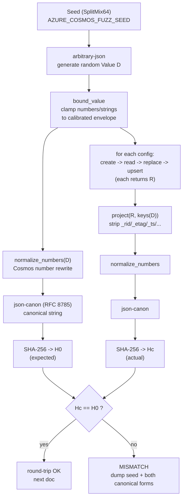
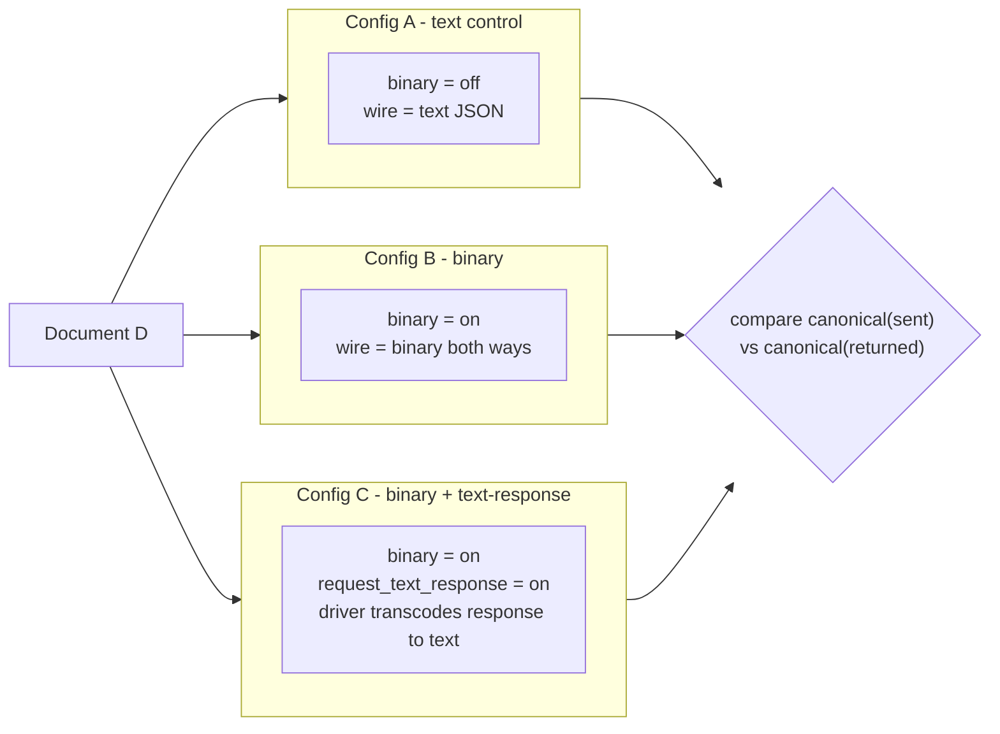
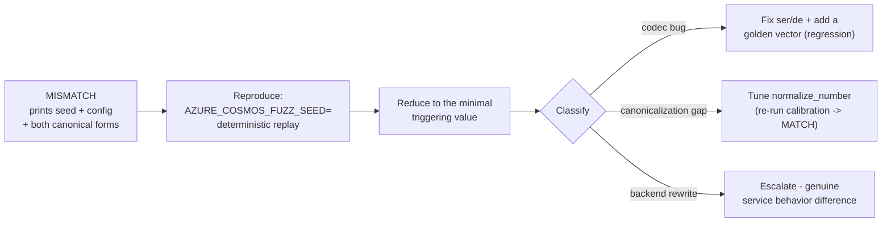
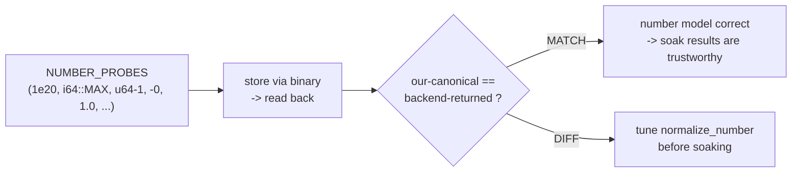

# Binary-Encoding Round-Trip Fuzzer — Design

**Status:** Draft · **Companion harness:** `azure_data_cosmos_perf/tests/binary_roundtrip_fuzzer.rs`

## 1. Goal

Validate that **arbitrary JSON survives a full Cosmos round-trip unchanged**,
across binary-encoding configurations, at high volume. Where the deterministic
golden vectors ([`binary_json_vectors.json`](../testdata/binary_json_vectors.json))
prove specific byte layouts and the in-tree fuzz suite hammers the *decoder* with
malformed input, this harness exercises the **end-to-end path**:

```
generate JSON → Rust encode → wire → backend store+rewrite → wire → Rust decode → compare
```

A single machine can validate **millions of distinct JSON structures over a few
days**, which no hand-written test set can approach.

This directly implements the reviewer request (FabianMeiswinkel, PR #4671):

> a tool that can produce random json structures and does e2e validation (via
> canonicalization + hash) — this would allow us to test millions of differently
> structured json objects and increase confidence level.

## 2. Core idea: canonicalize + compare

For each generated document `D`:

1. `H0 = hash(canonicalize(D))`
2. For each config `C` (binary on/off, text-response on/off, …):
   - drive every **body-carrying point op** — `create` → `read` → `replace` →
     `upsert` — each returning a document `R` (writes use content-response so the
     response decode path is exercised too);
   - `Hc = hash(canonicalize(project(R, keys(D))))` for each op's `R`;
   - **assert `Hc == H0`** for every op — otherwise dump the seed + both
     canonical forms.

These are exactly the four point operations for which binary encoding is honored
(`create` / `read` / `replace` / `upsert`); `delete` carries no body, and
`patch` / transactional batch / bulk are deferred (see the SPEC/HLD), so they are
intentionally excluded.

`project(R, keys(D))` strips the service-added system fields (`_rid`, `_etag`,
`_ts`, `_self`, `_attachments`) so only the fields we control are compared.

The harness compares **canonical strings directly** (strongest signal — it can
print the exact diff) *and* logs a **SHA-256** digest so the "store `H0` once,
compare later" workflow is available for a persistent corpus. SHA-256 is stable
across runs and platforms; we are detecting *differences*, so the digest's role
is a compact, durable corpus key rather than collision defense. (The canonical
string is produced by RFC 8785 / `json_canon` over the number-normalized value —
see §9.)

### 2.1 How this detects codec gaps

The fuzzer needs no knowledge of *correct bytes* — it exploits one invariant:
**a value stored and read back must be identical.** It runs each generated
document through **three configs** (text control, binary, binary+text-response),
which is what lets a mismatch **localize the broken layer**:

| Symptom in the mismatch dump | Where the bug is |
| ---------------------------- | ---------------- |
| Text config passes, **binary** config fails | The **encoder** (`ser.rs` / `writer.rs`) emitted wrong bytes for some value. |
| Binary write succeeds but the **read decodes wrong** | The **decoder** (`de.rs` / `reader.rs`) mishandles a wire form. |
| **binary+text-response** fails but plain binary passes | The **driver transcode** (`transcode_to_text`) loses something on binary→text. |
| **All configs fail identically** | Likely a backend rewrite the canonicalizer doesn't model yet → a calibration gap (tune `canonicalize_number`, §3.1), or a genuine service behavior to escalate. |

The specific classes of gap it is built to surface — the ones curated tests miss
because no human authored the triggering input:

- **Encoder ↔ decoder disagreement on a wire form the *backend* emits.** The Rust
  encoder emits only a *subset* of wire forms; the decoder accepts *all* of them
  (system strings, compressed 4/5/6/7-bit strings, GUID/base64 forms, uniform
  number arrays, reference strings). If the decoder mishandles a compact form the
  **backend** produces but the Rust encoder never does, no unit test exercises
  it — only a live round-trip does.
- **Number precision/representation edges** — exactly what calibration surfaces:
  non-finite handling, `-0`, integers above `i64::MAX` (backend stores as
  doubles), high-precision floats.
- **Unicode / string escaping** — astral code points, control characters,
  characters needing JSON escaping; a mismatch here is an encoder/decoder
  UTF-8/length bug.
- **Container framing** — deep nesting, mixed vs. uniform arrays, empty
  containers, arrays-of-objects; catches off-by-one length/count bugs.
- **The transcode path specifically** — the `binary+text-response` config is the
  *only* end-to-end exercise of `transcode_to_text` against real binary the
  backend produced.

**The debugging loop:** a failure prints the exact document, the config, and the
seed. Re-run with `AZURE_COSMOS_FUZZ_SEED=<n>` to reproduce deterministically,
reduce to the minimal triggering value, add it as a golden vector, and fix the
codec — then the new vector guards against regression.

**Limitations to keep in mind:** the fuzzer is only as good as its calibration
and its generator's range. Under-calibrated `canonicalize_number` → false
positives (noise); a form the generator never emits → false negatives (blind
spots). Calibrate first (§3.1), then widen coverage progressively with
`--wide-numbers` / `max_depth` / `unicode`.

### 2.2 How it works, visualized

**The per-document loop.** Every generated document is canonicalized once to get
the expected hash `H0`, then stored + read back under each config and compared:



**Three configs localize the broken layer.** The same document `D` runs through
three client configurations; because only one variable differs, *which* config
fails points at *which* layer is broken:



| What fails | Where the bug is |
| ---------- | ---------------- |
| **Text (A) fails** | Not the codec — a canonicalization gap or a real backend rewrite; escalate. |
| **Binary (B) fails, text (A) passes** | The **encoder** (`ser.rs`/`writer.rs`) emitted wrong bytes. |
| Binary write OK but **read decodes wrong** | The **decoder** (`de.rs`/`reader.rs`) mishandles a wire form. |
| **C fails, B passes** | The **driver transcode** (`transcode_to_text`) loses something binary to text. |
| **All three fail identically** | A backend rewrite the canonicalizer doesn't model yet (tune `normalize_number`), or a genuine service behavior to escalate. |

**The debugging loop.** Every failure is deterministically reproducible and
reduces to a permanent regression guard:



**Calibration is the safety valve.** Before a soak is trustworthy, calibration
proves the number model matches *this* account, so a mismatch is a real bug and
not modeling noise (it prints a table; it does not assert — see §3.1):



## 3. Canonicalization (the hard part)

Two JSON texts are "the same value" if they canonicalize identically. Rules:

| Aspect      | Rule |
| ----------- | ---- |
| Whitespace  | removed entirely |
| Object keys | sorted lexicographically (by UTF-8 code unit) |
| Strings     | minimally JSON-escaped (via `serde_json`) |
| Arrays      | order preserved |
| **Numbers** | **Cosmos-compatible normalization — see §3.1** |

### 3.1 Number normalization (the tuning surface)

The subtlety the reviewer flagged: **the backend rewrites numbers on store**, and
its rewrite is *not* identical to a strict canonicalizer like
[JCS / RFC 8785](https://datatracker.ietf.org/doc/html/rfc8785). If we
canonicalized with JCS but the backend renders `1.0` as `1`, a faithful
round-trip would *falsely* report a mismatch.

The harness therefore uses a **Cosmos-compatible** number canonicalizer, not JCS:

- **Integers up to `i64::MAX`**: emit plain decimal, no decimal point, no
  exponent, no leading zeros. `-0` → `0`.
- **Integers above `i64::MAX`**: routed through `f64` (see the calibration
  finding below) — the backend stores them as doubles, so a sent u64 and its
  returned double must canonicalize identically.
- **Integral-valued floats** (e.g. `1.0`, `2.0e1`): normalized to their integer
  form (`1`, `20`) — this mirrors the observed backend rewrite where a trailing
  `.0` is dropped.
- **Non-integral floats**: shortest round-trippable decimal (Rust's `ryu`, via
  `serde_json`'s `f64` formatting).

> **Calibrated against a live account (§6).** The first calibration run
> (18 probes) confirmed **16/18 forms already match**, including the tricky ones:
> integral floats and integral exponents collapse to integers (`1.0`, `2e1` →
> `1`, `20`), `-0` → `0`, trailing zeros are dropped (`1.2300` → `1.23`),
> repeating/high-precision floats and `0.1 + 0.2` round-trip exactly, and the
> backend renders large/small exponents in scientific notation (`1e20`,
> `1e-20`) which reparses to the same `f64`. The **two DIFFs** were integers
> above `i64::MAX`: the backend stores them as IEEE-754 doubles (lossy) and
> returns scientific notation — `18446744073709551614` → `1.8446744073709552e+19`
> and `2^63` → `9.223372036854776e+18`. `canonicalize_number` now models this by
> routing `u64`-above-`i64::MAX` through `f64`, so both sides canonicalize to the
> same double form. Re-running calibration after this change yields all `MATCH`.
>
> To re-calibrate after any change (or against a different account/config), run
> calibration mode (`AZURE_COSMOS_FUZZ_CALIBRATE=true`, see §6): it stores each
> probe in `NUMBER_PROBES` through the binary path, reads it back, and prints a
> table comparing `canonicalize_number`'s rendering against the backend's
> returned form. Every `DIFF` is a form to model; calibration is a **diagnostic**
> (prints the table, does not assert), since a `DIFF` is the signal to tune, not
> a failure.

### 3.2 Generator stays inside the calibrated envelope

To avoid false positives from *un-calibrated* number forms, the generator emits

### 3.2 Generator stays inside the calibrated envelope

To avoid false positives from *un-calibrated* number forms, the generator emits
numbers in **backend-safe ranges by default** (bounded integers, bounded-precision
floats). A `--wide-numbers` flag widens the range once the canonicalizer is
calibrated for those forms — this is how you progressively expand coverage.

## 4. Generator

A seeded PRNG (`SplitMix64`, seed logged for exact reproduction) produces a
random JSON **object** (Cosmos items are objects) using a **hybrid** strategy:

- a **depth-controlled skeleton** builds a nested container *spine* to a target
  depth drawn from `[1, max_depth]`, guaranteeing the document actually reaches
  that depth (each level is randomly an object or an array, with a few irregular
  filler siblings);
- every **leaf and filler branch** is irregular JSON from
  [`arbitrary-json`](https://docs.rs/arbitrary-json) — random keys (incl. empty,
  control-char, and Unicode), mixed-type arrays, nested sub-objects and
  arrays-of-objects, occasional homogeneous number arrays, and the scalars
  `null` / `true` / `false`;
- numbers are clamped to the calibrated envelope (§3.2) unless `--wide-numbers`;
  strings to ASCII unless `unicode`.

> **Why hybrid?** `arbitrary-json`'s `arbitrary_iter` decides whether to recurse
> from *remaining bytes* and stops almost immediately, so an `arbitrary-json`-only
> generator produced near-flat documents (avg depth ≈ 1.3, unchanged by
> `max_depth`). The explicit skeleton restores real depth: measured average depth
> now scales with the knob (≈ 3.9 at `max_depth=3`, ≈ 8.5 at `max_depth=12`, with
> deepest docs reaching 11–17 levels), which is what exercises the codec's
> container framing (length/count prefixes, nested arrays-of-objects) and the
> decoder's `MAX_DEPTH` guard. A `generator_depth_scales_with_max_depth` offline
> test locks this in.

Every run prints its seed; a failing run is reproduced exactly with
`AZURE_COSMOS_FUZZ_SEED=<seed>`.

## 5. Configurations exercised

Each config is a separate `CosmosClient` (binary encoding is resolved once at
build time):

| Config | `enabled` | `request_text_response` |
| ------ | --------- | ----------------------- |
| control (text) | false | — |
| binary | true | false |
| binary + text response | true | true |

Extend with two accounts (dictionary encoding on/off) by pointing
`AZURE_COSMOS_FUZZ_CONNECTION_STRING_2` at a second account — the harness runs
every generated doc through both.

## 6. Running the harness

```bash
# One-shot smoke run (a few hundred docs), local emulator:
AZURE_COSMOS_CONNECTION_STRING='AccountEndpoint=...;AccountKey=...;' \
AZURE_COSMOS_ALLOW_INVALID_CERT=true \
RUSTFLAGS='--cfg test_category="binary_encoding"' \
  cargo test -p azure_data_cosmos_perf --test binary_roundtrip_fuzzer -- --nocapture

# Multi-day soak (millions of docs):
AZURE_COSMOS_CONNECTION_STRING='...' \
AZURE_COSMOS_FUZZ_ITERATIONS=5000000 \
AZURE_COSMOS_FUZZ_MAX_DEPTH=6 \
RUSTFLAGS='--cfg test_category="binary_encoding"' \
  cargo test -p azure_data_cosmos_perf --test binary_roundtrip_fuzzer --release -- --nocapture

# Reproduce a failure:
AZURE_COSMOS_FUZZ_SEED=12345678901234567890 ... cargo test ...

# Calibrate number canonicalization against the account (prints a table, no assert):
AZURE_COSMOS_CONNECTION_STRING='...' AZURE_COSMOS_FUZZ_CALIBRATE=true \
RUSTFLAGS='--cfg test_category="binary_encoding"' \
  cargo test -p azure_data_cosmos_perf --test binary_roundtrip_fuzzer -- --nocapture
```

### Environment knobs

| Variable | Default | Meaning |
| -------- | ------- | ------- |
| `AZURE_COSMOS_CONNECTION_STRING` | — (required) | live account (endpoint + key) |
| `AZURE_COSMOS_ALLOW_INVALID_CERT` | false | accept emulator cert |
| `AZURE_COSMOS_FUZZ_ITERATIONS` | 200 | number of generated docs |
| `AZURE_COSMOS_FUZZ_SEED` | random | PRNG seed (for reproduction) |
| `AZURE_COSMOS_FUZZ_MAX_DEPTH` | 5 | max JSON nesting depth |
| `AZURE_COSMOS_FUZZ_WIDE_NUMBERS` | false | widen numeric range (post-calibration) |
| `AZURE_COSMOS_FUZZ_UNICODE` | true | include Unicode strings |
| `AZURE_COSMOS_FUZZ_CALIBRATE` | false | number-calibration mode (§3.1) |
| `AZURE_COSMOS_BINARY_TEST_DATABASE` / `_CONTAINER` | `binary-fuzz-*` | target names |

## 7. What a failure tells you

A mismatch is one of:

1. **A real codec bug** — Rust encoded or decoded a value wrong. (The golden
   vectors + in-tree fuzz should also then be extended with the reduced case.)
2. **A canonicalization gap** — the backend rewrote a number/string in a form the
   canonicalizer doesn't yet model. Fix `canonicalize_number` (§3.1) and, if the
   form is legitimately out of scope, narrow the generator.
3. **A backend rewrite difference** — genuinely different value after store; this
   is the highest-value finding and should be escalated.

The harness prints the seed, the config, and both canonical forms so the case is
immediately reproducible and reducible.

## 8. Relationship to the other test layers

The normative wire format is defined by
[`BINARY_ENCODING_RFC.md`](BINARY_ENCODING_RFC.md); this harness is one of the
mechanisms that **validates Rust against that spec** — specifically the RFC's §7
round-trip invariant, exercised end-to-end at scale (see the RFC's §1.4 diagram
for how all the artifacts relate).

| Layer | Input | Checks | Location |
| ----- | ----- | ------ | -------- |
| RFC | — | normative wire spec (source of truth) | `docs/BINARY_ENCODING_RFC.md` |
| Golden vectors | fixed corpus | exact byte layout, decode parity | `binary_json/vectors.rs` |
| Encoder conformance | fixed corpus | encode byte-exactness, canonical form | `binary_json/conformance.rs` |
| In-tree fuzz | random/truncated buffers | decoder never panics; `decode` ≡ `from_slice` | `binary_json/fuzz_tests.rs` |
| **Round-trip fuzzer** | **random JSON** | **end-to-end value fidelity across configs** | **this harness** |

These are complementary: golden vectors + conformance pin *the format*, in-tree
fuzz hardens *the decoder*, and this harness validates *the whole pipeline
against the live service* — and its number-canonicalization calibration (§3.1)
feeds the backend's observed rewrite rules back into the RFC's §7.

## 9. Planned evolution — `arbitrary-json` + `json-canon` + `sha2`

This section captures an agreed enhancement plan for the harness. The current harness uses a hand-rolled seeded generator (§4) and a hand-rolled canonicalizer (§3). Three well-maintained crates can replace the parts of that machinery that are pure boilerplate, while we **keep** the one part that is genuinely Cosmos-specific.

### 9.1 The crates and what each replaces

| Crate | Role | Replaces |
| ----- | ---- | -------- |
| [`arbitrary-json`](https://docs.rs/arbitrary-json) | Turns raw fuzzer/PRNG bytes into a random, structurally-valid `serde_json::Value` (via the `arbitrary` crate). | Our hand-rolled `gen_object` / `gen_value` / `gen_array` generator (§4). |
| [`json-canon`](https://docs.rs/json-canon) | RFC 8785 (JCS) canonical serialization — object-key sort, whitespace removal, string escaping. | The **structural** part of our `canonicalize` (§3): keys, whitespace, strings, array order. |
| [`sha2`](https://docs.rs/sha2) | SHA-256 over the canonical string, enabling a durable cross-run corpus of `H0` hashes. | Our `DefaultHasher` (SipHash) 64-bit hash. |

### 9.2 The critical constraint — keep Cosmos number canonicalization

**JCS number formatting is *not* Cosmos number formatting.** This is the whole reason the harness exists (§3.1). RFC 8785 uses ES6 `Number.prototype.toString` (shortest round-trippable), which differs from the backend's observed store-time rewrite:

- the backend stores integers above `i64::MAX` as IEEE-754 **doubles** and returns scientific notation (`18446744073709551614` → `1.8446744073709552e+19`);
- integral floats/exponents collapse to integers (`2e1` → `20`).

If we canonicalized numbers with raw JCS, a *faithful* round-trip would report **false-positive** mismatches on exactly the number edges we most want to test. So the plan is a **hybrid**, not a wholesale swap:

> **Normalize numbers with our calibrated `canonicalize_number` first (produce a number-normalized `Value`), then run that `Value` through `json_canon` for the structural pass, then `sha2` the result.**

`json-canon`'s own docs also note it emits `null` for `NaN`/`Inf` — incidentally aligned with Cosmos, but we do not want to rely on that incidentally, so number handling stays under our control.

### 9.3 Target pipeline

```
generate:      bytes ──arbitrary-json──▶ Value
normalize:     Value  ──our normalize_numbers (calibrated §3.1)──▶ Value′
canonicalize:  Value′ ──json_canon (RFC 8785 structural)──▶ canonical String
hash:          String ──sha2 (SHA-256)──▶ H
compare:       H(sent) == H(project(returned, keys(sent)))
```

Only **step 2** is Cosmos-specific and stays in our code; steps 1, 3, 4 become library calls.

### 9.4 Two harness shapes (we will land both, in order)

1. **Live-service round-trip (this harness, evolved).** Keep the `#[tokio::test]` soak driven by a seeded PRNG, but feed the PRNG bytes into `arbitrary-json` for generation and swap the structural canonicalizer to `json_canon` + `sha2`. This is the primary deliverable — it validates the whole pipeline against a real account, which per-doc network I/O makes unsuitable for a coverage-guided engine.
2. **Offline codec fuzzer (new, optional, no account).** A `cargo-fuzz` target using `arbitrary-json` that exercises the pure in-process invariant `Value → to_vec → from_slice → Value` (and the `decode`/`encode` reference oracle) with **no network**, so libfuzzer's coverage guidance and speed apply. This complements the decoder-only `fuzz_tests.rs` with a coverage-guided *round-trip* check.

### 9.5 Work plan

1. Add `arbitrary`, `arbitrary-json`, `json-canon`, and `sha2` as **dev-dependencies** of `azure_data_cosmos_perf` (test-only; not shipped in the SDK).
2. Extract the current number logic into a standalone `normalize_numbers(&Value) -> Value` that applies the calibrated `canonicalize_number` rules and leave calibration mode (§6) pointing at it.
3. Replace `canonicalize` internals with: `normalize_numbers` → `json_canon::to_string` → `sha2` digest. Keep the `project_to_sent_keys` step (§2) unchanged.
4. Replace `gen_object`/`gen_value` with an `arbitrary-json`-backed generator seeded from the existing `SplitMix64` byte stream (so runs stay reproducible via `AZURE_COSMOS_FUZZ_SEED`).
5. Re-run **calibration** (§6) against a live account to confirm `normalize_numbers` still yields all `MATCH` after the refactor; fold any new `DIFF` back in.
6. (Separate change) Add the `cargo-fuzz` offline codec target from §9.4(2).
7. Update §3, §4, and the layer table (§8) to reference the crates once landed.

### 9.6 Acceptance

- [x] Live harness produces identical pass/fail decisions to the pre-refactor version on a fixed seed set (no behavior regression), with cleaner internals.
- [x] Number edges (`> i64::MAX`, integral floats, `-0`, high-precision) still round-trip without false positives — verified by calibration `MATCH`.
- [x] `sha2` hashes are stable across runs for the same canonical input (enables a persistent corpus).
- [ ] (If landed) offline `cargo-fuzz` codec target builds and runs a short session clean.

### 9.7 Implementation status (landed)

Phases 1–4 of §9.5 are implemented in `binary_roundtrip_fuzzer.rs` across four commits:

| Phase | Change | Status |
| ----- | ------ | ------ |
| 1 | Dev-deps `arbitrary`, `arbitrary-json`, `json-canon`, `sha2` wired into `azure_data_cosmos_perf`. | ✅ landed |
| 2 | `normalize_number` / `normalize_numbers` extracted as the sole Cosmos-specific number transform (behavior-preserving). | ✅ landed |
| 3 | `canonicalize` now = `normalize_numbers` → `json_canon::to_string` (RFC 8785); differential hash switched to SHA-256. | ✅ landed |
| 4 | Generator replaced with `arbitrary-json`, seeded from `SplitMix64` (deterministic per `AZURE_COSMOS_FUZZ_SEED`); a `bound_value` pass keeps the `wide_numbers`/`unicode` envelope contract. | ✅ landed |
| 5 | Live re-calibration + soak against a real account. | ✅ landed (see below) |
| 6 | Offline `cargo-fuzz` codec target. | ⬜ deferred (§9.4(2)) |

#### Key finding — `json-canon` rejects integers ≥ 2⁵³

RFC 8785 / `json-canon` refuses to serialize any integer at or beyond the JSON
"max safe integer" (`2^53`), returning `Error("u64 must be less than JSON max
safe integer")`. Cosmos, however, **preserves `i64` integers exactly** and stores
`u64` above `i64::MAX` as lossy IEEE-754 doubles. To bridge this,
`normalize_number` maps JCS-unsafe numbers to **stable string tokens** (an exact
decimal for large `i64`, or the `f64` form for the lossy-double case), which are
only ever compared for equality — never parsed back. This keeps the sent and
round-tripped values comparable without tripping the JCS safe-integer guard, and
is the concrete realization of the §9.2 "keep Cosmos number canonicalization"
constraint. JCS-safe numbers still serialize as bare JSON numbers.

#### Remaining manual step (Phase 5)

Run calibration and a short soak against a live account to confirm the refactor
did not regress the number model (all `MATCH`) — see §6 for the commands. This is
the one step that cannot run in CI or offline because it requires a real Cosmos
endpoint.

#### Live validation (Phase 5, recorded)

Run against a real Cosmos account after the crate refactor:

- **Calibration:** all **18/18** number probes `MATCH` — every JCS-unsafe edge
  (`1e20`, `-1.5e18`, `i64::MAX`/`MIN`, `u64::MAX-1`, `2^63`) canonicalizes to the
  same stable string token on both the sent and backend-returned sides, and the
  integral-float/`-0`/trailing-zero rewrites all match.
- **Soak (initial, create + read):** 500 documents × 3 configs = 1500
  round-trips, all canonical-equal (seed `1784934026943565900`).
- **Soak (all four point ops):** **1000 documents × 3 configs × 4 point ops
  (create/read/replace/upsert) = 12,000 round-trips, all canonical-equal**
  (seed `1784944014111583800`), plus the offline unit tests. No mismatches.

This confirms no behavior regression from the `arbitrary-json` + `json-canon` +
SHA-256 refactor, and that the request-encode + response-decode paths for
`replace` and `upsert` round-trip identically to `create`/`read`. Closes §9.6's
first three acceptance items.
