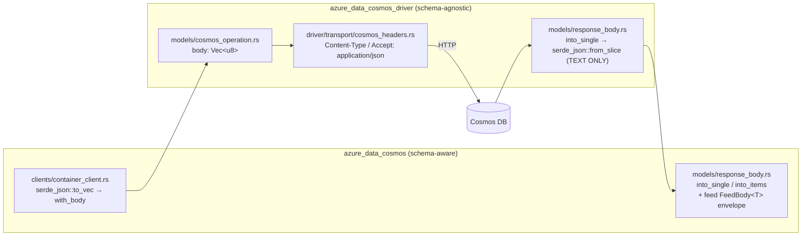

# Binary Encoding Specification

This document describes the design and phased implementation plan for **Cosmos
binary JSON encoding** in the Rust Cosmos DB stack (`azure_data_cosmos` and
`azure_data_cosmos_driver`).

> **Status:** Planning / not yet implemented. This is a design reference; the
> module and call-site changes it describes do not exist yet. Open questions are
> tracked in [§12](#12-open-questions).

## 1. Overview

Binary encoding transmits the request payload as **Cosmos binary JSON** (a
tagged byte stream whose first byte is `0x80`) instead of UTF-8 text JSON, and
accepts binary response bodies, decoding them back to text/typed values on the
response path. The primary benefit is reduced backend storage cost (COGS),
since the service persists the binary form directly. A secondary benefit is
faster serialization/deserialization when the typed path reads and writes the
binary form natively.

The feature is **opt-in** and **transparent**: when enabled, callers use the
same `create_item` / `read_item` / `query_items` / etc. APIs and observe
text-equivalent results.

### Goals

- Encode request bodies as Cosmos binary JSON for **writes** and **query**.
- Decode binary response bodies for **reads**, **write responses**, and
  **query** result envelopes.
- Keep the data-plane driver **schema-agnostic** — it never parses item bodies
  (see [ARCHITECTURE.md](../ARCHITECTURE.md)).
- Make decoding robust via **first-byte auto-detection**, independent of
  header negotiation.

### Non-goals (deferred)

- **Patch**, **transactional batch**, and **bulk** operations. These mirror the
  .NET out-of-scope set. Patch in particular is the only driver code path that
  decodes-merges-re-encodes a body (see
  [PATCH_HANDLER_SPEC.md](./PATCH_HANDLER_SPEC.md)), so it needs the codec but
  is sequenced after the core read/write/query path lands.

## 2. Scope

| Operation                                   | Request body | Response body | Milestone |
| ------------------------------------------- | :----------: | :-----------: | --------- |
| `read_item`                                 |      —       |    decode     | P1        |
| `query_items`                               |    encode    |    decode     | P1 / P2   |
| `create_item` / `upsert_item` / `replace_item` |   encode  |    decode     | P2        |
| `delete_item`                               |      —       |      —        | n/a       |
| `patch_item`                                |   deferred   |   deferred    | post-P4   |
| transactional batch / bulk                  |   deferred   |   deferred    | post-P4   |

This is broader than the .NET point-operations PR (#4652): the Rust effort
covers **query** request and response encoding in addition to point reads and
writes.

## 3. Background: the .NET reference

.NET PR [#4652](https://github.com/Azure/azure-cosmos-dotnet-v3/pull/4652)
introduced binary encoding for point operations:

- Opt-in via the `AZURE_COSMOS_BINARY_ENCODING_ENABLED` environment variable.
- Typed (`ItemAsync`) APIs: the serializer was refactored to read and write the
  binary bits directly into the stream (no intermediate text conversion).
- Stream (`ItemStreamAsync`) APIs: a text stream is transcoded to binary on the
  request path and back to text on the response path. Output streams are always
  text unless the caller explicitly opts into raw binary via the internal
  `EnableBinaryResponseOnPointOperations` request option.
- Patch, batch, and bulk were explicitly **out of scope**.

The Rust design adopts the same enablement model and the same two
implementation strategies (transcode first, native serde later), and extends
scope to query.

## 4. The Cosmos binary JSON format

The format is a tagged byte stream. A buffer begins with the preamble byte
`0x80`; because no valid UTF-8 text JSON document starts with `0x80`, the first
byte unambiguously distinguishes binary from text. Each value is introduced by
a **type-marker** byte that selects how the following bytes are interpreted.

### 4.1 Type-marker map

| Range          | Meaning                                                                              |
| -------------- | ------------------------------------------------------------------------------------ |
| `0x00`–`0x1F`  | Literal integer — the value *is* encoded in the marker (`value = marker`).           |
| `0x20`–`0x3F`  | 1-byte **system string** — index into a fixed built-in dictionary.                   |
| `0x40`–`0x5F`  | 1-byte **user string** — index into the per-buffer string dictionary.                |
| `0x60`–`0x67`  | 2-byte **user string**.                                                              |
| `0x68`–`0x7F`  | base64 / GUID / **compressed** strings (hex, datetime, packed 4/5/6/7-bit).          |
| `0x80`–`0xBF`  | Encoded-length string — `length = marker & 0x7F` (and `0x80` is the buffer preamble). |
| `0xC0`–`0xC7`  | `StrL1/2/4` (length-prefixed strings), `StrR1`–`StrR4` (**reference** strings), `NumberUInt64`. |
| `0xC8`–`0xCF`  | Numbers: `UInt8`, `Int16`, `Int32`, `Int64`, `Double`, `Float16`, `Float32`, `Float64`. |
| `0xD0`–`0xDF`  | `Null` (`0xD0`), `False` (`0xD1`), `True` (`0xD2`), `Guid` (`0xD3`), sized signed/unsigned ints, `Binary1/2/4ByteLength`. |
| `0xE0`–`0xE7`  | Arrays: `Arr0`, `Arr1`, `ArrL1/2/4` (length-prefixed), `ArrLC1/2/4` (length + item count). |
| `0xE8`–`0xEF`  | Objects: `Obj0`, `Obj1`, `ObjL1/2/4` (length-prefixed), `ObjLC1/2/4` (length + property count). |
| `0xF0`–`0xF7`  | Uniform / typed number arrays (analytics-oriented).                                  |
| `0xFF`         | `Invalid` (reserved to flag an invalid marker).                                      |

The authoritative source is the .NET file
`Microsoft.Azure.Cosmos/src/Json/JsonBinaryEncoding.TypeMarker.cs`.

### 4.2 The system-string dictionary

System strings (`0x20`–`0x3F` for 1-byte, plus 2-byte forms) are a **fixed,
hardcoded dictionary** of ~128 common Cosmos property names (`id`, `_rid`,
`_etag`, `_ts`, `_self`, `_attachments`, …). The table must match the service's
ordering **byte-for-byte**; an off-by-one produces silently wrong keys. The Rust
implementation will embed this table as a `const` array, cross-checked against
the .NET source and against captured service vectors.

### 4.3 Reference strings (dedup)

`StrR1`–`StrR4` encode a back-reference (by byte offset) to a string that
already appeared earlier in the buffer. The **decoder must resolve these**; the
**encoder may ignore them** (always emit the string inline). This is the core of
the encode/decode asymmetry.

## 5. Encode/decode asymmetry — the key design lever

> **The decoder must be complete; the encoder can be minimal-but-valid.**

- **Decoder (complete).** The service may emit *any* form: literal ints, system
  **and** user strings, reference strings, base64/GUID/compressed strings, every
  number width, and uniform number arrays. All branches are mandatory — the
  decoder parses untrusted service output and must handle everything.

- **Encoder (minimal valid).** To produce a *correct* (not size-optimal) buffer
  the encoder only needs:
  - strings → encoded-length or `StrL1/2/4`,
  - numbers → literal int / `Int64` / `Double`,
  - containers → `ObjLC*` / `ArrLC*` (length + count, back-patched),
  - `Null` / `False` / `True`.

  The encoder may **skip** reference-string dedup, compressed strings, and
  uniform arrays. The service accepts the verbose-but-valid form.

Consequence: the heavy implementation lift is the decoder and the system-string
table; the encoder is comparatively small.

## 6. Current Rust ser/de architecture

Key facts (verified against the current tree):

- **One decode choke point.** Reads, write responses, **and** query all funnel
  through `serde_json::from_slice` in the driver's
  `models/response_body.rs::into_single` / `into_items`. Query parses the whole
  `{"Documents":[…]}` envelope as `FeedBody<T>` (`feed/page.rs`,
  `feed/query_page.rs::from_response`), which itself lands on `into_single`.
  Making this boundary binary-aware covers all three response shapes at once.
- **One serialize pattern.** Every write/query serializes via
  `serde_json::to_vec(...).with_body(...)` in `clients/container_client.rs`
  (`create_item`, `replace_item`, `upsert_item`, `patch_item`, `query_items`).
- **Driver stays passthrough.** The schema-agnostic driver never needs to decode
  item bodies; its only required change is emitting the negotiation header. The
  lone body-parsing exception is the patch handler — and patch is deferred.
- **No negotiation header today.** `driver/transport/cosmos_headers.rs`
  hardcodes `Content-Type: application/json` and `Accept: application/json`;
  there is no `x-ms-cosmos-supported-serialization-formats` yet. This is the
  insertion point for negotiation.

## 7. Design decisions

1. **Self-contained codec module.** The codec is schema-agnostic and operates on
   bytes ↔ `serde_json::Value` (and, in v2, directly on `T: Serialize /
   DeserializeOwned`). The binary format is a stable wire format (algorithm plus
   constants), which the cosmos `AGENTS.md` permits sharing rather than
   duplicating. Placement is an open question ([§12](#12-open-questions)): a
   dedicated module re-exported internally, vs. a small standalone crate. A
   dedicated, independently fuzzable module is preferred.

2. **Transcoder first (v1), native serde later (v2).**
   - **v1:** `binary → text` and `text → binary` byte transcoders, reusing the
     existing `serde_json` for the typed layer. Mirrors .NET's *stream* flow and
     minimizes churn at the call sites.
   - **v2:** a native serde `Serializer` / `Deserializer` reading and writing
     binary directly (zero intermediate `Value` / text), mirroring .NET's
     refactored typed-serializer path for performance.

3. **Decode by auto-detection at the SDK boundary.** `into_single` / `into_items`
   inspect the first byte; `0x80` ⇒ binary ⇒ transcode (v1) or native-decode
   (v2). Robust even if header negotiation changes, and uniformly covers
   reads / write responses / query.

4. **Encode at the SDK call sites,** gated by an enablement flag. v1 path:
   `serde_json::to_vec` → `transcode_text_to_binary` → `with_body`.

5. **Negotiation + enablement.** The driver emits
   `x-ms-cosmos-supported-serialization-formats` when enabled. Enablement is a
   client/driver option that defaults from an environment variable (mirroring
   `AZURE_COSMOS_BINARY_ENCODING_ENABLED`), fitting the existing `CosmosOptions`
   env-var mechanism.

## 8. The codec layer in detail

### 8.1 Decoder (complete) — `binary → Value` and `binary → text`

A reader over `&[u8]`:

- Reads the type marker, dispatches to the matching parser.
- Implements **every** branch: literal ints; system strings (table lookup); user
  strings (track the per-buffer dictionary; resolve `StrR*` back-references by
  offset); all string forms incl. base64/GUID/compressed (hex, datetime, packed
  N-bit); all number widths; null/bool/guid; arrays and objects with 1/2/4-byte
  length and optional count; uniform number arrays.
- Two output modes: to `serde_json::Value` (typed path) and a streaming
  `binary → text` writer (raw/stream path).

### 8.2 Encoder (minimal valid) — `Value → binary`

- Prepend the `0x80` preamble.
- Strings → encoded-length or `StrL1/2/4`.
- Numbers → literal int / `Int64` / `Double`.
- Objects / arrays → `ObjLC*` / `ArrLC*` with back-patched length and count.
- `Null` / `False` / `True`.
- **No** dedup, compression, or uniform arrays in v1.

### 8.3 serde integration (v2)

`BinaryWriter: serde::Serializer` and `BinaryReader: serde::Deserializer` so
`T: Serialize` / `DeserializeOwned` flow straight to and from binary without the
intermediate `Value`, eliminating an allocation and a copy on the hot path.

## 9. Negotiation and enablement

- **Request.** When binary is enabled, the driver adds
  `x-ms-cosmos-supported-serialization-formats` (value to be confirmed; expected
  `JsonText, CosmosBinary`). The request `Content-Type` is expected to remain
  `application/json` — the service detects the binary form from the first byte.
  (Both are open questions — [§12](#12-open-questions).)
- **Response.** Decoding does **not** depend on negotiation: the SDK auto-detects
  the `0x80` preamble. Negotiation only governs whether the service *chooses* to
  send binary.
- **Enablement.** A client/driver option, defaulting from
  `AZURE_COSMOS_BINARY_ENCODING_ENABLED`. Disabled by default.

## 10. Phased delivery

| Phase | Deliverable                                                                                  | Unlocks                         |
| ----- | -------------------------------------------------------------------------------------------- | ------------------------------- |
| **P0** | Marker constants, system-string table, error types, cross-language round-trip test corpus.  | (no behavior change)            |
| **P1** | **Complete decoder** wired into `into_single` / `into_items` with first-byte auto-detect.    | binary **reads** + **query** responses |
| **P2** | **Minimal encoder** wired into `create` / `upsert` / `replace` (+ query request body), behind the enablement flag. | binary **writes** |
| **P3** | Negotiation header; enablement option + env var; end-to-end binary `Documents` envelope; assess native cross-partition query engine. | negotiated binary; query specifics |
| **P4** | Raw/stream byte APIs (`single()` / `items()` binary handling), opt-in raw-binary response, perf benchmarks, decoder fuzzing. | stream APIs; hardening |

**Deferred beyond P4:** patch, transactional batch, bulk.

## 11. Testing strategy

- **Round-trip property tests:** `text → binary → text` and
  `Value → binary → Value` for generated documents.
- **Cross-compatibility vectors:** binary buffers captured from .NET output;
  decode-parity against the known text form is the correctness bar.
- **Decoder fuzzing:** malformed / truncated / adversarial buffers. The decoder
  parses untrusted service bytes, so this is security-relevant (bounds checks,
  no panics, no unbounded allocation from attacker-controlled length prefixes).
- **Emulator integration tests:** read / write / query with binary enabled,
  asserting text-equivalent results. Gated under the existing `emulator`
  test categories.
- **Benchmarks:** extend `azure_data_cosmos_benchmarks` to compare text vs.
  binary on the point-read and write paths.

## 12. Open questions

1. **Codec placement** — dedicated internal module (re-exported) vs. a small
   standalone crate (e.g. `azure_data_cosmos_json`)?
2. **Negotiation header** — confirm exact name/value; expected
   `x-ms-cosmos-supported-serialization-formats: JsonText, CosmosBinary`
   (verify against the service / .NET `HttpConstants`).
3. **Request `Content-Type`** — confirm it stays `application/json` when the body
   is binary (service auto-detects from the first byte).
4. **Native query engine** — does the cross-partition path
   (`query_plan_native`, `query/eval`) ever evaluate on *binary* item bytes, or
   are items always decoded to values before evaluation? Determines whether P3
   touches the engine or only the envelope.
5. **v1 vs. v2 sequencing** — start with the transcoder for speed-to-correctness,
   or go straight to native serde on the typed path?

## 13. Indicative change map

- **New:** codec module/crate — markers, system-string table, reader (decoder),
  writer (encoder), serde adapters (v2), and tests.
- `azure_data_cosmos_driver/src/models/response_body.rs` (and the SDK wrapper
  `azure_data_cosmos/src/models/response_body.rs`): binary-aware `into_single` /
  `into_items`.
- `azure_data_cosmos/src/clients/container_client.rs`: conditional binary
  serialize on the write and query paths.
- `azure_data_cosmos_driver/src/driver/transport/cosmos_headers.rs`: emit the
  supported-serialization-formats header when enabled.
- Options / env plumbing for enablement; benchmarks; emulator tests.

## 14. References

- .NET PR #4652 — Binary Encoding for Point Operations:
  <https://github.com/Azure/azure-cosmos-dotnet-v3/pull/4652>
- .NET type markers —
  `Microsoft.Azure.Cosmos/src/Json/JsonBinaryEncoding.TypeMarker.cs`
- [ARCHITECTURE.md](../ARCHITECTURE.md) — schema-agnostic data-plane principle.
- [PATCH_HANDLER_SPEC.md](./PATCH_HANDLER_SPEC.md) — the deferred body-parsing path.
- [TRANSPORT_PIPELINE_SPEC.md](./TRANSPORT_PIPELINE_SPEC.md) — header application.
