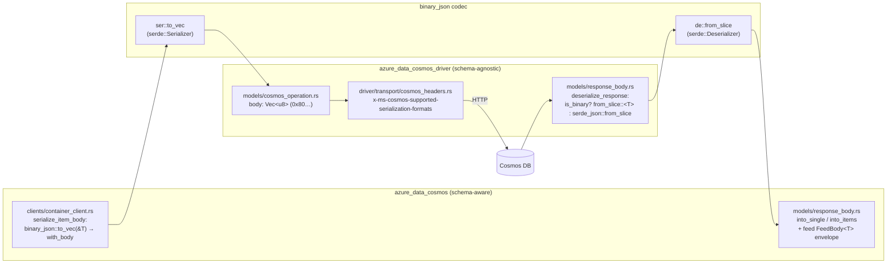
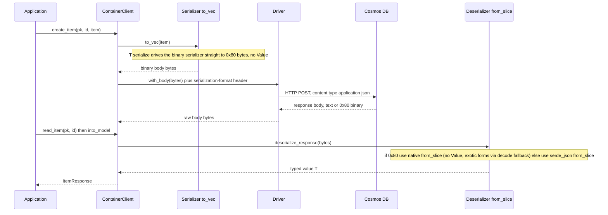

# Binary Encoding Specification

This document describes the design and phased implementation plan for **Cosmos
binary JSON encoding** in the Rust Cosmos DB stack (`azure_data_cosmos` and
`azure_data_cosmos_driver`).

> **Status:** Implemented (encode + decode). The **native serde serializer**
> ([`binary_json::to_vec`]) and the **native serde deserializer**
> ([`binary_json::from_slice`]) are the two production paths and are wired in:
> item writes serialize `T: Serialize` straight to binary via `to_vec` with no
> intermediate `serde_json::Value`, and responses auto-detect the `0x80`
> preamble and deserialize straight into `T` via `from_slice` (again with no
> intermediate `Value` on the common path). The deferred items (patch / batch /
> bulk) are noted inline. Open questions are tracked in
> [§12](#12-open-questions).
>
> **Note on `encode(&Value)` / `decode(&[u8]) -> Value`.** Earlier prototypes
> routed through `serde_json::Value` on both sides (`T → Value → encode` on
> write, `decode → Value → from_value` on read). Neither is on the hot path
> anymore — the SDK calls the native [`binary_json::to_vec`] /
> [`binary_json::from_slice`] directly. The `Value`-based
> [`encode`](#81-serializer-native-minimal-valid--t-serialize--binary) and
> [`decode`](#82-decoder-complete--binary--value-reference-oracle--fallback)
> functions are retained as reference oracles (parity tests, fuzzing corpus)
> and, for `decode`, as the fallback the deserializer uses for rare exotic wire
> forms (see [§8.3](#83-deserializer-native--binary--t)).

## 1. Overview

Binary encoding transmits the request payload as **Cosmos binary JSON** (a
tagged byte stream whose first byte is `0x80`) instead of UTF-8 text JSON, and
accepts binary response bodies, decoding them back to text/typed values on the
response path. The primary benefit is reduced backend storage cost (COGS),
since the service persists the binary form directly. A secondary benefit is
faster serialization/deserialization when the typed path reads and writes the
binary form natively.

The feature is **opt-in** and **transparent**: when enabled, callers use the
same `create_item` / `read_item` / `query_items` / etc. APIs and observe
text-equivalent results.

### Goals

- Encode request bodies as Cosmos binary JSON for **writes** and **query**.
- Decode binary response bodies for **reads**, **write responses**, and
  **query** result envelopes.
- Keep the data-plane driver **schema-agnostic** — it never parses item bodies
  (see [ARCHITECTURE.md](https://github.com/Azure/azure-sdk-for-rust/blob/main/sdk/cosmos/azure_data_cosmos_driver/ARCHITECTURE.md)).
- Make decoding robust via **first-byte auto-detection**, independent of
  header negotiation.

### Non-goals (deferred)

- **Patch**, **transactional batch**, and **bulk** operations. These mirror the
  .NET out-of-scope set. Patch in particular is the only driver code path that
  decodes-merges-re-encodes a body (see
  [PATCH_HANDLER_SPEC.md](https://github.com/Azure/azure-sdk-for-rust/blob/main/sdk/cosmos/azure_data_cosmos_driver/docs/PATCH_HANDLER_SPEC.md)), so it needs the codec but
  is sequenced after the core read/write/query path lands.

## 2. Scope

| Operation                                   | Request body | Response body | Status |
| ------------------------------------------- | :----------: | :-----------: | --------- |
| `read_item`                                 |      —       |    decode     | ✅ done |
| `create_item` / `upsert_item` / `replace_item` |   encode  |    decode     | ✅ done |
| `query_items`                               |   deferred   |    decode     | response done; request-encode deferred |
| `delete_item`                               |      —       |      —        | n/a |
| `patch_item`                                |   deferred   |   deferred    | deferred |
| transactional batch / bulk                  |   deferred   |   deferred    | deferred |

The response-decode boundary is shared, so `query_items` already decodes binary
response envelopes; only its *request-body* encoding + negotiation header remain.

## 3. Background: the .NET reference

.NET PR [#4652](https://github.com/Azure/azure-cosmos-dotnet-v3/pull/4652)
introduced binary encoding for point operations:

- Opt-in via the `AZURE_COSMOS_BINARY_ENCODING_ENABLED` environment variable.
- Typed (`ItemAsync`) APIs: the serializer was refactored to read and write the
  binary bits directly into the stream (no intermediate text conversion).
- Stream (`ItemStreamAsync`) APIs: a text stream is transcoded to binary on the
  request path and back to text on the response path. Output streams are always
  text unless the caller explicitly opts into raw binary via the internal
  `EnableBinaryResponseOnPointOperations` request option.
- Patch, batch, and bulk were explicitly **out of scope**.

The Rust design adopts the same enablement model but goes **straight to native
serde codecs** on both sides (rather than text↔binary transcoders):
`T: Serialize` is encoded directly to Cosmos binary JSON via
[`binary_json::to_vec`], and binary responses are deserialized straight into
`T: Deserialize` via [`binary_json::from_slice`], with no intermediate text or
`serde_json::Value` on the common path. Scope is also extended to query.

## 4. The Cosmos binary JSON format

The format is a tagged byte stream. A buffer begins with the preamble byte
`0x80`; because no valid UTF-8 text JSON document starts with `0x80`, the first
byte unambiguously distinguishes binary from text. Each value is introduced by
a **type-marker** byte that selects how the following bytes are interpreted.

### 4.1 Type-marker map

| Range          | Meaning                                                                              |
| -------------- | ------------------------------------------------------------------------------------ |
| `0x00`–`0x1F`  | Literal integer — the value *is* encoded in the marker (`value = marker`).           |
| `0x20`–`0x3F`  | 1-byte **system string** — index into a fixed built-in dictionary.                   |
| `0x40`–`0x5F`  | 1-byte **user string** — index into the per-buffer string dictionary.                |
| `0x60`–`0x67`  | 2-byte **user string**.                                                              |
| `0x68`–`0x7F`  | base64 / GUID / **compressed** strings (hex, datetime, packed 4/5/6/7-bit).          |
| `0x80`–`0xBF`  | Encoded-length string — `length = marker & 0x7F` (and `0x80` is the buffer preamble). |
| `0xC0`–`0xC7`  | `StrL1/2/4` (length-prefixed strings), `StrR1`–`StrR4` (**reference** strings), `NumberUInt64`. |
| `0xC8`–`0xCF`  | Numbers: `UInt8`, `Int16`, `Int32`, `Int64`, `Double`, `Float16`, `Float32`, `Float64`. |
| `0xD0`–`0xDF`  | `Null` (`0xD0`), `False` (`0xD1`), `True` (`0xD2`), `Guid` (`0xD3`), sized signed/unsigned ints, `Binary1/2/4ByteLength`. |
| `0xE0`–`0xE7`  | Arrays: `Arr0`, `Arr1`, `ArrL1/2/4` (length-prefixed), `ArrLC1/2/4` (length + item count). |
| `0xE8`–`0xEF`  | Objects: `Obj0`, `Obj1`, `ObjL1/2/4` (length-prefixed), `ObjLC1/2/4` (length + property count). |
| `0xF0`–`0xF7`  | Uniform / typed number arrays (analytics-oriented).                                  |
| `0xFF`         | `Invalid` (reserved to flag an invalid marker).                                      |

The authoritative source is the .NET file
`Microsoft.Azure.Cosmos/src/Json/JsonBinaryEncoding.TypeMarker.cs`.

### 4.2 The system-string dictionary

System strings (`0x20`–`0x3F` for 1-byte, plus 2-byte forms) are a **fixed,
hardcoded dictionary** of ~128 common Cosmos property names (`id`, `_rid`,
`_etag`, `_ts`, `_self`, `_attachments`, …). The table must match the service's
ordering **byte-for-byte**; an off-by-one produces silently wrong keys. The Rust
implementation embeds this table as a `const` array in `binary_json::system_strings`,
cross-checked against the .NET source and against captured service vectors.

### 4.3 Reference strings (dedup)

`StrR1`–`StrR4` encode a back-reference (by byte offset) to a string that
already appeared earlier in the buffer. The **decoder must resolve these**; the
**encoder may ignore them** (always emit the string inline). This is the core of
the encode/decode asymmetry.

## 5. Encode/decode asymmetry — the key design lever

> **The decoder must be complete; the serializer can be minimal-but-valid.**

- **Decoder (complete).** The service may emit *any* form: literal ints, system
  **and** user strings, reference strings, base64/GUID/compressed strings, every
  number width, and uniform number arrays. All branches are mandatory — the
  decoder parses untrusted service output and must handle everything.

- **Serializer (minimal valid).** To produce a *correct* (not size-optimal)
  buffer the native serde serializer only needs:
  - strings → encoded-length or `StrL1/2/4`,
  - numbers → literal int / `Int64` / `UInt64` / `Double`,
  - containers → `ObjLC*` / `ArrLC*` (length + count),
  - `Null` / `False` / `True`.

  It **skips** reference-string dedup, compressed strings, and uniform arrays.
  The service accepts the verbose-but-valid form.

Consequence: the heavy implementation lift is the decoder and the system-string
table; the serializer is comparatively small.

## 6. Rust ser/de architecture

The write path serializes `T` straight to binary via the native serde
serializer; the response path auto-detects the `0x80` preamble and deserializes
straight into `T` via the native serde deserializer. The schema-agnostic driver
stays a byte passthrough in both directions — it only emits the negotiation
header.

```mermaid
flowchart LR
  subgraph SDK["azure_data_cosmos (schema-aware)"]
    CI["clients/container_client.rs<br/>serialize_item_body:<br/>binary_json::to_vec(&T) → with_body"]
    RB["models/response_body.rs<br/>into_single / into_items<br/>+ feed FeedBody&lt;T&gt; envelope"]
  end
  subgraph DRV["azure_data_cosmos_driver (schema-agnostic)"]
    OP["models/cosmos_operation.rs<br/>body: Vec&lt;u8&gt; (0x80…)"]
    HDR["driver/transport/cosmos_headers.rs<br/>x-ms-cosmos-supported-serialization-formats"]
    DRB["models/response_body.rs<br/>deserialize_response:<br/>is_binary? from_slice::&lt;T&gt; : serde_json::from_slice"]
  end
  subgraph CODEC["binary_json codec"]
    SER["ser::to_vec<br/>(serde::Serializer)"]
    DE["de::from_slice<br/>(serde::Deserializer)"]
  end
  CI --> SER --> OP --> HDR
  HDR -->|HTTP| SVC[(Cosmos DB)]
  SVC --> DRB --> DE --> RB
```

Key facts (verified against the current tree):

- **One serialize choke point.** `clients/container_client.rs::serialize_item_body`
  calls `binary_json::to_vec(item)` when binary is enabled and
  `serde_json::to_vec(item)` otherwise. `create_item` / `replace_item` /
  `upsert_item` all route through it.
- **One deserialize choke point.** Reads, write responses, **and** query all
  funnel through `models/response_body.rs::deserialize_response`, which inspects
  the first byte (`is_binary`) and routes binary buffers through the native
  `binary_json::from_slice::<T>` and text through `serde_json::from_slice`.
  Query parses the whole `{"Documents":[…]}` envelope as `FeedBody<T>`, which
  itself lands on the same boundary — so all three response shapes are covered
  at once.
- **Driver stays passthrough.** The schema-agnostic driver never parses item
  bodies; its only encode-side change is emitting the negotiation header. The
  lone body-parsing exception is the patch handler — and patch is deferred.

### 6.1 Sequence — write then read (binary enabled)

```mermaid
sequenceDiagram
    participant App as Application
    participant CC as ContainerClient
    participant SER as Serializer to_vec
    participant DRV as Driver
    participant SVC as Cosmos DB
    participant DE as Deserializer from_slice

    App->>CC: create_item(pk, id, item)
    CC->>SER: to_vec(item)
    Note over SER: T serialize drives the binary serializer straight to 0x80 bytes, no Value
    SER-->>CC: binary body bytes
    CC->>DRV: with_body(bytes) plus serialization-format header
    DRV->>SVC: HTTP POST, content type application json
    SVC-->>DRV: response body, text or 0x80 binary
    DRV-->>CC: raw body bytes

    App->>CC: read_item(pk, id) then into_model
    CC->>DE: deserialize_response(bytes)
    Note over DE: if 0x80 use native from_slice (no Value, exotic forms via decode fallback) else use serde_json from_slice
    DE-->>CC: typed value T
    CC-->>App: ItemResponse
```

## 7. Design decisions

1. **Self-contained codec module.** The codec is schema-agnostic and lives in
   `azure_data_cosmos_driver::binary_json`. It operates directly on
   `T: Serialize` (encode) and `T: Deserialize` (decode). The binary format is a
   stable wire format (algorithm plus constants), which the cosmos `AGENTS.md`
   permits sharing rather than duplicating.

2. **Native serde serializer on the write path.** `BinarySerializer:
   serde::Serializer` (module `binary_json::ser`, entry point
   [`binary_json::to_vec`]) encodes `T` straight to binary — zero intermediate
   `serde_json::Value`, one fewer allocation and traversal than a
   transcode-through-`Value` approach. This mirrors .NET's refactored
   typed-serializer path and is the **only** encode strategy shipped.

3. **Native serde deserializer on the read path.** `BinaryDeserializer:
   serde::Deserializer` (module `binary_json::de`, entry point
   [`binary_json::from_slice`]) drives `T::deserialize` straight off the bytes.
   `deserialize_response` inspects the first byte; `0x80` ⇒ binary ⇒
   `from_slice::<T>`; anything else ⇒ `serde_json::from_slice`. Robust even if
   header negotiation changes, and uniformly covers reads / write responses /
   query. Objects, arrays, and plain scalars stream natively with no
   intermediate `Value`; the rare exotic wire forms fall back to the reference
   [`decode`] reader for a single value (see [§8.3](#83-deserializer-native--binary--t)).

4. **Encode at the SDK call sites,** gated by an enablement flag. The path is
   `binary_json::to_vec(item)` → `with_body`, chosen in `serialize_item_body`.

5. **Negotiation + enablement.** The SDK sets
   `x-ms-cosmos-supported-serialization-formats: JsonText,CosmosBinary` on item
   operations when enabled. Enablement resolves once at client construction,
   preferring the explicit `CosmosClientBuilder::with_binary_encoding_enabled`
   option and falling back to the `AZURE_COSMOS_BINARY_ENCODING_ENABLED`
   environment variable.

## 8. The codec layer in detail

### 8.1 Serializer (native, minimal valid) — `T: Serialize → binary`

`binary_json::ser` implements `serde::Serializer` and is exposed as
[`binary_json::to_vec`]. It drives a value's own `Serialize` impl straight to
Cosmos binary JSON:

- Prepend the `0x80` preamble.
- Scalars: `bool → False/True`, integers → literal int / `Int64` / `UInt64`,
  floats → `Double`, strings/chars → encoded-length or `StrL1/2/4`,
  `None`/`unit` → `Null`.
- Containers: objects/maps/structs → `ObjLC*`, arrays/tuples/seqs → `ArrLC*`,
  each written as `marker + byte-length + element-count + body`.
- Enums: serde's externally-tagged convention (unit → name string, others →
  `{ "Variant": <payload> }`), matching `serde_json`.
- **No** reference-string dedup, compression, or uniform arrays.

**The length-prefix problem.** The `ObjLC*` / `ArrLC*` markers place the payload
byte length and element count *before* the body, but serde drives serialization
sequentially and supplies neither up front. Each compound serializer therefore
buffers its children into a scratch `Vec` and frames them with the narrowest
fitting `LC` marker on `end()`. This is one scratch allocation per nesting level
— the only allocation cost — with **no** materialized `serde_json::Value` tree.

**Field ordering.** Typed structs preserve field *declaration* order (like
`serde_json::to_vec`); the alphabetized key order of `serde_json::to_value` is
irrelevant because the serializer never builds a `Value`.

### 8.2 Decoder (complete) — `binary → Value` (reference oracle + fallback)

`binary_json::reader::decode` is a reader over `&[u8]`:

- Reads the type marker, dispatches to the matching parser.
- Implements **every** branch: literal ints; system strings (table lookup); user
  strings (track the per-buffer dictionary; resolve `StrR*` back-references by
  offset); all string forms incl. base64/GUID/compressed (hex, datetime, packed
  N-bit); all number widths; null/bool/guid; arrays and objects with 1/2/4-byte
  length and optional count; uniform number arrays.
- Output is a `serde_json::Value`.

`decode` is no longer on the SDK read hot path. It remains as (a) the reference
oracle for parity tests and the fuzzing target, and (b) the **fallback** the
native deserializer ([§8.3](#83-deserializer-native--binary--t)) invokes for the
rare exotic wire forms.

### 8.3 Deserializer (native) — `binary → T`

`binary_json::de` implements `serde::Deserializer` and is exposed as
[`binary_json::from_slice`]. It drives a target type's own `Deserialize` impl
straight off the buffer:

- **Objects / arrays** stream through `MapAccess` / `SeqAccess`, deserializing
  each key/value or element in place — **no** intermediate `serde_json::Value`
  for the container structure. The container's declared count (or payload end
  offset) frames the stream, mirroring the reference decoder's bounds checks.
- **Common scalars** (null, booleans, every literal/fixed-width/extended number,
  and plain UTF-8 strings — system, encoded-length, and `StrL1/2/4`) feed the
  visitor directly. Plain strings are handed over as **borrowed** slices
  (`visit_borrowed_str`) pointing into the response buffer, so no per-string
  allocation is needed for types that accept borrowed data.
- **`Option` / newtype structs** are handled explicitly (`null` ⇒ `None`;
  newtype ⇒ transparent inner value).
- **Exotic wire forms** — GUID / base64 / compressed / reference strings, binary
  blobs, uniform number arrays — and **Rust enums** (serde's externally-tagged
  shape) fall back to the reference [`decode`] reader for a single value, which
  is then forwarded through `serde_json::Value`'s own deserializer. This keeps
  the native fast path small while inheriting the decoder's completeness.

Real Cosmos item bodies are objects of plain scalars, so the native fast path
covers them end-to-end; the `Value` fallback fires only for the uncommon forms.

`from_slice::<serde_json::Value>(buf)` is asserted to equal `decode(buf)`, and a
2000-case generative test checks native-vs-`decode` parity over random values.

### 8.4 Performance

Both benches live in `azure_data_cosmos_benchmarks`
(`cargo bench -p azure_data_cosmos_benchmarks --bench binary_encode` /
`--bench binary_decode`), comparing text, the retired via-`Value` path, and the
shipped native codec on a small (~64 B) and a large (~1.7 MB) item.

**Encode** (`binary_encode`):

| Item | text (`to_vec`) | via-`Value` (`encode`) | **native `to_vec`** |
| ---- | --------------: | ------------------: | -------------------: |
| ~64 B | ~0.33 µs | ~1.85 µs | **~0.75 µs** (~2.5× faster) |
| ~1.7 MB | ~2.33 ms | ~2.17 ms | **~1.64 ms** (~24% faster; ~1.0 GiB/s) |

**Decode into a typed struct** (`binary_decode`, `LogEntry` target):

| Item | text (`from_slice`) | via-`Value` (`decode`+`from_value`) | **native `from_slice`** |
| ---- | --------------: | ------------------: | -------------------: |
| ~64 B | ~0.90 µs | ~1.64 µs | **~0.90 µs** (~1.8× faster than via-`Value`) |
| ~1.7 MB | ~852 µs | ~587 µs | **~582 µs** (~32% faster than text) |

On both sides the native codec is faster than *both* the via-`Value` path and
text JSON on large payloads, by skipping the `Value` build / extra traversal
(and, on decode, borrowing strings from the buffer). The gain is largest on
small items, where the `Value` allocation dominated the fixed overhead.

## 9. Negotiation and enablement

- **Request.** When binary is enabled, the SDK sets
  `x-ms-cosmos-supported-serialization-formats: JsonText,CosmosBinary` on item
  operations. The request `Content-Type` stays `application/json` — the service
  detects the binary form from the first byte.
- **Response.** Decoding does **not** depend on negotiation: the SDK auto-detects
  the `0x80` preamble. Negotiation only governs whether the service *chooses* to
  send binary.
- **Enablement.** Resolved once at client construction from the
  `AZURE_COSMOS_BINARY_ENCODING_ENABLED` environment variable; disabled by
  default. A public builder option layering on the same variable is a planned
  follow-up.

## 10. Delivery status

All phases below are **done** except the noted follow-ups.

| Phase | Deliverable | Status |
| ----- | ----------- | ------ |
| **P0** | Marker constants, system-string table, error types, cross-language round-trip test corpus. | ✅ done |
| **P1** | Complete decoder ([`decode`]) with first-byte auto-detect; native deserializer ([`from_slice`]) wired into `deserialize_response`. | ✅ done (binary reads + response envelopes) |
| **P2** | Native serde serializer ([`to_vec`]) wired into `create` / `upsert` / `replace`, behind the enablement flag. | ✅ done (binary writes) |
| **P3** | Negotiation header + env-var enablement; end-to-end binary round-trip via the in-memory emulator. | ✅ done |
| **P4** | Decoder fuzzing; text-vs-binary encode **and** decode benchmarks. | ✅ done |

**Follow-ups / deferred:** query request-body encoding + negotiation; patch,
transactional batch, and bulk. (The native deserializer's exotic-form path still
routes through `decode` -> `Value`; extending native visitor coverage to those
rare forms is a possible future optimization.)

## 11. Testing strategy

- **Round-trip property tests:** `T → binary → T` on both codecs (native
  `to_vec` → native `from_slice`, and `to_vec` → `decode`), plus 2000-case
  generative parity tests asserting `to_vec(&value)` byte-matches the
  `encode(&Value)` oracle and `from_slice::<Value>(bytes)` equals `decode(bytes)`
  for arbitrary `serde_json::Value` inputs.
- **Cross-compatibility vectors:** binary buffers captured from .NET output;
  decode-parity against the known text form is the correctness bar.
- **Decoder fuzzing:** malformed / truncated / adversarial buffers. The decoder
  parses untrusted service bytes, so this is security-relevant (bounds checks,
  no panics, no unbounded allocation from attacker-controlled length prefixes).
- **Emulator integration tests:** read / write / query with binary enabled,
  asserting text-equivalent results. Gated under the existing `emulator`
  test categories.
- **Benchmarks:** `azure_data_cosmos_benchmarks`'s `binary_encode` and
  `binary_decode` benches compare text (`serde_json`), the retired via-`Value`
  path, and the shipped native codec on small and ~1.7 MB items (see the
  [§8.4](#84-performance) tables). Run with
  `cargo bench -p azure_data_cosmos_benchmarks --bench binary_encode` and
  `--bench binary_decode`.

## 12. Open questions

1. **Native query engine** — does the cross-partition path
   (`query_plan_native`, `query/eval`) ever evaluate on *binary* item bytes, or
   are items always decoded to values before evaluation? Determines whether
   query request-body encoding touches the engine or only the envelope.
2. **Codec placement** — keep the dedicated internal `binary_json` module
   (current choice) vs. a small standalone crate (e.g. `azure_data_cosmos_json`)
   if other language SDKs want to share it.
3. **Encoder API shape (review follow-ups from PR #4671)** — two reviewer
   suggestions on the `Value`-based reference encoder remain open:
   - Rename `writer::encode(&Value)` to disambiguate it from the native
     `ser::to_vec` (the reviewer suggested `to_vec`, which is already taken by
     the serde path); needs a name decision before implementing.
   - Change the shared emit helpers from `out: &mut Vec<u8>` to
     `mut out: impl std::io::Write` so callers can pool/stream buffers. This
     makes the currently-infallible helpers fallible and threads the `Write`
     bound through `ser`, so it is sequenced as a follow-up.

## 13. Change map (as implemented)

- **`azure_data_cosmos_driver/src/binary_json/`** — codec module: `markers`,
  `system_strings`, `error` (incl. `serde::ser::Error` + `serde::de::Error`),
  `reader` (`decode` reference oracle + shared cursor exposed to `de`),
  `writer` (`encode(&Value)` parity oracle + shared emit helpers), `ser`
  (native `serde::Serializer`, `to_vec`), `de` (native `serde::Deserializer`,
  `from_slice`), `vectors`, `fuzz_tests`.
- `azure_data_cosmos_driver/src/models/response_body.rs`:
  `deserialize_response` auto-detects the `0x80` preamble and calls
  `binary_json::from_slice::<T>`.
- `azure_data_cosmos/src/clients/container_client.rs`: `serialize_item_body`
  calls `binary_json::to_vec` on the binary write path; `apply_binary_negotiation`
  sets the header.
- `azure_data_cosmos/src/error.rs`: `convert_binary_encode_error` maps a
  `BinaryError` from the item-write encode path to the SDK error type (a
  request-body error). It is a helper called via `map_err` at the single
  call site rather than a `From` impl, so a future response-side decode error
  cannot be mislabeled as a request-body error.
- `azure_data_cosmos/src/clients/mod.rs`: `BinaryEncoding::resolve` prefers the
  explicit `CosmosClientBuilder::with_binary_encoding_enabled` option and falls
  back to the `AZURE_COSMOS_BINARY_ENCODING_ENABLED` environment variable.
- `azure_data_cosmos_driver/src/models/cosmos_headers.rs`: the
  supported-serialization-formats header field + emission.
- `azure_data_cosmos_benchmarks/benches/binary_encode.rs` /
  `binary_decode.rs`: the encode and decode benchmarks.

## 14. References

- .NET PR #4652 — Binary Encoding for Point Operations:
  <https://github.com/Azure/azure-cosmos-dotnet-v3/pull/4652>
- .NET type markers —
  `Microsoft.Azure.Cosmos/src/Json/JsonBinaryEncoding.TypeMarker.cs`
- [ARCHITECTURE.md](https://github.com/Azure/azure-sdk-for-rust/blob/main/sdk/cosmos/azure_data_cosmos_driver/ARCHITECTURE.md) — schema-agnostic data-plane principle.
- [PATCH_HANDLER_SPEC.md](https://github.com/Azure/azure-sdk-for-rust/blob/main/sdk/cosmos/azure_data_cosmos_driver/docs/PATCH_HANDLER_SPEC.md) — the deferred body-parsing path.
- [TRANSPORT_PIPELINE_SPEC.md](https://github.com/Azure/azure-sdk-for-rust/blob/main/sdk/cosmos/azure_data_cosmos_driver/docs/TRANSPORT_PIPELINE_SPEC.md) — header application.
