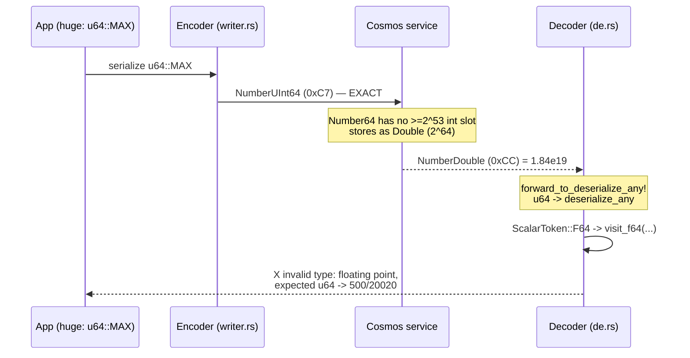
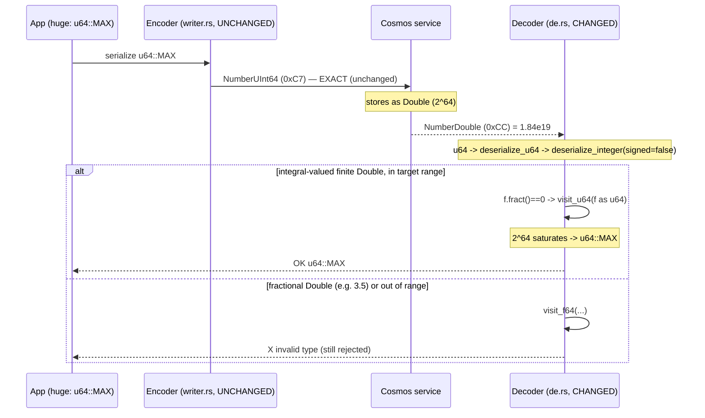

# Binary Encoding `u64::MAX` Round-Trip Failure — Analysis

## The failure

Test: `binary_encoding_item_crud_round_trips` (in
`sdk/cosmos/azure_data_cosmos/tests/binary_encoding_tests/cosmos_binary_encoding.rs`)

```
500/20020 (SerializationResponseBodyInvalid): failed to deserialize response body
Caused by: Custom("invalid type: floating point `18446744073709552000.0`, expected u64")
```

The test round-trips a struct with a `huge: u64` field set to `u64::MAX`
(`18446744073709551615`). It fails on the **read-back deserialize**, not the
write.

## Step by step, through our layers

### 1. Serialize (client → wire) — succeeds

`huge: u64::MAX` hits `binary_json/ser.rs`:

```rust
fn serialize_u64(self, v: u64) -> Result<()> {
    encode_u64(v, self.out);   // writes the UInt64 binary token, exact
    Ok(())
}
```

We send the full 64-bit integer faithfully as a `UInt64` token. No problem here.

### 2. The service stores it — precision is lost HERE

Cosmos stores **every JSON number as an IEEE-754 `double`**. `u64::MAX` has 64
significant bits, but a double has only 53 bits of mantissa, so it is rounded to
the nearest representable double: `18446744073709552000`. The integer is *gone* —
the store now holds a `Double`, not a `UInt64`.

### 3. The service returns the item — response carries a `Double` token

On read-back, the wire bytes for `huge` are a `Double` (F64) marker, because that
is what the service stored. Our reader decodes that scalar as
`ScalarToken::F64(1.8446744073709552e19)`.

### 4. Deserialize (wire → struct) — this is where it throws

serde's derive for the struct sees the field type `u64`, so it calls
`deserialize_u64(U64Visitor)`. Our deserializer forwards *every* numeric request
to `deserialize_any` (`binary_json/de.rs`):

```rust
forward_to_deserialize_any! {
    bool i8 ... u64 u128 f32 f64 ...    // u64 is forwarded, not handled specially
}
```

`deserialize_any` reads the native scalar, hits the `Double` branch:

```rust
ScalarToken::F64(f) => {
    if !f.is_finite() { /* reject NaN/inf */ }
    visitor.visit_f64(f)     // <-- calls visit_f64 on a U64Visitor
}
```

But serde's `U64Visitor` only implements `visit_u64` / `visit_i64` — it has **no
`visit_f64`**. serde's default `visit_f64` therefore returns
`Error::invalid_type(Unexpected::Float(...), &"u64")`, which our layer wraps as
`BinaryError::Custom("invalid type: floating point ..., expected u64")`, surfaced
as `500/20020 SerializationResponseBodyInvalid`.

## The essence

```
u64::MAX ──serialize_u64──▶ [UInt64 token]  (exact)
                                 │
                          Cosmos stores as f64  ← LOSS: 64-bit int → 53-bit mantissa
                                 │
         [Double token: 1.8446744073709552e19] ──▶ deserialize field `huge: u64`
                                                        │
                                          visit_f64 on a u64 visitor → REJECTED
```

Two independent facts combine to cause the failure:

1. **The service is lossy for integers ≥ 2^53** — it *cannot* return a `UInt64`;
   it only ever returns a `Double`. This is a service-model reality, not our bug.
2. **Our deserializer is strict** — it faithfully forwards the wire `Double` to
   `visit_f64`, and a typed `u64` field legitimately refuses a float. That
   strictness is *correct*: silently truncating `1.84e19` back into a `u64`
   would fabricate a value the user never stored.

So the ser/de layer isn't malfunctioning — it correctly reports that a `u64`
field cannot survive a Cosmos round-trip once the value exceeds 2^53. The
`binary_encoding` test is asserting an impossible round-trip (`huge: u64::MAX`),
which is exactly the same limit the round-trip fuzzer oracle models: because a
wide integer *cannot* survive, the oracle's `normalize_number` tokenizes the
**rounded** double so a lossy round-trip compares **equal** rather than raising a
false mismatch (see "Related" below).

## How the .NET SDK behaves (for comparison)

Verified against `Azure/azure-cosmos-dotnet-v3` source. Two facts drive the
difference:

1. **Cosmos's canonical number type has no unsigned slot.** `Number64` is
   documented as *"either a double or 64-bit int (long)"*. `u64::MAX` is
   `> long.MaxValue (2^63−1)`, so it fits **neither** as a `long` nor exactly as
   a `double` — it has no faithful representation in the model at all.
2. **.NET's writer pre-rounds by default.** From
   `JsonWriter.JsonBinaryWriter.cs`, `WriteIntegerInternal(ulong value)`:

   ```csharp
   if (value <= long.MaxValue)      this.WriteIntegerInternal((long)value);   // fits Int64
   else if (!this.enableUInt64Values) this.WriteDoubleInternal(value);        // DEFAULT: lossy Double on the CLIENT
   else { Write(TypeMarker.NumberUInt64); Write(value); }                     // opt-in exact UInt64
   ```

   So in its **default** config the .NET SDK turns a `ulong > long.MaxValue`
   into a `Double` **before it hits the wire** — precision is lost client-side.
   Full-precision `UInt64` is opt-in (`enableUInt64Values`).

### Side-by-side

| Aspect | .NET SDK (default) | .NET SDK (`enableUInt64Values`) | Rust SDK (this repo) |
|---|---|---|---|
| `serialize(u64::MAX)` on the wire | **Double** (lossy at client) | exact `NumberUInt64` token | **exact `NumberUInt64` token** (always) |
| Precision reaching the service | already lost | exact (needs backend support) | exact |
| Value stored by service | double | double (service coerces `Number64`) | double (service coerces) |
| Read-back of the stored double into a `u64`/`ulong` field | **coerced / accepted** by Newtonsoft (silent) | coerced / accepted (silent) | **rejected**: `visit_f64` on a `u64` visitor → `invalid type: floating point, expected u64` → `500/20020` |
| Net result for `u64::MAX` | round-trip "succeeds" but value is **silently corrupted** | same | round-trip **fails loudly**; no silent corruption |

> Note: the .NET read-back *coercion* (a returned double being accepted into a
> `ulong` field rather than throwing) is inferred from the Newtonsoft /
> `Number64JsonConverter` serializer stack, not from a single line in the
> fetched snippets — treat that specific cell as high-confidence but not
> line-proven.

**Takeaway:** neither SDK actually *preserves* `u64::MAX` through Cosmos — the
value is doomed by the `Number64` model. The only difference is **who tells you**:

- **.NET (default):** silently rounds at serialize time and silently coerces on
  read — the corruption is invisible.
- **Rust (this repo):** sends the exact value and **refuses** to fabricate a
  `u64` from the returned double — the loss is surfaced as an error.

Our stricter behavior is the safer default; the fuzzer oracle change makes the
round-trip fuzzer report the same limit instead of hiding it.

## Recommended fix (test, not codec)

The `huge` field should either be:

- typed `f64` (matching what the service actually stores), or
- set to a value ≤ 2^53 (round-trippable as an exact integer).

"Fixing" the decoder to accept a float into a `u64` would only mask silent data
corruption, so the codec should stay strict.

## UPDATE — decision: adopt the .NET *behavior*, reader-only

The team decided to **match the .NET SDK's read behavior** (silent lossy
round-trip) so Rust interops with existing data and does not surface an error for
a value the service cannot store exactly — **but keep the writer exact**. The key
realization: the precision loss happens **at the service** (`Number64` has no
integer slot ≥ 2^53), so the writer's encoding does not change the outcome. Only
the **read side** decides whether the returned `Double` errors or coerces.
Keeping the writer exact also keeps us **forward-compatible** — if the backend
ever preserves `NumberUInt64`, we already send it.

**Only the read path changed:**

- **Reader (`binary_json/de.rs`).** The deserializer no longer forwards integer
  types to `deserialize_any`; `deserialize_i*` / `deserialize_u*` now route
  through `deserialize_integer`, which **coerces an integral-valued finite
  `Double` into the integer visitor** (e.g. the service-echoed `2^64` saturates
  back to `u64::MAX`). The coercion is **routed by the target's signedness** (a
  `signed` flag threaded from each `deserialize_i*`/`deserialize_u*` entry):
  signed targets use `visit_i64` and the `i64` range, unsigned targets use
  `visit_u64` and the `u64` range. This matters because serde's signed visitor
  rejects a `u64` above `i64::MAX`, so routing every non-negative value through
  `visit_u64` would break signed fields (e.g. reading a service-echoed `i64::MAX`,
  stored as the double `2^63`). A **fractional** double is still a genuine type
  error — it is never silently truncated. The inclusive range endpoints are
  **deliberate**: `i64::MAX as f64` and `u64::MAX as f64` each round *up* (to
  `2^63` / `2^64`), which is exactly the double the service stores for those
  maxima, so the saturating cast is what lands the value back on what was sent.
  A double strictly beyond the endpoint falls through to `visit_f64` and errors.

**The writer is unchanged:** `encode_u64` still emits exact `NumberUInt64` for
values above `i64::MAX`, so the exact integer reaches the service (max precision
on the wire) and we support a future backend that preserves it.

### What the reader change brings in (sequence diagrams)

**Before (strict reader) — the failure:**



**After (reader coercion) — the fix:**



### Worked examples — why `u64::MAX` "matches" but `u64::MAX − 1` does not

The read-back succeeds via a **saturating** float→int cast (`f as u64` in Rust
clamps an out-of-range float to the type's nearest bound rather than wrapping or
panicking). Whether the round-tripped value *equals* the sent value then depends
entirely on whether the integer was exactly representable as an `f64` — with one
lucky exception at the very top of the range.

**Example A — `u64::MAX` (`18446744073709551615`, i.e. `2^64 − 1`): matches ✅**

```
send    18446744073709551615  (2^64 − 1)  → wire: exact NumberUInt64
store   nearest double        = 2^64      = 18446744073709551616  (low bits lost)
echo    NumberDouble(2^64)
read    (2^64) as u64  → SATURATES to u64::MAX = 2^64 − 1
result  received == sent   ✅  (coincidence: saturation clamps back onto the sent value)
```

**Example B — `u64::MAX − 1` (`18446744073709551614`): does NOT match ❌**

```
send    18446744073709551614  (2^64 − 2)  → wire: exact NumberUInt64
store   nearest double = 2^64             (SAME double as u64::MAX — indistinguishable now)
echo    NumberDouble(2^64)
read    (2^64) as u64  → SATURATES to u64::MAX = 2^64 − 1
result  received (2^64 − 1) != sent (2^64 − 2)   ❌  silent loss
```

Both values collapse onto the *same* stored double (`2^64`), so once the service
has stored them they are **indistinguishable**; the reader can only produce
`u64::MAX` for either.

**Example C — `2^60` (exactly `f64`-representable): matches ✅**

```
send    1152921504606846976  (2^60)      → wire: exact NumberUInt64
store   double 2^60          (exact — 2^60 fits the 53-bit mantissa with trailing zeros)
echo    NumberDouble(2^60)
read    (2^60) as u64  → 2^60  (in range, no saturation needed)
result  received == sent   ✅  (genuinely lossless)
```

**The rule:** any integer `≥ 2^53` that is **not** exactly `f64`-representable
mismatches — *except* `u64::MAX` itself, which the saturating cast happens to
recover. `u64::MAX` matching is therefore **not** evidence the value was
preserved; it is an artifact of saturation landing on the sent value. The de
layer no longer *errors* on any of these (that was the original bug — a `Double`
reaching a `u64` visitor); it now *succeeds*, accepting the (possibly lossy)
value.

### Net round-trip semantics after the change

| Value | Wire (write) | Service stores / echoes | Read-back into `u64` field | Exact? |
|---|---|---|---|---|
| `42` (≤ i64::MAX) | `Int64` | `Int64` | `42` | ✅ exact |
| `2^60` (f64-representable) | `UInt64` | `Double` | `2^60` | ✅ exact |
| `i64::MAX` into `i64` field | `Int64` | `Double (2^63)` | `i64::MAX` (float→int saturates) | ✅ happens to be exact |
| `u64::MAX` | `UInt64` | `Double (2^64)` | `u64::MAX` (float→int saturates) | ✅ happens to be exact |
| `u64::MAX − 1` | `UInt64` | `Double (2^64)` | `u64::MAX` | ❌ **silent loss** (asserted) |
| `2^64` into an `i64` field | — | `Double (2^64)` | error (out of signed range) | — rejected, not saturated |
| `3.5` into a `u64` field | `Double` | `Double` | error (`invalid type`) | — rejected, not truncated |

### Tests added (documenting *why* we opted in)

- `de::tests::wide_u64_echoed_as_double_coerces_back_to_u64` — the primary
  "why we did this" test: simulates the **service echo** (a `Double` on the wire,
  since the writer no longer produces one locally) and asserts `u64::MAX`,
  `u64::MAX − 1` (the silent loss), and an exactly-representable wide value.
- `de::tests::echoed_double_coerces_into_signed_targets_across_the_i64_range` —
  pins the **signedness routing**: `i64::MAX` (stored as `2^63`) and `i64::MIN`
  coerce into `i64`, a double beyond the signed range (`2^64`) errors instead of
  saturating into `i64::MAX`, and a negative double is refused by an unsigned
  target.
- `de::tests::wide_u64_sent_exactly_is_read_back_lossily_after_service_double_conversion`
  — end-to-end: the writer sends the exact `UInt64`, the simulated service echo
  is a `Double`, and the read-back value **differs** from the sent value
  (`i64::MAX + 2` → `2^63`), proving the loss is at the service, not the codec.
- `de::tests::integral_double_coerces_but_fractional_double_is_rejected` — pins
  that integral doubles coerce but fractional doubles still error.

### Known limitation — the `Value` / exotic-form path does not coerce

The coercion applies on the **native scalar** read path. Values decoded through
the `deserialize_via_value` fallback (exotic wire forms: GUID/base64/compressed
strings, binary blobs, and service-produced uniform `Float64` number arrays,
`0xF0..`) are driven by `serde_json::Value`'s own deserializer, which maps a
`Number(f64)` straight to `visit_f64`. The only form that both lands there **and**
carries integral doubles is a service-only uniform `Float64` array; this crate's
encoder never emits one. So deserializing such an array into a typed integer
sequence (e.g. `Vec<u64>`) errors instead of coercing, whereas the same values as
individual `Double` scalars would coerce. The untyped `Value` target — the common
case for these forms — is unaffected (it keeps the `f64` either way). This
asymmetry is an accepted, documented limitation.

The writer, conformance snapshots, golden vectors, and `ser` parity tests are
**unchanged** (the exact-`UInt64` encoding is retained).

### Historical rationale (pre-decision)

"Fixing" the decoder to accept a float into a `u64` masks silent data
corruption, so the codec was originally kept strict. That strictness was later
reversed (see the decision above) in favor of the always-on coercion, so a value
the service cannot store exactly no longer surfaces an error.

## Related

- Fuzzer oracle: `normalize_number` in
  `sdk/cosmos/azure_data_cosmos/tests/binary_roundtrip_fuzzer.rs` tokenizes a wide
  integer (`>= 2^53`) from its **rounded** double, so a lossy round-trip compares
  **equal** (the service cannot store the exact value, so a strict comparison
  would raise a false mismatch). Wide-number generation is opt-in
  (`AZURE_COSMOS_FUZZ_WIDE_NUMBERS=true`).
- Key files:
  - `sdk/cosmos/azure_data_cosmos_driver/src/binary_json/de.rs`
    (`deserialize_integer` + `deserialize_i*`/`deserialize_u*` — coerce integral
    `Double` into integer fields; the only production change)
  - `sdk/cosmos/azure_data_cosmos_driver/src/binary_json/writer.rs`
    (`encode_u64` — **unchanged**: still emits exact `NumberUInt64`, kept for
    max wire precision and forward-compatibility)
