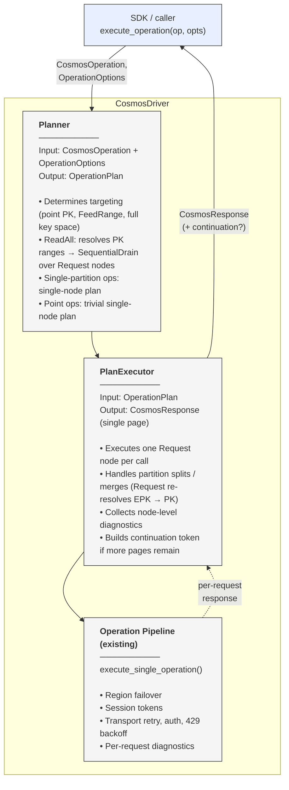

# Feed Operations Spec for `azure_data_cosmos_driver`

**Status:** Draft / Iterating
**Date:** 2026-04-28
**Authors:** (team)
**Crate:** `azure_data_cosmos_driver`

---

## Table of Contents

1. [Goals & Motivation](#1-goals--motivation)
2. [Architectural Overview](#2-architectural-overview)
3. [CosmosOperation Changes](#3-cosmosoperation-changes)
4. [Operation Plans](#4-operation-plans)
5. [Planner](#5-planner)
6. [Plan Executor](#6-plan-executor)
7. [Continuation Tokens](#7-continuation-tokens)
8. [Diagnostics Structure](#8-diagnostics-structure)
9. [Error Handling, Splits & Merges](#9-error-handling--partition-splits--merges)
10. [API Semantics & Invariants](#10-api-semantics--invariants)
11. [Testing Strategy](#11-testing-strategy)
12. [Future Work](#12-future-work)

---

## 1. Goals & Motivation

### Problem Statement

The driver currently supports only **point operations** — operations that target a single resource
and produce a single response. Operations like `ReadItem`, `UpsertItem`, and `DeleteContainer` go
through `execute_operation`, which drives the operation pipeline (region failover, session tokens,
transport retry) and returns a single `CosmosResponse`.

**Feed operations** — read-all-items, queries, read-many, and change feed — are fundamentally
different. They produce multiple pages of results, may span multiple partition key ranges, and
need pagination state that can be serialized across request boundaries.

Today, feed operations are handled entirely in the higher-level `azure_data_cosmos` crate, bypassing
the driver's operation pipeline. This means feed operations miss out on the driver's multi-region
failover, partition-level circuit breaker, throughput control, and diagnostics infrastructure.

### Goals

1. **Unified execution model** — Both point and feed operations flow through a common
   Plan → Execute pipeline. Point operations produce a trivial single-node plan. Feed operations
   produce multi-node plans that leverage the existing point-operation pipeline for individual
   Cosmos requests.

2. **Resumable pagination** — Feed operations produce a typed continuation token that can be
   serialized to a string and carried across process boundaries (e.g., sent to a browser).
   Resuming with a valid continuation token and an equivalent operation descriptor continues
   where the previous execution left off.

3. **Extensible operation model** — The plan model must support ReadAll (the initial target),
   cross-partition queries, single-partition queries/reads, read-many, and change feed, even if
   some are implemented later.

4. **Driver-level concerns** — Feed operations must integrate with multi-region failover,
   partition-level failover (PPAF/PPCB), throughput control, session consistency, and
   diagnostics — all managed by the driver.

5. **Schema-agnostic pages** — The driver returns feed pages as a list of pre-parsed item
   bodies (`Vec<Vec<u8>>`), each entry being the raw serialized bytes of one item. Point
   operations continue to return a single body (`Vec<u8>`). The driver does not deserialize
   item bodies; the higher-level SDK handles deserialization. To support both shapes through
   a single `CosmosResponse` type, this spec introduces a `ResponseBody` enum (analogous to
   `OperationPayload` for requests) — see [§10.2 CosmosResponse Changes](#102-cosmosresponse-changes).

6. **Performance non-regression** — Point operations must not pay measurable overhead for the
   unified plan model. Trivial plans must be allocation-light. No heap allocation for trivial
   plans beyond what `execute_operation` does today. No additional async machinery (no spawning,
   no channels) for single-node plans.

### Non-Goals (This Spec)

- Full cross-partition query execution with ORDER BY merge-sort and aggregation (future work).
- Backend query plan retrieval and interpretation (future work; required for cross-partition
  queries but not for ReadAll).
- Change feed full design (future work; this spec reserves extension points).
- ReadMany fan-out with concurrent partition fetching (future work).
- Client-side query rewriting or optimization.
- Concurrent partition fetching or merge steps.

### Primary Target

**ReadAll** is the first feed operation to implement. It reads all documents from a container by
draining partitions sequentially in effective partition key (EPK) order. Items are returned in
their **natural order**: ascending by `(EffectivePartitionKey, RID)`. Within each partition the
server returns items in ascending RID order; across partitions the driver iterates partitions
in ascending EPK order. ReadAll exercises:

- Partition key range resolution (via `PartitionKeyRangeCache`)
- Sequential traversal across partition key ranges in EPK order
- EPK range filtering via `x-ms-documentdb-epk-min` and `x-ms-documentdb-epk-max` headers
- Paginated reads within each partition
- Continuation token serialization and resume across SDK versions
- Integration with the operation pipeline for each sub-request

This spec is **complete when ReadAll works end-to-end** through the Plan → Execute pipeline.
Sections on continuation tokens and the plan model are designed to be extensible for future
operations (ReadMany, cross-partition query, change feed) without requiring a redesign.

**Ordering semantics:** ReadAll drains partitions in EPK order as an implementation behavior.
Within each partition, items are returned in ascending RID order — the natural sort order of
`SELECT *`. The combined output is therefore ascending by `(EffectivePartitionKey, RID)`. This
is a driver-emitted ordering, **not** a service-level ordering guarantee. The service does not
guarantee global cross-partition order without explicit `ORDER BY`.

---

## 2. Architectural Overview

`CosmosDriver::execute_operation` is the single entry point for **all** operations — both
point and feed. The driver is stateless across calls: each invocation produces a fresh
`OperationPlan` (consulting the input continuation token if present), executes one page of
that plan, and returns a `CosmosResponse` with an optional continuation token. Point
operations always return without a continuation; feed operations return one when more pages
remain. The SDK layer decides which operations to expose to its callers as pagers.



Internally, every call follows the same three-step flow:

1. **Plan** — the Planner converts the `CosmosOperation` (plus any input continuation
   token) into an `OperationPlan`.
2. **Execute one page** — the PlanExecutor walks the plan and issues exactly one Cosmos
   request via `execute_single_operation`.
3. **Respond** — the executor returns a `CosmosResponse`, attaching a continuation token
   when more pages remain.

### Layer Separation

The existing `execute_operation_pipeline` function is renamed to **`execute_single_operation`**
in this spec. It remains the internal entry point for executing a single Cosmos DB operation
through the operation pipeline (region failover, session tokens, transport retry, auth, 429
backoff, diagnostics). The feed operations layer calls `execute_single_operation` for each
individual Cosmos request within a plan.

| Concern | Component | Location |
|---------|-----------|----------|
| Operation intent & payload | `CosmosOperation` | `models/cosmos_operation.rs` |
| Plan creation | `Planner` | `driver/plan/planner.rs` (new) |
| Plan model | `OperationPlan`, `PlanNode` | `driver/plan/plan.rs` (new) |
| Plan execution | `PlanExecutor` | `driver/plan/executor.rs` (new) |
| Continuation state | `ContinuationToken` | `models/continuation_token.rs` (new) |
| Per-node request execution | `execute_single_operation` | `driver/pipeline/` (existing) |

### Open Issue: Re-Planning on Every Page

Because `execute_operation` is stateless, the driver must re-plan the operation on every
call — including subsequent pages of a paginated feed. The Planner uses the continuation
token to reconstruct the plan state, but still performs the full planning step (PK range
resolution) on each page.

For in-process callers (the common case), this is wasteful: the SDK crate calls
`execute_operation` in a loop, and the plan structure doesn't change between pages (Request
nodes handle partition splits internally by re-resolving EPK ranges). A future optimization
could allow `CosmosResponse` and/or `CosmosOperation` to carry a **cached `OperationPlan`**
so that subsequent requests skip re-planning when the plan is still valid. The cached plan
would be invalidated on account metadata changes, falling back to a full re-plan.

This optimization is not required for correctness — the stateless model works correctly
today — but should be considered for performance-sensitive workloads with many small pages.

---

## 3. CosmosOperation Changes

### 3.1 OperationType Refactor

`OperationType` currently carries no data and is `Copy`. Feed operations require variant-specific
data (query text, item lists, etc.). Rather than bloating `OperationType` with payload data — which
would break `Copy` and mix operation semantics with operation payload — we split the concern:

- **`OperationType`** remains a lightweight, `Copy` enum describing operation semantics
  (HTTP method, read-only, idempotent). Unchanged from today.

- **`OperationPayload`** is a new enum carrying variant-specific data. It replaces the untyped
  `body: Option<Vec<u8>>` field on `CosmosOperation`.

```rust
/// Operation-specific payload data.
///
/// Replaces the generic `body: Option<Vec<u8>>` on `CosmosOperation`.
/// Each variant carries exactly the data needed for its operation type.
#[derive(Clone, Debug)]
pub enum OperationPayload {
    /// No payload needed (e.g., ReadItem, DeleteItem, ReadContainer, ReadAllItems).
    None,

    /// Raw body bytes (e.g., CreateItem, UpsertItem, ReplaceItem).
    /// The caller provides pre-serialized JSON.
    Body(Vec<u8>),

    // Future variants:
    // Query { query: String, parameters: Option<Vec<u8>> },
    // ReadMany { items: Vec<(String, PartitionKey)> },
    // ChangeFeed { mode, start_from, ... },
}
```

`CosmosOperation` changes from:

```rust
pub struct CosmosOperation {
    operation_type: OperationType,
    resource_type: ResourceType,
    resource_reference: CosmosResourceReference,
    partition_key: Option<PartitionKey>,
    request_headers: CosmosRequestHeaders,
    body: Option<Vec<u8>>,  // ← removed
}
```

to:

```rust
pub struct CosmosOperation {
    operation_type: OperationType,
    resource_type: ResourceType,
    resource_reference: CosmosResourceReference,
    target: OperationTarget,
    request_headers: CosmosRequestHeaders,
    payload: OperationPayload,
}
```

### 3.2 OperationTarget

Partition targeting is currently a single `Option<PartitionKey>` field. Feed operations require
richer targeting. The targeting enum has three modes: no partition scope, a specific logical
partition key (needed for point reads where the raw partition key value must be sent to the
backend), or an EPK range for feed operations spanning one or more partitions.

```rust
/// How the operation is targeted to partitions.
#[derive(Clone, Debug)]
pub enum OperationTarget {
    /// No partition targeting (account-level or database-level operations,
    /// such as CreateDatabase or ReadContainer).
    None,

    /// Target a specific logical partition key.
    ///
    /// Used for point operations (read, create, delete, upsert, replace)
    /// and single-partition feed operations where the raw partition key
    /// value must be included in the request headers.
    PartitionKey(PartitionKey),

    /// Target a specific feed range.
    ///
    /// Used for feed operations that span one or more partitions.
    /// Uses the `FeedRange` type, which represents a contiguous span
    /// of effective partition key (EPK) space. See §3.2.1 below for
    /// the type's origin.
    ///
    /// The pipeline resolves the FeedRange to the owning PK range ID(s) via
    /// the `PartitionKeyRangeCache` at execution time.
    FeedRange(FeedRange),
}
```

#### 3.2.1 Migrating `FeedRange` from `azure_data_cosmos`

The `FeedRange` type currently lives in `azure_data_cosmos::feed_range` (see
`sdk/cosmos/azure_data_cosmos/src/feed_range.rs`). It is the public, opaque, cross-SDK-compatible
representation of a contiguous EPK range, with stable wire formats (base64-encoded JSON via
`Display`/`FromStr`, and structured JSON via `Serialize`/`Deserialize`).

This spec proposes **migrating `FeedRange` into the driver** (`azure_data_cosmos_driver`) so
that it can be used by `OperationTarget`, `ContinuationToken` resume state, and diagnostics
without crossing crate boundaries. The `azure_data_cosmos` crate then re-exports `FeedRange`
to preserve the existing public API.

Rationale:
- The driver's `OperationTarget::FeedRange` variant must be public (`OperationTarget` is a
  driver-public type), so it cannot use a `pub(crate)` driver-internal range type.
- `FeedRange` is already designed as a stable, cross-SDK-compatible type; promoting it to the
  driver consolidates the canonical definition in one place.
- Other driver-internal range types (e.g., `EpkRange<T>`) remain `pub(crate)` and continue to
  serve their internal callers.

Migration steps (out of scope for this spec, but for context):
1. Move `feed_range.rs` to `azure_data_cosmos_driver`.
2. Re-export `FeedRange` from `azure_data_cosmos` (e.g., `pub use azure_data_cosmos_driver::FeedRange;`).
3. Update internal driver code to consume `FeedRange` directly rather than its old location.

```rust
impl OperationTarget {
    /// The full key space: targets all partition key ranges.
    pub fn all_ranges() -> Self {
        Self::FeedRange(FeedRange::all_ranges())
    }
}
```

### 3.3 Factory Method Updates

Existing factory methods are updated to use `OperationPayload` and `OperationTarget`:

```rust
impl CosmosOperation {
    /// Reads an item.
    pub fn read_item(item: ItemReference) -> Self {
        let partition_key = item.partition_key().clone();
        Self::new(OperationType::Read, item)
            .with_target(OperationTarget::PartitionKey(partition_key))
    }

    /// Creates an item. Use `with_body()` to provide the document JSON.
    pub fn create_item(
        container: ContainerReference,
        partition_key: PartitionKey,
    ) -> Self {
        let resource_ref = CosmosResourceReference::from(container)
            .with_resource_type(ResourceType::Document)
            .into_feed_reference();
        Self::new(OperationType::Create, resource_ref)
            .with_target(OperationTarget::PartitionKey(partition_key))
        // Caller attaches body via .with_payload(OperationPayload::Body(...))
    }

    /// Reads all items across all partitions.
    pub fn read_all_items(container: ContainerReference) -> Self {
        let resource_ref = CosmosResourceReference::from(container)
            .with_resource_type(ResourceType::Document)
            .into_feed_reference();
        Self::new(OperationType::ReadFeed, resource_ref)
            .with_target(OperationTarget::all_ranges())
    }
}
```

### 3.4 Backward Compatibility

The `body: Option<Vec<u8>>` field is removed and replaced with `payload: OperationPayload`.
Factory methods that previously required `.with_body(...)` now accept the body in the factory
method or via `.with_payload(...)`. A convenience method `with_body(Vec<u8>)` can be kept as
sugar for `with_payload(OperationPayload::Body(...))`.

The transport pipeline's request builder must be updated to extract body bytes from
`OperationPayload` when constructing the Cosmos request. For `Body` variants, this is
straightforward. For `None`, no body is sent. Future payload variants (Query, ReadMany)
will be handled by the Planner before reaching the transport pipeline.

---

## 4. Operation Plans

### 4.1 Plan Model

An `OperationPlan` describes the nodes needed to execute an operation. The Planner builds an
Operation Plan which is made up of Nodes. Each Node represents an operation in the pipeline.

Rust's ownership model does not lend itself well to owning tree structures with parent-child
references. Instead, the plan uses a **flat list of nodes** with index-based references:

- **`NodeId`** is an offset into the plan's node list, used for parent-child relationships.
- **`NodeRange`** is a `[start, end)` pair of `NodeId` values representing a contiguous slice
  of children, avoiding a separate `Vec<NodeId>` heap allocation.
- Nodes are stored **bottom-up**: child nodes always appear before their parents in the list.
  This makes `NodeId` values stable and deterministic — the same plan input always produces
  the same node ordering.

```rust
/// Index of a node within an `OperationPlan::Graph`'s node list.
///
/// NodeIds are stable within a plan: the same inputs produce the same
/// node ordering. Children always have lower NodeIds than their parents
/// (bottom-up invariant).
#[derive(Clone, Copy, Debug, PartialEq, Eq, PartialOrd, Ord)]
pub(crate) struct NodeId(u32);

/// A contiguous range of node indices `[start, end)`.
///
/// Used to reference a slice of children without a separate heap allocation.
/// Children in a NodeRange are always contiguous in the node list because
/// they are built together by the planner.
#[derive(Clone, Copy, Debug)]
pub(crate) struct NodeRange {
    pub start: NodeId,
    pub end: NodeId,
}

impl NodeRange {
    pub fn len(&self) -> usize {
        (self.end.0 - self.start.0) as usize
    }

    pub fn is_empty(&self) -> bool {
        self.start == self.end
    }

    pub fn iter(&self) -> impl Iterator<Item = NodeId> {
        (self.start.0..self.end.0).map(NodeId)
    }
}
```

```rust
/// A plan for executing an operation.
///
/// Plans range from trivial (single node for a point read) to multi-node
/// (sequential drain across partition key ranges). The plan is created
/// by the Planner and executed by the PlanExecutor.
pub(crate) enum OperationPlan {
    /// A single-node plan, stored inline. No heap allocation.
    /// Used for point operations and single-partition feed operations.
    SingleNode(PlanNode),

    /// A multi-node plan stored as a flat list of nodes.
    /// Nodes are stored bottom-up: children appear before parents.
    /// Used for cross-partition feed operations (e.g., ReadAll).
    Graph {
        /// The flat list of nodes. Children appear before parents.
        nodes: Vec<PlanNode>,
        /// The root node of the plan (always the last node in the list).
        root: NodeId,
    },
}
```

```rust
/// A node in an operation plan.
///
/// Nodes reference each other via `NodeId` and `NodeRange` within the
/// flat node list. Composite nodes (SequentialDrain) reference child nodes;
/// leaf nodes (Request) have no children.
pub(crate) enum PlanNode {
    /// Execute a single Cosmos request via the operation pipeline.
    ///
    /// Each Request node targets a specific **EPK range** (not a PK range ID).
    /// At execution time, the node resolves its EPK range to the current PK
    /// range ID(s) via the `PartitionKeyRangeCache`. The Request node handles
    /// both **splits** (its EPK range maps to multiple child PK ranges) and
    /// **merges** (its EPK range falls entirely within a larger merged PK
    /// range) by issuing requests against the appropriate current PK ranges.
    /// In the merge case, the Request must include EPK min/max headers so the
    /// server only returns items inside the original range. The next time
    /// the plan is generated, EPK ranges will reflect the new topology and
    /// the plan resumes with the new ranges.
    Request {
        /// The operation to execute, targeted to a specific EPK range.
        /// Wrapped in `Arc` so that sibling Request nodes can share the base
        /// operation without cloning the full payload (headers, resource
        /// reference, etc.).
        operation: Arc<CosmosOperation>,
        /// Options for this fetch.
        options: OperationOptions,
        /// The EPK range this fetch targets.
        feed_range: FeedRange,
        /// Server-provided continuation token for this range, if resuming.
        continuation: Option<String>,
    },

    /// Sequential cross-partition drain.
    ///
    /// Enumerates child Request nodes in EPK order, draining each partition
    /// completely before moving to the next. Each page comes from exactly
    /// one partition — pages do not span partition boundaries.
    ///
    /// Within each partition, items are returned in (PartitionKey, ID)
    /// ascending order (the natural server sort order).
    SequentialDrain {
        /// Child Request nodes, ordered by EPK range.
        /// References a contiguous range in the plan's node list.
        children: NodeRange,
    },

    // Future variants:
    // UnorderedMerge { children: NodeRange },
    // OrderedMerge { children: NodeRange, order_by: ... },
    // Aggregate { children: NodeRange, aggregation: ... },
}
```

### 4.2 Bottom-Up Invariant

The flat node list is always built **bottom-up**: leaf nodes (Request) are pushed first,
then their parent (SequentialDrain) is pushed after them. This produces a deterministic layout where
`NodeId` values are stable for a given set of inputs.

For a ReadAll plan over 3 partitions, the node list looks like:

```text
Index  Node
─────  ──────────────────────────────────────────
  0    Request { feed_range: ["","55"), ... }
  1    Request { feed_range: ["55","AA"), ... }
  2    Request { feed_range: ["AA","FF"), ... }
  3    SequentialDrain { children: NodeRange(0..3) }

root = NodeId(3)
```

The `NodeRange(0..3)` for the SequentialDrain's children is a zero-cost reference to the contiguous
slice of Request nodes. No `Vec<NodeId>` allocation is needed.

### 4.3 Plan Examples

#### Point Operation (ReadItem)

```text
SingleNode(Request { operation: read_item, feed_range: pk_epk, continuation: None })
```

A `SingleNode` plan with one `Request` node. The executor runs it directly, gets a
`CosmosResponse`, done. No heap allocation.

#### ReadAll (Cross-Partition)

```text
Graph {
  nodes: [
    0: Request { feed_range: ["","55"), continuation: None },
    1: Request { feed_range: ["55","AA"), continuation: None },
    2: Request { feed_range: ["AA","FF"), continuation: None },
    3: SequentialDrain { children: NodeRange(0..3) },
  ],
  root: NodeId(3),
}
```

The executor processes partitions sequentially:
1. Request all pages from EPK range `["","55")` until that partition is drained.
2. Move to EPK range `["55","AA")`, fetch all pages.
3. Move to EPK range `["AA","FF")`, fetch all pages.

Each `execute_operation` call produces exactly **one page** from the currently-active
partition. When a partition is fully drained (server returns no continuation), the next
call starts the next partition. A continuation token is returned after each page until
all partitions are exhausted.

#### ReadAll — Resumed from Continuation

When resuming from a continuation token that says "active range is `["55","AA")` with
server token `xyz`", the Planner skips already-drained ranges and rebuilds the plan
starting from the active range:

```text
Graph {
  nodes: [
    0: Request { feed_range: ["55","AA"), continuation: Some("xyz") },
    1: Request { feed_range: ["AA","FF"), continuation: None },
    2: SequentialDrain { children: NodeRange(0..2) },
  ],
  root: NodeId(2),
}
```

Only the remaining partitions are in the plan. The first Request carries the server
continuation from the token.

### 4.4 SingleNode Optimization

For point operations, the plan model MUST be zero or near-zero overhead compared to the current
direct `execute_single_operation` call. The `OperationPlan::SingleNode` variant ensures this:

- **No heap allocation**: The single `PlanNode` is stored inline in the enum, not in a `Vec`.
- **No graph traversal**: The executor matches on `SingleNode` and directly calls
  `execute_single_operation`.

---

## 5. Planner

### 5.1 Responsibilities

The Planner transforms a `CosmosOperation` into an `OperationPlan`. For ReadAll, this is
synchronous: resolve partition key ranges and build a `SequentialDrain` node over `Request` children.

```rust
pub(crate) struct Planner<'a> {
    /// Access to the PK range cache for partition resolution.
    pk_range_cache: &'a PartitionKeyRangeCache,
}

impl<'a> Planner<'a> {
    /// Creates an operation plan from a CosmosOperation.
    ///
    /// For point operations, this is synchronous and trivial.
    /// For ReadAll, this resolves PK ranges and builds a SequentialDrain plan.
    pub async fn plan(
        &self,
        operation: &CosmosOperation,
        options: &OperationOptions,
        continuation: Option<&ContinuationToken>,
        // Callback for fetching PK ranges (keeps Planner transport-decoupled).
        fetch_pk_ranges: impl Fn(...) -> ...,
    ) -> azure_core::Result<OperationPlan> {
        // ...
    }
}
```

### 5.2 Planning Logic by Operation Type

| Operation | Targeting | Plan Strategy |
|-----------|-----------|---------------|
| ReadItem, DeleteItem, etc. | `PartitionKey` | Single `Request` node. SingleNode. |
| CreateDatabase, ReadContainer, etc. | `None` | Single `Request` node. SingleNode. |
| ReadAllItems (single partition) | `PartitionKey` | Single `Request` node. Paginated. |
| ReadAllItems (cross-partition) | `FeedRange` (`all_ranges()`) | Resolve PK ranges → `SequentialDrain` over N `Request` nodes. Sequential. |

### 5.3 Pseudo-Code: Building a Trivial Plan

The following pseudo-code illustrates how the Planner constructs a plan for a point
operation or single-partition feed:

```rust
// PSEUDO-CODE — illustrative, not compilable
fn plan_trivial(operation: CosmosOperation, options: OperationOptions) -> OperationPlan {
    OperationPlan::SingleNode(PlanNode::Request {
        feed_range: operation.target().as_epk_range(),
        operation: Arc::new(operation),
        options,
        continuation: None,
    })
}
```

No PK range resolution is needed. The operation is wrapped in a single `Request` node.

### 5.4 Pseudo-Code: Building a ReadFeed Plan

The following pseudo-code illustrates how the Planner constructs a cross-partition ReadAll
plan, including resume from a continuation token:

```rust
// PSEUDO-CODE — illustrative, not compilable
fn plan_read_feed(
    operation: &CosmosOperation,
    pk_ranges: &[PartitionKeyRange],
    continuation: Option<&ContinuationToken>,
) -> OperationPlan {
    // Determine where to start: either from a continuation token or the beginning.
    let (start_epk, server_token) = match continuation {
        Some(token) => {
            let state = token.resume_state();
            (state.epk_min(), state.server_token().cloned())
        }
        None => (EffectivePartitionKey::MIN, None),
    };

    // Build Request nodes bottom-up, one per PK range that hasn't been drained.
    let shared_op = Arc::new(create_fetch_from(operation));
    let mut nodes = Vec::new();

    let remaining_ranges = pk_ranges
        .iter()
        .filter(|r| r.max_epk() > start_epk);

    let mut is_first_remaining = true;
    for range in remaining_ranges {
        let continuation = if is_first_remaining {
            is_first_remaining = false;
            server_token.clone()
        } else {
            None
        };

        nodes.push(PlanNode::Request {
            operation: Arc::clone(&shared_op),
            options: derive_request_options(range),
            feed_range: range.feed_range(),
            continuation,
        });
    }

    // Push the SequentialDrain node after all its children (bottom-up invariant).
    let children = NodeRange {
        start: NodeId(0),
        end: NodeId(nodes.len() as u32),
    };
    nodes.push(PlanNode::SequentialDrain { children });

    let root = NodeId(nodes.len() as u32 - 1);
    OperationPlan::Graph { nodes, root }
}
```

Key points:
- Request nodes are pushed first (children), then the SequentialDrain (parent) — maintaining the
  bottom-up invariant.
- On resume, ranges left of the continuation's EPK min are skipped entirely. The first
  remaining Request carries the server token from the continuation.
- All Request nodes share the base operation via `Arc`, avoiding clones of headers and
  resource references.

### 5.5 Resuming from a Continuation Token

When a `ContinuationToken` is provided, the Planner validates it (version, container RID,
operation kind), resolves the current partition key ranges, and uses the token's resume
state to reconstruct the plan at the correct position.

The resume algorithm for `SequentialDrain` is described in [§7.3 Resume Strategy](#73-resume-strategy).

### 5.6 Future Extensions

The Planner architecture supports future operations without redesign:

- **ReadMany**: Group items by PK range, create concurrent `Request` nodes with an
  `UnorderedMerge` parent. Requires adding concurrency support to the PlanExecutor.
- **Cross-partition query**: Request a backend query plan, create `Request` nodes per
  partition, optionally with `OrderedMerge` for ORDER BY queries.
- **Change feed**: Create `Request` nodes scoped to feed ranges with change-feed-specific
  continuation state. Add a parent merge node based on change-feed merge semantics.
- **Concurrency management**: All plan nodes receive a **concurrency permit** (semaphore
  token) during execution. For ReadAll, the executor holds a single permit — sequential
  by design. Future operations (ReadMany, cross-partition queries) will acquire multiple
  permits from a shared semaphore, allowing the PlanExecutor to control the degree of
  parallelism across nodes without changing the plan model.

---

## 6. Plan Executor

### 6.1 Core Execution Loop

The Plan Executor runs an `OperationPlan` and produces one page of results per call.

```rust
pub(crate) struct PlanExecutor;

impl PlanExecutor {
    /// Executes one page of the plan, producing a `CosmosResponse`.
    ///
    /// The response includes a continuation token if more pages are available.
    /// Each call executes exactly one Cosmos request to one partition.
    pub async fn execute(
        plan: &OperationPlan,
        driver_context: &DriverContext,
        diagnostics: &mut DiagnosticsContextBuilder,
    ) -> azure_core::Result<CosmosResponse> {
        // ...
    }
}
```

The following pseudo-code illustrates the core execution loop for a `SequentialDrain` plan.
Function names are descriptive; their implementations are not shown.

```rust
// PSEUDO-CODE — illustrative, not compilable
async fn execute_plan(
    plan: &OperationPlan,
    driver_context: &DriverContext,
    diagnostics: &mut DiagnosticsContextBuilder,
) -> Result<CosmosResponse> {
    match plan {
        OperationPlan::SingleNode(request) => {
            // Point ops and single-partition feeds: execute directly.
            execute_request_node(request, driver_context, diagnostics).await
        }
        OperationPlan::Graph { nodes, root } => {
            let root_node = &nodes[root.0 as usize];
            execute_node(root_node, nodes, driver_context, diagnostics).await
        }
    }
}

async fn execute_node(
    node: &PlanNode,
    all_nodes: &[PlanNode],
    driver_context: &DriverContext,
    diagnostics: &mut DiagnosticsContextBuilder,
) -> Result<CosmosResponse> {
    match node {
        PlanNode::Request { .. } => {
            execute_request_node(node, driver_context, diagnostics).await
        }
        PlanNode::SequentialDrain { children } => {
            // Find the active child: the first Request that hasn't been drained.
            // On a fresh plan, this is children.start. On resume, the Planner
            // has already pruned drained partitions, so children.start is the
            // active one.
            let active_id = children.start;
            let active_request = &all_nodes[active_id.0 as usize];

            // Acquire a concurrency permit (sequential: only one permit).
            let _permit = acquire_concurrency_permit(driver_context).await;

            // Execute one page from the active partition.
            let response = execute_request_node(
                active_request, driver_context, diagnostics
            ).await?;

            // Build the continuation token based on what happened.
            let continuation = build_drain_continuation(
                &response, active_request, active_id, children, all_nodes
            );

            Ok(response.with_continuation(continuation))
        }
    }
}
```

### 6.2 Backpressure & Cancellation

- **Caller drops the future**: The in-flight `execute_single_operation` future is
  cancelled via standard Rust drop semantics.
- **Memory bounds**: Each call buffers at most one page of results.
- **Cancellation mid-page**: If the caller cancels during a page fetch, the continuation
  token from the *previous* completed call remains valid for resumption.

---

## 7. Continuation Tokens

### 7.1 Design Principles

Continuation tokens must be:

1. **Durable across SDK versions** — A token produced by SDK version N must be usable by
   SDK version N+k. Tokens may be stored durably (e.g., in a database) or transiently
   (e.g., in a URL parameter) and must survive SDK upgrades. Newer SDKs MUST support reading
   tokens from older SDKs. Changing the token format dramatically increases complexity because
   SDKs must support versions `current - x`.

2. **Versioned** — Tokens carry a version field. Revving the version is the option of last
   resort. New `ResumeState` variants can be added without changing the version, because
   `serde`'s tagged enum deserialization handles unknown variants gracefully (they fail to
   parse, which is the correct behavior when an older SDK encounters a token from a newer one).

   **Version preservation across resume:** When resuming from an input continuation token,
   the SDK MUST emit any output continuation token using the **same version** as the input
   token. This guarantees that a caller persisting the token across pages does not observe
   a version "drift" mid-operation: a token started at version N continues to round-trip as
   version N until the operation completes, even if the SDK has since added support for a
   higher version. The SDK only emits the latest version when no input token is provided.

3. **Aim for O(1) size** — Token size should ideally be constant regardless of partition
   count. For ReadAll, only the state of the currently-active partition is stored, and other
   partitions' positions are reconstructed from EPK bounds on resume. However, per-partition
   state MAY become necessary for certain node types (e.g., change feed requires per-range
   tokens). It is up to each node type to define its own resume state and thus determine
   the size of that state.

4. **Composable** — Each node type defines its own `ResumeState` variant. New node types
   add new variants without breaking the token structure for existing node types. The resume
   state is extensible via serde's tagged enum — unknown variants from newer SDKs fail to
   deserialize correctly in older SDKs.

5. **Operation-bound** — Tokens include an operation kind to prevent replaying a token from
   one operation type against a different operation on the same container.

### 7.2 Token Structure

```rust
/// A typed continuation token for resuming a feed operation.
///
/// Opaque to callers. Serializes to a string via `Display` and
/// deserializes via `FromStr`. The internal representation is
/// versioned and validated on deserialization.
#[derive(Clone, Debug)]
pub struct ContinuationToken {
    inner: ContinuationTokenInner,
}

/// Internal token representation (not public).
#[derive(Clone, Debug, Serialize, Deserialize)]
#[serde(rename_all = "camelCase")]
struct ContinuationTokenInner {
    /// Token format version for forward/backward compatibility.
    version: u32,

    /// Container identity (RID, not name) to detect container recreation.
    container_rid: String,

    /// The operation kind this token was produced for.
    /// Prevents replaying tokens across incompatible operations.
    operation_kind: String,

    /// The resume state, defined by the node type that produced it.
    resume: ResumeState,
}
```

```rust
/// Resume state for a plan node.
///
/// Each variant captures the state for one node type. New variants
/// can be added as new node types are introduced, without changing
/// the token version.
#[derive(Clone, Debug, Serialize, Deserialize)]
#[serde(tag = "type")]
enum ResumeState {
    /// Sequential cross-partition drain.
    ///
    /// Tracks the current feed range position: `epk_min` and `epk_max`
    /// identify the active range, and `server_token` holds the server
    /// continuation for that range (if mid-partition).
    ///
    /// On resume, ranges with max ≤ `epk_min` are skipped (already drained).
    /// The range matching `[epk_min, epk_max)` resumes from `server_token`.
    /// Ranges after `epk_max` start fresh.
    #[serde(rename = "sequentialDrain")]
    SequentialDrain(SequentialDrainState),

    /// A single partition request, mid-stream or just completed.
    /// Used as the root resume state for single-partition feed operations.
    #[serde(rename = "request")]
    Request(RequestState),

    // Future variants (added without changing token version):
    //
    // /// Change feed — per-range continuation tokens.
    // #[serde(rename = "changeFeed")]
    // ChangeFeed(ChangeFeedState),
    //
    // /// Ordered merge for ORDER BY queries.
    // #[serde(rename = "orderedMerge")]
    // OrderedMerge(OrderedMergeState),
}

/// Resume state for a SequentialDrain node.
#[derive(Clone, Debug, Serialize, Deserialize)]
#[serde(rename_all = "camelCase")]
struct SequentialDrainState {
    /// EPK minimum of the current active feed range.
    /// All ranges with max ≤ this value have been fully drained.
    epk_min: String,

    /// EPK maximum of the current active feed range.
    epk_max: String,

    /// Server-provided continuation token for this range.
    /// `None` when this range was just completed and the cursor
    /// is at the boundary to the next range.
    #[serde(skip_serializing_if = "Option::is_none")]
    server_token: Option<String>,
}

/// Resume state for a single-partition Request node.
#[derive(Clone, Debug, Serialize, Deserialize)]
#[serde(rename_all = "camelCase")]
struct RequestState {
    /// EPK min inclusive of the target range.
    epk_min: String,

    /// EPK max exclusive of the target range.
    epk_max: String,

    /// Server-provided continuation token for this range.
    #[serde(skip_serializing_if = "Option::is_none")]
    server_token: Option<String>,
}
```

#### Wire-format field reference

| Rust type | Field | Wire key | Content |
|-----------|-------|----------|---------|
| `ContinuationTokenInner` | `version` | `version` | Format version (integer) |
| | `container_rid` | `containerRid` | Container RID (string) |
| | `operation_kind` | `operationKind` | Operation kind (e.g., `"readAll"`) |
| | `resume` | `resume` | `ResumeState` (tagged union) |
| `SequentialDrainState` | *(tag)* | `type` | `"sequentialDrain"` |
| | `epk_min` | `epkMin` | EPK min inclusive (hex string) |
| | `epk_max` | `epkMax` | EPK max exclusive (hex string) |
| | `server_token` | `serverToken` | Server continuation (omitted if null) |
| `RequestState` | *(tag)* | `type` | `"request"` |
| | `epk_min` | `epkMin` | EPK min inclusive (hex string) |
| | `epk_max` | `epkMax` | EPK max exclusive (hex string) |
| | `server_token` | `serverToken` | Server continuation (omitted if null) |

### 7.3 Resume Strategy

On resume, the Planner validates the token and uses the resume state to reconstruct the
plan at the correct position.

#### `SequentialDrain` (sequential cross-partition)

The `SequentialDrainState` tracks the cursor position via EPK bounds. On resume:

| Partition position | Action |
|--------------------|--------|
| **Left of active** (range max ≤ `epk_min`) | Skip — already drained. |
| **Active range** (matches `[epk_min, epk_max)`) | Resume using `server_token`. If `server_token` is `None`, the range is complete — skip it and start the next range fresh. |
| **Right of active** (range min ≥ `epk_max`) | Start fresh (not yet visited). |

If the active range has split since the token was created, the Planner uses the EPK bounds
to assign the server continuation to the appropriate child range. The `server_token` applies
to the first sub-range that overlaps the original EPK bounds; subsequent sub-ranges start
fresh.

#### `Request` (leaf — single partition)

A bare `RequestState` at the root (no wrapping `SequentialDrain`) represents a single-partition operation.
Resume uses `server_token` directly.

### 7.4 Serialization

`ContinuationToken` implements `Display` and `FromStr`. The wire format is base64url-encoded
JSON (using the URL-safe alphabet with no padding):

```rust
impl Display for ContinuationToken {
    fn fmt(&self, f: &mut fmt::Formatter<'_>) -> fmt::Result {
        let json = serde_json::to_vec(&self.inner).map_err(|_| fmt::Error)?;
        let encoded = base64::engine::general_purpose::URL_SAFE_NO_PAD.encode(&json);
        f.write_str(&encoded)
    }
}

impl FromStr for ContinuationToken {
    type Err = azure_core::Error;

    fn from_str(s: &str) -> Result<Self, Self::Err> {
        let decoded = base64::engine::general_purpose::URL_SAFE_NO_PAD
            .decode(s)
            .map_err(|e| azure_core::Error::new(ErrorKind::DataConversion, e))?;
        let inner: ContinuationTokenInner = serde_json::from_slice(&decoded)
            .map_err(|e| azure_core::Error::new(ErrorKind::DataConversion, e))?;
        // Version check
        if inner.version > CURRENT_TOKEN_VERSION {
            return Err(azure_core::Error::with_message(
                ErrorKind::DataConversion,
                "continuation token version is newer than this SDK supports",
            ));
        }
        Ok(Self { inner })
    }
}
```

#### Sample Tokens

**ReadAll, mid-stream on partition ["55","AA")**

JSON (before base64 encoding):
```json
{
  "version": 1,
  "containerRid": "dbs/abc/colls/def",
  "operationKind": "readAll",
  "resume": {
    "type": "sequentialDrain",
    "epkMin": "55",
    "epkMax": "AA",
    "serverToken": "+RID:~abc123#RT:1#TRC:10#ISV:2#IEO:65551"
  }
}
```

On resume, the Planner sees the drain cursor at `["55","AA")`. Ranges with max ≤ `"55"` are
skipped. The range `["55","AA")` resumes from `serverToken`. Ranges after `"AA"` start fresh.

**ReadAll, target partition just completed (cursor at boundary)**

```json
{
  "version": 1,
  "containerRid": "dbs/abc/colls/def",
  "operationKind": "readAll",
  "resume": {
    "type": "sequentialDrain",
    "epkMin": "55",
    "epkMax": "AA"
  }
}
```

`serverToken` is absent, meaning partition `["55","AA")` is fully drained. The Planner
skips everything up to and including this range, and starts the next partition fresh.

**Single-partition feed, mid-stream**

A bare `RequestState` at the root (no wrapping layer):

```json
{
  "version": 1,
  "containerRid": "dbs/abc/colls/def",
  "operationKind": "readAll",
  "resume": {
    "type": "request",
    "epkMin": "55",
    "epkMax": "AA",
    "serverToken": "-RID:QmFzZTY0#RT:3#TRC:50"
  }
}
```

### 7.5 Compatibility Contract

A continuation token is **invalidated** by:

1. **Container recreation** — The token's `containerRid` won't match the new container's RID.
2. **Token version mismatch** — A token produced by a newer SDK version may not be readable
   by an older version. Newer SDKs MUST support tokens from older versions (backward compat).
3. **Operation kind mismatch** — The token's `operationKind` must match the operation being
   resumed. A `readAll` token cannot be used with a query operation.
4. **Structure mismatch** — If the re-created plan produces a different node type than the
   token's `ResumeState` variant (e.g., a `drain` token for a single-partition operation),
   the token is rejected.

A continuation token **survives**:

1. **Partition splits and merges** — The token stores EPK bounds, not PK range IDs. On resume,
   the Planner re-resolves EPK bounds to current PK range IDs. After a split, an original
   range maps to multiple child ranges; after a merge, multiple original ranges map to a
   single combined range. Either way, the EPK bounds in the token still identify the exact
   slice of the EPK space that has (or hasn't) been drained.
2. **SDK version upgrades** — The token is versioned. Older token versions are supported by
   newer SDKs (backward compatible deserialization).
3. **Process boundaries** — The token is a self-contained string, safe to send to a browser
   and back.
4. **Durable storage** — Tokens can be stored in databases and used across process restarts,
   machine migrations, and SDK upgrades.

### 7.6 What the Token Does NOT Encode

- **Per-range state for all partitions (for SequentialDrain)** — Only the active range's state is
  stored. Other partitions' positions are reconstructed from the EPK bounds on resume. Other
  node types may store per-range state if needed (see §12.3 Change Feed).
- **Query text or parameters** — The caller must provide an equivalent `CosmosOperation`.
- **Session tokens** — Session consistency is not preserved across process boundaries via
  the continuation token.
- **Container name or database name** — Only the RID is stored.
- **PK range IDs** — Only EPK bounds are stored, which are stable across partition splits.
  PK range IDs are resolved dynamically from the `PartitionKeyRangeCache` on resume.

---

## 8. Diagnostics Structure

### 8.1 Design Principle

The driver does **not** create OpenTelemetry spans or any other telemetry artifacts. Instead,
each call to `execute_operation` returns a `DiagnosticsContext` on the `CosmosResponse`
containing a structured hierarchy of timing and request data. The higher-level SDK crate uses
this data to create OTEL spans, log entries, or any other telemetry it chooses.

This separation ensures the driver remains transport- and telemetry-agnostic while providing
enough detail for the SDK to reconstruct the full execution timeline.

### 8.2 Hierarchy: Plan → Node → Request

Each `execute_operation` call produces a `DiagnosticsContext` with a hierarchical view of the
operation plan's execution. The hierarchy mirrors the plan graph: composite nodes (SequentialDrain)
contain child node diagnostics, and leaf nodes (Request) contain Cosmos request diagnostics.

```text
DiagnosticsContext
  ├── activityId, totalDurationMs, totalRequestCharge
  │
  └── operationPlan (NodeDiagnostics)
        ├── nodeType: "sequentialDrain"
        ├── startedAt, completedAt, durationMs
        │
        └── children[]
              └── [0] NodeDiagnostics
                    ├── nodeType: "request"
                    ├── epkRange: { min, max }
                    ├── startedAt, completedAt, durationMs
                    ├── requestCharge
                    ├── outcome: "success" | "failed"
                    │
                    ├── requests[]
                    │     ├── [0] RequestDiagnostics (initial attempt)
                    │     └── [1] RequestDiagnostics (retry, if any)
                    │
                    └── children[] (empty for Request)
```

Every node holds a list of diagnostics from the child nodes it triggered (`children`),
as well as its own Cosmos requests. This makes the diagnostics structure recursive and
directly mirrors the plan graph.

For point operations (SingleNode plan), the hierarchy collapses: the `operationPlan`
is a single Request node with its requests and no children. The existing flat `requests()`
accessor is preserved for backward compatibility by flattening the tree.

### 8.3 Hierarchical Diagnostics Types

```rust
/// Diagnostics for a single plan node's execution.
///
/// This type is recursive: composite nodes (SequentialDrain) contain child
/// `NodeDiagnostics` entries, mirroring the plan graph structure.
pub struct NodeDiagnostics {
    /// What kind of node this was.
    node_type: NodeType,

    /// The EPK range targeted by this node (for Request nodes).
    /// `None` for non-Request nodes.
    feed_range: Option<FeedRange>,

    /// When the node started executing.
    started_at: Instant,

    /// When the node completed.
    completed_at: Instant,

    /// Duration in milliseconds.
    duration_ms: u64,

    /// Total RU charge for this node (including children).
    request_charge: RequestCharge,

    /// Individual Cosmos request diagnostics for this node.
    /// Empty for non-leaf nodes that don't directly issue Cosmos requests.
    /// May contain multiple entries due to retries within the node.
    requests: Vec<RequestDiagnostics>,

    /// Child node diagnostics, for composite nodes (SequentialDrain, future merge nodes).
    /// Empty for leaf nodes (Request).
    /// For SequentialDrain, contains only the nodes that were executed in this call
    /// (typically one Request node per page).
    children: Vec<NodeDiagnostics>,

    /// Outcome of this node's execution.
    outcome: NodeOutcome,
}

/// Outcome of a plan node's execution.
#[derive(Clone, Debug)]
pub enum NodeOutcome {
    /// The node completed successfully.
    Success,
    /// The node failed with an error.
    Failed { message: String },
}

/// Identifies the kind of plan node for diagnostics purposes.
#[derive(Clone, Copy, Debug, PartialEq, Eq, Serialize)]
#[serde(rename_all = "camelCase")]
pub enum NodeType {
    /// A Request node that executed an Cosmos request via execute_single_operation.
    Request,
    /// A SequentialDrain node that sequentially processes partitions.
    SequentialDrain,
    // Future: UnorderedMerge, OrderedMerge, Aggregate, etc.
}
```

### 8.4 JSON Representation

Diagnostics serialize to a hierarchical JSON structure with consistent camelCase property
names:

```json
{
  "activityId": "e4b2c1d8-...",
  "totalDurationMs": 42,
  "totalRequestCharge": 5.23,
  "requestCount": 1,
  "operationPlan": {
    "nodeType": "sequentialDrain",
    "startedAt": 0,
    "completedAt": 42,
    "durationMs": 42,
    "requestCharge": 5.23,
    "outcome": "success",
    "requests": [],
    "children": [
      {
        "nodeType": "request",
        "epkRange": { "min": "00", "max": "55" },
        "startedAt": 0,
        "completedAt": 15,
        "durationMs": 15,
        "requestCharge": 5.23,
        "outcome": "success",
        "requests": [
          {
            "executionContext": "initial",
            "pipelineType": "dataPlane",
            "transportSecurity": "secure",
            "transportKind": "gateway",
            "transportHttpVersion": "http2",
            "region": "westus2",
            "endpoint": "https://myaccount.documents.azure.com/",
            "status": "200",
            "requestCharge": 5.23,
            "activityId": "e4b2c1d8-...",
            "serverDurationMs": 3.2,
            "durationMs": 15,
            "events": [
              { "eventType": "transportStart", "durationMs": null },
              { "eventType": "responseHeadersReceived", "durationMs": 12 },
              { "eventType": "transportComplete", "durationMs": 15 }
            ],
            "timedOut": false,
            "requestSent": "sent",
            "error": null
          }
        ],
        "children": []
      }
    ]
  }
}
```

For point operations, the structure is similar but with a single Request node and no wrapping
SequentialDrain:

```json
{
  "activityId": "a1b2c3d4-...",
  "totalDurationMs": 8,
  "totalRequestCharge": 1.0,
  "requestCount": 1,
  "operationPlan": {
    "nodeType": "request",
    "epkRange": null,
    "durationMs": 8,
    "requestCharge": 1.0,
    "outcome": "success",
    "requests": [{ "..." : "..." }],
    "children": []
  }
}
```

### 8.5 Alignment with Existing `DiagnosticsContext`

The existing `DiagnosticsContext` type (in `diagnostics_context.rs`) currently uses a flat
`requests: Arc<Vec<RequestDiagnostics>>` structure. The feed operations change adds the
hierarchical `operationPlan` field while preserving backward compatibility:

```rust
impl DiagnosticsContext {
    /// Returns the plan diagnostics for this operation.
    pub fn operation_plan(&self) -> &NodeDiagnostics { ... }

    /// Returns all Cosmos request diagnostics, flattened across nodes.
    ///
    /// This is backward-compatible with the pre-feed-operations API.
    /// Requests are returned in the order they were executed.
    pub fn requests(&self) -> Arc<Vec<RequestDiagnostics>> {
        // Flatten: recursively collect requests from the node tree.
    }
}
```

The `DiagnosticsContextBuilder` gains node-tracking methods:

```rust
impl DiagnosticsContextBuilder {
    /// Records that a node has started executing.
    pub(crate) fn start_node(
        &mut self,
        node_type: NodeType,
        feed_range: Option<FeedRange>,
    ) -> NodeHandle { ... }

    /// Records that a node has completed, with its requests and children.
    pub(crate) fn complete_node(
        &mut self,
        handle: NodeHandle,
        requests: Vec<RequestDiagnostics>,
        children: Vec<NodeDiagnostics>,
        outcome: NodeOutcome,
    ) { ... }
}
```

### 8.6 Verbosity Control

The existing `DiagnosticsVerbosity` enum (Summary / Detailed) controls serialization:

| Verbosity | Behavior |
|-----------|----------|
| **Summary** | Node-level timing included. Individual `RequestDiagnostics` are deduplicated/aggregated as they are today. |
| **Detailed** | Full tree: all node timestamps, all individual `RequestDiagnostics` with events, all children. |

Point operations produce the same output as today at both verbosity levels — the hierarchy
is transparent when there's only one node.

### 8.7 Pagination Context

Each `execute_operation` call produces one `DiagnosticsContext`. The SDK layer manages
pagination and can:

1. **Aggregate across pages** — collect diagnostics from multiple pages to produce a
   summary of the full feed operation (total RU, total duration, pages fetched).

2. **Create OTEL spans** — the SDK can create a parent span for the feed operation,
   child spans for each page, and nested spans for each node, using the timestamps
   and metadata from the diagnostics tree. The driver does not prescribe span structure —
   it provides the data.

---

## 9. Error Handling & Partition Splits & Merges

### 9.1 Partition Split During Execution

Request nodes target **EPK ranges**, not PK range IDs. When a Request node receives a 410/1002
(Gone — PartitionKeyRangeGone) response, the Request node handles the split **internally**:

1. **Invalidate** the `PartitionKeyRangeCache` for the affected container.
2. **Re-fetch** the partition key ranges.
3. **Re-resolve** the Request node's EPK range to the new child PK range IDs.
4. **Internally split** — the single Request range issues requests to the appropriate
   child PK ranges.
5. **Resume execution** with the child range result.

The plan structure remains stable across splits. The Request node absorbs the split
internally without changing the plan graph. The next time the plan is generated (on the
next page), the Planner will see the new split ranges from the PK range cache and create
separate Request nodes for each child range — the continuation token's EPK bounds guide
the resume position correctly.

The continuation token survives because it stores EPK bounds (not PK range IDs), and the
Planner re-resolves those bounds to current PK range IDs on each page.

### 9.2 Partition Merge During Execution

Cosmos DB may also **merge** adjacent partitions to consolidate underutilized capacity.
After a merge, multiple original PK ranges become one larger PK range. The Request node's
EPK bounds may now fall entirely **inside** a larger merged PK range — the EPK range did
not change, but its owning PK range did.

Merge handling:

1. **Cache miss / 410** — A Request may detect the merge via either a stale-cache PK range
   ID (the old PK range no longer exists) or via a 410/1002 response. The handling mirrors
   the split path: invalidate the cache, re-fetch ranges, re-resolve EPK bounds.
2. **EPK bounds preserved on the wire** — When the Request issues requests against the
   merged PK range, it MUST include `x-ms-documentdb-epk-min` and `x-ms-documentdb-epk-max`
   headers set to its original EPK bounds. This ensures the server returns only items
   inside the Request's intended slice of the merged range, not the entire merged range.
3. **Continuation token survival** — The continuation token's EPK bounds remain valid.
   On the next page, the Planner sees the merged PK range and may produce a single
   Request node spanning what was previously multiple ranges. The token's EPK bounds
   correctly identify the cursor position inside the merged range.

The plan structure changes across pages (fewer Request nodes after a merge), but the
continuation token's semantics are unchanged: it identifies a slice of the EPK space
that has been drained, regardless of how that slice maps to PK ranges.

### 9.3 Error Propagation

| Error Scenario | Behavior |
|----------------|----------|
| 410/1002 (PartitionKeyRangeGone) — split | Request node internally re-resolves EPK range, retries against child PK ranges. |
| 410/1002 (PartitionKeyRangeGone) — merge | Request node internally re-resolves EPK range, retries against the merged PK range with EPK min/max headers. |
| 429 (Throttled) | Handled by transport pipeline (backoff + retry). |
| 503 (Service Unavailable) | Handled by operation pipeline (region failover). |
| 404 (Not Found) — container | Fail the entire feed operation. |
| Transient network error | Handled by transport pipeline (retry). |
| Invalid continuation token | Fail with `ErrorKind::DataConversion`. |

---

## 10. API Semantics & Invariants

### 10.1 Public API

The driver exposes a single `execute_operation` method for **all** operations — both point
and feed. The driver is stateless across calls: each invocation runs one page of the plan
and returns a `CosmosResponse`. The response optionally includes a continuation token when
more pages are available.

```rust
impl CosmosDriver {
    /// Executes a Cosmos DB operation (point or feed).
    ///
    /// For point operations (read, create, delete, etc.), this returns the
    /// single response with no continuation token.
    ///
    /// For feed operations (read-all), this executes one page of the plan
    /// and returns the result. If more pages are available, the response
    /// includes a `ContinuationToken`. The caller passes this token back
    /// in `OperationOptions` to fetch the next page.
    pub async fn execute_operation(
        &self,
        operation: CosmosOperation,
        options: OperationOptions,
    ) -> azure_core::Result<CosmosResponse> {
        // Plan → Execute one page → return CosmosResponse
    }
}
```

### 10.2 CosmosResponse Changes

`CosmosResponse` gains an optional continuation token, and its `body` field becomes a
`ResponseBody` enum to support both single-document responses (point operations) and
multi-document responses (feed operations) without forcing every caller to parse a feed
envelope:

```rust
/// The body of a Cosmos DB response.
///
/// Mirrors `OperationPayload` on the request side: each variant carries
/// exactly the data shape expected for its kind of operation, and the
/// driver does not deserialize item content.
#[non_exhaustive]
pub enum ResponseBody {
    /// No body (e.g., 204 No Content).
    None,

    /// A single document body — raw serialized bytes.
    /// Used for point operations (read, create, upsert, replace) and for
    /// resource reads (database, container).
    Single(Vec<u8>),

    /// A list of document bodies — one entry per item, each entry being
    /// the raw serialized bytes of one item.
    /// Used for feed operations (ReadAll, future query/read-many).
    /// The driver parses the response envelope to split items into a
    /// `Vec<Vec<u8>>` but does not deserialize the items themselves.
    Items(Vec<Vec<u8>>),
}

#[non_exhaustive]
pub struct CosmosResponse {
    /// Response body. Variant depends on operation type.
    body: ResponseBody,

    /// Extracted Cosmos-specific headers.
    headers: CosmosResponseHeaders,

    /// Operation status including HTTP status code and optional sub-status.
    status: CosmosStatus,

    /// Full diagnostics context for this operation.
    diagnostics: Arc<DiagnosticsContext>,

    /// Continuation token for feed operations.
    /// Present when more pages are available; absent for point operations
    /// and when the feed is fully drained.
    continuation_token: Option<ContinuationToken>,
}

impl CosmosResponse {
    /// Returns the response body.
    pub fn body(&self) -> &ResponseBody {
        &self.body
    }

    /// Returns the continuation token, if more pages are available.
    ///
    /// For point operations, this always returns `None`.
    /// For feed operations, `None` means the operation is complete.
    pub fn continuation_token(&self) -> Option<&ContinuationToken> {
        self.continuation_token.as_ref()
    }
}
```

The `Items(Vec<Vec<u8>>)` shape lets the SDK iterate items and apply per-item
deserialization (with per-item error handling) without first parsing the entire
feed envelope itself.

### 10.3 OperationOptions Changes

`OperationOptions` gains feed-specific fields:

```rust
pub struct OperationOptions {
    // ... existing fields (retry, timeout, consistency, etc.) ...

    /// Maximum number of items per page (feed operations only).
    ///
    /// **This is always a hint.** The driver and the server may exceed it in
    /// well-defined cases:
    ///
    /// - The server may return fewer items than requested (e.g., a partition
    ///   has fewer items than `max_item_count`).
    /// - Some operations require returning a logical group of items together,
    ///   even if that group exceeds `max_item_count`. The most prominent case
    ///   is the change feed, where all documents sharing the same LSN
    ///   (logical sequence number) are returned in the same page to preserve
    ///   atomicity. ReadAll does not have this constraint today, but the
    ///   contract is the same: callers MUST treat `max_item_count` as a hint,
    ///   not a hard cap.
    ///
    /// If not set, the server default applies.
    max_item_count: Option<u32>,

    /// Continuation token for resuming a previous feed operation.
    /// Pass the token from a previous `CosmosResponse::continuation_token()`.
    continuation: Option<ContinuationToken>,
}
```

These fields are ignored for point operations.

### 10.4 Ordering Guarantees

| Operation | Order Guarantee |
|-----------|-----------------|
| ReadAll (single partition) | (PartitionKey, ID) ascending. |
| ReadAll (cross-partition) | Within each partition, (PartitionKey, ID) ascending. Across partitions, items are yielded in EPK order (implementation behavior, not a service guarantee). |

### 10.5 Page Boundaries

Each `execute_operation` call for ReadAll returns exactly one page from exactly one partition:

- **Server-side max item count**: The server may return fewer items than requested.
- **Client-side max item count**: Configurable via `OperationOptions::max_item_count`.
  This is **always a hint** — the driver may exceed it when an operation requires
  returning a logical group of items together (e.g., change feed returns all documents
  sharing the same LSN in the same page). Callers MUST NOT treat the value as a hard cap.
- **Server continuation**: A page boundary occurs whenever the server returns a continuation
  token.
- **Partition boundary**: When a partition is fully drained (no server continuation), the
  current page is returned. The next call starts the next partition.

Pages never span partition boundaries.

---

## 11. Testing Strategy

### 11.1 Unit Tests

| Test Area | Cases |
|-----------|-------|
| Planner — point ops | Verify SingleNode plan for each point operation type. |
| Planner — ReadAll | Verify Graph plan with SequentialDrain root, correct Request children per PK range. |
| Planner — ReadAll resume | Verify resume skips drained partitions, resumes active, starts right fresh. |
| Planner — bottom-up invariant | Verify children always have lower NodeIds than parents. |
| PlanExecutor — single node | Execute SingleNode plan, verify result matches direct pipeline call. |
| PlanExecutor — drain | Execute SequentialDrain plan with mock pipeline, verify sequential execution. |
| PlanExecutor — drain page boundary | Verify pages don't span partition boundaries. |
| ContinuationToken — serialize | Serialize to base64url string, verify roundtrip. |
| ContinuationToken — deserialize | Deserialize from explicit string, verify result. |
| ContinuationToken — version compat | Older version tokens deserialize correctly. |
| ContinuationToken — future version | Token with version > current is rejected. |
| ContinuationToken — operation kind | Token with wrong operation kind is rejected. |
| ContinuationToken — split recovery | Token with EPK bounds spanning a split range maps to correct child ranges. |
| ContinuationToken — SequentialDrain resume | SequentialDrain node correctly classifies partitions as left/target/right. |
| ContinuationToken — nesting | Nested tokens round-trip correctly through serialize/deserialize. |
| ContinuationToken — unknown variant | Unknown `ResumeState` type fails gracefully on deserialize. |
| NodeId/NodeRange | Verify range iteration, length, empty checks. |
| OperationTarget — variants | Verify `PartitionKey`, `all_ranges()`, and custom `FeedRange` produce correct targets. |
| Diagnostics — hierarchy | Verify recursive node tree structure appears in diagnostics JSON. |
| Diagnostics — children | Verify composite nodes contain child node diagnostics. |
| Diagnostics — backward compat | Verify `requests()` flattening returns all requests from nested nodes. |

### 11.2 Integration Tests

| Test Area | Cases |
|-----------|-------|
| ReadAll — basic | Read all items from a container, verify all returned in EPK order. |
| ReadAll — empty container | ReadAll on empty container returns no results, no continuation. |
| ReadAll — single partition | All items in one partition, verify SingleNode plan execution. |
| ReadAll — multi partition | Items across multiple partitions, verify sequential drain. |
| ReadAll — pagination | Verify continuation token threads correctly across pages. |
| ReadAll — resume | Get continuation mid-stream, resume from it, verify continued results. |
| ReadAll — resume across SDK versions | Serialize token, deserialize with newer SDK, verify resume works. |
| ReadAll — partition split | Trigger split during ReadAll, verify Request node re-resolves and completes. |
| ReadAll — large dataset | Read many items, verify all pages and partitions are drained. |
| Diagnostics — RU aggregation | Verify total RU charge sums across all pages. |
| Diagnostics — plan structure | Verify diagnostics JSON shows SequentialDrain/Request hierarchy with children. |

### 11.3 Performance Tests

| Test Area | Metric |
|-----------|--------|
| Point op overhead | Latency regression < 1% vs. direct `execute_single_operation`. |
| ReadAll latency | Sequential partition drain does not introduce unnecessary overhead. |

---

## 12. Future Work

### 12.1 ReadMany

ReadMany reads multiple items by (ID, PartitionKey) pairs. It requires grouping items by
PK range, creating concurrent `Request` nodes, and merging results via an `UnorderedMerge`
node. This adds concurrency control (semaphore-based) to the PlanExecutor and a new
`PlanNode::UnorderedMerge` variant.

### 12.2 Cross-Partition Queries

Cross-partition queries require fetching a backend query plan, creating `Request` nodes per
partition, and optionally performing client-side sort for ORDER BY queries via an
`OrderedMerge` node. This adds query plan fetching callbacks to the Planner and k-way
merge logic to the PlanExecutor.

### 12.3 Change Feed

The change feed is a specialized feed operation with unique characteristics: start-from
modes, lease-based partition assignment, and incremental/full-fidelity modes.

Unlike ReadAll's sequential drain (where only the active partition's state is needed),
change feed requires **per-range continuation tokens**. Each feed range maintains its
own server continuation, and the resume state is a list of per-range tokens:

```rust
// Future ResumeState variant (illustrative)
#[serde(rename = "changeFeed")]
ChangeFeed(ChangeFeedState),

#[serde(rename_all = "camelCase")]
struct ChangeFeedState {
    /// Per-range continuation tokens.
    /// Each entry tracks one feed range's EPK bounds and its
    /// server-provided continuation token.
    range_tokens: Vec<RangeToken>,
}

#[serde(rename_all = "camelCase")]
struct RangeToken {
    epk_min: String,
    epk_max: String,
    server_token: Option<String>,
}
```

This is an example where per-partition state is necessary (the token size is O(N) in
range count), as noted in [§7.1 Design Principles](#71-design-principles). The plan
model reserves extension points in `PlanNode` and `ResumeState` for change feed support.

### 12.4 Concurrency

Future operations (ReadMany, cross-partition queries) will require concurrent partition
fetching. The concurrency permit model described in [§5.6](#56-future-extensions) provides
the foundation: a shared semaphore limits the number of concurrent permits, and each plan
node acquires a permit before executing. This will add `UnorderedMerge` / `OrderedMerge`
nodes to the plan model.

### 12.5 Cached Operation Plans

For in-process callers that call `execute_operation` in a loop, caching the `OperationPlan`
across pages (invalidating on metadata changes) would avoid re-planning on every page. This
is a performance optimization, not a correctness concern.

### 12.6 Hedging for Feed Operations

The existing hedging mechanism (speculative execution in secondary regions) could be extended
to individual plan nodes, allowing feed fetches to hedge independently.
