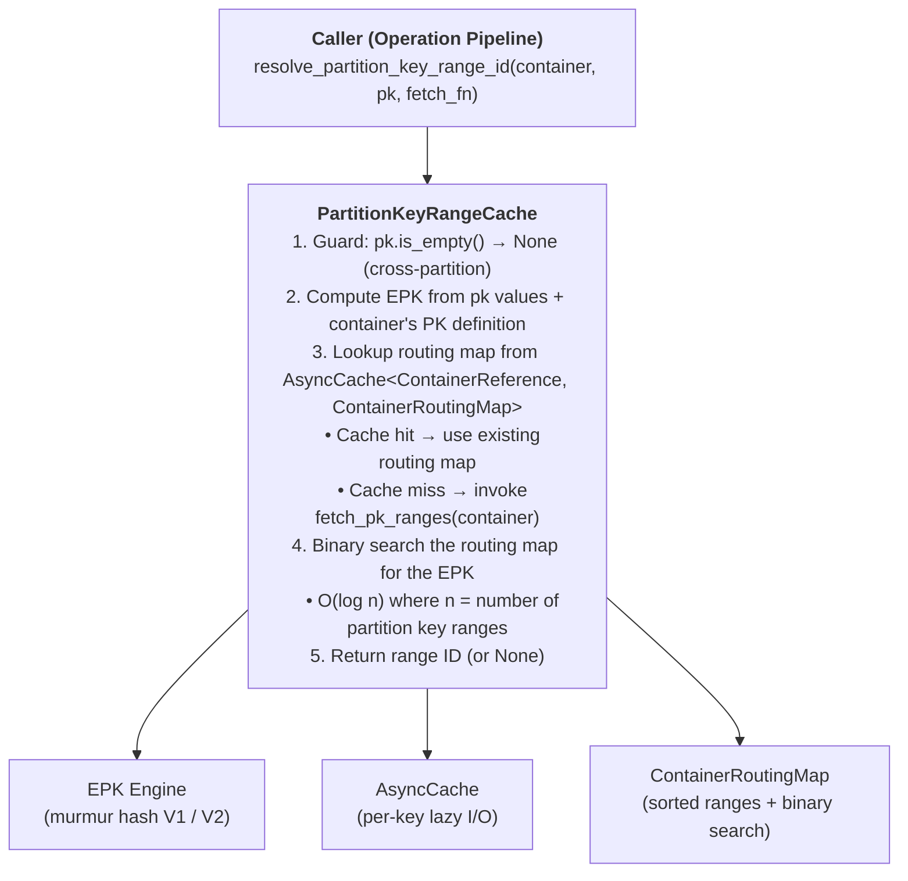
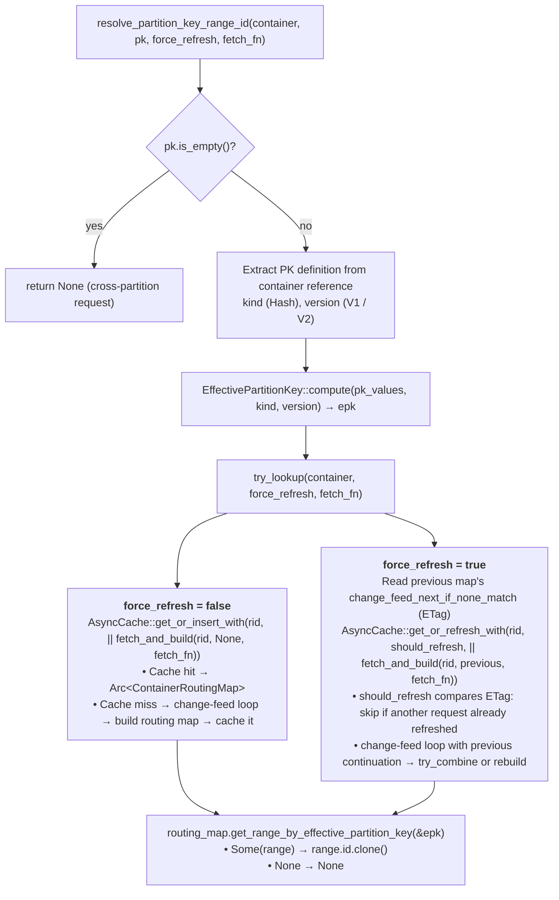
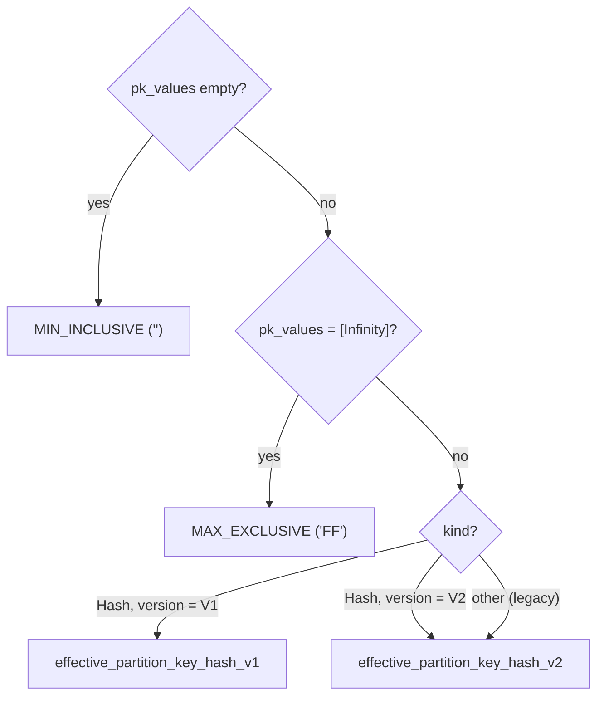
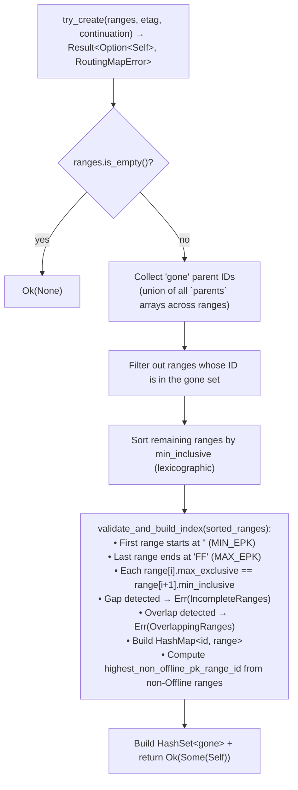
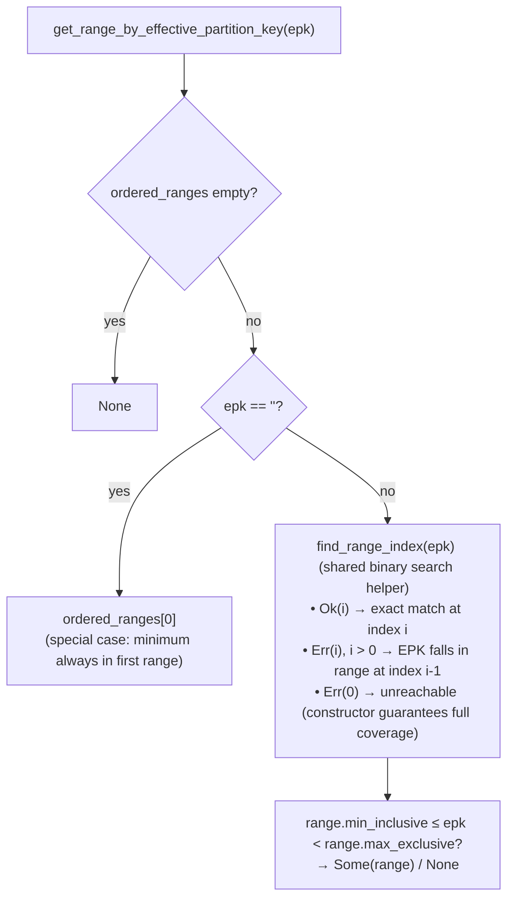
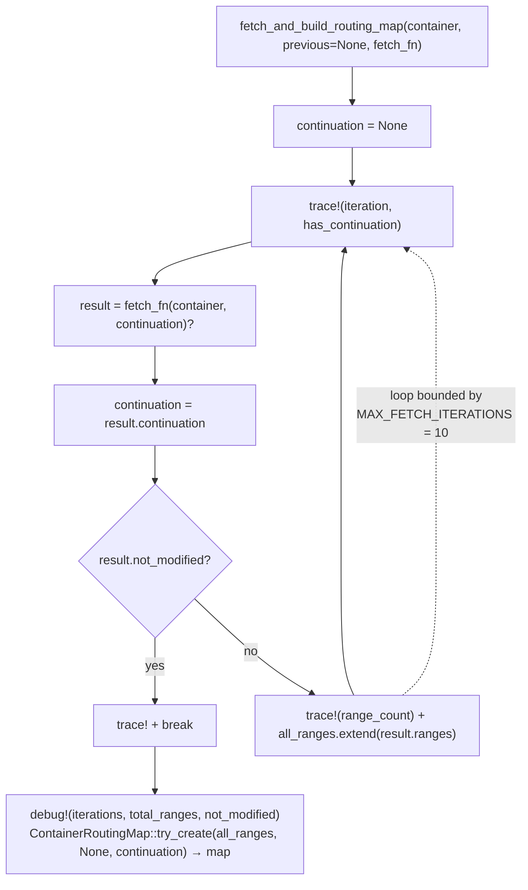
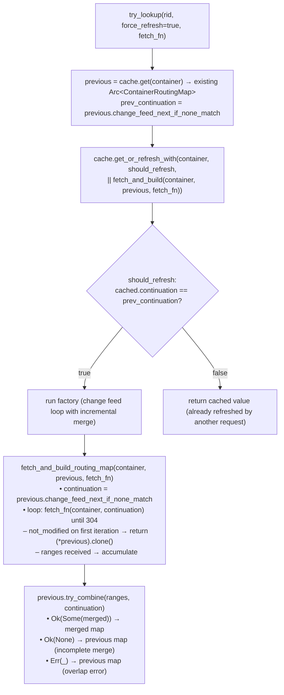
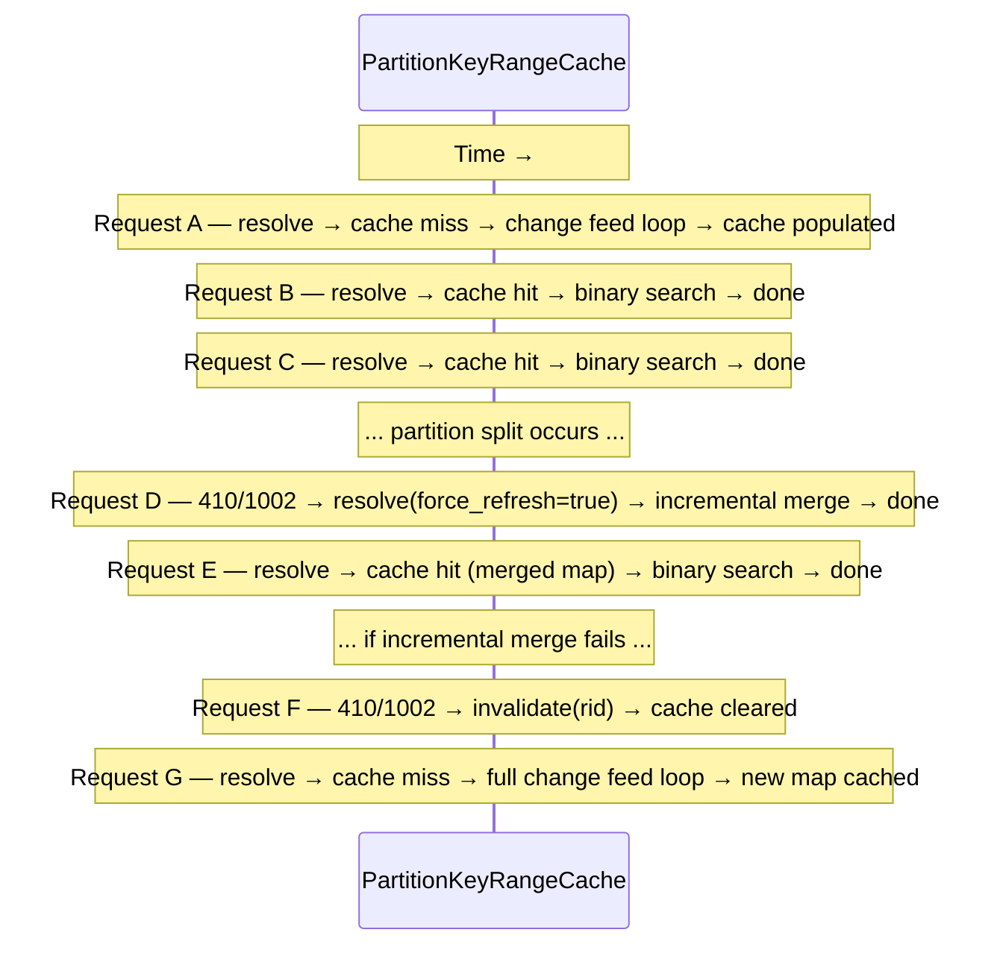

# Partition Key Range Cache Spec

**Status:** Draft  
**Date:** 2026-03-19  
**Authors:** (team)  
**Crate:** `azure_data_cosmos_driver`

---

## Table of Contents

1. [Goals & Motivation](#1-goals--motivation)
2. [Architectural Overview](#2-architectural-overview)
3. [Component Design](#3-component-design)
4. [Effective Partition Key (EPK) Computation](#4-effective-partition-key-epk-computation)
5. [Container Routing Map](#5-container-routing-map)
6. [Cache Lifecycle](#6-cache-lifecycle)
7. [Async Caching Infrastructure](#7-async-caching-infrastructure)
8. [Integration Points](#8-integration-points)
9. [Error Handling & Edge Cases](#9-error-handling--edge-cases)
10. [Performance Characteristics](#10-performance-characteristics)
11. [Testing Strategy](#11-testing-strategy)
12. [Cross-SDK Comparison](#12-cross-sdk-comparison)
13. [Known Issues & Design Decisions](#13-known-issues--design-decisions)
14. [SDK Deprecation & Migration](#14-sdk-deprecation--migration)
15. [Future Work](#15-future-work)

---

## 1. Goals & Motivation

### Problem Statement

Cosmos DB distributes data across physical partitions. Each physical partition owns a
contiguous range of the hash space, described by a **partition key range** (a pair of
`[minInclusive, maxExclusive)` hex strings). To enable **partition-level failover**
(PPAF/PPCB — see `PARTITION_LEVEL_FAILOVER_SPEC.md`), the driver must resolve the
partition key supplied by the caller into the concrete **partition key range ID** that
owns that key. The `PartitionKeyRangeCache` provides this resolution layer.

### Goals

1. **Efficient EPK→Range resolution** — Given a user-supplied partition key and a
   container reference, compute the effective partition key (EPK) and look up the
   owning range ID in O(log n) time.
2. **Lazy fetching** — Fetch the `/pkranges` feed from the service only on first
   access for a container, not eagerly for every container the client touches.
3. **Single-pending-I/O semantics** — When multiple concurrent requests target the
   same container before / during the initial fetch, only one `/pkranges` call
   happens; all others await the shared result.
4. **Invalidation on partition splits** — When the driver detects a 410/1002 (Gone —
   PartitionKeyRangeGone) response, the cached routing map for the affected container
   is invalidated, forcing a refetch on the next request.
5. **Schema-agnostic** — The cache operates at the driver layer using raw partition key
   values and hex-encoded EPK strings; it has no knowledge of document schemas or
   serialization formats.

---

## 2. Architectural Overview



### Layer Separation

| Concern | Component | Location |
|---------|-----------|----------|
| EPK hashing | `EffectivePartitionKey::compute` | `models/effective_partition_key.rs` |
| Range abstraction | `Range<T>` | `models/range.rs` |
| Range model | `PartitionKeyRange` | `models/partition_key_range.rs` |
| Routing map | `ContainerRoutingMap` | `driver/cache/container_routing_map.rs` |
| Caching + orchestration | `PartitionKeyRangeCache` | `driver/cache/partition_key_range_cache.rs` |
| Async primitives | `AsyncCache`, `AsyncLazy` | `driver/cache/async_cache.rs`, `async_lazy.rs` |

---

## 3. Component Design

### 3.1 `PkRangeFetchResult`

The callback return type that mirrors the Cosmos DB change feed protocol:

```rust
pub(crate) struct PkRangeFetchResult {
    /// Parsed partition key ranges from the response body (empty if `not_modified`).
    pub ranges: Vec<PartitionKeyRange>,
    /// Continuation token from the `etag` response header.
    pub continuation: Option<String>,
    /// True when the server returned HTTP 304 Not Modified.
    pub not_modified: bool,
}
```

Callers construct this from the HTTP response by parsing the body for ranges,
extracting the `etag` header as `continuation`, and checking for HTTP 304.

### 3.2 `PartitionKeyRangeCache`

```rust
pub(crate) struct PartitionKeyRangeCache {
    cache: AsyncCache<ContainerReference, ContainerRoutingMap>,
}
```

**Visibility:** `pub(crate)` — internal to the driver crate.

**Key:** `ContainerReference`. Provides the container RID (for the
`x-ms-expected-rid` header) and the partition key definition (for EPK computation).

**Value:** `ContainerRoutingMap` — a validated, sorted snapshot of all partition key
ranges for one container.

#### Methods

| Method | Description |
|--------|-------------|
| `new()` | Creates an empty cache. |
| `resolve_partition_key_range_id(container, pk, force_refresh, fetch_fn)` | Main entry point. Computes EPK, looks up or fetches the routing map, and returns the range ID. |
| `resolve_overlapping_ranges(rid, min, max, force_refresh, fetch_fn)` | Returns all ranges overlapping the given EPK interval. |
| `resolve_partition_key_range_by_id(rid, pk_range_id, force_refresh, fetch_fn)` | Looks up a specific range by its ID. |
| `invalidate(container)` | Removes the cached routing map for a container, forcing refetch on next access. |

#### Callback Signature

All public methods accept a generic callback for fetching partition key ranges:

```rust
F: Fn(ContainerReference, Option<String>) -> Fut,
Fut: Future<Output = Option<PkRangeFetchResult>>,
```

Parameters:
- `ContainerReference` — the container reference (provides RID and PK definition)
- `Option<String>` — the `If-None-Match` continuation token (from a previous fetch's
  `etag` header, or `None` for a fresh fetch)

The callback uses `Fn` (not `FnOnce`) because the change-feed loop may call it
multiple times. The cache is fully transport-decoupled — the caller provides the
logic to fetch `/pkranges` from the service, keeping the cache unit-testable
without a live endpoint.

#### `resolve_partition_key_range_id` — Detailed Flow



### 3.3 `parse_pk_ranges_response`

```rust
pub(crate) fn parse_pk_ranges_response(
    body: &[u8],
) -> Option<Vec<PartitionKeyRange>>
```

A standalone helper that deserializes a raw `/pkranges` JSON response body into a
`Vec<PartitionKeyRange>`. Returns `None` on deserialization failure. This is meant
to be used by the caller when constructing the `fetch_fn` callback.

The helper uses the `PkRangesResponse` envelope type defined in
`models/partition_key_range.rs`:

```rust
/// Response from the `/pkranges` REST endpoint.
#[derive(Debug, Deserialize)]
pub(crate) struct PkRangesResponse {
    /// The partition key ranges returned by the service.
    #[serde(rename = "PartitionKeyRanges")]
    pub partition_key_ranges: Vec<PartitionKeyRange>,
}
```

---

## 4. Effective Partition Key (EPK) Computation

The EPK engine lives in `models/effective_partition_key.rs` and transforms user-supplied
partition key values into a hex-encoded string that can be compared against range
boundaries.

### Hash Versions

| Version | Algorithm | Output |
|---------|-----------|--------|
| **V1** | MurmurHash3-32 → f64 → binary-encode hash + truncated components | Variable-length hex string |
| **V2** | MurmurHash3-128 → reverse bytes → clear top 2 bits | 32-char uppercase hex string |

### Dispatch Logic



### Constants

| Constant | Value | Meaning |
|----------|-------|---------|
| `MIN_INCLUSIVE_EFFECTIVE_PARTITION_KEY` | `""` | Start of the hash space |
| `MAX_EXCLUSIVE_EFFECTIVE_PARTITION_KEY` | `"FF"` | End of the hash space (exclusive) |

---

## 5. Container Routing Map

`ContainerRoutingMap` is the core data structure that enables efficient EPK → range
lookups. It is defined in `driver/cache/container_routing_map.rs`.

### 5.1 Data Structure

```rust
pub(crate) struct ContainerRoutingMap {
    range_by_id: HashMap<String, PartitionKeyRange>,     // O(1) ID lookup
    ordered_ranges: Vec<PartitionKeyRange>,              // sorted by min_inclusive
    gone_ranges: HashSet<String>,                        // IDs of split (gone) parents
    highest_non_offline_pk_range_id: i32,                // for split detection
    pub etag: Option<ETag>,                              // for incremental refresh
    pub change_feed_next_if_none_match: Option<String>,  // continuation token for change feed
}
```

`PartitionKeyRange` provides a `as_range()` method that converts it to a
`EpkRange<&str>` (from `models/range.rs`) with `is_min_inclusive: true` and
`is_max_inclusive: false`, matching the `[minInclusive, maxExclusive)` semantics.

### 5.2 Construction — `try_create`

Validation errors are represented by `RoutingMapError`, which is marked
`#[non_exhaustive]` for forward compatibility:

```rust
#[derive(Debug)]
#[non_exhaustive]
pub(crate) enum RoutingMapError {
    OverlappingRanges,
    IncompleteRanges,
}
```



**Key behaviors:**

- **Parent filtering**: After a partition split, the service returns both the old
  ("gone") parent ranges and the new child ranges. Child ranges list their parent IDs
  in the `parents` field. The routing map filters out any range whose ID appears as a
  parent, keeping only the current generation.

- **Completeness validation**: The routing map must cover the entire EPK space
  `["", "FF")` with no gaps. If the ranges have gaps, `try_create` returns
  `Err(RoutingMapError::IncompleteRanges)`. If ranges overlap, it returns
  `Err(RoutingMapError::OverlappingRanges)`. An empty input returns `Ok(None)`.

### 5.3 EPK Lookup — `get_range_by_effective_partition_key`

Uses binary search on the sorted `ordered_ranges` vector:



The final bounds check uses direct `&str` comparisons (`min_inclusive <= epk` and
`epk < max_exclusive`) to avoid allocations on the hot path.

**Complexity:** O(log n) where n is the number of partition key ranges.

### 5.4 Additional Methods

| Method | Description |
|--------|-------------|
| `range(id)` | O(1) lookup by range ID via the HashMap. |
| `ranges()` | Returns all partition key ranges, sorted by `min_inclusive`. |
| `is_gone(id)` | Returns `true` if the given range ID has been split (is in the gone set). |
| `get_overlapping_ranges(epk_range)` | Returns all ranges overlapping the given `Range<&EffectivePartitionKey>` via `find_range_index` + `partition_point`. |
| `highest_non_offline_pk_range_id()` | Returns the highest parsed range ID among non-Offline ranges (for split detection). |
| `try_combine(new_ranges, continuation)` | Merges incrementally-fetched `Vec<PartitionKeyRange>` into this map. |
| `empty()` | Creates an empty routing map (fallback for error paths). |

---

## 6. Cache Lifecycle

### 6.1 Initialization

The cache is created empty — no partition key ranges are fetched until the first
`resolve_partition_key_range_id` call for a given container.

### 6.2 Population (Lazy Fetch via Change Feed Loop)

On the first request for a container:

1. `AsyncCache::get_or_insert_with` detects a cache miss.
2. `fetch_and_build_routing_map` runs the **change feed loop**:
   a. Calls `fetch_pk_ranges(container, None)` (no continuation for first fetch).
   b. Parses the response: accumulates ranges and captures the `etag` continuation token.
   c. Loops, passing the continuation token to subsequent calls, until the service
      returns HTTP 304 Not Modified (signaling no more pages), or `MAX_FETCH_ITERATIONS`
      (10) is reached.
3. The accumulated ranges are passed to `ContainerRoutingMap::try_create`
   to build the routing map, preserving the final continuation token.
4. The resulting map is stored in the cache.
5. Concurrent requests for the same container that arrive while the fetch is
   in-flight share the same pending future (single-pending-I/O).



Note: `fetch_and_build_routing_map` is a bare free function (not an associated
method on `PartitionKeyRangeCache`) since it does not access any cache state.

### 6.3 Cache Hit (Steady State)

Subsequent requests for the same container find the routing map in the cache and
proceed directly to the EPK lookup — no I/O required.

### 6.4 Force Refresh (Incremental via Change Feed)

When `force_refresh=true` (e.g., after a 410/1002 Gone response):

1. The cache reads the existing routing map's `change_feed_next_if_none_match`
   continuation token.
2. `AsyncCache::get_or_refresh_with` checks `should_force_refresh`: if the cached
   map's continuation matches what we observed, a refresh is needed. If another
   concurrent request already refreshed it, the refresh is skipped.
3. The change feed loop runs with the previous map's continuation as the starting
   `If-None-Match` value.
4. If the service returns 304 Not Modified on the first iteration, the existing map
   is returned unchanged (no split occurred since last fetch).
5. If new ranges are returned, they are merged with the existing map via
   `ContainerRoutingMap::try_combine`:
   - Ranges from the previous map are kept (minus gone parents).
   - New ranges are added (minus gone parents).
   - The merged set is validated for completeness.
   - If incomplete (gaps), the previous map is preserved as fallback.



### 6.5 Invalidation (Partition Splits)

When the driver receives a **410/1002 Gone — PartitionKeyRangeGone** response:

1. The retry policy calls `invalidate(container)`.
2. The entry is removed from `AsyncCache`.
3. The next `resolve_partition_key_range_id` call triggers a fresh `/pkranges` fetch
   (full change feed loop, no incremental merge since there's no previous map).



### 6.6 Fallback on Fetch Failure

If `fetch_fn` returns `None` (service unreachable or unexpected response):

- **During initial population:** The cache stores an empty routing map via
  `ContainerRoutingMap::empty()`. All EPK lookups return `None`.
- **During incremental refresh:** The previous routing map is preserved. A
  `tracing::warn!` is emitted for diagnostics.
- **During `try_combine`:** If the merge is incomplete or overlapping, the previous
  map is preserved as fallback with a warning logged.

---

## 7. Async Caching Infrastructure

The partition key range cache is built on two async primitives that provide
single-pending-I/O semantics without coupling to a specific async runtime.

### 7.1 `AsyncLazy<T>`

A lazily initialized value computed asynchronously. Uses `async_lock::RwLock` (runtime-
agnostic) with double-checked locking:

| Method | Behavior |
|--------|----------|
| `new()` | Creates an uninitialized lazy value. |
| `get_or_init(factory)` | Fast path: read lock returns cached `Arc<T>`. Slow path: write lock + double-check + run factory. |
| `try_get()` | Non-blocking peek. Returns `Some(Arc<T>)` if initialized. |
| `get()` | Blocking wait (yield loop) until initialization completes. |

**Lock contention profile:**
- Post-initialization: read-lock only (zero contention among readers).
- During initialization: one writer, all other callers await on the read lock.

### 7.2 `AsyncCache<K, V>`

A concurrent key-value cache built on `RwLock<HashMap<K, Arc<AsyncLazy<V>>>>`:

| Method | Behavior |
|--------|----------|
| `new()` | Creates an empty cache. |
| `get_or_insert_with(key, factory)` | Fast path: read lock finds existing `AsyncLazy`. Slow path: write lock inserts new `AsyncLazy`, factory runs once. |
| `get(key)` | Read-only peek, returns `None` if missing or not yet initialized. |
| `invalidate(key)` | Removes the entry under a write lock, returns the previous value if any. |

**Single-pending-I/O guarantee:** For a given key, at most one factory closure runs
at a time. If multiple callers race on a cache miss, only the first to acquire the
write lock inserts a new `AsyncLazy`; all others find it during the double-check and
await the same initialization future.

---

## 8. Integration Points

### 8.1 Driver Layer (Current — `azure_data_cosmos_driver`)

The `PartitionKeyRangeCache` in the driver is a _standalone_ component (see the
`#[allow(unused_imports)]` on its re-export in `cache/mod.rs`). It is designed to be
wired into the operation pipeline for partition-level failover (PPAF/PPCB) but is
currently pending integration.

**Dead-code suppression pattern:** Because the cache and its model dependencies are
not yet wired into the operation pipeline, the compiler would emit dead-code warnings.
These are suppressed using `#[allow(dead_code)]` on the `mod` declarations in the
parent modules (`models/mod.rs` and `driver/cache/mod.rs`), rather than `#![allow(dead_code)]`
inner attributes in each file. This keeps the intent clear ("this module is
intentionally unused for now") without masking legitimate dead-code issues within
the modules themselves.

The cache accepts a generic `fetch_fn` callback for transport-decoupled fetching:

```rust
pub async fn resolve_partition_key_range_id<F, Fut>(
    &self,
    container: &ContainerReference,
    partition_key: &PartitionKey,
    force_refresh: bool,
    fetch_pk_ranges: F,
) -> Option<String>
where
    F: Fn(String, Option<String>) -> Fut,
    Fut: Future<Output = Option<PkRangeFetchResult>>,
```

The callback takes `(container, if_none_match)` and returns a `PkRangeFetchResult`
containing the parsed ranges, the response's `etag` continuation token, and a
`not_modified` flag for HTTP 304. The cache loops calling this callback (change-feed
pattern) until the server signals no more changes.

### 8.2 Sample `fetch_pk_ranges` Implementation

Below is what a concrete `fetch_pk_ranges` callback would look like when wired to
the driver's operation pipeline. The caller captures a reference to the driver and
constructs a `ReadFeed` operation targeting the container's `/pkranges` resource:

```rust
use crate::driver::cache::{
    partition_key_range_cache::parse_pk_ranges_response,
    PkRangeFetchResult,
};
use crate::models::{
    CosmosOperation, CosmosResourceReference,
    ContainerReference, OperationType, ResourceType,
};
use crate::options::OperationOptions;

impl CosmosDriver {
    /// Resolves the partition key range ID for a request, using the
    /// operation pipeline to fetch /pkranges via the change feed protocol.
    async fn resolve_pk_range(
        &self,
        container: &ContainerReference,
        partition_key: &PartitionKey,
        force_refresh: bool,
    ) -> Option<String> {
        let container_clone = container.clone();
        let driver = self;

        self.pk_range_cache
            .resolve_partition_key_range_id(
                container,
                partition_key,
                force_refresh,
                // The callback is Fn (not FnOnce) — it may be called multiple
                // times by the change feed loop.
                |container_ref: ContainerReference, if_none_match: Option<String>| {
                    let container = container_clone.clone();
                    async move {
                        driver.fetch_pk_ranges_page(&container, &collection_rid, if_none_match.as_deref()).await
                    }
                },
            )
            .await
    }

    /// Fetches a single page of partition key ranges from the service.
    ///
    /// Constructs a ReadFeed operation for the /pkranges resource with:
    /// - `x-ms-max-item-count: -1` (request all ranges per page)
    /// - `a-im: Incremental Feed` (change feed mode)
    /// - `if-none-match: <etag>` (continuation from previous fetch, if any)
    ///
    /// Returns `PkRangeFetchResult` with:
    /// - `ranges`: parsed partition key ranges from the body
    /// - `continuation`: the `etag` response header
    /// - `not_modified`: true if the server returned HTTP 304
    async fn fetch_pk_ranges_page(
        &self,
        container: &ContainerReference,
        collection_rid: &str,
        if_none_match: Option<&str>,
    ) -> Option<PkRangeFetchResult> {
        // Build the ReadFeed operation targeting /pkranges
        let resource_ref = CosmosResourceReference::from(container.clone())
            .with_resource_type(ResourceType::PartitionKeyRange)
            .into_feed_reference();

        let mut operation = CosmosOperation::new(OperationType::ReadFeed, resource_ref)
            .with_header("x-ms-max-item-count", "-1")
            .with_header("a-im", "Incremental Feed");

        if let Some(etag) = if_none_match {
            operation = operation.with_header("if-none-match", etag);
        }

        // Execute through the standard pipeline (auth, retry, failover).
        let response = self
            .execute_operation(operation, OperationOptions::new())
            .await
            .ok()?;

        let continuation = response
            .headers()
            .get("etag")
            .map(|v| v.to_string());

        // HTTP 304 Not Modified → no changes since the ETag.
        if response.status() == 304 {
            return Some(PkRangeFetchResult {
                ranges: vec![],
                continuation,
                not_modified: true,
            });
        }

        // Parse the response body.
        let ranges = parse_pk_ranges_response(response.body())?;

        Some(PkRangeFetchResult {
            ranges,
            continuation,
            not_modified: false,
        })
    }
}
```

**Key points:**
- The callback is `Fn` (not `FnOnce`) because the change-feed loop calls it repeatedly.
- `x-ms-max-item-count: -1` requests all ranges in one page (Cosmos DB limits are low
  enough that this is safe).
- `a-im: Incremental Feed` puts the service into change feed mode.
- `if-none-match: <etag>` is the continuation token from the previous fetch. On the
  first fetch this is `None`, causing the service to return all current ranges.
- The cache internally loops until it receives `not_modified: true` (HTTP 304), then
  either creates a fresh routing map or merges incrementally with `try_combine`.

### 8.3 SDK Layer (`azure_data_cosmos`)

The SDK crate has its own `PartitionKeyRangeCache` in `routing/partition_key_range_cache.rs`
which is being **deprecated**. Its capabilities have been ported to the driver cache
(see §14). The SDK cache had:

- Direct pipeline references (`Arc<GatewayPipeline>`, `Arc<ContainerCache>`, `Arc<GlobalEndpointManager>`)
- The same change feed loop pattern with `If-None-Match` / 304 handling
- `try_lookup(collection_rid, previous_value)` with ETag comparison
- `should_force_refresh` comparing `change_feed_next_if_none_match` between previous and cached values

The driver cache achieves the same functionality through the transport-decoupled
callback approach, which is more flexible and testable.

### 8.4 `ContainerReference`

The cache depends on `ContainerReference` (from `models/resource_reference.rs`) to
obtain:

- `rid()` — the container RID used as cache key.
- `partition_key_definition()` — the PK definition (paths, kind, version) used for
  EPK computation.

---

## 9. Error Handling & Edge Cases

| Scenario | Behavior |
|----------|----------|
| Empty partition key (`PartitionKey::EMPTY`) | Returns `None` immediately — cross-partition request, no range resolution needed. |
| `fetch_fn` returns `None` (initial fetch) | Caches an empty routing map. Lookups return `None`. Warning logged. |
| `fetch_fn` returns `None` (incremental refresh) | Falls back to previous routing map. Warning logged. |
| Incomplete range set (gaps in coverage) | `try_create` returns `Err(IncompleteRanges)`. Falls back to empty map + warning. |
| Overlapping ranges (data corruption) | `try_create` returns `Err(OverlappingRanges)`. Falls back to empty map + warning. |
| Partition split (gone parent ranges) | Parent ranges filtered out by `try_create`. Only child ranges kept. |
| `try_combine` fails (incomplete merge) | Falls back to previous routing map. Warning logged. |
| EPK not found in routing map | `get_range_by_effective_partition_key` returns `None` (should not happen for a valid map). |
| Concurrent requests for same container | Single-pending-I/O: one fetch, others await. |
| Concurrent `force_refresh` requests | ETag-based `should_force_refresh` ensures only one refresh runs; others reuse the result. |
| `invalidate` during in-flight resolve | New requests after invalidation trigger a refetch. In-flight requests finish with the old map. |
| `Change feed loop exceeds MAX_FETCH_ITERATIONS` | Loop terminates, warning logged, builds map from accumulated ranges so far. |

---

## 10. Performance Characteristics

| Operation | Complexity | Allocations |
|-----------|-----------|-------------|
| EPK computation (V2) | O(n) where n = PK components | 1 `Vec<u8>` + 1 `String` |
| EPK computation (V1) | O(n) | 1 `Vec<u8>` + 1 `String` |
| Cache lookup (hit) | O(1) async read lock | Arc clone |
| Binary search in routing map | O(log r) where r = number of ranges | None (direct `&str` comparisons) |
| Cache miss + fetch | O(r log r) to sort + O(r) to validate | HashMap + Vec of ranges |
| Invalidation | O(1) amortized | None |

**Memory per container:** `r × sizeof(PartitionKeyRange)` in the sorted vec +
`r × sizeof(PartitionKeyRange)` in the HashMap.
For a typical container with ~100 ranges, this is negligible.

---

## 11. Testing Strategy

### 11.1 Unit Tests (Existing)

**`partition_key_range_cache.rs` tests:**

| Test | Validates |
|------|-----------|
| `resolve_returns_range_id` | End-to-end: PK → EPK → range ID "0" via single-range map. |
| `empty_pk_returns_none` | `PartitionKey::EMPTY` short-circuits to `None`. |
| `force_refresh_uses_incremental_merge` | Populates cache, then force-refreshes; verifies 304 returns same map. |
| `parse_pk_ranges_response_test` | JSON deserialization of `/pkranges` response. |

**`container_routing_map.rs` tests:**

| Test | Validates |
|------|-----------|
| `create_single_range` | Single range `["", "FF")` accepted. |
| `create_three_ranges` | Three contiguous ranges accepted. |
| `lookup_in_single_range` | Binary search in single-range map. |
| `lookup_in_three_ranges` | Binary search across boundaries (min_inclusive exact match, mid-range, boundary crossings). |
| `lookup_by_id` | HashMap lookup. Gone parent excluded. |
| `incomplete_range_returns_error` | Gaps in EPK space → `try_create` returns `Err(IncompleteRanges)`. |
| `overlapping_ranges_returns_error` | Overlapping ranges → `try_create` returns `Err(OverlappingRanges)`. |
| `filters_gone_parent_ranges` | Parent range filtered when children reference it. |
| `is_gone_tracks_parent_ranges` | `is_gone()` returns true for parent IDs, false for child IDs. |
| `get_overlapping_ranges_full_span` | Full EPK space query returns all ranges. |
| `get_overlapping_ranges_partial` | Partial interval query returns overlapping ranges only. |
| `get_overlapping_ranges_single` | Narrow interval query returns single matching range. |
| `empty_input_returns_none` | Empty input → `try_create` returns `Ok(None)`. |

**`partition_key_range.rs` tests:**

| Test | Validates |
|------|-----------|
| `partition_key_range_creation` | Constructor assigns fields correctly. |
| `as_range` | `as_range()` produces `EpkRange<&str>` with correct min/max and inclusivity. |
| `equality_check` | `PartialEq` compares identity fields only. |
| `serialization` | JSON round-trip via serde. |
| `range_overlap` | `Range::check_overlapping` boundary semantics. |

**`effective_partition_key.rs` tests:**

| Test | Validates |
|------|-----------|
| `empty_pk_returns_min` | Empty values → `""`. |
| `string_pk_hash_v2_matches_sdk` | Known V2 hash matches cross-SDK reference value. |
| `string_pk_hash_v2_empty_string` | Empty string PK → deterministic hash. |
| `string_pk_hash_v2_partition_key` | Another known reference value. |
| `bool_true_hash_v2` / `bool_false_hash_v2` | Boolean PK hashing. |

### 11.2 Recommended Additional Tests

- **Concurrent resolve (same container):** Verify single `fetch_fn` invocation under
  concurrent requests.
- **Invalidate + re-fetch:** Verify that after `invalidate`, the next resolve triggers a
  new fetch, and the old map is no longer returned.
- **Multi-container isolation:** Verify that invalidation of one container does not
  affect another.
- **V1 EPK correctness:** Add known reference values for V1 hash (currently V2 only).
- **Hierarchical PK (multi-component):** Test EPK computation with 2–3 component
  partition keys.
- **Emulator integration:** End-to-end test using the Cosmos DB emulator with real
  `/pkranges` responses and actual partition splits.

---

## 12. Cross-SDK Comparison

This section compares the Rust driver `PartitionKeyRangeCache` and
`ContainerRoutingMap` with their equivalents in the .NET SDK v3 and Java SDK.

**Source references:**
- **.NET:** `Microsoft.Azure.Cosmos.Routing.PartitionKeyRangeCache` + `ContainerRoutingMap`
  ([azure-cosmos-dotnet-v3](https://github.com/Azure/azure-cosmos-dotnet-v3))
- **Java:** `RxPartitionKeyRangeCache` + `InMemoryContainerRoutingMap`
  ([azure-sdk-for-java](https://github.com/Azure/azure-sdk-for-java))
- **Rust (driver):** `PartitionKeyRangeCache` + `ContainerRoutingMap`
  (`azure_data_cosmos_driver/src/driver/cache/`)
- **Rust (SDK):** `PartitionKeyRangeCache` + `ContainerRoutingMap`
  (`azure_data_cosmos/src/routing/`)

### 12.1 Feature Matrix

| Feature | .NET | Java | Rust Driver | Rust SDK |
|---------|:----:|:----:|:-----------:|:--------:|
| **AsyncCache with single-pending-I/O** | `AsyncCacheNonBlocking` | `AsyncCacheNonBlocking` | `AsyncCache` | `AsyncCache` |
| **EPK → range binary search** | ✅ | ✅ | ✅ | ✅ |
| **Range ID → range HashMap lookup** | ✅ | ✅ | ✅ | ✅ |
| **Overlapping range resolution** | ✅ `GetOverlappingRanges` | ✅ `getOverlappingRanges` | ✅ `resolve_overlapping_ranges` | ✅ `resolve_overlapping_ranges` |
| **`forceRefresh` parameter** | ✅ | ✅ | ✅ | ✅ |
| **`TryLookup` with `previousValue`** | ✅ | ✅ | ✅ (via `should_force_refresh`) | ✅ |
| **`ShouldForceRefresh` logic** | ✅ (ETag compare) | ✅ (ref equality) | ✅ (ETag compare) | ✅ (ETag compare) |
| **Change feed incremental refresh** | ✅ `ChangeFeedNextIfNoneMatch` | ✅ `changeFeedNextIfNoneMatch` | ✅ (change-feed loop) | ✅ |
| **`TryCombine` incremental merge** | ✅ | ✅ | ✅ | ✅ |
| **Gone parent filtering** | ✅ | ✅ | ✅ | ✅ |
| **`IsGone(rangeId)` check** | ✅ | ✅ | ✅ | ❌ |
| **`ServiceIdentity` per range** | ✅ `Tuple<PKRange, ServiceIdentity>` | ✅ `ImmutablePair<PKRange, IServerIdentity>` | ❌ (not needed) | ❌ |
| **`CollectionUniqueId` on map** | ✅ | ✅ | ❌ | ❌ |
| **Separate `orderedRanges` as `EpkRange<&str>`** | ✅ | ✅ | Partial (`as_range()` converts on demand) | ❌ |
| **Completeness validation** | ✅ (throws on gaps/overlap) | ✅ (throws) | ✅ (returns `Err(RoutingMapError)`) | ✅ |
| **Incomplete routing map retries** | ✅ (throws `NotFoundException`) | ✅ (`InCompleteRoutingMapRetryPolicy`) | ❌ (empty fallback) | ❌ |
| **Diagnostics / tracing** | ✅ `ITrace`, `PartitionKeyRangeCacheTraceDatum` | ✅ `MetadataDiagnosticsContext` | Minimal (`tracing::warn!`) | Minimal |
| **Explicit `refreshAsync`** | via `TryLookup(prev)` | ✅ `refreshAsync` | via `force_refresh` param | via `try_lookup(prev)` |
| **Length-aware range comparer** | ✅ `useLengthAwareRangeComparer` | ❌ | ❌ | ❌ |
| **`HighestNonOfflinePkRangeId`** | ✅ | ❌ | ✅ | ❌ |
| **Range status (Online/Offline)** | ✅ `PartitionKeyRangeStatus` | ❌ | ✅ `PartitionKeyRangeStatus` | ❌ |
| **Transport-decoupled (`fetch_fn` closure)** | ❌ (wired to `IStoreModel`) | ❌ (wired to `RxDocumentClientImpl`) | ✅ | ❌ (wired to `GatewayPipeline`) |
| **Single `resolve(container, pk)` entry point** | ❌ (caller computes EPK) | ❌ (caller computes EPK) | ✅ | ❌ |

### 12.2 Observations

#### What the Rust driver does well

1. **Transport decoupling via `fetch_fn`:** The generic closure parameter keeps the
   cache independent of transport details — a deliberate architectural choice for the
   driver layer. .NET and Java wire directly to their respective store models, making
   isolated unit testing harder.

2. **Single `resolve_partition_key_range_id` entry point:** The Rust driver
   encapsulates EPK computation + routing map lookup in one call. .NET and Java expose
   lower-level primitives and expect callers to handle EPK computation separately.

3. **Clean `parse_pk_ranges_response` helper:** Standalone deserialization helper that
   callers can compose freely.

#### Gaps vs. .NET / Java

**Resolved gaps** (from initial analysis):

| # | Gap | Status | Resolution |
|---|-----|--------|------------|
| G1 | No `forceRefresh` / `previousValue` refresh pattern | ✅ Resolved | `force_refresh: bool` parameter + ETag-based `should_force_refresh` |
| G2 | No overlapping range resolution | ✅ Resolved | `get_overlapping_ranges()` on `ContainerRoutingMap`, `resolve_overlapping_ranges()` on cache |
| G3 | No `IsGone(rangeId)` on routing map | ✅ Resolved | `is_gone(id)` method on `ContainerRoutingMap` |
| G4 | Error swallowing on fetch failure | ✅ Partially | `RoutingMapError` enum distinguishes errors. `resolve_*` methods still return `Option` (error → `None` + warning). |
| G5 | No change feed incremental refresh | ✅ Resolved | Change-feed loop with `PkRangeFetchResult`, ETag continuation, 304 handling |
| G8 | No overlap detection | ✅ Resolved | `RoutingMapError::OverlappingRanges` distinct from `IncompleteRanges` |
| G9 | Incomplete routing map handling | ✅ Resolved | `RoutingMapError` distinguishes incomplete from overlapping |
| N2 | `HighestNonOfflinePkRangeId` | ✅ Resolved | Computed during `try_create` |
| N3 | Range status (Online/Offline) | ✅ Resolved | `PartitionKeyRangeStatus` enum with Online/Splitting/Offline/Split |

**Remaining gaps:**

| # | Gap | Impact | Notes |
|---|-----|--------|-------|
| G4 | `Result` return type for `resolve_*` | Callers cannot distinguish fetch failure from EPK miss | Future: change `Option` → `Result<Option<_>>` |
| G6 | No `ServiceIdentity` per range | Not needed | Service identity is not required for the driver's current routing model |
| G7 | No `CollectionUniqueId` on routing map | Minor — collection RID serves as external key | Consider for diagnostics |
| N1 | `useLengthAwareRangeComparer` | .NET-only; handles hex strings of different lengths | Low priority |

### 12.3 Rust SDK Layer vs. Rust Driver Layer

The driver cache now has **full feature parity** with the SDK cache and is the
designated successor (see §14). The SDK cache is being deprecated.

| Capability | Driver cache | SDK cache | Notes |
|------------|:------------:|:---------:|-------|
| Basic EPK → range lookup | ✅ | via driver | Driver is the canonical layer |
| Overlapping ranges | ✅ | ✅ | Both support `resolve_overlapping_ranges` |
| Force refresh / `previousValue` | ✅ | ✅ | Driver uses ETag-based `should_force_refresh` |
| Change feed incremental refresh | ✅ | ✅ | Driver has full change-feed loop + `try_combine` |
| `isGone` check | ✅ | ❌ | Driver only |
| `highest_non_offline_pk_range_id` | ✅ | ❌ | Driver only |
| Range status model | ✅ | ❌ | Driver has `PartitionKeyRangeStatus` enum |
| Error propagation | Partial (Option) | ✅ | Driver still returns `Option`; future → `Result` |
| Transport decoupled | ✅ (callback) | ❌ (pipeline) | Driver's callback is more testable |

---

## 13. Known Issues & Design Decisions

### 13.1 No TTL-Based Expiry

The driver cache does not expire entries on a timer. Entries live until explicitly
invalidated. This is intentional:

- Partition key ranges rarely change (only on splits).
- Splits are detected via 410/1002 responses, which trigger explicit invalidation.
- A TTL would add complexity and unnecessary re-fetches for stable containers.

### 13.2 Empty Map Fallback

When the initial `fetch_fn` call returns `None` or every page fails, the cache stores a
`ContainerRoutingMap::empty()`. This means:

- All EPK lookups return `None`.
- The caller proceeds without partition-scoped routing.
- A `tracing::warn!` captures the event.

When a **force refresh** fails (incremental merge via `try_combine` returns `None`),
the cache preserves the **previous** routing map instead of replacing it with an empty
one. This prevents a failed refresh from degrading routing for an already-cached
container.

**Alternative considered:** Return an error from `resolve_partition_key_range_id`
instead of `None`. Rejected because the cache is used in an advisory capacity —
partition-level failover is an optimization, and failing to resolve a range should not
block the request. A future change may switch to `Result<Option<_>>` for better
diagnostics (see §15).

### 13.3 Transport Decoupling

The `fetch_fn` closure pattern (`Fn(String, Option<String>) -> Fut`) keeps the cache
independent of transport details. The same cache can be used with gateway mode, direct
mode, or test mocks without any changes. This follows the schema-agnostic driver
principle.

### 13.4 Change-Feed Loop Safety

The change-feed loop in `fetch_and_build_routing_map` is bounded by
`MAX_FETCH_ITERATIONS = 10`. This prevents infinite loops if the server never returns
304 Not Modified. On exceeding the limit, the loop terminates and builds the routing
map from whatever ranges have been accumulated so far.

### 13.5 ETag-Based `should_force_refresh`

When multiple concurrent requests detect a stale routing map (e.g., after a partition
split), each passes `force_refresh: true`. The `should_force_refresh` predicate
compares the `change_feed_next_if_none_match` on the cached map against the value
the caller saw. If the cache has already been refreshed by another request (new ETag),
the predicate returns `false`, avoiding redundant fetches.

---

## 14. SDK Deprecation & Migration

The SDK-layer `PartitionKeyRangeCache` (in `azure_data_cosmos`) is being deprecated and
will be removed. All partition key range resolution must move to the driver cache.

### Capabilities Ported to Driver

The following SDK capabilities have been ported to the driver cache:

| Capability | Driver Location | Status |
|---|---|---|
| `PartitionKeyRangeStatus` enum (Online/Splitting/Offline/Split) | `models/partition_key_range.rs` | ✅ Implemented |
| `lsn` field on `PartitionKeyRange` | `models/partition_key_range.rs` | ✅ Implemented |
| `highest_non_offline_pk_range_id` computation | `ContainerRoutingMap` | ✅ Implemented |
| `try_combine()` incremental merge | `ContainerRoutingMap` | ✅ Implemented |
| `change_feed_next_if_none_match` continuation | `ContainerRoutingMap` | ✅ Implemented |
| `resolve_overlapping_ranges()` | `PartitionKeyRangeCache` | ✅ Implemented |
| `resolve_partition_key_range_by_id()` | `PartitionKeyRangeCache` | ✅ Implemented |
| `is_gone()` | `ContainerRoutingMap` | ✅ Implemented |
| `get_overlapping_ranges()` | `ContainerRoutingMap` | ✅ Implemented |
| `force_refresh` parameter | `PartitionKeyRangeCache` | ✅ Implemented |
| Distinct `OverlappingRanges` vs `IncompleteRanges` errors | `RoutingMapError` | ✅ Implemented |
| Change-feed incremental fetch loop (If-None-Match/304) | `fetch_and_build_routing_map` | ✅ Implemented |
| ETag-based `should_force_refresh` | `try_lookup` predicate | ✅ Implemented |
| `PkRangeFetchResult` callback protocol | `cache/mod.rs` | ✅ Implemented |

### Remaining Work

| Capability | Priority | Notes |
|---|---|---|
| Wire cache into operation pipeline | Critical | Currently standalone, needs integration (see §8.2 for sample) |
| Return `Result` from `resolve_*` methods instead of `Option` | Important | Error propagation for diagnostics |

## 15. Future Work

Prioritized based on cross-SDK gap analysis (§12) and SDK deprecation (§14).

### Critical (needed for PPAF/PPCB integration)

1. **Wire into the operation pipeline** — The driver cache is currently standalone
   (`#[allow(unused_imports)]`). It needs to be integrated with the request pipeline
   to provide range IDs for partition-level failover headers. See §8.2 for a sample
   `fetch_pk_ranges` implementation showing how the callback would be constructed.

2. **Fix error propagation (G4)** — Change `resolve_partition_key_range_id` to
   return `Result<Option<String>>` instead of `Option<String>`. Fetch failures
   should be propagated, not swallowed into an empty routing map.

### Nice-to-have

3. **Metrics / diagnostics** — Expose cache hit/miss rates, fetch latency, and
   invalidation counts through the diagnostics module.

4. **Stale-while-revalidate** — On invalidation, serve the old routing map while
   the refetch is in progress, reducing latency for the first request after a split.
