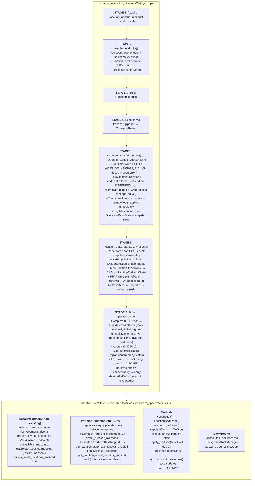
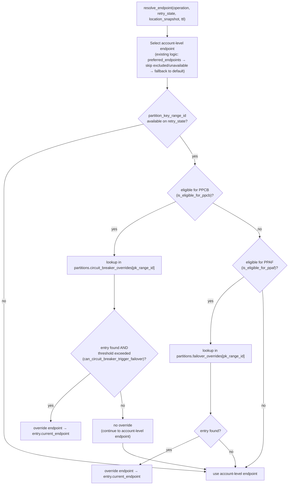
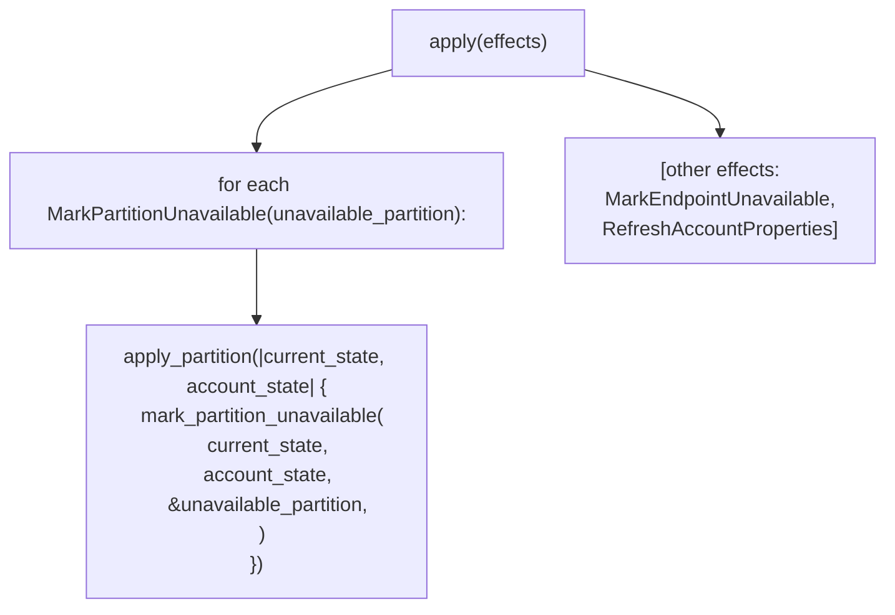
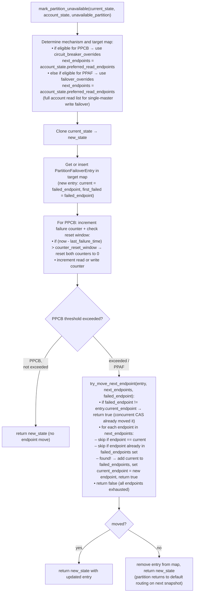
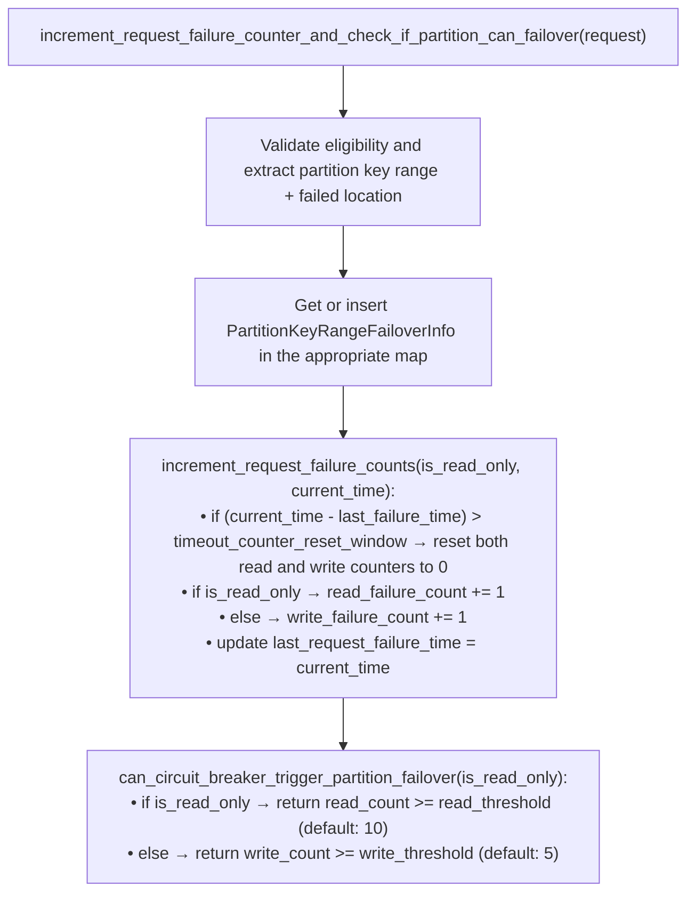
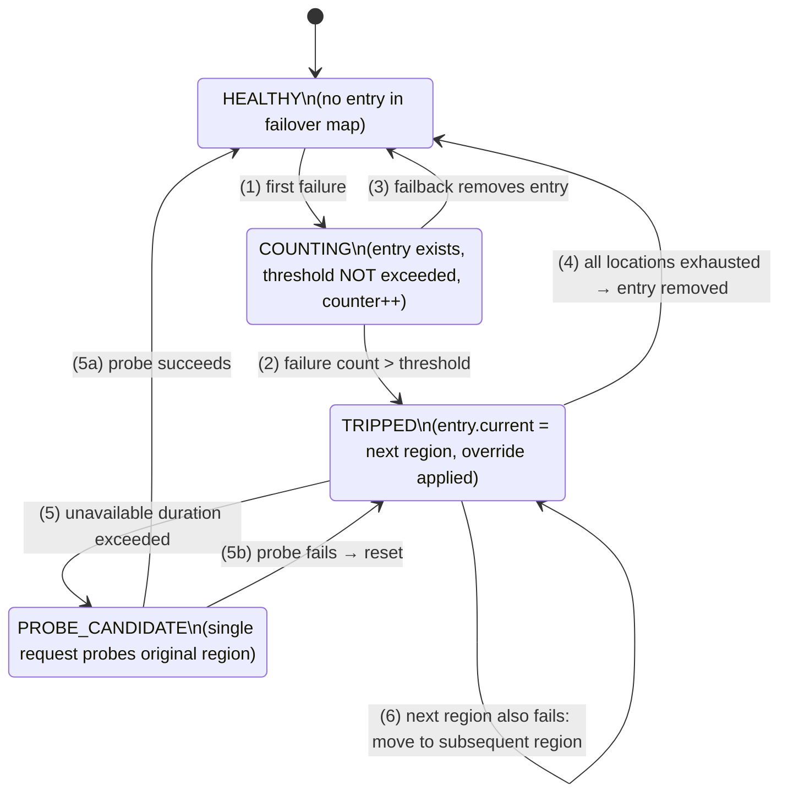
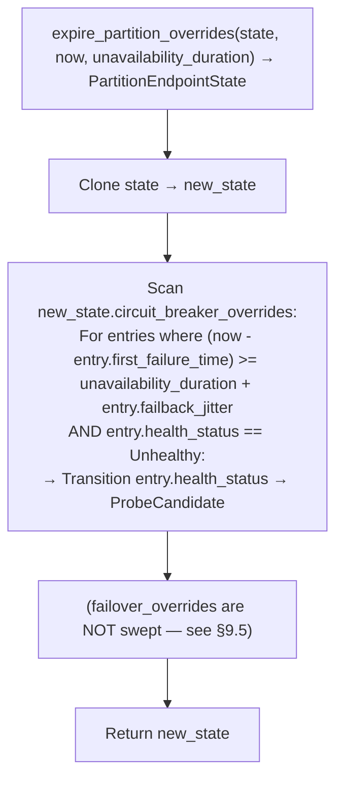
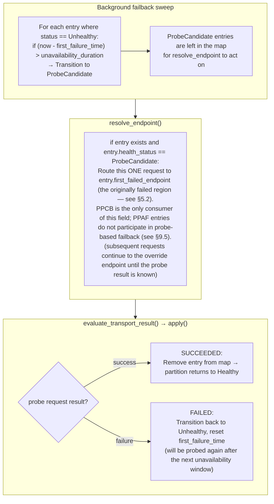
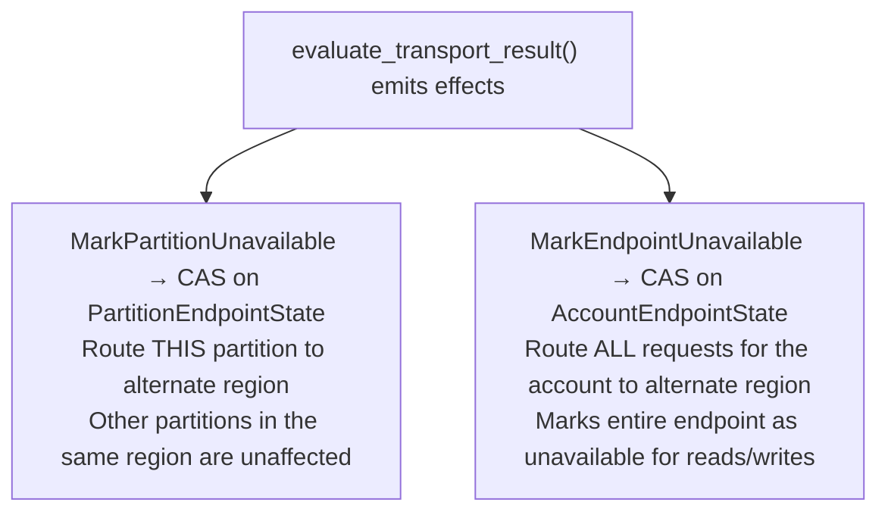
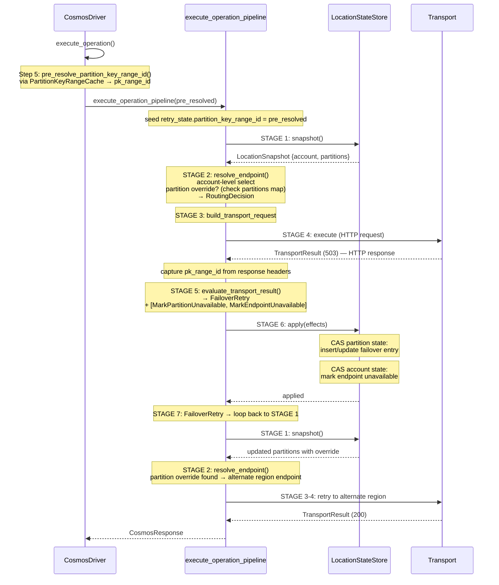

# Per-Partition Automatic Failover (PPAF) & Per-Partition Circuit Breaker (PPCB) Spec

**Status:** Draft / Iterating  
**Date:** 2026-04-27  
**Authors:** (team)  
**Crate:** `azure_data_cosmos_driver`

---

## Table of Contents

1. [Goals & Motivation](#1-goals--motivation)
2. [Architectural Overview](#2-architectural-overview)
3. [Feature Enablement & Configuration](#3-feature-enablement--configuration)
4. [Eligibility Rules](#4-eligibility-rules)
5. [Component Design](#5-component-design)
6. [Partition Failover Flow](#6-partition-failover-flow)
7. [Circuit Breaker Mechanics](#7-circuit-breaker-mechanics)
8. [Operation Pipeline Integration](#8-operation-pipeline-integration)
9. [Background Failback Loop](#9-background-failback-loop)
10. [Status Code Handling Matrix](#10-status-code-handling-matrix)
11. [Configuration Surface](#11-configuration-surface)
12. [Interaction with Account-Level Failover](#12-interaction-with-account-level-failover)
13. [Known Issues & Design Decisions](#13-known-issues--design-decisions)
14. [Test Coverage](#14-test-coverage)
15. [Prerequisites & Missing Pieces](#15-prerequisites--missing-pieces)

---

## 1. Goals & Motivation

### Problem Statement

Cosmos DB accounts span multiple regions. When a single partition in a region becomes
unhealthy (503, 429/3092, 410/1022) or when a write region changes (403/3), the
**entire region** does not need to be marked unavailable — only the affected partition
should be failed over to the next available region. This provides:

1. **Finer-grained fault isolation** — healthy partitions in the same region continue
   to be served locally, avoiding unnecessary cross-region latency for unaffected
   requests.
2. **Faster recovery** — partition-level failovers are tracked independently, allowing
   the background failback loop to restore each partition as soon as the original
   region recovers, rather than waiting for a full account-level failover reversal.
3. **Multi-master write support** — on accounts with multiple write regions, the
   circuit breaker enables partition-level failover for both reads and writes across
   preferred regions.

### Two Complementary Mechanisms

The SDK implements two distinct but complementary partition-level failover mechanisms:

| Mechanism | Abbreviation | Applies To | Account Type | Trigger |
|---|---|---|---|---|
| Per-Partition Automatic Failover | **PPAF** | **Writes only** | **Single-master** (one write region) | **Write success** (HTTP 2xx, 409 Conflict, 412 Precondition Failed) on a region during cross-region retry. Failure statuses (403/3, 503, 429/3092, 410/1022, 408, transport error) drive *retry* but **do not** record a partition-level override. |
| Per-Partition Circuit Breaker | **PPCB** | **Reads** (any account), **Writes** on multi-master | **Multi-master** + all accounts for reads | Failure count meets threshold |

These two mechanisms are **mutually exclusive per request** — a given request uses
either the PPAF path or the PPCB path, never both. The decision is based on the
request's operation type (read vs. write) and whether the account supports multiple
write locations.

> **PPAF design note (success-time discovery)**: Earlier iterations of this spec
> recorded a PPAF override on every failure status code (403/3, 503, etc.). The
> current design instead defers partition-level state changes until the write
> *definitively reaches a region* (proven by a 2xx, 409, or 412 response). This
> avoids polluting routing state with unverified failures from transient blips
> and makes write-region discovery deterministic. See [§6.4](#64-ppaf--single-master-writes-success-time-discovery)
> for full details.

### Design Principles

- **Partition granularity**: Failover state is tracked per `(PartitionKeyRange, Region)` pair.
- **Threshold-gated**: The circuit breaker does not trip on the first failure. Failure
  counters must meet configurable thresholds before a partition is failed over.
- **Gradual failback**: After a configurable unavailability window, failed
  partitions transition to a `ProbeCandidate` state. A single probe request is
  routed to the original region; only on success is the partition marked healthy.
  This avoids "opening the flood gate" for all traffic at once.
- **Environment-variable configurable**: All thresholds, windows, and intervals are
  overridable via environment variables for testing and operational flexibility.
- **No control-plane dependency**: Failover decisions are made locally by the SDK based
  on observed request failures — no server-side signal is required beyond the HTTP
  status codes.

---

## 2. Architectural Overview

### Driver Architecture vs. SDK Architecture

The driver uses a fundamentally different architecture from the `azure_data_cosmos`
SDK. Where the SDK uses a `ClientRetryPolicy` (azure\_core pipeline policy) with
`before_send_request()` / `should_retry()` callbacks and a separate
`GlobalPartitionEndpointManager` with `RwLock<HashMap>` maps, the driver instead uses:

- A **7-stage operation loop** (`execute_operation_pipeline`) that drives retry
- **Pure evaluation functions** (`evaluate_transport_result`) that emit effects
- A **`LocationEffect` system** that decouples failure classification from state mutation
- **Lock-free CAS state** via `crossbeam_epoch::Atomic<T>` in `LocationStateStore`
- **Immutable state snapshots** (`LocationSnapshot`) consumed by each loop iteration

The partition-level failover state lives in `PartitionEndpointState`, which is
managed alongside `AccountEndpointState` inside `LocationStateStore` using the
same lock-free pattern.



### Request Flow Summary

1. **Partition Key Range Pre-Resolution** (in `execute_operation`, before pipeline):
   - When PPAF/PPCB is enabled and the operation targets a partitioned resource
     with a known container and partition key, `pre_resolve_partition_key_range_id()`
     uses the `PartitionKeyRangeCache` to look up the partition key range ID.
   - The cache fetches from the service on cache miss (via `/pkranges` changefeed).
   - The resolved ID is passed to `execute_operation_pipeline` and seeded on
     `OperationRetryState.partition_key_range_id`.

2. **Endpoint resolution** (Stage 2 — `resolve_endpoint`):
   - Select account-level endpoint from `AccountEndpointState` (existing logic).
   - If partition-level failover is enabled and a `partition_key_range_id` is
     available on the `OperationRetryState` (from pre-resolution or response
     header capture), consult `PartitionEndpointState` for an override. If
     found and threshold conditions are met, use the partition-level override
     endpoint instead.

3. **Failure evaluation** (Stage 5 — `evaluate_transport_result`):
   - Classify the response status code.
   - Emit `LocationEffect::MarkPartitionUnavailable` for eligible status codes
     (403/3, 503, 429/3092, 410, 408, 5xx server errors). This effect carries
     the `partition_key_range_id`, the failed endpoint's region, and whether
     the request was read-only.
   - Return `OperationAction::FailoverRetry` so the loop re-enters Stage 1,
     acquiring a fresh `LocationSnapshot` with the updated partition state.
     When the failover retry budget is already exhausted the action becomes
     `OperationAction::Abort` instead, but the same effects are still emitted
     so PPCB observes the final failure (see §10).

3. **Effect application** (Stage 6 — `location_state_store.apply`):
   - `MarkPartitionUnavailable` → CAS loop on `PartitionEndpointState`:
     insert or update a `PartitionFailoverEntry`, advance to the next available
     endpoint in the preferred list.
   - `MarkEndpointUnavailable` → existing CAS on `AccountEndpointState`.
   - Both effects can be emitted simultaneously for 503/429/410 (partition
     marking for future requests + endpoint marking for account-level routing).

4. **Background failback**:
   - A periodic task scans all circuit-breaker `PartitionEndpointState`.
   - Entries whose `first_failure_time` exceeds the configured unavailability
     duration are removed via CAS, restoring default routing.

---

## 3. Feature Enablement & Configuration

### Enable/Disable Flags

| Flag | Source | Default | Description |
|---|---|---|---|
| `per_partition_circuit_breaker_enabled` | Layered `OperationOptionsView` (env → runtime → account) → env var `AZURE_COSMOS_PER_PARTITION_CIRCUIT_BREAKER_ENABLED` | `false` | Fallback enablement for PPCB when the server flag is not set. Resolved via the layered `OperationOptionsView` at construction time. The effective PPCB value is `server_flag \|\| options_value`, so PPCB remains enabled if the server flag is `true` regardless of this option. |
| `per_partition_automatic_failover_enabled` | Server-side `AccountProperties.enable_per_partition_failover_behavior` | `false` | PPAF is enabled when the Cosmos DB account has this flag set. Updated dynamically on each account properties refresh. |

> **Configuration resolution**: The PPCB option is resolved at construction time
> via the layered `OperationOptionsView` (Environment → Runtime → Account) and
> stored in `PartitionFailoverConfig`. The environment layer reads the env var
> `AZURE_COSMOS_PER_PARTITION_CIRCUIT_BREAKER_ENABLED`; higher layers can
> override the value programmatically.

### Dynamic Reconfiguration

Both flags are stored as fields on `PartitionEndpointState` and updated atomically
via the CAS loop when account properties are refreshed:

- **PPAF**: Updated when `sync_account_properties()` processes a new
  `AccountProperties` response. When the server-side account property
  `enable_per_partition_failover_behavior` changes, the next CAS swap on
  `PartitionEndpointState` picks it up.

- **PPCB**: The effective value is:
  ```
  enable_per_partition_failover_behavior || options_circuit_breaker_enabled
  ```
  This means PPCB is enabled if **either** the server flag or the client-side
  option value is set to `true`.

### Initialization

```rust
// In CosmosDriver construction:

// 1. Build a layered OperationOptionsView (env_override → env → runtime →
//    account) to resolve init-time config. No per-operation overrides exist at
//    construction time; the `env_override` kill-switch layer still applies.
let init_view = OperationOptionsView::new_with_override(
    Some(Arc::clone(runtime.env_override_operation_options())),
    Some(Arc::clone(runtime.env_operation_options())),
    Some(runtime.operation_options()),
    Some(options.operation_options().clone()),
    None,
);
let config = PartitionFailoverConfig::from_options(&init_view);

// 2. Initial PartitionEndpointState (PPAF starts disabled — updated on
//    first account properties refresh)
let initial_partition_state = PartitionEndpointState {
    failover_overrides: HashMap::new(),
    circuit_breaker_overrides: HashMap::new(),
    per_partition_automatic_failover_enabled: false,
    per_partition_circuit_breaker_enabled: config.circuit_breaker_option_enabled,
    config,
};

// 3. LocationStateStore is initialized with this partition state
//    (replaces the current empty PartitionEndpointState placeholder)

// 4. On account properties refresh (in sync_account_properties):
//    - Read AccountProperties.enable_per_partition_failover_behavior
//    - CAS-update PartitionEndpointState with new flags:
//        per_partition_automatic_failover_enabled =
//            account_props.enable_per_partition_failover_behavior
//        per_partition_circuit_breaker_enabled =
//            account_props.enable_per_partition_failover_behavior
//            || current.config.circuit_breaker_option_enabled
```

---

## 4. Eligibility Rules

### 4.1 Per-Partition Automatic Failover (PPAF)

A request is eligible when **all** conditions are true:

1. `partition_state.per_partition_automatic_failover_enabled == true`
2. The operation targets a partitioned resource (`is_partitioned_resource`) —
   i.e., `ResourceType::Document` or `ResourceType::StoredProcedure` with
   `OperationType::Execute`
3. The operation is a **write** (`!is_read_only`)
4. The account is **single-master** (`!account_state.multiple_write_locations_enabled`)
5. More than one preferred read endpoint is available

```rust
// Pure eligibility check — evaluated in resolve_endpoint() and in
// mark_partition_unavailable() routing system
fn is_eligible_for_ppaf(
    partition_state: &PartitionEndpointState,
    account_state: &AccountEndpointState,
    is_read_only: bool,
    is_partitioned_resource: bool,
) -> bool {
    partition_state.per_partition_automatic_failover_enabled
        && is_partitioned_resource
        && !is_read_only
        && !account_state.multiple_write_locations_enabled
        && account_state.preferred_read_endpoints.len() > 1
}
```

**Rationale**: On a single-master account, the write region is fixed. When a specific
partition's write endpoint returns 403/3 (WriteForbidden), the **service** has already
decided to redirect writes for that partition to a different region. PPAF is not
"done" by the SDK — it is a service-side decision. The SDK's role is to understand
the hints from the service (the 403/3 status code) and route subsequent requests for
that partition to the next available read region.

### 4.2 Per-Partition Circuit Breaker (PPCB)

A request is eligible when **all** conditions are true:

1. `partition_state.per_partition_circuit_breaker_enabled == true`
2. The operation targets a partitioned resource (`is_partitioned_resource`) —
   i.e., `ResourceType::Document` or `ResourceType::StoredProcedure` with
   `OperationType::Execute`
3. The operation is **either**:
   - A **read** (`is_read_only`), **or**
   - A **write** on a **multi-master** account
4. More than one preferred read endpoint is available

```rust
fn is_eligible_for_ppcb(
    partition_state: &PartitionEndpointState,
    account_state: &AccountEndpointState,
    is_read_only: bool,
    is_partitioned_resource: bool,
) -> bool {
    partition_state.per_partition_circuit_breaker_enabled
        && is_partitioned_resource
        && (is_read_only || account_state.multiple_write_locations_enabled)
        && account_state.preferred_read_endpoints.len() > 1
}
```

**Rationale**: Multi-master accounts treat all regions as write regions. The circuit
breaker path handles both reads and writes by tracking failure counts per
partition and failing over to the next preferred region when the count exceeds
the threshold.

### 4.3 Shared Pre-Conditions

The conditions below are checked **inside** each eligibility function (§4.1, §4.2)
rather than as external pre-gates. They are listed here for reference:

1. At least one of PPAF or PPCB must be enabled on `PartitionEndpointState`.
2. The operation must target a partitioned resource — checked via the
   `is_partitioned_resource` parameter (resolved by the caller from
   `resource_type().is_partitioned(operation_type())`).
3. There must be **more than one preferred read endpoint** in `AccountEndpointState`
   (otherwise there is nowhere to fail over to).
4. A resolved `partition_key_range_id` must be available on `OperationRetryState`
   (see [§15 Prerequisites](#15-prerequisites--missing-pieces)).
5. When marking a failed location, the endpoint that failed must be known from
   the `RoutingDecision` used for that attempt.

---

## 5. Component Design

### 5.1 `PartitionEndpointState` (replaces empty placeholder)

The central structure for partition-level failover state. Resides in
`src/driver/routing/partition_endpoint_state.rs` and is managed by
`LocationStateStore` via the same lock-free CAS pattern used for
`AccountEndpointState`.

**Key design decision**: Unlike the SDK's `GlobalPartitionEndpointManager` which
stores two `RwLock<HashMap>` with interior mutability, the driver follows its
existing immutable-snapshot pattern. `PartitionEndpointState` is a plain `Clone`
struct. Mutations create a new instance and swap it atomically via
`crossbeam_epoch`. This eliminates reader/writer contention on the hot path.

```rust
/// Immutable partition-level endpoint routing state.
///
/// Managed via CAS in LocationStateStore alongside AccountEndpointState.
#[derive(Clone, Debug)]
pub(crate) struct PartitionEndpointState {
    /// PPAF map: writes on single-master accounts.
    /// Key: partition key range ID.
    pub failover_overrides: HashMap<PartitionKeyRangeId, PartitionFailoverEntry>,

    /// PPCB map: reads (any account) + writes on multi-master.
    /// Key: partition key range ID.
    pub circuit_breaker_overrides: HashMap<PartitionKeyRangeId, PartitionFailoverEntry>,

    /// PPAF enabled (from AccountProperties.enable_per_partition_failover_behavior).
    pub per_partition_automatic_failover_enabled: bool,

    /// PPCB enabled (from options + account property).
    pub per_partition_circuit_breaker_enabled: bool,

    /// Configuration read from DriverOptions at construction time.
    /// Includes `circuit_breaker_option_enabled` for recomputation on account refresh.
    pub config: PartitionFailoverConfig,
}
```

**Why two maps?** Single-master accounts have a distinct write endpoint that differs
from the read endpoints. When a write partition fails over on a single-master
account, it must use the account-level read endpoints (full
`preferred_read_endpoints` list). On multi-master accounts, all regions serve both
reads and writes, so the preferred read endpoints are used for both. Keeping
separate maps avoids cross-contamination between these two routing strategies.

### 5.2 `PartitionFailoverEntry`

Per-partition failover tracking state. One instance exists per failed-over partition
key range.

```rust
/// Per-partition failover entry.
///
/// Immutable value — mutations produce a new instance via CAS.
#[derive(Clone, Debug)]
pub(crate) struct PartitionFailoverEntry {
    // ── Routing State ──────────────────────────────────────────
    /// Current endpoint this partition is routed to.
    pub current_endpoint: CosmosEndpoint,
    /// Original endpoint that first failed (used for failback).
    pub first_failed_endpoint: CosmosEndpoint,
    /// Set of endpoints already tried.
    pub failed_endpoints: HashSet<CosmosEndpoint>,

    // ── Failure Counters ───────────────────────────────────────
    /// Read failure count (not necessarily consecutive — see §13.2).
    pub read_failure_count: i32,
    /// Write failure count (not necessarily consecutive — see §13.2).
    pub write_failure_count: i32,

    // ── Timestamps ─────────────────────────────────────────────
    /// When the first failure occurred (for failback eligibility).
    pub first_failure_time: Instant,
    /// When the most recent failure occurred (for counter reset).
    pub last_failure_time: Instant,

    // ── Failback ───────────────────────────────────────────────
    /// Lifecycle state for gradual failback (probe-based recovery). See §9.4.
    pub health_status: HealthStatus,
    /// Per-entry random delay added to `partition_unavailability_duration`
    /// before this entry becomes a `ProbeCandidate`. Spreads simultaneously-
    /// failed partitions across the failback window so they don't all stampede
    /// the recovering region on the same sweep tick (thundering-herd
    /// mitigation). Sampled once when the entry is created (and re-sampled on
    /// probe failure) from `[0, partition_unavailability_duration / 2)`. PPAF
    /// entries always use `Duration::ZERO` since they do not participate in
    /// background failback. See §9.3.
    pub failback_jitter: Duration,
}
```

**Immutability note**: In the SDK, `PartitionKeyRangeFailoverInfo` uses `AtomicI32`
for counters and `RwLock<Instant>` for timestamps because it is mutated in-place
behind an `RwLock<HashMap>`. In the driver, since the entire
`PartitionEndpointState` is swapped atomically via CAS, counters and timestamps are
plain values. Each CAS update produces a new `PartitionFailoverEntry` with
incremented/updated fields.

### 5.3 `PartitionFailoverConfig`

Configuration values resolved from the layered `OperationOptionsView` at driver
construction time.

```rust
/// Configuration for partition-level failover, read once at construction.
#[derive(Clone, Debug)]
pub(crate) struct PartitionFailoverConfig {
    /// Read failures before circuit trips (default: 10).
    /// Env: AZURE_COSMOS_CIRCUIT_BREAKER_FAILURE_COUNT_FOR_READS
    pub read_failure_threshold: i32,

    /// Write failures before circuit trips (default: 5).
    /// Env: AZURE_COSMOS_CIRCUIT_BREAKER_FAILURE_COUNT_FOR_WRITES
    pub write_failure_threshold: i32,

    /// Window after which failure counters reset (default: 5 minutes).
    /// Env: AZURE_COSMOS_CIRCUIT_BREAKER_TIMEOUT_COUNTER_RESET_WINDOW_IN_MINUTES
    pub counter_reset_window: Duration,

    /// Duration a partition must remain unavailable before failback (default: 5s).
    /// Env: AZURE_COSMOS_ALLOWED_PARTITION_UNAVAILABILITY_DURATION_IN_SECONDS
    pub partition_unavailability_duration: Duration,

    /// Interval for the background failback sweep (default: 300s).
    /// Env: AZURE_COSMOS_PPCB_STALE_PARTITION_UNAVAILABILITY_REFRESH_INTERVAL_IN_SECONDS
    pub failback_sweep_interval: Duration,

    /// PPCB option value from layered options (default: false).
    /// Retained for recomputation on account refresh:
    ///   effective_ppcb = server_flag || circuit_breaker_option_enabled
    /// Resolved via OperationOptionsView (env → runtime → account → operation).
    pub circuit_breaker_option_enabled: bool,
}
```

### 5.4 Partition Key Range Identity

The key type used to identify partitions in the failover maps is
`PartitionKeyRangeId` — a newtype wrapping a `String`:

```rust
/// Identifies a physical partition key range.
///
/// Newtype wrapper around the raw string ID from the
/// `x-ms-documentdb-partitionkeyrangeid` response header.
#[derive(Clone, Debug, PartialEq, Eq, Hash)]
pub(crate) struct PartitionKeyRangeId(String);

impl PartitionKeyRangeId {
    pub fn as_str(&self) -> &str {
        &self.0
    }
}

impl std::fmt::Display for PartitionKeyRangeId {
    fn fmt(&self, f: &mut std::fmt::Formatter<'_>) -> std::fmt::Result {
        f.write_str(&self.0)
    }
}

impl std::str::FromStr for PartitionKeyRangeId {
    type Err = std::convert::Infallible;
    fn from_str(s: &str) -> Result<Self, Self::Err> {
        Ok(Self(s.to_owned()))
    }
}
```

This is simpler than the SDK's `PartitionKeyRange` struct (which also carries
`min_inclusive`/`max_exclusive`) because the driver only needs the ID for map
lookups. Using a newtype rather than a bare `String` prevents accidental
misuse (e.g., passing an account ID where a partition key range ID is expected).

**Source of the partition key range ID**: In gateway mode, the gateway resolves the
physical partition for each request. The partition key range ID is returned in the
response header `x-ms-documentdb-partitionkeyrangeid`. On the first attempt (success
or failure), the driver captures this ID and stores it in `OperationRetryState` for
use in subsequent retry attempts. See [§15 Prerequisites](#15-prerequisites--missing-pieces)
for details.

### 5.5 Existing Driver Components (Modified)

The following existing driver types require modifications for PPAF/PPCB:

| Type | File | Modification |
|------|------|-------------|
| `LocationStateStore` | `routing/location_state_store.rs` | Replace empty `PartitionEndpointState`; add `apply_partition()` CAS method; wire failback loop; update `sync_account_properties()` to update PPAF/PPCB flags |
| `LocationSnapshot` | `routing/location_state_store.rs` | `partitions` field becomes meaningful (currently always `Arc::new(PartitionEndpointState)`) |
| `LocationEffect::MarkPartitionUnavailable` | `routing/location_effects.rs` | Remove `#[allow(dead_code)]`; handled in `apply()` |
| `UnavailablePartition` | `routing/location_effects.rs` | Remove `#[allow(dead_code)]` from fields |
| `OperationRetryState` | `pipeline/components.rs` | Add `partition_key_range_id: Option<PartitionKeyRangeId>` field |
| `evaluate_transport_result` | `pipeline/retry_evaluation.rs` | Wire actual `partition_key_range_id` from `OperationRetryState` (replace `String::new()` TODO) |
| `resolve_endpoint` | `pipeline/operation_pipeline.rs` | Consult `PartitionEndpointState` for partition-level override |
| `execute_operation_pipeline` | `pipeline/operation_pipeline.rs` | Capture `partition_key_range_id` from response headers and store in retry state |

---

## 6. Partition Failover Flow

### 6.1 Override Application (Stage 2 — `resolve_endpoint`)

On every loop iteration, `resolve_endpoint()` checks for existing partition-level
overrides after selecting the account-level endpoint:



**Key difference**: PPAF overrides unconditionally when an entry exists. PPCB
additionally checks `can_circuit_breaker_trigger_failover()` — the threshold
gate — before applying the override. This means PPCB requires the failure count to
meet the threshold before the partition is actually routed to the alternate region,
even if a failover entry already exists.

### 6.2 Marking Partition Unavailable (Stage 6 — `apply`)

> **Applies to PPCB only.** PPAF + single-master writes follow a different path —
> see [§6.4](#64-ppaf--single-master-writes-success-time-discovery). The flow
> below describes how PPCB (reads on any account, writes on multi-master) marks
> a partition unavailable in response to a failure.

When `evaluate_transport_result()` emits `LocationEffect::MarkPartitionUnavailable`
for a PPCB-eligible request, `LocationStateStore::apply()` processes it
immediately via a CAS loop on `PartitionEndpointState`:



### 6.3 `mark_partition_unavailable` (Pure Routing System Function)

> **Shared by PPAF and PPCB.** The same pure function handles both mechanisms;
> the difference is *when* it runs. For PPCB it is applied immediately on every
> failure; for PPAF + single-master writes it is **deferred** and only applied
> when the operation reaches a region-confirming status — see
> [§6.4](#64-ppaf--single-master-writes-success-time-discovery).

A pure function in `routing_systems.rs` that produces a new `PartitionEndpointState`:

> **Signature note**: The actual implementation takes a fourth parameter
> `is_partitioned_resource: bool` so the eligibility checks (§4.1, §4.2) can
> be evaluated without re-deriving it from the operation. The caller copies
> the value from `UnavailablePartition.is_partitioned_resource` (which was
> populated when `evaluate_transport_result` produced the effect). The
> diagram below omits that parameter for readability.



### 6.4 PPAF + Single-Master Writes: Success-Time Discovery

For writes on a single-master account with PPAF enabled
(`retry_state.ppaf_write_retry_allowed == true`), the partition-level override is
**recorded only on success** — specifically when the request *definitively reaches
a region* and the response status proves the region processed the request:

| Status | Source | Meaning |
|---|---|---|
| HTTP 2xx | `OperationAction::Complete` | Write succeeded — region is the write region. |
| 409 Conflict | `OperationAction::Abort` | Item already exists — region is processing writes. |
| 412 Precondition Failed | `OperationAction::Abort` | ETag mismatch — region is processing writes. |

**Failure statuses** (403/3, 503, 429/3092, 410, 408, 500, transport error) drive
cross-region retry but **never** record a partition-level override. The would-be
`MarkPartitionUnavailable` and `MarkEndpointUnavailable` effects are *deferred*
in `retry_state.pending_write_effects` and either:

- **flushed** at the same point the override is recorded (success or 409/412), or
- **discarded** if the operation aborts with any other status (including
  exhaustion of the failover retry budget).

This design has three goals:

1. **No false positives.** A transient blip on the only known write region must
   never mark that region unavailable client-side — doing so would force
   unnecessary cross-region failover for every subsequent write, even when the
   region is healthy moments later.
2. **Cross-region discovery during outages.** When the original write region is
   down, the retry loop iterates over the **union of read + write endpoints**
   (deduplicated, preserving read-list order then any write-only entries) so
   the next attempt naturally rolls over to a different region. The first
   region to return a region-confirming status is recorded as the new override.
3. **Once-only cost.** After discovery, the override persists; subsequent
   writes go directly to the discovered region. `flush_pending_write_effects`
   performs a snapshot pre-check (`is_effect_already_applied`) and drops any
   deferred effect whose target endpoint is already marked unavailable or whose
   partition override already rotated past the failed region, so the
   steady-state cost of a successful write that retried converges to a single
   shared-pointer snapshot read.

#### Effect emission and flow

`evaluate_transport_result()` produces the same set of effects regardless of
whether PPAF SM is active. The pipeline then partitions them via
`partition_effects_for_deferral()`:

- Reads / multi-master writes: all effects are immediate.
- Single-master writes: `MarkPartitionUnavailable` is deferred. When PPAF is
  also enabled (`ppaf_write_retry_allowed`), `MarkEndpointUnavailable` is
  likewise deferred so a transient retry doesn't darken the only write region.

```
STAGE 5 (evaluate)        STAGE 6 (apply)              STAGE 7 (act)
────────────────────      ──────────────────           ──────────────────────────
[failure on attempt N]
  effects = {              partition into:
    MarkPartitionUnavail,    immediate = {RefreshAcctProps}
    MarkEndpointUnavail,     deferred = {MarkPartitionUnavail,
    RefreshAccountProps                   MarkEndpointUnavail}
  }                        apply(immediate)
                           extend retry_state
                            .pending_write_effects with deferred
                                                       FailoverRetry → loop
                                                       (carry pending forward;
                                                        next attempt skips
                                                        regions that failed)

[success on attempt N+1]   (no new effects)            Complete:
                                                         flush pending_write_effects
                                                           (snapshot pre-check
                                                            drops no-op effects;
                                                            mark_partition_unavailable
                                                            then accumulates the
                                                            previously-failed
                                                            endpoints into the
                                                            entry's failed_endpoints
                                                            set and rotates
                                                            current_endpoint past
                                                            them via
                                                            try_move_next_endpoint)
```

For an **abort** path the same logic applies, but the flush only happens when
the status is region-confirming (409/412). On any other abort (503/429-3092/
410/408/403-3/transport error/deadline) the buffered effects are dropped —
the driver never proved any region was actually healthy, so it must not
pollute routing state.

#### How the override entry is created and where `current_endpoint` lands

There is **no separate `RecordPpafWriteRegion` effect or pure function**. The
PPAF override entry is created and rotated through the same
`mark_partition_unavailable` function used by PPCB (see [§6.3](#63-mark_partition_unavailable-pure-routing-system-function)),
the only difference being that for PPAF SM writes its application is deferred.

When `flush_pending_write_effects` finally runs after a region-confirming
status, each buffered `MarkPartitionUnavailable(failed_endpoint)` effect feeds
`mark_partition_unavailable`, which:

- creates the `PartitionFailoverEntry` on first encounter (initial
  `current_endpoint = first_failed_endpoint`, both copies of the failed region),
- inserts the failed endpoint into `failed_endpoints`, and
- calls `try_move_next_endpoint` to advance `current_endpoint` to the next
  candidate from `account_state.preferred_read_endpoints` that is not already
  in `failed_endpoints`.

After all deferred effects have been flushed, the entry's `failed_endpoints`
contains every region that failed during the retry chain and `current_endpoint`
points at the next candidate region in preferred-read order that is not in
that set. This is **not guaranteed** to be the exact region that returned the
region-confirming status — convergence happens implicitly: any subsequent
failure on the still-unhealthy region rotates again, while any success leaves
the entry alone. Because
[`preferred_endpoints_for_attempt`](#cross-region-routing-during-discovery)
exposes the union of read+write endpoints, both the retry loop and the
post-flush rotation share the same candidate ordering, so steady-state
convergence on the actually-healthy region is reached quickly.

> **Note on `first_failed_endpoint`:** PPAF entries do not use probe-based
> failback (see [§9.5](#95-failback-scope)), so `first_failed_endpoint` is set
> to the originally failed region by the entry constructor and is never read
> for PPAF.

#### Cross-region routing during discovery

While a PPAF SM write is retrying, `preferred_endpoints_for_attempt()` returns
the deduplicated **union** of `preferred_read_endpoints + preferred_write_endpoints`
(read order first, write-only entries appended). This is necessary because
`preferred_write_endpoints` on a single-master account contains only the
currently-known write region — if that region has failed over server-side,
the driver must probe other regions to discover the new write region.

The retry loop's location index advances on each attempt and the deferred
`MarkEndpointUnavailable`/`MarkPartitionUnavailable` effects feed an in-flight
"failed regions" skip set in `resolve_endpoint`, so each attempt is guaranteed
to pick a different region (until the union is exhausted, at which point the
retry budget is the only remaining gate).

> **In-flight skip set applies to the PPAF override branch too.** Because PPAF
> defers `MarkPartitionUnavailable` until success, the persistent
> `failover_overrides[pk_range_id].current_endpoint` can lag the per-attempt
> failure history within a single operation: a failback scenario where the
> previously discovered region (e.g. `centralus`) starts returning 403/3 would
> otherwise see every retry re-routed to that same stale override target.
> `resolve_endpoint` therefore checks `entry.current_endpoint.region()`
> against `in_flight_failed` *before* honouring the PPAF override; if the
> region is in the skip set the override is bypassed for this attempt and the
> branch falls through to `selected` (the primary endpoint computed by
> `try_select_endpoint`, which has already rotated past the failed region).
> The same guard is applied to the PPCB `ProbeCandidate` and threshold-met
> branches for symmetry. The persistent override entry itself is left in
> place; it is rewritten on the next region-confirming flush via
> `mark_partition_unavailable`.

---

## 7. Circuit Breaker Mechanics

### 7.1 Failure Counter Tracking

The circuit breaker maintains per-partition failure counters. The counters
are incremented on each failure and checked against configurable thresholds.

> **Note on naming**: The environment variables use the term "failure count" (e.g.,
> `AZURE_COSMOS_CIRCUIT_BREAKER_FAILURE_COUNT_FOR_READS`).
> These are not strictly consecutive: in the CAS model, a lost CAS can cause a
> counter increment to be dropped (see §13.2), and successful requests between
> failures do not reset the counter. Only the timeout window (§7.3) resets counters.



### 7.2 Threshold Configuration

| Parameter | Default | Environment Variable |
|---|---|---|
| Read failure threshold | 10 | `AZURE_COSMOS_CIRCUIT_BREAKER_FAILURE_COUNT_FOR_READS` |
| Write failure threshold | 5 | `AZURE_COSMOS_CIRCUIT_BREAKER_FAILURE_COUNT_FOR_WRITES` |
| Counter reset window | 5 minutes | `AZURE_COSMOS_CIRCUIT_BREAKER_TIMEOUT_COUNTER_RESET_WINDOW_IN_MINUTES` |

### 7.3 Counter Reset Window

If the time between two failures exceeds `timeout_counter_reset_window`
(default: 5 minutes), **both** read and write counters are reset to zero before the
new failure is recorded. This prevents stale failures from accumulating across long
idle periods — if a partition has been healthy for 5 minutes, any new failure starts
the counter fresh.

### 7.4 Circuit Breaker State Transitions



**Transitions:**

| # | From | To | Trigger |
|---|---|---|---|
| 1 | HEALTHY | COUNTING | First failure creates an entry in the failover map; counter incremented but below threshold. |
| 2 | COUNTING | TRIPPED | Counter meets threshold; `try_mark_endpoint_unavailable_for_partition_key_range()` moves the partition to the next region; override is now applied on subsequent requests. |
| 3 | COUNTING | HEALTHY | Background failback loop removes the entry after `partition_unavailability_duration` elapses (threshold was never reached). |
| 4 | TRIPPED | HEALTHY | All locations exhausted in `try_move_next_location()`; entry is removed from the map and the partition returns to default routing. |
| 5 | TRIPPED | PROBE_CANDIDATE | Background failback loop transitions the entry to `ProbeCandidate` after `partition_unavailability_duration` elapses. |
| 5a | PROBE_CANDIDATE | HEALTHY | Next request for this partition is routed to the original region as a probe. If it succeeds, the entry is removed. |
| 5b | PROBE_CANDIDATE | TRIPPED | Probe request fails → return to `Unhealthy`, reset timer. Will be probed again after next unavailability window. |
| 6 | TRIPPED | TRIPPED | Alternate region also fails; `try_move_next_location()` advances to the next available region. |

---

## 8. Operation Pipeline Integration

The driver does not have a `ClientRetryPolicy`. Instead, PPAF/PPCB integrates with
the 7-stage operation loop (`execute_operation_pipeline`) and the pure retry
evaluation function (`evaluate_transport_result`).

### 8.1 Integration Points in the Operation Loop

#### 8.1.1 Stage 2: Endpoint Resolution with Partition Override

```rust
// In resolve_endpoint():
fn resolve_endpoint(
    operation: &CosmosOperation,
    retry_state: &OperationRetryState,
    location: &LocationSnapshot,
    endpoint_unavailability_ttl: Duration,
) -> RoutingDecision {
    // 1. Existing account-level endpoint selection
    let account_endpoint = /* existing logic */;

    // 2. NEW: Partition-level override check
    if let Some(pk_range_id) = &retry_state.partition_key_range_id {
        let partitions = location.partitions.as_ref();
        let account = location.account.as_ref();

        if is_eligible_for_ppcb(partitions, account, operation) {
            if let Some(entry) = partitions.circuit_breaker_overrides.get(pk_range_id) {
                if can_circuit_breaker_trigger_failover(
                    entry,
                    operation.is_read_only(),
                    &partitions.config,
                ) {
                    return RoutingDecision {
                        endpoint: entry.current_endpoint.clone(),
                    };
                }
            }
        } else if is_eligible_for_ppaf(partitions, account, operation) {
            if let Some(entry) = partitions.failover_overrides.get(pk_range_id) {
                return RoutingDecision {
                    endpoint: entry.current_endpoint.clone(),
                };
            }
        }
    }

    RoutingDecision { endpoint: account_endpoint }
}
```

#### 8.1.2 Stage 4→5: Capturing Partition Key Range ID

After the transport pipeline returns (Stage 4), the response headers may contain
`x-ms-documentdb-partitionkeyrangeid`. This is captured and stored in
`OperationRetryState` for use in subsequent retry attempts:

```rust
// In execute_operation_pipeline(), after Stage 4:
if retry_state.partition_key_range_id.is_none() {
    if let Some(pk_range_id) = result.partition_key_range_id_from_headers() {
        retry_state.partition_key_range_id = Some(pk_range_id);
    }
}
```

This means that on the **first attempt**, if `pre_resolve_partition_key_range_id()`
was unable to resolve the ID (e.g., due to a cache miss that fails to fetch from
the service), no partition-level override is possible. In practice, the PK range
cache successfully resolves the ID before the first attempt for most operations,
so partition-level routing is effective from the very first attempt.

#### 8.1.3 Stage 5: Retry Evaluation Emits Effects

`evaluate_transport_result()` emits `LocationEffect::MarkPartitionUnavailable`
for failure status codes (403/3, 503, 429/3092, 410, 408, 500-on-reads,
transport error). The `partition_key_range_id` is read from `OperationRetryState`:

```rust
// In evaluate_transport_result(), for 503/429/410/gone:
LocationEffect::MarkPartitionUnavailable(UnavailablePartition {
    partition_key_range_id: retry_state
        .partition_key_range_id
        .clone(),
    region: endpoint.region().cloned(),
    is_read: operation.is_read_only(),
})
```

For **403/3 WriteForbidden**, the effect list also includes
`MarkPartitionUnavailable` so PPCB-eligible writes (multi-master) and reads can
record the failure. **For PPAF + single-master writes, this effect is later
deferred and ultimately discarded** unless the operation eventually succeeds in
another region (see [§6.4](#64-ppaf--single-master-writes-success-time-discovery)).

```rust
// In evaluate_transport_result(), 403/3 branch:
if status.is_write_forbidden() && retry_state.can_retry_failover() {
    return (
        OperationAction::FailoverRetry { .. },
        vec![
            LocationEffect::RefreshAccountProperties,
            LocationEffect::MarkEndpointUnavailable { .. },
            LocationEffect::MarkPartitionUnavailable(UnavailablePartition {
                partition_key_range_id: retry_state
                    .partition_key_range_id
                    .clone(),
                region: endpoint.region().cloned(),
                is_read: false, // WriteForbidden is always a write
            }),
        ],
    );
}
```

The pipeline immediately partitions these effects via
`partition_effects_for_deferral()` (see [§6.4](#64-ppaf--single-master-writes-success-time-discovery)
for the rules). For PPAF SM writes, the partition / endpoint effects move into
`retry_state.pending_write_effects`; only `RefreshAccountProperties` is applied
immediately.

#### 8.1.4 Stage 6: Effect Application (with deferral)

`LocationStateStore::apply()` handles the `MarkPartitionUnavailable` effect by
CAS-updating `PartitionEndpointState`:

```rust
// In LocationStateStore::apply():
LocationEffect::MarkPartitionUnavailable(partition) => {
    if partition.partition_key_range_id.is_none() {
        // No partition key range ID available (first attempt);
        // skip partition-level marking.
        continue;
    }
    self.apply_partition(|current_partitions| {
        mark_partition_unavailable(
            current_partitions,
            &self.account_snapshot(),
            &partition,
        )
    });
}
```

There is no separate effect arm for PPAF success-time recording — the same
`MarkPartitionUnavailable` arm above is what eventually creates and rotates
PPAF override entries when buffered write-path effects are flushed.

**Deferral split.** Before `apply()` is called, `partition_effects_for_deferral()`
partitions the emitted effects into `(immediate, deferred)`:

- **Immediate**: applied right now (reads and multi-master writes always go
  here; for PPAF SM writes only `RefreshAccountProperties` is immediate).
- **Deferred**: appended to `retry_state.pending_write_effects` and either
  flushed (on success / 409 / 412) or discarded (on any other abort). See
  [§6.4](#64-ppaf--single-master-writes-success-time-discovery) for the
  complete rules.

For PPAF + SM writes there is no additional effect synthesized at success
time: the override entry is created and rotated past failed regions purely
as a side effect of replaying the buffered `MarkPartitionUnavailable` /
`MarkEndpointUnavailable` effects through `mark_partition_unavailable` and
the normal endpoint-marking path.

### 8.2 `OperationRetryState` Changes

```rust
pub(crate) struct OperationRetryState {
    // ... existing fields ...

    /// Partition key range ID resolved from the first response.
    /// None until the first transport attempt returns headers.
    pub partition_key_range_id: Option<PartitionKeyRangeId>,

    /// Whether PPAF allows non-idempotent write retries on failover.
    pub ppaf_write_retry_allowed: bool,

    /// Whether the per-partition circuit breaker is active for this account.
    /// When `true`, endpoint-level `MarkEndpointUnavailable` effects are
    /// suppressed for PPCB-eligible requests.
    pub ppcb_active: bool,
}
```

### 8.3 `evaluate_transport_result` Signature Change

The function needs access to the partition key range ID for building the
`UnavailablePartition` effect. Two options:

**Option A** (preferred): Pass `retry_state` to `evaluate_transport_result`:

```rust
pub(crate) fn evaluate_transport_result(
    operation: &CosmosOperation,
    endpoint: &CosmosEndpoint,
    result: TransportResult,
    retry_state: &OperationRetryState,  // already passed
) -> (OperationAction, Vec<LocationEffect>)
```

The function already receives `retry_state` — the partition key range ID is
simply read from it.

**Option B**: Pass the partition key range ID separately. Avoided because it
adds a parameter for a value already available on `retry_state`.

### 8.4 Difference from SDK Retry Policy

In the SDK's `ClientRetryPolicy`, the 403/3 handling has a **priority gate**: if
the partition-level mark succeeds, the request retries immediately without falling
through to account-level failover. In the driver, this priority is naturally
achieved because `evaluate_transport_result` emits all effects at once (both
`MarkPartitionUnavailable` and `MarkEndpointUnavailable` + `RefreshAccountProperties`),
and `apply()` processes them all in Stage 6. The retry loop then re-enters Stage 1
with a fresh snapshot that has both updates.

---

## 9. Background Failback Loop

### 9.1 Loop Structure

The background failback loop is spawned via the driver's
`BackgroundTaskManager` (from `driver::transport::background_task_manager`)
during `LocationStateStore` construction (or on first PPAF/PPCB enablement).
The spawned future holds a `Weak` reference to `LocationStateStore` to avoid
preventing the store from being dropped when the driver is dropped.

Using `BackgroundTaskManager` provides:
- **Abort-on-drop** — when the manager is dropped, the failback task is
  automatically aborted, preventing orphaned background work.
- **Panic safety** — if the failback future panics, `BackgroundTaskManager`
  catches the panic and logs it instead of propagating to the runtime.
- **Graceful shutdown** — `BackgroundTaskManager::shutdown()` can be called
  to abort and await all background tasks before driver teardown.

```rust
// In LocationStateStore construction:
let weak_store: Weak<LocationStateStore> = Arc::downgrade(&store);
let config = partition_config.clone();

background_task_manager.spawn(async move {
    failback_loop(weak_store, config).await;
});

// The failback loop itself:
async fn failback_loop(
    weak_store: Weak<LocationStateStore>,
    config: PartitionFailoverConfig,
) {
    loop {
        tokio::time::sleep(config.failback_sweep_interval).await;

        let Some(store) = weak_store.upgrade() else {
            // LocationStateStore was dropped — exit the loop.
            break;
        };

        store.apply_partition(|current_partitions| {
            expire_partition_overrides(
                current_partitions,
                Instant::now(),
                config.partition_unavailability_duration,
            )
        });
    }
}
```

**Lifecycle**: The `BackgroundTaskManager` instance is owned by
`LocationStateStore` (or its parent `CosmosDriverRuntime`). When the store is
dropped, the manager's `Drop` impl aborts all spawned tasks — including the
failback loop — ensuring no leaked background work. The `Weak` reference
provides an additional safety layer: even if abort delivery is delayed, the
loop will exit on the next iteration when `Weak::upgrade()` returns `None`.

### 9.2 `expire_partition_overrides` (Pure Routing System Function)

A pure function in `routing_systems.rs`:



**Per-entry jitter.** Each PPCB entry carries a `failback_jitter: Duration`
sampled once at creation (and re-sampled on probe failure) from
`[0, partition_unavailability_duration / 2)`. Adding it to the eligibility
deadline staggers entries that all failed at the same instant — without it,
a sweep tick following a region-wide outage would transition every affected
partition into `ProbeCandidate` simultaneously and let the next operations
stampede the still-recovering region. The jitter source is `SystemTime`
nanoseconds (no `rand` dependency); PPAF entries always use `Duration::ZERO`
because they are not swept here at all (see §9.5).

**Note**: The failback loop only sweeps `circuit_breaker_overrides` (PPCB). PPAF
entries in `failover_overrides` are **not** swept — see §9.5 for rationale.

### 9.3 Failback Timing

| Parameter | Default | Environment Variable |
|---|---|---|
| Unavailability duration before failback | 5 seconds | `AZURE_COSMOS_ALLOWED_PARTITION_UNAVAILABILITY_DURATION_IN_SECONDS` |
| Background sweep interval | 300 seconds | `AZURE_COSMOS_PPCB_STALE_PARTITION_UNAVAILABILITY_REFRESH_INTERVAL_IN_SECONDS` |

**Interaction**: A partition must have been unavailable for at least
`partition_unavailability_duration + failback_jitter` (where `failback_jitter`
is sampled per entry from `[0, partition_unavailability_duration / 2)`) before
the failback loop considers it. With defaults that lower bound is between 5
and 7.5 seconds per entry; combined with the 300-second sweep interval, the
effective failback time falls between 5 and ~308 seconds, with simultaneously-
failed partitions naturally spread across the window.

### 9.4 Gradual Failback (Probe-Based Recovery)

Rather than abruptly redirecting all traffic back to the original region, the
driver should employ a **staged failback** approach to avoid cascading failures
if the original region has not fully recovered.

#### Partition Health States

Each `PartitionFailoverEntry` tracks a `health_status` field:

| State | Description |
|---|---|
| `Unhealthy` | Partition is failed-over to an alternate region. All requests route to the override endpoint. |
| `ProbeCandidate` | Unavailability window has elapsed. The **next single request** for this partition is tentatively routed back to the original region as a health probe. |
| `Healthy` | Probe succeeded. Entry is removed; future requests use default routing. |

> **Relationship to §7.4 circuit breaker states**: The state diagram in §7.4
> shows 4 *logical* states (HEALTHY, COUNTING, TRIPPED, PROBE_CANDIDATE) that
> describe the full circuit breaker lifecycle. These 3 `health_status` values
> map to them as follows:
>
> - **HEALTHY** (§7.4) = no entry in the map (no `health_status` to store).
>   The `Healthy` value here is a transient outcome that triggers entry removal.
> - **COUNTING** and **TRIPPED** (§7.4) both correspond to `Unhealthy`. The
>   distinction between them is derived from comparing failure counters against
>   thresholds, not from the `health_status` field.
> - **PROBE_CANDIDATE** (§7.4) = `ProbeCandidate`.

#### Failback Flow



#### Rationale

This approach addresses the concern raised by reviewers that "opening the flood
gate" for all requests at once is unsafe. By sending a single probe request first:

- **Reduced blast radius**: Only one request pays the latency cost if the region
  is still unhealthy.
- **Gradual confidence**: The probe validates that the original region is serving
  the partition before restoring full traffic.
- **No active probing cost**: The probe piggybacks on a real user request rather
  than requiring synthetic health checks.

> **Future enhancement**: If the single-probe model proves insufficient, a
> percentage-based ramp-up (e.g., 1% → 10% → 50% → 100%) could be added. For
> the initial implementation, single-request probing provides a good balance of
> safety and simplicity.

### 9.5 Failback Scope

The failback loop only sweeps `circuit_breaker_overrides` (PPCB entries).
`failover_overrides` (PPAF entries) are intentionally **not** swept.

**Rationale**: PPAF failovers are *service-directed* — the Cosmos DB backend
decides when a partition's write region changes (signalled via 403/3
WriteForbidden). The SDK's role is to follow the service's routing hints, not
to second-guess them with client-side probing. PPAF overrides therefore persist
until either:

1. All preferred read endpoints are exhausted in `try_move_next_endpoint()`,
   at which point the entry is removed and the partition returns to default
   routing.
2. The service signals a new routing change (e.g., another 403/3 from the
   override region triggers a fresh failover cycle).

This matches the Java and .NET SDK behavior, where PPAF entries are not subject
to the background circuit-breaker recovery sweep.

---

## 10. Status Code Handling Matrix

The following table maps each status code to effects emitted by
`evaluate_transport_result()`. The right-most column shows what the pipeline
actually applies once `partition_effects_for_deferral()` has split the effect
list for the request type.

| Status Code | Sub-Status | LocationEffects Emitted | OperationAction | Effective for PPAF + SM writes |
|---|---|---|---|---|
| 403 | 3 (WriteForbidden) | `RefreshAccountProperties` + `MarkEndpointUnavailable(WriteForbidden)` + `MarkPartitionUnavailable` | `FailoverRetry` | Only `RefreshAccountProperties` applied; partition / endpoint effects deferred and ultimately discarded unless a later attempt succeeds. |
| 408 | Any (RequestTimeout) | `MarkPartitionUnavailable` + `MarkEndpointUnavailable(RequestTimeout)` | `FailoverRetry` | Both effects deferred; discarded on subsequent abort. |
| 410 | Any (Gone) | `MarkPartitionUnavailable` + `MarkEndpointUnavailable(ServiceUnavailable)` | `FailoverRetry` | Both effects deferred; discarded on subsequent abort. |
| 429 | 3092 (SystemResourceUnavailable) | `MarkPartitionUnavailable` + `MarkEndpointUnavailable(ServiceUnavailable)` | `FailoverRetry` | Both effects deferred; discarded on subsequent abort. |
| 500-599 | Any | `MarkPartitionUnavailable` + `MarkEndpointUnavailable(InternalServerError)` | `FailoverRetry` if budget allows, else `Abort` (effects still emitted) | Reads / multi-master writes apply immediately; PPAF SM writes defer (discarded on subsequent non-confirming abort). |
| 404 | 1002 (ReadSessionNotAvailable) | None | `SessionRetry` | — |
| Transport error (not sent) | — | None | `FailoverRetry` | — |
| Transport error (sent, idempotent) | — | `MarkEndpointUnavailable(TransportError)` | `FailoverRetry` | Effect deferred; discarded on subsequent abort. |
| 2xx (Success: 200, 201, 202, 204, 207, …) | — | None | `Complete` | **Deferred effects flushed**, registering the override on the prior failed regions. |
| 4xx — region-confirming (400, 401, 404/0, 409, 412, 413, …) | Any non-1002 | None | `Abort` | **Deferred effects flushed**: the server processed and rejected the request, so the prior failed regions are confirmed unhealthy. |
| Non-retry-trigger 5xx (501, 502, …) after PPAF SM retry budget exhausted | Any | None | `Abort` | **Deferred effects flushed**: treated as a region-confirming response per `is_region_confirming_status`. |
| Other | — | None | `Abort` | Deferred effects discarded. |

> **Note**: 408 (RequestTimeout) and all 5xx server errors (500-599) emit
> `MarkPartitionUnavailable` from `evaluate_transport_result`, matching the
> Java SDK's `handleLocationExceptionForPartitionKeyRange` behavior. As with
> the other write-path entries above, those effects are **deferred** for
> writes via `partition_effects_for_deferral` and applied only when a later
> attempt produces a region-confirming status (see §6.4); on reads they are
> applied immediately. The PPCB-eligible immediate path emits the marks even
> when the failover retry budget is exhausted and the action becomes `Abort`,
> so the final retry that pushed the operation over the budget is still
> recorded against PPCB rather than silently dropped. For non-idempotent
> writes without PPAF, the 5xx/408 branch falls through to `Abort` with no
> effects emitted at all, since
> `can_retry_failover()` and idempotency are both required to enter that
> branch.

### Effect Processing in `apply()`

For each status code that emits `MarkPartitionUnavailable` and is **not** a PPAF
SM write:

1. `MarkPartitionUnavailable` → CAS on `PartitionEndpointState`:
   - For PPCB: increment failure counter, check threshold, potentially move
     to next endpoint
   - If `partition_key_range_id` is empty (first attempt), this effect is
     skipped — no partition-level state change occurs

2. `MarkEndpointUnavailable` → CAS on `AccountEndpointState`:
   - Marks the entire endpoint as temporarily unavailable (existing behavior)
   - Future requests to any partition on this endpoint will skip it during
     account-level endpoint selection

For PPAF SM writes, both effects are buffered in
`retry_state.pending_write_effects` and only applied on a region-confirming
flush. See [§6.4](#64-ppaf--single-master-writes-success-time-discovery) for
the full lifecycle. No additional effect is synthesized at success time —
the override entry is created (or rotated past more failed regions) purely
through `mark_partition_unavailable` replaying the buffered
`MarkPartitionUnavailable` effects against `failover_overrides`.

---

## 11. Configuration Surface

### 11.1 Environment Variables

| Variable | Type | Default | Description |
|---|---|---|---|
| `AZURE_COSMOS_PER_PARTITION_CIRCUIT_BREAKER_ENABLED` | `bool` | `false` | Master switch for per-partition circuit breaker |
| `AZURE_COSMOS_ALLOWED_PARTITION_UNAVAILABILITY_DURATION_IN_SECONDS` | `i64` | `5` | Minimum time a partition must be unavailable before failback sweep considers it |
| `AZURE_COSMOS_PPCB_STALE_PARTITION_UNAVAILABILITY_REFRESH_INTERVAL_IN_SECONDS` | `i64` | `300` | Interval between background failback sweep iterations |
| `AZURE_COSMOS_CIRCUIT_BREAKER_FAILURE_COUNT_FOR_READS` | `i32` | `10` | Read failure threshold before circuit trips |
| `AZURE_COSMOS_CIRCUIT_BREAKER_FAILURE_COUNT_FOR_WRITES` | `i32` | `5` | Write failure threshold before circuit trips |
| `AZURE_COSMOS_CIRCUIT_BREAKER_TIMEOUT_COUNTER_RESET_WINDOW_IN_MINUTES` | `i64` | `5` | Window (in minutes) after which failure counters reset |

### 11.2 Server-Side Configuration

| Property | Source | Description |
|---|---|---|
| `enable_per_partition_failover_behavior` | `AccountProperties` JSON | Enables PPAF for single-master write accounts. Updated dynamically on account refresh. |

---

## 12. Interaction with Account-Level Failover

### 12.1 Layered Failover

Partition-level and account-level failover operate as complementary layers managed
by the same `LocationStateStore`:



### 12.2 Priority

1. **Partition-level overrides are checked after account-level endpoint selection**
   in `resolve_endpoint()`. If a partition-level override exists, it takes
   precedence over the account-level routing decision for that specific partition.

2. **For 403/3 on PPAF + single-master writes**, the failure-time effects are
   **not** applied immediately — they are deferred and only flushed if a later
   attempt succeeds (see [§6.4](#64-ppaf--single-master-writes-success-time-discovery)).
   `RefreshAccountProperties` is the only effect applied immediately. For
   PPCB-eligible 403/3 (multi-master writes / reads), all effects are applied
   immediately in Stage 6.

3. **For 503/429/410** on PPCB-eligible requests, both `MarkPartitionUnavailable`
   and `MarkEndpointUnavailable` are applied immediately. On PPAF + single-master
   writes, the same effects are deferred per the rules in §6.4.

### 12.3 Endpoint Lists

| Mechanism | Endpoint Source | Description |
|---|---|---|
| PPAF | `AccountEndpointState.preferred_read_endpoints` | Full set of account-level read endpoints. Used because single-master writes can only fail over to read regions. |
| PPCB | `AccountEndpointState.preferred_read_endpoints` | Preferred read endpoints (same list on multi-master, where all regions serve reads and writes). |

**Note**: In the SDK, PPAF uses `account_read_endpoints()` (unordered account-level
regions) while PPCB uses `read_endpoints()` (preferred-location-ordered). In the
driver, both use `preferred_read_endpoints` from `AccountEndpointState`. If
preferred-location ordering is needed for the PPAF case (using account-level order
rather than preferred order), a separate `account_read_endpoints` list may need to be
added to `AccountEndpointState` in the future.

---

## 13. Known Issues & Design Decisions

### 13.1 CAS Contention on PartitionEndpointState

The driver replaces the SDK's `RwLock<HashMap>` with a CAS loop on an immutable
`PartitionEndpointState` snapshot. Under high concurrency with many partitions
failing simultaneously, multiple threads may race to CAS the same snapshot, causing
retry iterations in the CAS loop.

**Mitigation**: Partition failures are infrequent events. Under normal operation, the
CAS loop completes in a single iteration. Under stress (many concurrent partition
failures), the CAS may retry a few times, but each retry is a cheap clone +
functional update — much cheaper than lock contention. If this becomes a measurable
bottleneck, the partition state could be split into per-partition atomic entries, but
this is not expected to be necessary.

### 13.2 Failure Counter Side Effects in CAS Model

In the SDK, `increment_request_failure_counter_and_check_if_partition_can_failover()`
always increments the counter (side effect) even if the threshold is not reached.
In the driver's immutable model, counter increments happen inside the
`mark_partition_unavailable` pure function, which produces a new state with
updated counters via CAS. This means a failed CAS (concurrent modification)
may lose a counter increment.

**Acceptance criteria**: Losing an occasional counter increment under high concurrency
is acceptable — it delays the threshold trigger by one failure at most, which is a
better trade-off than introducing locks.

### 13.3 Threshold Gate on Override Application

When a PPCB entry exists but the failure count has not yet met the threshold,
`resolve_endpoint()` returns the account-level endpoint (no override applied).
This means the request continues to hit the original (possibly unhealthy) region
until enough failures accumulate. This is a deliberate trade-off:

- **Pro**: Prevents premature failovers on transient, self-healing errors.
- **Con**: Requests continue to fail until the threshold is reached, adding latency.

### 13.4 First-Attempt Partition Override via PK Range Cache

The driver uses a `PartitionKeyRangeCache` to pre-resolve partition key range IDs
**before** the first pipeline attempt. When PPAF/PPCB is enabled and the operation
provides a container reference and partition key,
`CosmosDriver::pre_resolve_partition_key_range_id()` computes the effective
partition key hash and looks up the owning range from the cached routing map. The
resolved ID is passed into `execute_operation_pipeline` which seeds it on
`OperationRetryState.partition_key_range_id`, enabling partition-level overrides
from the **very first attempt**.

**Cache Behavior**:
- On the first operation targeting a given container, the cache is empty. The driver
  fetches partition key ranges from the service (`/pkranges` changefeed endpoint),
  populates the routing map, and resolves the range ID — all before the first
  pipeline attempt.
- Subsequent operations for the same container use the cached routing map (O(log n)
  binary search on range boundaries).
- The cache uses incremental change feed (`A-IM: Incremental feed` + `If-None-Match`
  etag) for efficient refresh.

**Retry & Fail-Fast Policy** (`fetch_pk_ranges_from_service`):

The `/pkranges` request is dispatched through the standard `execute_operation`
pipeline, so it inherits the pipeline's full retry stack — including
**cross-region failover** via `retry_evaluation`. On transient outcomes
(503 ServiceUnavailable, 408 RequestTimeout, 429-3092, 410-Gone, transport-layer
errors), `evaluate_transport_result` returns `OperationAction::FailoverRetry` and
the pipeline rotates to the next preferred read region. A single call therefore
walks every preferred read region before giving up — no additional outer retry
loop is needed.

Permanent errors are treated as **fail-fast**:

- **401 Unauthorized / 403 Forbidden / 404 NotFound** → return `None` immediately;
  no retry is attempted. These indicate misconfiguration (bad credentials, missing
  resource) where retrying or failing over to another region cannot help. The
  caller surfaces a clear signal to the caller (and operators see an error-level
  log line so they can distinguish misconfiguration from transient blips).

The PK ranges call is foundational — without it the SDK cannot apply
partition-level overrides — so this layered policy ensures we exhaust legitimate
recovery options (cross-region retry) but stop quickly on conditions that cannot
be fixed by retrying.

**Fallback (last resort)**: If the cross-region retry cycle is exhausted or a
permanent error occurs, the function returns `None` and the pipeline falls back
to the response-header approach — the first attempt uses account-level routing,
and the partition key range ID is captured from
`x-ms-documentdb-partitionkeyrangeid` on the response for use in subsequent
retries. This keeps the operation correct (partition-level overrides simply
don't engage on the first attempt) without surfacing a hard error to the caller.

### 13.5 Stale Override After Account Refresh

When account properties are refreshed and the region topology changes (e.g., a new
region is added), existing partition-level override entries are **not** invalidated.
The overrides continue to route to the previously selected alternate region until
either:
- The failback loop transitions them to `ProbeCandidate` and a successful probe
  removes the entry, or
- All locations are exhausted and the entry is removed.

This is generally acceptable because region topology changes are rare, but it means
the override may point to a less-optimal region after a topology change.

### 13.6 Background Task Lifecycle via `BackgroundTaskManager`

The failback loop (and any future background tasks in the driver) is spawned
through the driver's `BackgroundTaskManager`
(`driver::transport::background_task_manager`). This provides:

- **Abort-on-drop**: When the `BackgroundTaskManager` is dropped, all stored
  `JoinHandle`s are aborted, cancelling background tasks immediately.
- **Panic safety**: Spawned futures are wrapped in `catch_unwind`, so a panic
  in the failback loop is logged rather than crashing the runtime.
- **Graceful shutdown**: `BackgroundTaskManager::shutdown()` aborts and
  *awaits* all tasks, providing deterministic cleanup on driver teardown.
- **Handle pruning**: Completed task handles are pruned on each `spawn()`
  call, preventing unbounded accumulation.

The `Weak` reference inside the failback future provides a secondary exit
condition: if the `LocationStateStore` is dropped before the manager aborts
the task, the loop self-terminates on the next iteration.

---

## 14. Test Coverage

The implementation should include comprehensive tests covering:

### 14.1 Pure Routing System Tests

- `mark_partition_unavailable`: PPAF path creates entry and moves to next endpoint
- `mark_partition_unavailable`: PPCB path increments counter, no move below threshold
- `mark_partition_unavailable`: PPCB path moves endpoint when threshold met
- `mark_partition_unavailable`: all endpoints exhausted → entry removed
- `mark_partition_unavailable`: concurrent CAS (different thread already moved)
- `expire_partition_overrides`: entries older than duration transition to `ProbeCandidate`
- `expire_partition_overrides`: entries newer than duration are preserved as `Unhealthy`
- `expire_partition_overrides`: both PPAF and PPCB maps are scanned
- `expire_partition_overrides`: entries already in `ProbeCandidate` state are not re-transitioned

### 14.2 Eligibility Tests

- PPAF eligibility for write operations on single-master accounts
- PPAF ineligibility for read operations
- PPAF ineligibility on multi-master accounts
- PPCB eligibility for reads on any account type
- PPCB eligibility for writes on multi-master accounts
- PPCB ineligibility for writes on single-master accounts
- Ineligibility when both flags are disabled
- Ineligibility for non-partitioned resource types (Databases, Containers, etc.)
- Ineligibility when only one read endpoint is available

### 14.3 Circuit Breaker Counter Tests

- Read failure counter increment and threshold check
- Write failure counter increment and threshold check
- Counter reset after timeout window elapses
- Threshold not met → no failover
- Threshold met → failover triggered

### 14.4 `resolve_endpoint` Integration Tests

- Partition override applied when PPAF entry exists
- Partition override applied when PPCB entry exists and threshold met
- No partition override when PPCB entry exists but threshold not met
- No partition override when `partition_key_range_id` is `None`
- Partition override takes precedence over account-level endpoint

### 14.5 `evaluate_transport_result` Effect Tests

- 403/3 emits `MarkPartitionUnavailable` + `MarkEndpointUnavailable` + `RefreshAccountProperties`
- 408 emits `MarkPartitionUnavailable` + `MarkEndpointUnavailable(RequestTimeout)`
- 500 (reads only) emits `MarkPartitionUnavailable` + `MarkEndpointUnavailable(InternalServerError)`
- 503 emits `MarkPartitionUnavailable` + `MarkEndpointUnavailable`
- 429/3092 emits `MarkPartitionUnavailable` + `MarkEndpointUnavailable`
- `partition_key_range_id` from `OperationRetryState` is wired into effect

### 14.5.1 PPAF + SM Deferral / Success-Time Recording Tests

- `partition_effects_for_deferral` defers `MarkPartitionUnavailable` for PPAF SM writes
- `partition_effects_for_deferral` defers `MarkEndpointUnavailable` for PPAF SM writes
- `partition_effects_for_deferral` does **not** defer for reads or multi-master writes
- `mark_partition_unavailable` (PPAF branch) creates a new `failover_overrides` entry on first failed endpoint, rotates `current_endpoint` to the next preferred read endpoint, and accumulates failed endpoints across successive flushed effects
- `union_read_write_endpoints` produces a deduplicated read-then-write list
- `is_region_confirming_status` returns true for 409 / 412 only
- Pipeline: 2xx success on PPAF SM write flushes deferred effects (override entry now exists for the partition with all failed regions accumulated)
- Pipeline: 409/412 abort on PPAF SM write flushes deferred effects
- Pipeline: 503 abort (retry budget exhausted) on PPAF SM write **discards** deferred effects (no override entry is created)
- Pipeline: deferred effects are carried forward across `FailoverRetry` (skip set drives next-region selection)
- `resolve_endpoint` (PPAF branch) bypasses the override when `entry.current_endpoint.region()` is in the in-flight skip set, falling through to the primary `selected` endpoint (regression test for the PPAF write failback infinite-retry bug — without this guard, a stale override pointing at a freshly-failing region causes every retry to hammer the same failed region)
- `resolve_endpoint` (PPAF branch) honours the override when its `current_endpoint` is NOT in the in-flight skip set

### 14.6 `LocationStateStore::apply` Tests

- `MarkPartitionUnavailable` with empty `partition_key_range_id` is skipped
- `MarkPartitionUnavailable` creates new entry in correct map (PPAF vs PPCB)
- `MarkPartitionUnavailable` updates existing entry (increments counter)
- CAS succeeds under no contention
- CAS retries under simulated contention

### 14.7 Failback Loop Tests

- Background loop exits when `LocationStateStore` is dropped (`Weak` upgrade fails)
- Partitions eligible for failback after unavailability duration
- Partitions NOT eligible before unavailability duration
- `Unhealthy` entry transitions to `ProbeCandidate` after unavailability duration

### 14.8 Gradual Failback (Probe) Tests

- `ProbeCandidate` entry causes `resolve_endpoint` to route one request to original region
- Subsequent requests while probe is in-flight continue to use override endpoint
- Successful probe removes entry → future requests use default routing
- Failed probe transitions entry back to `Unhealthy` with reset `first_failure_time`
- Multiple partitions in `ProbeCandidate` state are probed independently

### 14.9 End-to-End Operation Loop Tests

- Multi-region failover with 3 regions → round-robin through regions via partition override
- Partition key range ID captured from first response, used in retry
- 403/3 with PPAF enabled → partition-level retry with override
- 503 → partition marked + endpoint marked + failover retry

---

## 15. Prerequisites & Missing Pieces

### 15.1 Partition Key Range ID Availability

**Status**: ✅ Implemented.

The partition key range ID is now available through two complementary mechanisms:

1. **Pre-resolution via `PartitionKeyRangeCache`** (proactive, before first attempt):
   `CosmosDriver::pre_resolve_partition_key_range_id()` uses the cached routing map
   to compute the partition key range ID from the operation's partition key. The
   resolved ID is passed to `execute_operation_pipeline` and seeded on
   `OperationRetryState.partition_key_range_id`. This enables PPAF/PPCB overrides
   from the very first attempt.

2. **Response header extraction** (reactive, fallback):
   The pipeline continues to capture `x-ms-documentdb-partitionkeyrangeid` from
   response headers in Stage 4 when `partition_key_range_id` is `None`. This serves
   as a fallback when pre-resolution fails or the operation type doesn't support it.

**Implementation details**:
- `PartitionKeyRangeCache` field added to `CosmosDriver` struct.
- `fetch_pk_ranges_from_service()` method fetches ranges via `/pkranges` changefeed
  using the standard `execute_operation` pipeline. The pipeline's
  `retry_evaluation` provides cross-region failover on transient errors
  (503/408/429/410); permanent errors (401/403/404) fail fast (return `None`
  without retry).
- `pre_resolve_partition_key_range_id()` checks eligibility (PPAF/PPCB enabled,
  partitioned resource, container + partition key present) before calling the cache.
- `execute_operation_pipeline` accepts `pre_resolved_pk_range_id: Option<PartitionKeyRangeId>`
  and seeds it on `retry_state` after `OperationRetryState::initial()`.

### 15.2 `ResourceType.is_partitioned()` Method

The eligibility check requires knowing whether the operation targets a partitioned
resource. A convenience method on `ResourceType`:

```rust
impl ResourceType {
    pub fn is_partitioned(self, operation_type: OperationType) -> bool {
        match self {
            ResourceType::Document => true,
            ResourceType::StoredProcedure => operation_type == OperationType::Execute,
            _ => false,
        }
    }
}
```

Documents are always partitioned. Stored procedures are only partitioned when
the operation is `Execute` (i.e., executing the sproc against a specific
partition). CRUD operations on stored procedure metadata are not
partition-scoped. This matches the .NET SDK's
`CanUsePartitionLevelFailoverLocations()` which checks
`ResourceType.StoredProcedure && OperationType.ExecuteJavaScript`.

### 15.3 Environment Variable Reading

The driver needs to read PPAF/PPCB env vars at construction time. Currently, no
env-var-based configuration exists in the driver. The values should be read once
in `CosmosDriver::new()` (or `CosmosDriverRuntime`) and stored in
`PartitionFailoverConfig`.

### 15.4 `sync_account_properties` Integration

`LocationStateStore::sync_account_properties()` currently only updates
`AccountEndpointState`. It needs to also CAS-update `PartitionEndpointState` flags:

```rust
// In sync_account_properties(), after updating account state:
self.apply_partition(|current| {
    let mut next = current.clone();
    next.per_partition_automatic_failover_enabled = properties.enable_per_partition_failover_behavior;
    next.per_partition_circuit_breaker_enabled = properties.enable_per_partition_failover_behavior
        || current.config.circuit_breaker_option_enabled;
    next
});
```

### 15.5 Files to Create/Modify

| File | Action | Purpose |
|------|--------|---------|
| `src/driver/routing/partition_endpoint_state.rs` | **Create** | `PartitionEndpointState`, `PartitionFailoverEntry`, `PartitionFailoverConfig` |
| `src/driver/routing/routing_systems.rs` | **Modify** | Add `mark_partition_unavailable()` and `expire_partition_overrides()` pure functions; the PPAF branch of `mark_partition_unavailable` is what creates and rotates `failover_overrides` entries when buffered write-path effects are flushed (see [§6.4](#64-ppaf--single-master-writes-success-time-discovery)) |
| `src/driver/routing/location_state_store.rs` | **Modify** | Replace empty `PartitionEndpointState`; add `apply_partition()` CAS method; spawn failback loop via `BackgroundTaskManager`; update `sync_account_properties()` |
| `src/driver/routing/location_effects.rs` | **Modify** | Remove `#[allow(dead_code)]` from `MarkPartitionUnavailable` and `UnavailablePartition` |
| `src/driver/routing/mod.rs` | **Modify** | Export new `partition_endpoint_state` module |
| `src/driver/pipeline/components.rs` | **Modify** | Add `partition_key_range_id: Option<PartitionKeyRangeId>` and `pending_write_effects: Vec<LocationEffect>` to `OperationRetryState`; add `ppaf_write_retry_allowed` flag |
| `src/driver/pipeline/retry_evaluation.rs` | **Modify** | Wire `partition_key_range_id` from retry state; emit `MarkPartitionUnavailable` for 403/3; add `partition_effects_for_deferral()` helper that splits effects into immediate / deferred based on `is_read_only` and `ppaf_write_retry_allowed` |
| `src/driver/pipeline/operation_pipeline.rs` | **Modify** | Capture `partition_key_range_id` from response headers; consult partition overrides in `resolve_endpoint()`; accept `pre_resolved_pk_range_id` parameter and seed it on `OperationRetryState`; for PPAF SM writes, route via union of read+write endpoints (`union_read_write_endpoints`) and skip in-flight failed regions; in Stage 7 `Complete`/`Abort(409\|412)`, call `flush_pending_write_effects` to apply the buffered `MarkPartitionUnavailable` / `MarkEndpointUnavailable` effects; on non-confirming abort, discard `pending_write_effects`; on `FailoverRetry`/`SessionRetry`, transfer `pending_write_effects` across the retry-state transition |
| `src/driver/cosmos_driver.rs` | **Modify** | Add `PartitionKeyRangeCache` field; implement `fetch_pk_ranges_from_service()` and `pre_resolve_partition_key_range_id()`; wire pre-resolution into `execute_operation()` |
| `src/driver/cache/mod.rs` | **Modify** | Export `parse_pk_ranges_response`, `PartitionKeyRangeCache`, `PkRangeFetchResult` |

---

## Appendix: Data Flow Sequence Diagram


