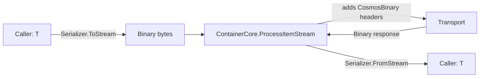
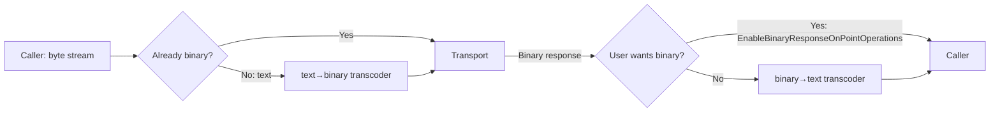
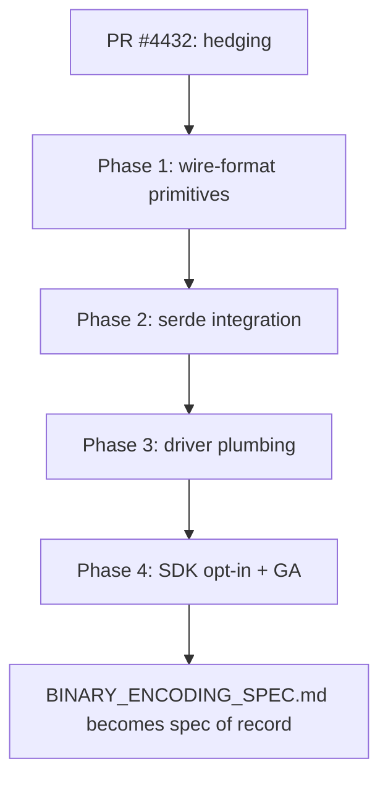

# Binary Encoding for Cosmos DB Rust Driver — Planning & Implementation Details

**Status:** Planning · Not yet implemented
**Scope:** Cross-cutting design proposal for adding Cosmos JSON-Binary wire-format support to `azure_data_cosmos_driver` and `azure_data_cosmos`.
**Reference implementation:** [.NET PR #4652 — "Binary Encoding: Adds Binary Encoding Support for Point Operations"](https://github.com/Azure/azure-cosmos-dotnet-v3/pull/4652) (merged 2024-10-23, +2,821 / -1,066).
**Authoritative wire-format spec:** `Microsoft.Azure.Cosmos.Json.JsonBinaryEncoding` namespace in the .NET SDK source tree.

> ⚠️ **This is a planning document, not a spec.** It captures the architectural shape and phased rollout. A separate `BINARY_ENCODING_SPEC.md` should be written during Phase 2 once the on-the-wire format details are locked into Rust code (system-string table, type-marker table, length-prefix encoding).

---

## 1. TL;DR

The .NET PR ships **two distinct integration strategies** depending on API shape, and we should mirror that split:

| .NET API surface | What .NET does | What Rust should do |
|---|---|---|
| `Container.CreateItemAsync<T>(...)` (typed) | Refactor `CosmosJsonDotNetSerializer` / `CosmosSystemTextJsonSerializer` to **write binary directly** during `T → bytes` | New `BinaryJsonSerializer` that implements `serde::ser::Serializer` and writes binary; symmetric `BinaryJsonDeserializer` implementing `serde::de::Deserializer` |
| `Container.CreateItemStreamAsync(Stream)` (raw bytes) | If caller's stream is text, run a **text→binary transcoder** at the edge before sending | New `text_to_binary(&[u8]) → Vec<u8>` and `binary_to_text(&[u8]) → Vec<u8>` transcoders |

**Key Rust-side observation:** The SDK does not yet expose a stream API surface. Only the **typed path** matters for v1. The transcoder is still needed because:

- `container_client.rs::query_items` already holds JSON bytes (`serde_json::to_vec(&query)?`), and the same pattern appears for `execute_transactional_batch` and `patch_item`.
- The in-memory emulator (`in_memory_emulator/operations.rs`) needs to accept binary requests so feature tests remain meaningful without a live account.
- Custom user-supplied serializers (a future SDK extension point) will produce text bytes and need transcoding.

**Read-path detection:** Binary-encoded responses are unambiguously distinguishable from text responses by the first byte — JSON text always starts in printable ASCII (`0x20–0x7E`), Cosmos JSON-Binary uses the magic byte `0x80` (version marker). The `ResponseBody::into_single::<T>` / `into_items::<T>` entry points sniff this byte and dispatch accordingly. **Callers never see the format.**

---

## 2. Background — what the .NET PR ships

### 2.1 Opt-in surface

A new environment variable `AZURE_COSMOS_BINARY_ENCODING_ENABLED` controls feature activation:

- Truthy value (`true` / `1` / case-insensitive) → enabled by default for every operation.
- Per-operation override via `ItemRequestOptions.EnableBinaryResponseOnPointOperations` (currently only honored by the stream APIs).

When enabled, the SDK adds **two request headers**:

```text
x-ms-cosmos-supported-serialization-formats: CosmosBinary
x-ms-documentdb-content-serialization-format:  CosmosBinary
```

The backend accepts a binary-encoded request body and responds in binary on the response body. The motivation is to **reduce backend storage cost (COGS)** — Cosmos's storage layer stores documents in binary internally, so accepting and returning them in binary avoids server-side transcoding.

### 2.2 Scope (mirrors what we must support)

| In scope | Out of scope | Rationale for out-of-scope |
|---|---|---|
| `CreateItem` / `CreateItemStream` | `PatchItem` | Backend support pending |
| `ReadItem` / `ReadItemStream` | `TransactionalBatch` | Backend support pending |
| `UpsertItem` / `UpsertItemStream` | `Bulk` APIs | Backend support pending |
| `ReplaceItem` / `ReplaceItemStream` | Queries | Backend support pending |
| `DeleteItem` / `DeleteItemStream` | | |

**Phase-1 scope in Rust** matches: 5 point ops × typed `T` path. Stream surface deferred until the SDK adds one.

### 2.3 .NET flow diagrams (paraphrased)

**Typed `ItemAsync<T>` path:**



**Stream `ItemStreamAsync` path:**



### 2.4 On-the-wire format

The format is defined by the static class `JsonBinaryEncoding` in the .NET source. Key properties for our planning:

- **Single-byte `TypeMarker` per token** identifies the type and (for variable-length tokens) the length-prefix width. Examples (table is large — exact bytes locked during Phase 1):
  - `0xC0` = Null, `0xC1` = False, `0xC2` = True
  - `0xC8` = Int8, `0xC9` = Int16, `0xCA` = Int32, `0xCB` = Int64
  - `0xCD` = Float32, `0xCE` = Float64
  - `0x80..=0xBF` = String with embedded short length
  - `0xD0..=0xDF` = String with 1/2/4-byte length prefix
  - `0xE0..=0xEF` = Array with 1/2/4-byte length prefix
  - `0xF0..=0xFF` = Object with 1/2/4-byte length prefix
- **System-string references** — a small pre-shared dictionary of common Cosmos JSON keys (`"_etag"`, `"id"`, `"_ts"`, `"_rid"`, `"_self"`, `"_attachments"`, etc.) is referenced by single-byte markers. Typical compression: ~30% off common Cosmos document payloads.
- **User-string references** — strings repeated within a single document are deduplicated to a single in-buffer copy plus offset references.
- **Magic-byte prefix** `0x80` at offset 0 identifies the buffer as binary-encoded (used by our format-sniffing dispatch).

---

## 3. Current Rust ser/de surface — where the work lands

Traced via `git grep` against the workspace at branch `main` (HEAD as of 2026-06-04):

| File | Role | Sites that need to know about format |
|---|---|---|
| `azure_data_cosmos/src/clients/container_client.rs` | The 5 point ops live here; each calls `serde_json::to_vec(&item)?` to build the request body | **`create_item`** (L302), **`replace_item`** (L400), **`upsert_item`** (L608); `read_item` (L662) / `delete_item` (L714) carry no body |
| `azure_data_cosmos/src/models/item_response.rs` | `ItemResponse::into_model::<T>` delegates to `CosmosResponse::into_model::<T>` | Single deser entry — read path |
| `azure_data_cosmos/src/models/response_body.rs` | `ResponseBody::into_single::<T>` / `into_items::<T>` — SDK wrapper | Delegates to driver |
| `azure_data_cosmos_driver/src/models/response_body.rs` (L127–170) | **The single `serde_json::from_slice` site for the typed `into_single` / `into_items` path** | This is where format-sniffing dispatches |
| `azure_data_cosmos_driver/src/driver/pipeline/operation_pipeline.rs` | Sets request headers (incl. `Content-Type`) on every request | New site: opt-in `CosmosBinary` headers when binary enabled |
| `azure_data_cosmos_driver/src/in_memory_emulator/operations.rs` | Pure-Rust local emulator parses request bodies with `serde_json::from_slice` | **Must learn to read binary requests** for in-memory tests to remain meaningful without a live account |

**Observation:** The driver layer is body-format-agnostic on the **request** side — it just passes `Vec<u8>` to the transport. The format-aware sites are concentrated at:

1. **SDK → driver request boundary** (`container_client.rs` write sites).
2. **Driver-internal deserialization** (`response_body.rs`).
3. **In-memory emulator** (request body parsing).

This is a clean boundary and
 means the diff stays scoped. The transport pipeline, retry evaluation, partition routing, and PPCB all remain format-agnostic.

---

## 4. Architectural plan — three layers + SDK opt-in

### 4.1 Layer 1: cosmos_json_binary sub-module (new) — wire-format primitives

**Location:** `sdk/cosmos/azure_data_cosmos_driver/src/json_binary/`

**Why in the driver crate, not the SDK?** The transcoder and binary↔text helpers are used by **both** the SDK (typed path) and the driver (in-memory emulator, future query plan, future binary-feed responses), and the driver crate is already a trust-boundary leaf. Putting it in zure_data_cosmos would force the driver to take a dependency on the SDK — wrong direction per the Cosmos AGENTS architecture rules.

**Files:**

````````````````````
json_binary/
├── mod.rs                  // re-exports + module-level docs (spec link to .NET source)
├── type_marker.rs          // the TypeMarker byte table (const fns, no_std-friendly)
├── reader.rs               // BinaryJsonReader<'a> over &'a [u8] — token-stream
├── writer.rs               // BinaryJsonWriter — pushes tokens into Vec<u8>
├── transcode.rs            // text_to_binary(&[u8]) -> Vec<u8>, binary_to_text(...) -> Vec<u8>
├── serde_deser.rs          // BinaryDeserializer — implements serde::de::Deserializer<'de>
├── serde_ser.rs            // BinarySerializer — implements serde::ser::Serializer
├── system_strings.rs       // The static SystemString dictionary
└── tests/                  // round-trip tests + .NET fixture parity tests
````````````````````

**Key types (sketch):**

````````````````````
ust
// type_marker.rs
#[derive(Copy, Clone, PartialEq, Eq)]
#[repr(u8)]
pub(crate) enum TypeMarker {
    Null = 0xC0,
    False = 0xC1,
    True = 0xC2,
    Int8 = 0xC8,
    Int16 = 0xC9,
    Int32 = 0xCA,
    Int64 = 0xCB,
    Float32 = 0xCD,
    Float64 = 0xCE,
    // ... full table mirrors .NET enum exactly
}

impl TypeMarker {
    pub fn from_byte(b: u8) -> Self { /* ... */ }
    pub fn is_string(self) -> bool { /* ... */ }
    pub fn is_array(self) -> bool { /* ... */ }
    pub fn is_object(self) -> bool { /* ... */ }
}

// reader.rs
pub struct BinaryJsonReader<'a> {
    buf: &'a [u8],
    pos: usize,
    user_string_table: Option<&'a UserStringTable<'a>>,
}

impl<'a> BinaryJsonReader<'a> {
    pub fn new(buf: &'a [u8]) -> Result<Self, BinaryJsonError> {
        // verifies magic byte 0x80 at pos 0
    }
    pub fn peek_marker(&self) -> Result<TypeMarker, BinaryJsonError>;
    pub fn read_null(&mut self) -> Result<(), BinaryJsonError>;
    pub fn read_bool(&mut self) -> Result<bool, BinaryJsonError>;
    pub fn read_i64(&mut self) -> Result<i64, BinaryJsonError>;
    pub fn read_f64(&mut self) -> Result<f64, BinaryJsonError>;
    pub fn read_str(&mut self) -> Result<Cow<'a, str>, BinaryJsonError>;
    pub fn enter_array(&mut self) -> Result<ArrayHandle, BinaryJsonError>;
    pub fn enter_object(&mut self) -> Result<ObjectHandle, BinaryJsonError>;
    // ... etc
}

// serde_deser.rs — the load-bearing piece
pub struct BinaryDeserializer<'a, 'b> {
    reader: &'b mut BinaryJsonReader<'a>,
}

impl<'de, 'a: 'de, 'b> serde::de::Deserializer<'de> for &'b mut BinaryDeserializer<'a, 'b> {
    type Error = BinaryJsonError;
    // The 30-odd serde methods, all routed through reader.peek_marker().
    // Implements deserialize_any by dispatching on the marker.
    // Critical: deserialize_str / deserialize_string use Cow<'a, str> from reader
    //          so zero-copy works when the binary payload doesn't compress the
    //          string (most user-defined strings).
}
````````````````````

**Why hand-rolled and not via serde_json::Value?** Two reasons:

1. **Performance** — the whole point of binary encoding is to avoid inary → serde_json::Value → T. We want inary → T direct, same as serde_json::from_slice::<T> is 	ext → T direct. Going through Value would defeat the gain.
2. **Zero-copy strings** — user-string-table-referenced strings can be borrowed from the input slice with no allocation. serde_json::Value::String always allocates an owned String.

**API stability commitment:** Phase 1 ships these types as `pub(crate)`. They become `pub` only when (a) the wire format is locked, (b) zure_data_cosmos is ready to consume them via re-export, and (c) the driver-crate SemVer-stability bar (driver-public API) is acceptable. Until then, the only public surface is the format-sniffing dispatch in ResponseBody and the env-var/options plumbing.

### 4.2 Layer 2: format-sniffing dispatch in ResponseBody

Modify `azure_data_cosmos_driver/src/models/response_body.rs`:

````````````````````
ust
pub fn into_single<T: DeserializeOwned>(self) -> crate::error::Result<T> {
    let bytes = self.single()?;
    match BodyFormat::sniff(&bytes) {
        BodyFormat::JsonText => serde_json::from_slice(&bytes).map_err(text_deser_err),
        BodyFormat::JsonBinary => {
            let mut reader = json_binary::BinaryJsonReader::new(&bytes)
                .map_err(binary_init_err)?;
            let mut de = json_binary::BinaryDeserializer::new(&mut reader);
            T::deserialize(&mut de).map_err(binary_deser_err)
        }
    }
}
````````````````````

`BodyFormat::sniff` inspects the first byte:

- JSON text first bytes: `{`, `[`, `"`, digit, `t`, `f`, `n`, or ASCII whitespace — all in `0x09..=0x7D`.
- JSON binary magic byte: `0x80`.

Unambiguous because **every valid JSON text first byte is below 0x80**. Empty bodies are handled by `single()` before `sniff` is reached.

The symmetric `into_items` follows the same shape — sniff each item buffer independently because feed responses can theoretically mix formats per-item (in practice they won't, but defensiveness costs nothing).

### 4.3 Layer 3: opt-in plumbing

**4.3.1 Env-var parsing** — `azure_data_cosmos_driver/src/options/env_parsing.rs` already has the `parse_*_from_env` pattern (used for `AZURE_COSMOS_HEDGING_DISABLED` in PR #4432). Add:

````````````````````
ust
pub(crate) fn parse_binary_encoding_enabled_from_env() -> bool {
    parse_truthy_env_var("AZURE_COSMOS_BINARY_ENCODING_ENABLED")
}
````````````````````

Use the same `1` / `true` / `yes` / `on` predicate the hedging kill switch uses (per Copilot's review feedback on PR #4432 — "any truthy value").

**4.3.2 `DriverOptions::binary_encoding_enabled: bool`** with `with_binary_encoding(enabled)` builder method.

**4.3.3 Per-operation override** — `OperationOptions::binary_encoding: Option<bool>` so callers can opt in/out per op. Resolved in the standard precedence chain (the same shape used for `AvailabilityStrategy`):

1. Operation-level (`OperationOptions::binary_encoding`)
2. Client-level (`DriverOptions::binary_encoding_enabled`)
3. Environment variable (`AZURE_COSMOS_BINARY_ENCODING_ENABLED`)
4. Default: `false`

**4.3.4 Header emission in `operation_pipeline.rs`** — in the STAGE 3 `build_transport_request` path, when binary encoding resolves to enabled **for an operation type that the backend currently supports** (Create / Read / Upsert / Replace / Delete on Document resource), emit:

````````````````````	ext
x-ms-cosmos-supported-serialization-formats: CosmosBinary
x-ms-documentdb-content-serialization-format:  CosmosBinary
````````````````````

For out-of-scope op types (Patch, Query, Batch, Bulk), the headers are NOT emitted even when binary encoding is enabled — defensive, matches .NET behavior.

**4.3.5 Body transcode at the SDK boundary** — `container_client.rs`'s `create_item` / `upsert_item` / `replace_item`:

````````````````````
ust
let body = if self.context.driver.binary_encoding_enabled_for(&op_options) {
    // Direct typed path — no intermediate text bytes
    cosmos_json_binary::serialize_to_binary(&item)?
} else {
    serde_json::to_vec(&item)?
};
````````````````````

The SDK gains a thin `serialize_to_binary<T: Serialize>(&T) -> Result<Vec<u8>>` helper re-exported from the driver's `json_binary` module.

### 4.4 Layer 4: in-memory emulator transcoding shim

`azure_data_cosmos_driver/src/in_memory_emulator/operations.rs` currently does `serde_json::from_slice::<serde_json::Value>(request_body)` at every handler entry (lines 207, 381, 870, 1296, 1608). Update the helper to **sniff and transcode-to-text before parsing**:

````````````````````
ust
fn parse_request_body_as_value(body: &[u8]) -> Result<serde_json::Value, ApiError> {
    let text_bytes = match BodyFormat::sniff(body) {
        BodyFormat::JsonText => Cow::Borrowed(body),
        BodyFormat::JsonBinary => {
            Cow::Owned(json_binary::binary_to_text(body)?)
        }
    };
    serde_json::from_slice(&text_bytes).map_err(/* ... */)
}
````````````````````

The emulator stays **text-internal** (the in-memory store, the response builder, the operation handlers all keep using `serde_json::Value`), but it now **accepts** binary requests. Response bodies the emulator produces stay text — clients with binary encoding enabled will receive text responses from the emulator, which the format-sniffing dispatch handles correctly.

This keeps the existing 1,800+ emulator tests as the source of truth without requiring us to teach every handler the new format. **Important invariant for the v1 cut.**

---

## 5. Phased rollout — proposed commit/PR layout

Each phase ships as a separate PR with its own validation gates (`cargo fmt` → `cargo build` → `cargo clippy --tests --all-features` → `cargo doc --no-deps --all-features` → lib tests → integration tests).

### Phase 1 (foundation) — separate PR

1. `cosmos_json_binary` module: `TypeMarker`, `BinaryJsonReader`, `BinaryJsonWriter`, `transcode.rs`.
2. **No serde integration yet.**
3. Lots of byte-level round-trip tests against fixtures dumped from the .NET implementation.
4. `system_strings.rs` — the dictionary table. Audit against the .NET source for parity.

**Goal:** Lock the wire-format reader/writer in isolation. No public API changes outside the new module.

**Diff estimate:** ~1,500–2,500 LoC (mostly TypeMarker table + reader/writer + tests).

### Phase 2 (serde) — separate PR

1. `BinaryDeserializer` implementing `serde::de::Deserializer`. Tests against `T = serde_json::Value`, `T = #[derive(Deserialize)] struct`, edge cases (`i64` boundary, `f64` NaN/Inf, deeply nested arrays, missing fields, unknown fields).
2. `BinarySerializer` implementing `serde::ser::Serializer`. Round-trip tests:
   - `T → binary → T`
   - `T → text → binary → T`
   - `T → binary → text → T`
3. `serialize_to_binary<T>` + `deserialize_from_binary<T>` helpers.

**Goal:** A complete serde integration over the Layer-1 primitives. Still no plumbing into the operation pipeline.

**Diff estimate:** ~800–1,200 LoC.

### Phase 3 (driver plumbing) — separate PR

1. `ResponseBody::into_single` / `into_items` format-sniffing dispatch.
2. `DriverOptions::binary_encoding_enabled` + env-var parser + per-op override.
3. Header emission in `operation_pipeline.rs` for in-scope op types.
4. In-memory emulator transcoding shim.

**Goal:** The driver can now send binary requests, receive binary responses, and the emulator interops correctly. SDK is still text-only.

**Diff estimate:** ~400–600 LoC.

### Phase 4 (SDK opt-in) — separate PR

1. `container_client.rs` typed point-op write sites switch to `serialize_to_binary` when enabled.
2. End-to-end live-account tests with binary encoding on/off (parameterized harness, similar to `DriverTestClient::run_with_unique_db_and_hedging` introduced in PR #4432).
3. Documentation: write `BINARY_ENCODING_SPEC.md` (the spec-of-record companion to this planning doc).
4. Public API: `CosmosClientBuilder::with_binary_encoding(enabled)` setter.
5. CHANGELOG entries in both `azure_data_cosmos` and `azure_data_cosmos_driver`.

**Goal:** Feature complete and user-facing.

**Diff estimate:** ~300–500 LoC.

---

## 5.5 Detailed implementation plan — commit-by-commit

This section expands §5's high-level PR groupings into commit-sized work items. Each commit must be independently reviewable, ship its own validation gates green (`fmt` → `build` → `clippy` → `doc` → tests), and not regress any pre-existing test. **Commits within a phase land in the same PR**; phases land as separate PRs against `main`.

> **Hard prerequisite:** PR #4432 (hedging) must merge to `main` before Phase 1 starts. The binary-encoding work touches `operation_pipeline.rs` (header emission), `response_body.rs` (sniffing dispatch), and `env_parsing.rs` (env-var parser) — all three are in active flux on the hedging branch. Sequencing avoids cross-PR conflict noise that would dwarf the actual review surface.

### Phase 1 — Wire-format primitives (foundation)

**Branch name:** `users/<alias>/cosmos_json_binary_phase1_wire_format`
**Target merge:** PR against `main`
**Phase exit criteria:** `cargo test -p azure_data_cosmos_driver --all-features --lib cosmos_json_binary::` is green with ≥95% coverage; all .NET fixture round-trips pass byte-for-byte; no public API surface added outside the new `pub(crate)` module.

| # | Commit | Files touched | LoC est. | Notes |
|---|---|---|---|---|
| 1.1 | `feat(cosmos/json-binary): module scaffold + TypeMarker table` | `json_binary/mod.rs`, `json_binary/type_marker.rs`, `lib.rs` (mod decl) | ~250 | Defines `TypeMarker` enum (full byte table from .NET source), classification helpers (`is_string`, `is_array`, `is_object`, `is_number`, `length_kind`). No reader/writer yet — pure data. Unit tests assert every byte value 0x00–0xFF maps to a defined `TypeMarker` (or `Reserved`). |
| 1.2 | `feat(cosmos/json-binary): static SystemString dictionary` | `json_binary/system_strings.rs`, `json_binary/tests/system_strings.txt` | ~400 | The static dictionary table (`"_etag"`, `"id"`, `"_ts"`, etc.). Frozen snapshot of the .NET source committed as `tests/system_strings.txt`; CI fails if the in-code table drifts from the snapshot. `lookup_by_index(u8) -> Option<&'static str>` and `lookup_by_str(&str) -> Option<u8>` API. |
| 1.3 | `feat(cosmos/json-binary): BinaryJsonReader (token stream)` | `json_binary/reader.rs`, `json_binary/error.rs` | ~600 | Single-pass reader over `&'a [u8]`. Methods: `new` (verifies magic byte 0x80), `peek_marker`, `read_null`/`read_bool`/`read_i64`/`read_f64`, `read_str` returning `Cow<'a, str>`, `enter_array` / `enter_object` returning bounded handles, `skip_value`. `BinaryJsonError` enum: `UnexpectedEof`, `InvalidMarker(u8)`, `Utf8Error`, `LengthOverflow`, `SystemStringOutOfRange`. Tests: primitives + nested arrays + nested objects, fuzzed inputs reject cleanly. |
| 1.4 | `feat(cosmos/json-binary): BinaryJsonWriter (token sink)` | `json_binary/writer.rs` | ~500 | Pushes tokens into a caller-owned `Vec<u8>` (or any `impl io::Write`). Methods: `write_null`, `write_bool`, `write_i64` (auto-picks Int8/16/32/64), `write_f64`, `write_str` (auto-picks short / 1B / 2B / 4B length-prefix), `begin_array` / `end_array`, `begin_object` / `end_object` (writes length prefix retroactively). System-string lookup integrated: short strings matching dictionary write 1-byte ref. User-string dedup deferred to Phase 1.6. |
| 1.5 | `feat(cosmos/json-binary): transcode helpers` | `json_binary/transcode.rs` | ~250 | `text_to_binary(&[u8]) -> Result<Vec<u8>, BinaryJsonError>` parses with `serde_json` and emits via `BinaryJsonWriter`. `binary_to_text(&[u8]) -> Result<Vec<u8>, BinaryJsonError>` reads via `BinaryJsonReader` and emits via `serde_json::to_writer`. Both round-trip tested. |
| 1.6 | `feat(cosmos/json-binary): user-string deduplication` | `json_binary/writer.rs`, `json_binary/reader.rs` | ~350 | Writer maintains a per-document hash-table of strings; second occurrence emits an offset reference. Reader follows offsets. Locks in the on-the-wire format for typical Cosmos documents (where `partitionKey` / `id` etc. recur). Tests verify byte-for-byte parity with .NET-generated fixtures. |
| 1.7 | `test(cosmos/json-binary): .NET fixture parity suite` | `json_binary/tests/fixtures/*.bin`, `json_binary/tests/parity.rs` | ~150 + fixture bytes | A set of ≥20 `.bin` files dumped from the .NET implementation covering: empty object, all primitives, nested arrays, system-string-heavy docs, user-string-heavy docs, deep nesting (32 levels), large array (1024 elements), Unicode strings, signed/unsigned int boundaries, special floats. Test asserts `binary_to_text` produces JSON that `serde_json` parses identically to the .NET-produced text equivalent. |
| 1.8 | `docs(cosmos/json-binary): module-level documentation` | `json_binary/mod.rs` | ~100 | Module-level rustdoc with the format invariants, reference to the planning doc, and `#[cfg(doctest)]`-gated examples. Per Cosmos AGENTS rules: no spec references in doc comments — invariants stated directly. |

**Phase 1 total:** ~2,600 LoC including tests + fixtures. **8 commits.**

### Phase 2 — Serde integration

**Branch name:** `users/<alias>/cosmos_json_binary_phase2_serde`
**Depends on:** Phase 1 merged.
**Phase exit criteria:** `BinaryDeserializer` passes the standard `serde` deserializer conformance suite (manually adapted); `BinarySerializer` round-trips with `T = serde_json::Value` and a hand-rolled `#[derive(Serialize, Deserialize)]` struct fixture; zero-copy borrowing verified for `Cow<'a, str>` deserialization on system-string and user-string references.

| # | Commit | Files touched | LoC est. | Notes |
|---|---|---|---|---|
| 2.1 | `feat(cosmos/json-binary): BinaryDeserializer primitives` | `json_binary/serde_deser.rs`, `json_binary/serde_deser/error.rs` | ~400 | Implements `serde::de::Deserializer<'de>` for `&mut BinaryDeserializer<'a, 'b>` where `'a: 'de`. Covers `deserialize_bool`/`i8`–`i64`/`u8`–`u64`/`f32`/`f64`/`str`/`string`/`bytes`/`option`/`unit`/`identifier`. Uses `Cow::Borrowed` for zero-copy strings from the input slice. |
| 2.2 | `feat(cosmos/json-binary): BinaryDeserializer compounds` | `json_binary/serde_deser.rs` | ~350 | `deserialize_seq` (via `SeqAccess` impl), `deserialize_map` (via `MapAccess` impl), `deserialize_struct`, `deserialize_enum` (externally/internally/adjacently tagged). Handles missing fields, unknown fields (`deny_unknown_fields` respected), and `#[serde(flatten)]`. |
| 2.3 | `feat(cosmos/json-binary): deserialize_any dispatch` | `json_binary/serde_deser.rs` | ~150 | `deserialize_any` reads the marker and dispatches to the appropriate typed deserialize method. Required for `T = serde_json::Value` and any `#[serde(untagged)]` enum. Tests against `Value` round-trip parity with `serde_json`. |
| 2.4 | `feat(cosmos/json-binary): BinarySerializer primitives` | `json_binary/serde_ser.rs`, `json_binary/serde_ser/error.rs` | ~350 | Implements `serde::ser::Serializer` writing to an internal `BinaryJsonWriter`. Methods for all primitive types, `serialize_str`, `serialize_bytes`, `serialize_none`, `serialize_some`, `serialize_unit`. |
| 2.5 | `feat(cosmos/json-binary): BinarySerializer compounds` | `json_binary/serde_ser.rs` | ~300 | `serialize_seq`/`tuple`/`tuple_struct`/`tuple_variant`/`map`/`struct`/`struct_variant`. Length-prefix back-patching uses the same shape as `BinaryJsonWriter::end_array`/`end_object`. |
| 2.6 | `feat(cosmos/json-binary): public convenience helpers` | `json_binary/mod.rs` | ~100 | `pub(crate) fn serialize_to_binary<T: Serialize>(value: &T) -> Result<Vec<u8>, BinaryJsonError>` and `pub(crate) fn deserialize_from_binary<'a, T: Deserialize<'a>>(bytes: &'a [u8]) -> Result<T, BinaryJsonError>`. These are what the SDK and `ResponseBody` call. |
| 2.7 | `test(cosmos/json-binary): serde round-trip suite` | `json_binary/tests/serde_roundtrip.rs` | ~350 | For each of: `serde_json::Value` (the universal canonical), a hand-rolled `Product { id, price, tags: Vec<String>, meta: HashMap<String, Value> }`, an `enum` with externally/internally/adjacently tagged variants, edge cases (NaN/Inf — must error, since Cosmos JSON does not accept them on the wire; i64 boundaries; empty arrays/objects; deeply nested). Round-trips assert `T → binary → T == T` and `T → text → binary → T == T → text → T`. |
| 2.8 | `bench(cosmos/json-binary): perf parity vs serde_json` | `azure_data_cosmos_benchmarks/benches/json_binary.rs` | ~200 | Criterion benchmark comparing `serde_json::to_vec` vs `serialize_to_binary` and `from_slice` vs `deserialize_from_binary` for representative document shapes. Goal: serializer ≤ 1.2x slower (binary writes more bytes for length prefixes); deserializer ≤ 1.5x faster on Cosmos-typical docs (system-string dictionary wins). Numbers committed as comment in the bench file for tracking. |

**Phase 2 total:** ~2,200 LoC. **8 commits.**

### Phase 3 — Driver plumbing

**Branch name:** `users/<alias>/cosmos_json_binary_phase3_driver_plumbing`
**Depends on:** Phase 2 merged.
**Phase exit criteria:** All pre-existing driver tests (1,803 lib + integration) pass with `AZURE_COSMOS_BINARY_ENCODING_ENABLED=1` set; in-memory emulator accepts binary requests transparently; no behavior change for the default (binary-disabled) path.

| # | Commit | Files touched | LoC est. | Notes |
|---|---|---|---|---|
| 3.1 | `feat(cosmos/driver): BodyFormat sniffing dispatch` | `models/response_body.rs`, `models/body_format.rs` (new) | ~150 | `BodyFormat::sniff(&[u8]) -> BodyFormat { JsonText, JsonBinary }` per §4.2. `ResponseBody::into_single` / `into_items` dispatch based on sniff result. Unit tests with hand-crafted byte fixtures + a property test that `serde_json::Value → text → sniff == JsonText` and `→ binary → sniff == JsonBinary` for arbitrary `Value`s. |
| 3.2 | `feat(cosmos/options): binary encoding env var + driver options` | `options/env_parsing.rs`, `options/driver_options.rs` | ~120 | `parse_binary_encoding_enabled_from_env()` mirroring the `parse_hedging_disabled_from_env_with` truthy-value predicate from PR #4432 (`1`/`true`/`yes`/`on`, case-insensitive). `DriverOptions::binary_encoding_enabled: bool` + `DriverOptionsBuilder::with_binary_encoding(enabled)`. Default `false`. Unit tests. |
| 3.3 | `feat(cosmos/options): per-operation binary encoding override` | `options/operation_options.rs`, `models/operation_options_view.rs` | ~100 | `OperationOptions::binary_encoding: Option<bool>` + `OperationOptionsView::binary_encoding_enabled(driver_default, env_default) -> bool` implementing the precedence chain from §4.3.3 (operation → client → env → default). Unit tests for each precedence case. |
| 3.4 | `feat(cosmos/pipeline): emit CosmosBinary headers when enabled` | `driver/pipeline/operation_pipeline.rs`, `models/cosmos_headers.rs` (constants) | ~100 | Two new constants: `SUPPORTED_SERIALIZATION_FORMATS` and `CONTENT_SERIALIZATION_FORMAT` header names, `COSMOS_BINARY` value. In `build_transport_request`'s STAGE 3 path: when binary encoding is resolved-enabled AND `operation.operation_type()` is one of `CreateItem`/`ReadItem`/`UpsertItem`/`ReplaceItem`/`DeleteItem` AND `operation.resource_type() == ResourceType::Document`, emit both headers. Out-of-scope op types never emit. Unit tests cover the gating matrix. |
| 3.5 | `feat(cosmos/emulator): binary request body transcoding shim` | `in_memory_emulator/operations.rs` (5 sites: lines 207, 381, 870, 1296, 1608), `in_memory_emulator/body_parse.rs` (new helper) | ~150 | Single `parse_request_body_as_value(body: &[u8]) -> Result<Value, ApiError>` helper that sniffs and transcodes-to-text before `serde_json::from_slice::<Value>`. All 5 call sites updated. Emulator response bodies stay text — the client's format-sniffing dispatch handles the mixed case. Existing emulator tests must pass without modification (text-only requests still work). |
| 3.6 | `test(cosmos/emulator): binary request acceptance` | `tests/in_memory_emulator_tests/binary_encoding.rs` (new) | ~250 | Parameterized test harness: for each of Create/Read/Upsert/Replace/Delete, send the request body in binary, assert the emulator responds successfully and the body the emulator stored matches the canonical text representation. Asserts the gating: Query/Patch/Batch with binary-encoding-enabled options must NOT emit the headers (verified via header inspection on a fault-injected transport that records every outgoing request). |
| 3.7 | `docs(cosmos/driver): binary encoding rustdoc` | `options/driver_options.rs`, `options/operation_options.rs`, `models/body_format.rs` | ~100 | API rustdoc explaining the precedence chain, the in-scope operation set, the env-var name, and a runnable example showing how to enable it. Per Cosmos AGENTS rules: every public item gets purpose / example / errors / partition-key notes (where applicable). |

**Phase 3 total:** ~970 LoC. **7 commits.**

### Phase 4 — SDK opt-in & user-facing API

**Branch name:** `users/<alias>/cosmos_json_binary_phase4_sdk_optin`
**Depends on:** Phase 3 merged.
**Phase exit criteria:** Round-trip live-account test passes against a real Cosmos account with binary encoding both on and off; `CHANGELOG.md` updated in both crates; docs/API reference render cleanly; no breaking change to the `azure_data_cosmos` public API (binary encoding is opt-in additive).

| # | Commit | Files touched | LoC est. | Notes |
|---|---|---|---|---|
| 4.1 | `feat(cosmos/sdk): binary encoding builder + options surface` | `clients/cosmos_client_builder.rs`, `options/cosmos_client_options.rs`, `options/operation_options.rs` (SDK side) | ~150 | `CosmosClientBuilder::with_binary_encoding(enabled: bool)` setter forwarding to `DriverOptions::with_binary_encoding`. `OperationOptions::with_binary_encoding(enabled: bool)` per-op override. Identical precedence as the driver layer. |
| 4.2 | `feat(cosmos/sdk): typed point-op write sites use binary serialize` | `clients/container_client.rs` (3 sites: `create_item` L302, `replace_item` L400, `upsert_item` L608) | ~80 | Each `serde_json::to_vec(&item)?` replaced with `if binary_enabled { cosmos_json_binary::serialize_to_binary(&item)? } else { serde_json::to_vec(&item)? }`. `read_item` and `delete_item` carry no body — unchanged. Unit tests for the gating. |
| 4.3 | `feat(cosmos/sdk): diagnostics record body format` | `models/diagnostics_context.rs`, `driver/pipeline/operation_pipeline.rs` | ~120 | Per-request diagnostic entries gain a `body_format: BodyFormat` field (request side and response side independently — they can differ, e.g. binary request but text response from a non-upgraded backend region). Exposed via `DiagnosticsContext::request_body_format()` / `response_body_format()` accessors for "why is my workload not seeing COGS savings?" investigations (per §6 risk R3 + open question 5). |
| 4.4 | `test(cosmos/sdk): end-to-end binary encoding live-account suite` | `tests/binary_encoding.rs` (new), `tests/framework/test_client.rs` (extension) | ~400 | Parameterized harness — `DriverTestClient::run_with_unique_db_and_binary_encoding(enabled, async fn)` modeled on the `run_with_unique_db_and_hedging` pattern from PR #4432. For each of the 5 point ops, run with binary on and off; assert (a) success, (b) diagnostics record the correct format, (c) round-trip of a `serde_json::Value` and a typed `Product` struct yields byte-identical data. |
| 4.5 | `docs(cosmos/sdk): BINARY_ENCODING_SPEC.md` | `docs/BINARY_ENCODING_SPEC.md` (new) | ~600 | The spec-of-record companion to this planning doc. Contents: wire-format invariants (frozen), TypeMarker table, system-string dictionary (with the parity-test reference), precedence chain, opt-in headers, supported operation matrix, troubleshooting (R3 fallback behavior, R4 emulator interop). Once this doc exists, the present planning doc transitions to a planning-history record. |
| 4.6 | `chore(cosmos): CHANGELOG entries for binary encoding GA` | `azure_data_cosmos/CHANGELOG.md`, `azure_data_cosmos_driver/CHANGELOG.md` | ~50 | One entry per crate under "Features Added", referencing the public-API additions (builder method, op-options method, env var) and the env-var opt-in. Per the Cosmos changelog instruction file (`cosmos.changelog.instructions.md`). |
| 4.7 | `docs(cosmos/sdk): public-API rustdoc + runnable examples` | `clients/cosmos_client_builder.rs`, `clients/container_client.rs`, `lib.rs` (top-level docs) | ~150 | Every new public item: purpose / example / errors / partition-key notes per the Cosmos AGENTS Documentation rules. Runnable doctest showing the env-var path, the builder path, and the per-op-override path. |

**Phase 4 total:** ~1,550 LoC. **7 commits.**

### Cross-phase summary

| Phase | Commits | LoC est. | Public API added | Risk |
|---|---|---|---|---|
| 1 | 8 | ~2,600 | None (all `pub(crate)`) | Low — pure additive, no integration points touched |
| 2 | 8 | ~2,200 | None (still `pub(crate)`) | Medium — serde conformance is subtle; round-trip suite is the safety net |
| 3 | 7 | ~970 | `DriverOptions::with_binary_encoding`, `OperationOptions::binary_encoding`, env var | Medium — pipeline header emission must not regress existing tests; in-memory emulator shim is the easiest place to introduce subtle bugs |
| 4 | 7 | ~1,550 | `CosmosClientBuilder::with_binary_encoding`, `OperationOptions::with_binary_encoding` (SDK), `DiagnosticsContext::*_body_format` | Low–Medium — user-facing surface, but additive; the live-account test suite is the integration safety net |
| **Total** | **30** | **~7,320** | 5 new public methods + 1 env var | |

**Realistic calendar estimate** (1 senior eng full-time, 2-week sprints, code-review turnaround included):

- Phase 1: 3 weeks (the wire-format parity bar is the slow part)
- Phase 2: 2 weeks
- Phase 3: 1.5 weeks
- Phase 4: 2 weeks (live-account test setup + docs)
- **Total: ~8.5 weeks** with no scope creep, no backend-version-skew surprises (R3), no spec drift mid-flight (R1).

### Sequencing dependencies (visual)



Phases must land in strict order — each phase's tests depend on the previous phase's API. No parallelization possible within this work, but other Cosmos work (query, change feed, partition key cache) can proceed independently against the same `main`.

---

## 6. Known unknowns and risks

| # | Risk | Mitigation |
|---|---|---|
| R1 | **System-string table drift** — the .NET dictionary may change between SDK versions. A mismatch would silently corrupt round-tripped documents. | Phase 1 includes a parity test that compares the Rust table to a frozen snapshot of the .NET source. CI must fail on dictionary drift. |
| R2 | **Floating-point edge cases** — `serde_json::Value` rejects NaN/Inf; binary encoding represents them. | Phase 2 tests must cover NaN/Inf/-0.0/subnormals explicitly. Document the asymmetry. |
| R3 | **Backend version skew** — some backend regions may not yet accept `CosmosBinary`. | Catch HTTP 400 with sub-status indicating "unsupported serialization format" and fall back to text on the next attempt. Treat as a per-account capability, cache the decision. |
| R4 | **In-memory emulator divergence** — the transcoder shim is the only place the emulator differs from production. If transcoder bugs surface only in production traffic, emulator tests won't catch them. | Phase 1 includes a fuzz test that does `text → binary → text` and `binary → text → binary` round-trips on randomly generated JSON values. Run as part of CI. |
| R5 | **PR #4432 (hedging) merge conflicts** — the hedging implementation is in active review on the same branch. Binary encoding work should NOT start until that lands. | Sequence: hedging merges → main → branch off main for binary encoding. |
| R6 | **Custom user serializers** — the .NET PR notes that custom serializers "may or may not" output binary. The Rust SDK does not yet have a custom-serializer extension point. | Out of scope for v1. When the extension point is added, the SDK must transcode if the custom serializer returns text bytes with binary encoding enabled. |
| R7 | **#[non_exhaustive] on BodyFormat** — adding a third format in the future would force a major version bump if BodyFormat is ever exposed publicly. | Keep `BodyFormat` `pub(crate)` forever. Only the dispatch behavior is public. |

---

## 7. Open questions to resolve before Phase 1 starts

1. **Naming.** `cosmos_json_binary` vs `json_binary` vs `binary_encoding`? Lean toward `cosmos_json_binary` because (a) it's specific, (b) it leaves room for hypothetical "raw Cosmos binary" formats that aren't JSON-isomorphic.
2. **Should the transcoder lift into zure_data_cosmos as a public utility?** Probably yes once stable — apps that maintain their own bytes (e.g., change-feed processors) may want it. Defer to Phase 4.
3. **Streaming API.** Should we plan a stream-shaped SDK surface (`create_item_bytes(...)`) alongside the typed one? .NET has both. Decision deferred until v1 ships; tracked separately.
4. **Per-region capability cache.** Do we treat binary-encoding support as a per-account or per-region property? .NET treats it as account-wide. Mirror unless we see evidence of region skew.
5. **Diagnostics.** Should the diagnostics context record which format was used for a given request/response? Useful for "why is my workload not seeing COGS savings?" investigations. Probably yes — add a `body_format: BodyFormat` field on per-request diagnostic entries during Phase 3.

---

## 8. References

- **.NET PR #4652** — [Binary Encoding: Adds Binary Encoding Support for Point Operations](https://github.com/Azure/azure-cosmos-dotnet-v3/pull/4652). The reference implementation.
- **.NET source** — `Microsoft.Azure.Cosmos.Json.JsonBinaryEncoding` namespace. Authoritative wire-format spec.
- **Cosmos AGENTS instructions** — `sdk/cosmos/AGENTS.md`. Architecture rules (driver/SDK split, no model sharing, validation gates).
- **PR #4432 (Cross-region hedging)** — pattern source for env-var parsing, opt-in plumbing, per-op override precedence, in-memory emulator interop.

---

## 9. Document status

- **Created:** 2026-06-04
- **Authors:** dkunda (initial plan), drafted with assistance from the .NET PR analysis.
- **Next revision trigger:** Phase 1 implementation starts → spin off `BINARY_ENCODING_SPEC.md` for the locked wire-format details and keep this doc as the planning-history record.
