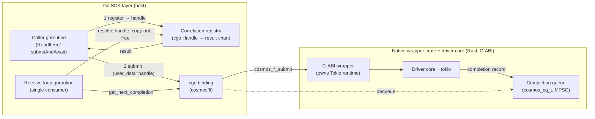
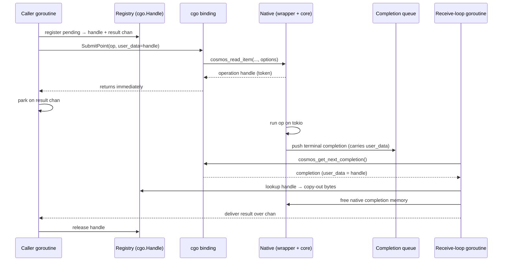

# Go SDK ↔ native async FFI: completion correlation & data transfer

**Source of truth:** Both this document and the Go POC implementation are
derived from the C-ABI spec, `NATIVE_WRAPPER_SPEC.md`
([spec PR #4461](https://github.com/Azure/azure-sdk-for-rust/pull/4461)). Where
this doc describes ABI-level behavior (completion model, ownership, cancellation
semantics), the spec is authoritative and supersedes anything here if the two
drift. The Rust *implementation*
([impl PR #4515](https://github.com/Azure/azure-sdk-for-rust/pull/4515)) does not
yet implement every part of the spec — see §6 for where the two currently differ
— so the Go layer is written against the spec, not the current state of the
implementation.

**Scope.** This document covers only the FFI-linking layer: how completions are
correlated back to the right Go caller and how response bytes cross into Go.
Things missing from this document — and coming as we keep working on these POCs —
are support for other operations (e.g. queries/feeds) and the linking and
propagation of AAD credentials and telemetry/diagnostics across the boundary.

**How to read this.** §1–§7 are the spec: what we decided and what we're
building. The appendices carry the supporting rationale — the Go GC/FFI
background (A), the option-by-option analysis and .NET contrast (B), the full
benchmark and live-validation detail (C), and the criteria for revisiting the
shelved `Pinner` option (D). Skip them unless you want the "why".

---

## 1. Decisions

The Go SDK has to solve two *independent* problems at the FFI boundary, and the
choice for each is separable:

| Axis | Question | Decision | One-line rationale |
| --- | --- | --- | --- |
| **Correlation** | a completion comes back from Rust — which parked caller does it belong to? | **`runtime/cgo.Handle`** (runtime-owned handle table) | runtime-blessed, liveness-aware, loud (panic) failure mode, full `-race`/`checkptr` coverage, no `unsafe` in our code |
| **Data transfer** | how do Rust's response bytes get into Go? | **copy-out** (Rust owns the buffer; Go copies into Go memory, then frees the native buffer) | matches the spec's `take_response`/`bytes_free` ownership model; nothing native escapes the receive loop |

Supporting points:

- **`map` (a `sync.Map` ticket table) stays available** as the pure-Go / no-cgo
  fallback (`cgo.Handle` needs `CGO_ENABLED=1` and falls back to `map`
  automatically) and as the simplest reference implementation.
- **`runtime.Pinner` (raw-pointer correlation) is opt-in only**, behind
  `WithRegistry(RegistryPin)` / `COSMOS_REGISTRY=pin`. It is a *measured
  micro-optimization* whose only real win (fewer bytes on the correlator) is
  swamped by the response copy we must do anyway, and it costs us the race
  detector on the hot path. It is **shelved, not rejected** — re-entry criteria
  are in Appendix D.

**Why this is a safety/tooling decision, not a performance one:** every
completion in the system is drained serially by a single receive-loop goroutine,
and each dispatch (a registry lookup, a kilobyte-scale response copy, a few
frees, a channel send) costs *microseconds* — against an operation whose floor is
a ~1–2 ms network round trip. The part of that cost that differs between `map`,
`cgo.Handle`, and `Pinner` is *nanoseconds*. So the correlator choice is
invisible end-to-end (evidence in §5), and we optimize for safety and tooling
coverage instead. The decisive tie-breaker is the failure mode if the contract
the design leans on ever breaks (§3.3): `cgo.Handle` fails *loud and contained*,
`Pinner` fails *silent* (use-after-free).

---

## 2. The async FFI model

| Layer | Name used in this doc | Role |
| --- | --- | --- |
| Rust driver core (`azure_data_cosmos_driver`) | **driver core** | the Cosmos client: pipeline, retries, transport. Honors a `deadline`, takes no cancellation token. |
| Rust C-ABI crate (`azure_data_cosmos_driver_native`) | **native wrapper crate** | owns the Tokio runtime, exposes the C ABI (`cosmos_*_submit`, completion queues), implements cancellation. This is what the spec calls "the wrapper". |
| Our Go binding (`azcosmos` / `cosmosffi`) | **Go SDK layer** | calls the C ABI, runs the receive loop, maps results to Go. The subject of *this* document. |

When the spec (or this doc) says work happens "in the wrapper", it means the
**native wrapper crate (Rust/FFI)** — *not* the Go SDK layer.

Every network operation is **asynchronous and non-blocking at the FFI boundary**:

1. The Go SDK layer calls `cosmos_*_submit(...)`, which returns *immediately* with
   a lightweight in-flight handle — **not** the result.
2. It passes an opaque `void *user_data` into the submit call. The native wrapper
   crate **never dereferences it**; it stores the value verbatim and round-trips
   it back on the completion (spec §3.3). This is our correlation hook.
3. The driver core runs the operation on the wrapper's Tokio runtime. When it
   finishes, the wrapper enqueues a **completion record** on a caller-owned
   **completion queue** (`cosmos_cq_t`).
4. The Go SDK layer runs a single **receive-loop** goroutine that waits on the
   queue, dequeues completions, reads the `user_data` back, maps the result into
   Go, frees the native records, and wakes the waiting caller.

In Go terms: a caller goroutine calls `ReadItem`, registers itself, submits, and
parks on a channel. The receive loop later resolves that channel. The caller is
*blocked with no live Go reference to itself* during the network round trip —
that is the crux of the correlation problem (Appendix A explains why that makes
the waiter look like garbage to the GC).

The native contract guarantees **exactly one terminal completion per submit**
(`OK | ERROR | CANCELLED`) — even a cancelled op produces a completion record.
That guarantee is what makes lifetime management tractable; it is also the single
assumption the whole design leans on (§3.3).

### 2.1 Architecture at a glance

The component view shows which Go pieces touch the FFI boundary. Only the **cgo
binding** and the **receive loop** ever cross it; callers never do.

The per-operation happy path (one `ReadItem`): submit returns a token
immediately, and a later completion on the queue is what wakes the parked caller.

These diagrams show the happy path only. Cancellation and deadline behavior (and
their current limitations) are covered in §6.

---

## 3. Correlation: options and decision

### 3.1 The three options at a glance

All three implement the same interface (`register / resolve / unregister /
live`) and are selectable at runtime, so the POC compares them in the *same*
client machinery. (What each one actually is, mechanically, is in Appendix B.)

| | `sync.Map` (map) | **`cgo.Handle` (chosen)** | `Pinner` (pin) |
| --- | --- | --- | --- |
| Who owns the table | us | the Go runtime | nobody (raw address) |
| Lookup on completion | yes (our map) | yes (runtime table) | **no** (direct cast) |
| `unsafe` / `//go:nocheckptr` | no | no | **yes** |
| Race detector on hot path | full | full | **forfeited** |
| Liveness-aware | yes (safe-miss) | yes | **no** |
| Weak-ref design possible | n/a | via Delete semantics | **no** |
| Failure mode if exactly-once breaks | benign no-op | **deterministic panic** | **silent use-after-free** |
| Build constraint | any | needs `CGO_ENABLED=1` (falls back to map) | pure Go |

`cgo.Handle` is the closest analog to .NET's `GCHandle`: table-backed,
liveness-aware, and it panics deterministically on misuse. Under the hood it
*is* a `sync.Map` (Go 1.24 stdlib), so the "lookup" we pay is the same cheap
`sync.Map.Load` the map option uses — just owned and disciplined by the runtime.
We chose it over `map` for that runtime ownership and over `Pinner` for the
failure mode below.

### 3.2 Data does not flow through the correlator

A note that removes the usual reason teams reach for raw-pointer correlation:
the response bytes do **not** ride on the correlation token. Regardless of
correlation choice, the receive loop copies the response into Go memory anyway
(§4). So the only thing `Pinner` shaves is the correlator's own footprint
(~56 B → ~16 B), which is noise next to that mandatory copy. The GC-pressure
argument that is pin's entire reason to exist collapses once you account for the
copy you're already doing.

### 3.3 The safety hinge: exactly-once

All three options are correct *as long as* each token is consumed exactly once
(resolve **xor** unregister). The native contract promises this (§2). The graded
question is what happens if a misbehaving native core ever violates it — a
duplicate, a late completion after cancel, a completion for an op we already tore
down. We cannot fully prevent this from Go; it is the Rust core's contract. What
differs is the blast radius:

- **map** → safe no-op. The bad token simply isn't found.
- **`cgo.Handle`** → deterministic **panic** (`misuse of cgo.Handle`) — loud,
  reproducible, points at the bug, and **contained**: the receive loop recovers
  per-completion panics, so a bad token fails just that op rather than crashing
  the process.
- **`Pinner`** → **silent use-after-free**: a raw address cast to memory that may
  have been reclaimed and reused. Non-deterministic corruption, worst blast
  radius, no stack trace, and the race detector that would have caught a
  discipline regression is gone.

This is the core reason to default to `cgo.Handle`: not that pin is buggy today
(it is verified correct, Appendix C), but that its *worst case* is the nightmare
class while the alternatives' worst case is benign or loud.

---

## 4. Data transfer: copy-out

On completion, the receive loop maps the native response into Go and frees the
native records before waking the caller. The response body is copied into
Go-owned memory (`C.GoBytes` in the real binding), after which the native buffer
is freed (`cosmos_bytes_free`). The returned `ItemResponse` borrows nothing
native and is safe to retain forever.

The alternative — pin a Go buffer and have Rust write the response straight into
it (zero-copy) — is rejected for the same reasons as pin correlation (§3.3), plus
extra cgo-rule friction, and for a decisive additional reason: **you must copy
the response into Go memory anyway for safety**, so the copy is a per-operation,
kilobyte-scale allocation that happens on every op regardless. There is no
zero-copy win to be had without giving the caller a buffer whose lifetime is tied
to native memory — exactly what we are avoiding.

---

## 5. Evidence

All numbers are POC measurements (Intel i7-13800H). The fake-backend benchmarks
isolate the *machinery* (network removed, so the SDK path is the only thing being
timed); the live run confirms the same correctness holds end-to-end over the real
network and under deliberate throttling. Full methodology and the complete
tables are in Appendix C — the summary here is the load-bearing part.

**The correlator choice is invisible end-to-end.** Driving 16,000 concurrent
write+read ops through the full client path with simulated latency 0 — the most
hostile possible setting for showing a registry difference, since there is no
network cost to hide behind — all three registries land in the same band
(≈108–151 ms total, i.e. ≈8 µs/op), and the spread is run-to-run GC variance, not
a registry signal. Per-op dispatch is microseconds; the part that differs between
registries is nanoseconds (Appendix C.1). Put the ~1–2 ms network round trip back
in and that gap disappears entirely. End-to-end throughput is **consumer-bound**
(one receive loop drains serially), so the correlation choice is not a latency or
throughput decision.

**Correct and leak-free under real load.** Against a live Azure Cosmos DB
container provisioned at 50,000 RU/s, an upsert workload ramped 512 → 4096
concurrent workers stayed correct and leak-free at every level — in-flight count
returned to zero after each, no hangs, no queue-full rejections, no crashes —
while RU consumption was pushed *past* the provisioned budget and throttling
(429s) ramped into the thousands, each surfacing as a typed retry-after error and
freeing its handle like any other terminal completion.

| concurrency | ops/s | peak RU/s | p50 | p99 | throttled (429) |
| --- | --- | --- | --- | --- | --- |
| 512 | 3,795 | 37,562 | 112 ms | 1,107 ms | 0 |
| 1024 | 6,010 | 61,531 | 111 ms | 1,351 ms | 1 |
| 2048 | 5,367 | 54,282 | 127 ms | 5,006 ms | 286 |
| 4096 | 5,903 | 57,970 | 247 ms | 6,122 ms | 1,178 |

Beyond ~1024 workers ops/s plateaus around 5–6k and tail latency balloons — but
that ceiling is **RU throttling on the service side**, not the single receive
loop running out of capacity. The live data therefore reinforces the
consumer-bound argument rather than contradicting it: the bottleneck is the
network/RU budget, and the correlation choice is nowhere near it.

**Correctness was also graded under the race detector** (`-race`, cgo enabled)
across integrity, cancellation, and teardown phases: all three registries pass,
in-flight count returns to zero, zero race/`checkptr` reports — *after* applying
`//go:nocheckptr` to the pin resume path. That pin *needs* that opt-out while map
and handle are checkptr-clean is itself a recorded finding (detail in Appendix C).

---

## 6. Known limitations / open issues

- **Cancellation is memory-safe, but cooperative and not a wire-level abort.**
  Cancellation is implemented in the **native wrapper crate (Rust/FFI)**, *not*
  the driver core and *not* the Go SDK layer (spec §3.6.3). The driver core takes
  no cancellation token — it only honors a `deadline` — so the wrapper runs the
  driver future inside a `tokio::select!` against a per-op `Notify`; our Go
  `handle.Cancel()` (on `ctx.Done()`) signals it, and the wrapper drops the
  future and synthesizes a `CANCELLED` completion. Consequences:
  - **Memory lifecycle is always correct on our side** — we still await the one
    terminal completion and free exactly once.
  - **It is not a protocol-level cancel.** Dropping the `reqwest` future closes
    the TCP connection but sends no cancel to the gateway, which may still execute
    the request server-side. For **writes, a cancelled op may still apply** —
    idempotency considerations match the normal retry path.
  - **Granularity is "drop at the next await point"**, not instantaneous.
  - **Cancel-vs-completion race:** if the op resolves first you get the natural
    `OK`/`ERROR` and `was_cancel_requested` returns `true`; we currently collapse
    `CANCELLED → context.Canceled` and do not yet surface that flag.
  - **No diagnostics on a cancelled completion** — the partial diagnostics context
    is dropped with the future.
  - **This piece is not waiting only on us.** Our half is done (the ABI exposes
    `cosmos_operation_handle_cancel`, we call it on `ctx.Done()` and await the
    terminal completion). The substance that remains lives **Rust-side**: the
    wrapper finishing the `select!`/`Notify`/future-drop path (the current impl
    surfaces `was_cancel_requested` but tends to let the op run to natural
    completion), and — for anything better than future-drop — the driver core
    gaining a `CancellationToken`. It is also lower urgency than the deadline item
    below: a propagated deadline guarantees an op *terminates* (the leak-prevention
    property), whereas cancellation only makes that termination *prompter*.

- **Operation deadlines are not yet enforced SDK-side (open).** What keeps a hung
  op from parking its waiter forever is that every op eventually *terminates* —
  and today that is only *emergent*. We verified all three layers: the Go layer
  passes no per-op options and **does not propagate the caller's `context`
  deadline** into the native op (it uses ctx only to trigger a cancel, which the
  current Rust impl does not act on); the ABI exposes a per-op
  `end_to_end_timeout_ms` but leaves it unset by default; and the driver core
  applies **no default end-to-end deadline** (it is `None` unless a latency policy
  is set, and the enforcement check is a no-op when `None`). An op is therefore
  bounded only by per-attempt transport timeouts (~6 s) × a finite retry budget.
  The fix is functional, not observational: **translate the caller's `context`
  deadline to `end_to_end_timeout_ms`, and impose a sane default when the caller
  passes none (`context.Background()`)** — so the single value that ought to bound
  the operation everywhere (driver enforcement → clean `CLIENT_OPERATION_TIMEOUT`,
  Go-side await, cancellation gating) actually does, instead of being dropped.
  This is the real backstop against a hung-op leak.

- **Single-consumer throughput ceiling (by design).** One receive-loop goroutine
  serially drains the queue, so completion-*processing* throughput is bounded by
  one core running `dispatch`. In practice this is far from the wall (`dispatch`
  is microseconds vs a ~1–2 ms round trip), which is exactly why the correlator
  choice doesn't move end-to-end throughput. If a single queue's drain ever *does*
  become the bottleneck, the native queue is multi-producer/single-consumer by
  design and the spec supports **one queue per consumer thread**, so the lever is
  to **scale consumers horizontally (N queues, N receive loops)**, not to change
  the correlator. Not built: the POC hardcodes one queue + one loop; scaling later
  means choosing how to shard submissions (round-robin / per-CPU).

- **No backpressure / unbounded in-flight (open).** The Go layer submits as fast
  as callers call; nothing caps concurrent in-flight ops. Each costs a parked
  goroutine + a registry entry + an eventual completion record, so a sustained
  caller-outruns-drain or backend-slowdown grows memory unbounded. Mitigation
  (not yet implemented): a semaphore bounding max in-flight, exposed as a client
  knob.

- **Observability for in-flight/aged handles (open).** A silent leak is *rare by
  construction* — the exactly-once contract (§3.3) resolves every waiter via its
  one terminal completion, and the verification-first way we are building this
  layer is what keeps it that way. Observability here is not because we expect
  leaks, but because §3.3 is a contract we **cannot prove from Go**, so the
  responsible move is to make it *monitorable*. `Outstanding()` is today only a
  test hook; production would want an in-flight gauge, the **age of the oldest
  in-flight op** (the real leak-vs-load discriminator), and terminal-outcome
  counters — where a non-zero **recovered-panic** count is direct proof the §3.3
  contract was violated. Not yet wired; a natural consumer of the deferred
  telemetry surface.

---

## 7. Next steps

1. Decide whether to bound in-flight ops (backpressure semaphore) and add handle
   observability before any non-fake backend handles real load (§6).
2. Propagate the caller's `context` deadline to `end_to_end_timeout_ms` with a
   sane default — the highest-value functional fix on the Go side (§6).
3. Keep the pluggable-registry seam and the `-race` load harness in the tree so
   the pin decision stays measurable if Appendix D's criteria ever trigger.
4. The real `cosmos_native` binding is wired behind the `cosmosffi` build tag and
   **validated against a live account** (§5); remaining live work is breadth, not
   proof — exercise read/mixed workloads and the opt-in pin path over the network,
   and add a transient-retry policy so sporadic server 5xx responses are retried
   rather than surfaced raw.

---

# Appendices (background & rationale)

The material below is the supporting "why" behind §1–§7. None of it is required
to understand the decisions; it is here so the considerations are on record.

## Appendix A. Primer: GC, FFI, and why this is subtle in Go

Background for reviewers who don't live in Go's memory model.

### A.1 Roots and why a parked waiter looks like garbage

A garbage collector frees anything it cannot reach from a **root** (a stack
variable, a global, etc.). When a caller submits an op and parks, the only thing
"holding" its waiter object is **Rust** — and neither Go's nor .NET's GC scans
memory owned by foreign code. So to both collectors, a waiter that only native
code references looks unreachable, i.e. collectible. The core problem on the
correlation axis is: *keep this object alive and recoverable even though only
foreign code holds a reference to it, then get it back when the completion lands.*

### A.2 Strong vs weak references

- A **strong** reference keeps the object alive: as long as one exists, the GC
  will not collect the object.
- A **weak** reference does *not* keep it alive: if nothing else holds it
  strongly, the GC may collect it, and the weak reference then reads as "gone"
  (null) instead of dangling.

The relevance: a design where the SDK holds a **strong** ref (so the object lives
as long as the SDK cares) and Rust is given a **weak** ref (so a late completion
for an abandoned op safely reads null instead of corrupting memory) is attractive
for robustness. As we'll see, .NET expresses this directly with one handle type.
Go gained a `weak` package in Go 1.24 (`weak.Pointer[T]`), so the *weak-reference
capability* now exists in the stdlib — but it is a lifetime-observation
primitive, not an FFI bridge: it hands out no stable integer/address to pass
through C, so it does not on its own solve the correlation problem. `Pinner` (the
primitive we'd reach for on the zero-lookup path) is still strong-only and cannot
express it.

### A.3 Go's `runtime.Pinner`

`Pinner` (Go 1.21+) does three things to one object when you `Pin` it:

1. **Roots it** — the GC won't collect it while pinned.
2. **Freezes it in place** — Go's GC is non-moving today, but the language spec
   permits a moving collector in the future; pinning guarantees the address stays
   valid regardless, so you can safely hand out a raw pointer.
3. **Lets you pass it to C** — cgo's pointer-passing rules forbid handing C a Go
   pointer that may be moved or collected during the call; pinning lifts that
   restriction for the pinned object. The other cgo rules still apply — notably you
   still must not pass a pointer to Go memory that itself contains unpinned Go
   pointers.

You then hand Rust the raw address as `user_data`, and on completion cast it
straight back — **no lookup**. `Pinner` is strong-only and binary: an object is
pinned or it is gone. There is no weak mode and no "is this still valid?" query.

### A.4 `checkptr` and `//go:nocheckptr`

Go ships a runtime instrumentation, `checkptr`, that flags dangerous
`unsafe.Pointer` usage — notably converting an integer back to a pointer, which
is exactly the `Pinner` round-trip. `checkptr` is **only compiled in under
`-race` (or `-d=checkptr`)**; a production `go build` never runs it. The pin
round-trip is genuinely valid (the object is pinned, alive, unmoved), but
`checkptr` cannot prove provenance through an integer token, so it
false-positives and crashes the test run. Silencing it requires
`//go:nocheckptr` on the resume function. The cost is not a production hazard —
it is the **loss of race-detector coverage on the hottest path in the SDK**.

### A.5 The .NET contrast: `GCHandle`

.NET ships the single all-in-one primitive Go lacks. `GCHandle.Alloc(obj)` →
`GCHandle.ToIntPtr` hands native code an integer that:

- **roots** the object,
- is a **stable token** that survives even though .NET's GC *moves* objects,
- **translates back** with `GCHandle.FromIntPtr` (no user-side table),
- is **liveness-aware** — after `Free`, dereferencing reads null / throws rather
  than corrupting,
- supports **weak** handles (the strong-SDK / weak-Rust design from A.2),
- all **without giving up any runtime safety tooling**.

It is an index into a runtime-managed table, which is why it knows liveness and
supports weak refs. Go has no *single* equivalent. As of Go 1.24–1.25 the same
capabilities exist, but **split across three separate primitives**: `cgo.Handle`
(root + stable integer token, but a table lookup to translate back),
`runtime.Pinner` (root + stable address, zero-lookup, but `unsafe` and no race
coverage), and `weak.Pointer` (weak refs, new in 1.24). No one of them is the
all-in-one that `GCHandle` is — and that split is exactly what forces the choice
this document is about. (`runtime.AddCleanup`, also new in 1.24, modernizes
finalizers but is orthogonal here.)

## Appendix B. Correlation options in depth

### B.1 What each one actually is

- **map** — our original POC. We keep a `sync.Map` keyed by a monotonic ticket,
  pass the integer as `user_data`, and `LoadAndDelete` on completion. Simple,
  fully safe, **safe-miss** (a completion for an unknown/already-removed ticket
  is a harmless no-op). Cost: a structure every op touches plus a lookup.

- **`cgo.Handle`** — Go's *runtime-blessed* FFI bridge. `cgo.NewHandle(ch)`
  stores the channel in the **runtime's** table and returns an integer; the
  receive loop does `cgo.Handle(token).Value()` then `.Delete()`. **We write no
  map** — the runtime owns the bookkeeping. It is the closest analog to .NET's
  `GCHandle`: table-backed, liveness-aware, and it **panics deterministically**
  on double-delete (a loud, debuggable failure rather than corruption). Under the
  hood it *is* a `sync.Map` (Go 1.24 stdlib: `NewHandle` = atomic counter +
  `Store`, `Value` = `Load`) — so the "lookup" we pay on this path is the same
  cheap `sync.Map.Load` the map option uses, just owned and disciplined by the
  runtime. The lookup cost is invisible against network latency.

- **`Pinner`** — pin the waiter object, hand Rust its raw address as `user_data`,
  and on completion cast the address straight back to the waiter with **no
  lookup**. The zero-lookup path. Its cost is everything in Appendix A.3–A.4:
  `unsafe`, `//go:nocheckptr`, no race coverage, no liveness check, and it cannot
  express a weak-ref design.

### B.2 Why this is harder in Go than in .NET

| | .NET | Go |
| --- | --- | --- |
| Blessed managed-obj→native primitive | `GCHandle` (one API, all modes) | none — split across `cgo.Handle` / `Pinner` / `weak` |
| Zero-lookup round-trip | yes (`FromIntPtr`) | only via `Pinner` + `unsafe` |
| Liveness-aware token | yes | only `cgo.Handle` (table), not `Pinner` |
| Weak-ref capability | yes (`GCHandleType.Weak`) | yes since Go 1.24 (`weak.Pointer`), but it's a lifetime primitive, not an FFI bridge |
| Zero-lookup **and** full tooling in one primitive | yes | **no** — must pick: zero-lookup *or* race/`checkptr` coverage |

.NET gets zero-lookup **and** full safety from one supported API, picking
normal/pinned/weak per need. Go, even at 1.24/1.25, splits those same
capabilities across three primitives, so it forces a choice: `Pinner` gives
.NET's *speed shape* without its *safety net*; `cgo.Handle`/map give the safety
with a lookup — and that lookup is a `sync.Map.Load` (the very structure
`cgo.Handle` is built on). Since the lookup is free relative to the network,
Go's right answer is the safe one — but the reason we had to think about it at
all is that Go has no *single* `GCHandle`-equivalent that delivers zero-lookup
and full safety together.

## Appendix C. Evidence in detail

All numbers are POC measurements (Intel i7-13800H). C.1–C.3 use an in-memory fake
backend so the *machinery* is the bottleneck, not the network; they establish
relative behavior, not production throughput. C.4 reports a run against a **live
Azure Cosmos DB account**.

### C.1 Registry microbenchmark (ns/op · B/op · allocs/op, 3-run avg)

| Benchmark | map | handle | pin |
| --- | --- | --- | --- |
| **Seq** (uncontended) | 157 · 56 · 1 | 176 · 56 · 2 | **134 · 16 · 1** |
| **Churn** (max contention) | 657 · 67 · 2 | 710 · 68 · 2 | **44 · 16 · 1** |
| **SingleConsumer** (real topology) | 752 · 97 · 2 | 776 · 98 · 2 | 824 · 70 · 1 |

Reading: pin is ~15× faster on raw contended registration (Churn) and allocates
less — but in **SingleConsumer**, which mirrors our actual one-receive-loop
topology, all three are within noise (pin is even marginally slower on ns),
because the bottleneck is the single resolver + channel handoff, not the
registry.

### C.2 End-to-end (load harness, 16 000 write+read ops, simulated latency 0)

This is the **aggregate wall-clock to drive a heavy concurrent workload
end-to-end through the full client path** — submit → native queue → single
receive loop → resolve → caller wake — once per registry. What produces the
number:

- **Workload:** 16 worker goroutines × 500 iterations, each iteration doing one
  write and one read = **16 000 operations total**, every one driven through the
  real client path (not a registry microbenchmark).
- **Simulated latency 0:** the in-memory backend completes instantly, on purpose.
  With the network removed, the *only* thing left to time is the SDK machinery —
  registry register/lookup/delete, the response copy-out, the frees, and the
  channel handoff. This is the most hostile possible setting for showing a
  registry difference, because there's no multi-millisecond network cost to hide
  behind.
- **What's timed:** the wall-clock around the *fully-awaited* workload (every
  op's response received and checked) on a fresh client. The same pass also
  records allocation and GC counters and asserts the in-flight count returns to
  zero before and after shutdown.

The figures below are the **total for all 16 000 operations**, not per-op:

| Registry | integrity wall time (all 16 000 ops) |
| --- | --- |
| map | 126–149 ms |
| handle | 142–151 ms |
| pin | 108–114 ms |

The spread (≈108–151 ms) is run-to-run **GC variance**, not a registry signal:
the bands overlap across repeated runs, and the ordering is not stable. The
per-op cost is ≈130 ms ÷ 16 000 ≈ **8 µs/op**; the millisecond figures are just
that microsecond-scale per-op cost summed 16 000 times and drained serially
through one consumer. **End-to-end throughput is consumer-bound, so the
correlation choice is not a latency decision.** The part of that per-op cost that
actually differs between map, handle and pin is *nanoseconds* (C.1); put the
~1–2 ms network round trip back in and that gap disappears entirely beneath it.

### C.3 Correctness / lifecycle verification (race detector)

The **same workload** is also run for each registry under Go's race detector
(with cgo enabled, so the handle registry is exercised and any pointer/lifetime
misuse is caught), graded for correctness across three phases rather than timed:

- **integrity** — the C.2 16 000-op workload, but each op carries a unique item
  id echoed in the response body; asserts every completion routed to the *right*
  waiter (no cross-talk).
- **cancellation** — 3 000 ops racing random context deadlines against op
  latency; asserts cancelled ops still release their entry.
- **teardown** — 1 500 in-flight ops + a concurrent shutdown; asserts clean
  shutdown with no leftover entries, with a hang detector.

**Result: all three registries PASS all three phases, the in-flight count returns
to zero (no leaks), zero race/checkptr reports** — *after* applying
`//go:nocheckptr` to the pin resume path. That pin *needs* that opt-out, while
map and handle are checkptr-clean, is itself a recorded finding.

Two real bugs this verification surfaced and we fixed:

1. Pin fataled under the race detector on the `uintptr → *waiter` cast → required
   `//go:nocheckptr`.
2. A close-time submit rejection surfaced a raw native status code instead of a
   clean "client closed" error; now translated, because the closing state is set
   before shutdown begins.

### C.4 Live-backend validation (real Azure Cosmos DB, throttling on purpose)

This run drives the **real native binding against a live Azure Cosmos DB
container** to confirm the async FFI pipeline stays correct and leak-free over
the actual network, and to watch it behave when the workload deliberately exceeds
provisioned throughput.

Setup: one warm client on the default **handle** registry; a single container
provisioned at **50,000 RU/s**; an upsert workload where each operation uses a
unique item id (also the partition key) so writes fan out across partitions;
256-byte documents. Concurrency is ramped 512 → 1024 → 2048 → 4096 workers, each
level issuing operations back-to-back for a fixed window. After every level the
harness waits for all in-flight operations to settle and asserts the in-flight
count has returned to zero.

| concurrency | ops/s | peak RU/s | p50 | p99 | max | throttled (429) |
| --- | --- | --- | --- | --- | --- | --- |
| 512 | 3,795 | 37,562 | 112 ms | 1,107 ms | 1,240 ms | 0 |
| 1024 | 6,010 | 61,531 | 111 ms | 1,351 ms | 4,386 ms | 1 |
| 2048 | 5,367 | 54,282 | 127 ms | 5,006 ms | 5,841 ms | 286 |
| 4096 | 5,903 | 57,970 | 247 ms | 6,122 ms | 6,363 ms | 1,178 |

What it establishes:

- **Correct and leak-free under real load.** Across every level — up to **4096
  concurrent operations**, sustained throttling, and RU consumption pushed past
  the provisioned 50,000 RU/s — the in-flight count returned to **zero after each
  level**, with no hangs, no queue-full rejections, and no crashes. The
  `cgo.Handle` correlator routed every completion to its waiter under saturation.
- **Throttling is handled cleanly.** As concurrency climbs past what the container
  will serve, the gateway returns HTTP 429s in growing numbers (1 → 286 →
  1,178); each surfaces as a typed, retry-after-bearing error and frees its handle
  like any other terminal completion. No corruption, no leak on the throttled
  path.
- **The wall is the backend, not the drain.** Beyond ~1024 workers the container
  is saturated: ops/s plateaus around 5–6k and p99/max latency balloons into
  multiple seconds. That ceiling is **RU throttling on the service side** — not
  the single receive loop running out of capacity (per-op dispatch is
  microseconds, C.2). So the live data reinforces rather than contradicts the
  consumer-bound argument: the bottleneck is the network/RU budget, and the
  correlation choice is nowhere near it. The single-consumer ceiling remains a
  real design limit (§6), but this workload never reached it — the backend pushed
  back first.

## Appendix D. Pin as a revisitable optimization

Pin is **not permanently rejected** — it is shelved with explicit re-entry
criteria. We would revisit making it the default (or offering it as a supported
fast path) only if **all** of these hold:

1. **Profiling shows correlator allocation is a real bottleneck** for a concrete
   workload — i.e. GC pressure attributable to the registry (not the response
   copy) shows up in production traces.
2. The **response-copy cost has itself been addressed** (e.g. buffer pooling), so
   that shaving the correlator is no longer dwarfed by it.
3. The **exactly-once contract is hardened** — ideally fuzzed against adversarial
   native behavior (duplicate / late / post-teardown completions) so that pin's
   silent-corruption worst case is demonstrably unreachable.
4. We accept (and document) the **loss of race-detector coverage** on the resume
   path, or find a way to retain it.

Until then, pin earns its keep only as a measured comparison point.
