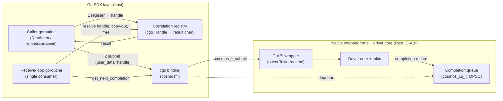
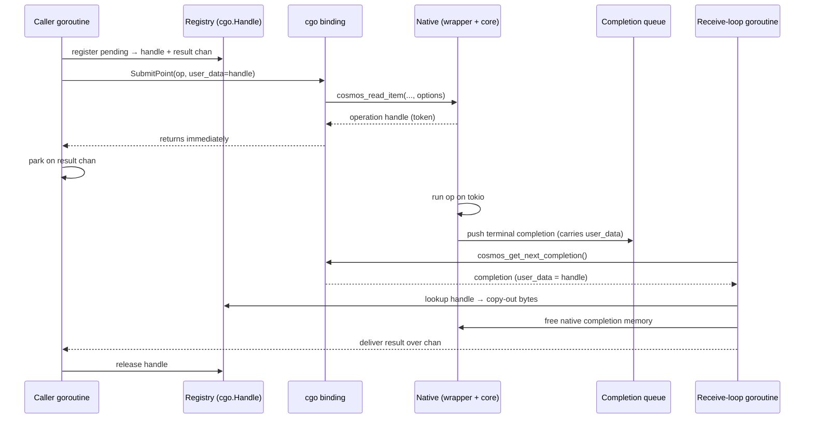

# Go SDK ↔ native async FFI: completion correlation & data transfer

**Source of truth:** Both this document and the Go POC implementation are
derived from the C-ABI spec, `NATIVE_WRAPPER_SPEC.md`
([spec PR #4461](https://github.com/Azure/azure-sdk-for-rust/pull/4461)). Where
this doc describes ABI-level behavior (completion model, ownership, cancellation
semantics), the spec is authoritative and supersedes anything here if the two
drift. The Rust *implementation*
([impl PR #4515](https://github.com/Azure/azure-sdk-for-rust/pull/4515)) does not
yet implement every part of the spec — see §6 for where the two currently differ
— so the Go layer is written against the spec, not the current state of the
implementation.

**Scope.** This document covers only the FFI-linking layer: how completions are
correlated back to the right Go caller and how response bytes cross into Go.
Out of scope for now (coming as the POCs continue): other operations (queries /
feeds), and the linking and propagation of AAD credentials and
telemetry/diagnostics across the boundary.

---

## 1. Decisions

The Go SDK has to solve two *independent* problems at the FFI boundary; the
choice for each is separable:

| Axis | Question | Decision |
| --- | --- | --- |
| **Correlation** | a completion comes back from Rust — which parked caller does it belong to? | **`runtime/cgo.Handle`** (the Go runtime's own handle table) |
| **Data transfer** | how do Rust's response bytes get into Go? | **copy-out** (Rust owns the buffer; Go copies into Go memory, then frees the native buffer) |

Supporting decisions:

- **`map` (a `sync.Map` ticket table) stays available** as the pure-Go / no-cgo
  fallback — `cgo.Handle` requires `CGO_ENABLED=1` and falls back to `map`
  automatically — and as the simplest reference implementation.
- **`runtime.Pinner` (raw-pointer correlation) is opt-in only**, behind
  `WithRegistry(RegistryPin)` / `COSMOS_REGISTRY=pin`. It is **shelved, not
  rejected**; revisit criteria are in §5.

The rest of this document lays out the design these decisions imply (§2–§4), the
justification behind them (§5), and what is deliberately not yet built (§6–§7).

---

## 2. The async FFI model

| Layer | Name used in this doc | Role |
| --- | --- | --- |
| Rust driver core (`azure_data_cosmos_driver`) | **driver core** | the Cosmos client: pipeline, retries, transport. Honors a `deadline`, takes no cancellation token. |
| Rust C-ABI crate (`azure_data_cosmos_driver_native`) | **native wrapper crate** | owns the Tokio runtime, exposes the C ABI (`cosmos_*_submit`, completion queues), implements cancellation. This is what the spec calls "the wrapper". |
| Our Go binding (`azcosmos` / `cosmosffi`) | **Go SDK layer** | calls the C ABI, runs the receive loop, maps results to Go. The subject of *this* document. |

When the spec (or this doc) says work happens "in the wrapper", it means the
**native wrapper crate (Rust/FFI)** — *not* the Go SDK layer.

Every network operation is **asynchronous and non-blocking at the FFI boundary**:

1. The Go SDK layer calls `cosmos_*_submit(...)`, which returns *immediately* with
   a lightweight in-flight handle — **not** the result.
2. It passes an opaque `void *user_data` into the submit call. The native wrapper
   crate **never dereferences it**; it stores the value verbatim and round-trips
   it back on the completion (spec §3.3). This is our correlation hook.
3. The driver core runs the operation on the wrapper's Tokio runtime. When it
   finishes, the wrapper enqueues a **completion record** on a caller-owned
   **completion queue** (`cosmos_cq_t`).
4. The Go SDK layer runs a single **receive-loop** goroutine that waits on the
   queue, dequeues completions, reads the `user_data` back, maps the result into
   Go, frees the native records, and wakes the waiting caller.

In Go terms: a caller goroutine calls `ReadItem`, registers itself, submits, and
parks on a channel; the receive loop later resolves that channel. The caller is
blocked with no live Go reference to itself during the round trip — which is why
correlation needs an explicit, GC-safe handle rather than an ordinary pointer.

The native contract guarantees **exactly one terminal completion per submit**
(`OK | ERROR | CANCELLED`) — even a cancelled op produces a completion record.
That guarantee is what makes lifetime management tractable, and it is the single
assumption the whole design leans on (its failure mode drives the correlation
choice — §5).

### 2.1 Architecture at a glance

The component view shows which Go pieces touch the FFI boundary. Only the **cgo
binding** and the **receive loop** ever cross it; callers never do.

The per-operation happy path (one `ReadItem`): submit returns a token
immediately, and a later completion on the queue is what wakes the parked caller.

These diagrams show the happy path only. Cancellation and deadline behavior (and
their current limitations) are covered in §6.

---

## 3. Correlation: the three options and the choice

All three options implement the same `register / resolve / unregister / live`
interface and are selectable at runtime, so the POC compares them in the *same*
client machinery. We chose **`cgo.Handle`**; the comparison and the reasoning are
below.

| | `sync.Map` (map) | **`cgo.Handle` (chosen)** | `Pinner` (pin) |
| --- | --- | --- | --- |
| Who owns the table | us | the Go runtime | nobody (raw address) |
| Lookup on completion | yes | yes (runtime table) | no (direct address cast) |
| Safety tooling (`-race`) on hot path | full | full | forfeited (requires `unsafe`) |
| Liveness-aware (safe on a stale token) | yes | yes | no |
| Failure mode if the exactly-once contract breaks | benign no-op | **loud panic, contained to one op** | **silent use-after-free** |
| Build constraint | any | `CGO_ENABLED=1` (else falls back to map) | pure Go |

- **`map`** — keep a `sync.Map` keyed by a monotonic ticket, pass the integer as
  `user_data`, `LoadAndDelete` on completion. Simple and fully safe, but the
  table is ours to own and reason about.
- **`cgo.Handle`** — the Go runtime's *blessed* FFI bridge. `cgo.NewHandle(ch)`
  stores the value in the **runtime's** table and returns an integer; the receive
  loop does `Value()` then `Delete()`. We write no map, and it fails loudly
  (deterministic panic) on misuse instead of corrupting. It is effectively a
  runtime-owned, disciplined version of the `map` option.
- **`Pinner`** — pin the waiter and hand Rust its raw address, casting straight
  back on completion with no lookup. Fastest in isolation, but requires `unsafe`,
  forfeits race-detector coverage on the hottest path, and its failure mode is
  silent memory corruption.

We chose `cgo.Handle` over `map` for the runtime-owned bookkeeping and loud
failure mode, and over `Pinner` because — as §5 shows — the speed it buys is
invisible end-to-end while the safety it costs is not.

---

## 4. Data transfer: copy-out

On completion, the receive loop copies the response body into Go-owned memory
(`C.GoBytes` in the real binding) and frees the native buffer
(`cosmos_bytes_free`) before waking the caller. The returned `ItemResponse`
borrows nothing native and is safe to retain forever. This matches the spec's
`take_response` / `bytes_free` ownership model, and nothing native escapes the
receive loop.

The alternative — pin a Go buffer and have Rust write the response straight into
it (zero-copy) — is rejected: you must copy the response into Go memory anyway
for safety, so the copy is a mandatory, per-operation, kilobyte-scale allocation
on every op regardless of correlation choice. There is no zero-copy win to be had
without handing the caller a buffer whose lifetime is tied to native memory,
which is exactly what we are avoiding.

---

## 5. Justification

**The correlation choice is a safety/tooling decision, not a performance one.**
Every completion is drained serially by a single receive-loop goroutine, and each
dispatch (a registry lookup, the mandatory response copy, a few frees, a channel
send) costs *microseconds*, against an operation whose floor is a ~1–2 ms network
round trip. The part of that per-op cost that actually differs between `map`,
`cgo.Handle`, and `Pinner` is *nanoseconds*. So whatever the correlator does, it
is invisible end-to-end — which frees us to optimize for safety and tooling
coverage instead of raw speed.

**The measurements confirm this.** Driving 16,000 concurrent write+read ops
through the full client path with the network removed (simulated latency 0 — the
most hostile possible setting for exposing a registry difference) lands all three
registries in the same ≈110–150 ms band, i.e. ≈8 µs/op; the run-to-run spread is
GC variance, not a registry signal. Isolated microbenchmarks *do* show `Pinner`
faster on contended registration (~15×, and with fewer allocations), but that
advantage evaporates in the real single-consumer topology where the bottleneck is
the one resolver and channel handoff, not the registry.

**The tie-breaker is the failure mode.** All three options are correct *as long
as* each token is consumed exactly once, which the native contract promises but
which we cannot prove from Go. If a misbehaving native core ever violates it (a
duplicate, a late completion after cancel, a completion for a torn-down op),
`map` is a benign no-op, `cgo.Handle` is a loud deterministic panic that the
receive loop recovers per-completion (so one bad token fails just that op, not
the process), and `Pinner` is a silent use-after-free with no stack trace and no
race-detector coverage to have caught the regression. We optimize for the loud,
contained failure over the silent, catastrophic one. (This is also why Go forces
the choice at all: unlike .NET's single `GCHandle` primitive, Go splits
root-the-object, stable-token, and weak-reference across `cgo.Handle`, `Pinner`,
and `weak.Pointer`, so no one primitive gives zero-lookup *and* full safety.)

**It holds up against a live account.** Running the real native binding against a
Cosmos container provisioned at 50,000 RU/s, an upsert workload ramped to 4096
concurrent operations stayed correct and leak-free at every level — in-flight
count returned to zero after each, no hangs, no queue-full rejections, no crashes
— while RU consumption was pushed past the provisioned budget and throttling
(429s) ramped into the thousands, each surfacing as a typed retry-after error and
freeing its handle like any other completion.

| concurrency | ops/s | peak RU/s | p50 | p99 | throttled (429) |
| --- | --- | --- | --- | --- | --- |
| 512 | 3,795 | 37,562 | 112 ms | 1,107 ms | 0 |
| 1024 | 6,010 | 61,531 | 111 ms | 1,351 ms | 1 |
| 2048 | 5,367 | 54,282 | 127 ms | 5,006 ms | 286 |
| 4096 | 5,903 | 57,970 | 247 ms | 6,122 ms | 1,178 |

Beyond ~1024 workers ops/s plateaus around 5–6k and tail latency climbs — but
that ceiling is **RU throttling on the service side**, not the single receive
loop, which reinforces the point above: the bottleneck is the network/RU budget,
and the correlation choice is nowhere near it. Correctness was also graded under
the race detector (`-race`, cgo enabled) across integrity, cancellation, and
teardown phases: all three registries pass with zero leaks and zero
race/`checkptr` reports — `Pinner` only after an `unsafe`-related opt-out that
`map` and `cgo.Handle` don't need.

**Why `Pinner` is shelved rather than removed.** It stays behind an opt-in flag
as a measured comparison point. We would revisit making it a supported fast path
only if *all* of these held: profiling shows correlator allocation is a real
bottleneck for a concrete workload; the mandatory response copy has itself been
addressed (e.g. buffer pooling) so shaving the correlator isn't dwarfed by it;
the exactly-once contract has been hardened (ideally fuzzed against adversarial
native behavior) so the silent-corruption worst case is demonstrably unreachable;
and we explicitly accept the loss of race-detector coverage on that path.

---

## 6. Known limitations / open issues

- **Cancellation is memory-safe, but cooperative and not a wire-level abort.**
  Cancellation is implemented in the **native wrapper crate (Rust/FFI)**, *not*
  the driver core and *not* the Go SDK layer (spec §3.6.3). The driver core takes
  no cancellation token — it only honors a `deadline` — so the wrapper runs the
  driver future inside a `tokio::select!` against a per-op `Notify`; our Go
  `handle.Cancel()` (on `ctx.Done()`) signals it, and the wrapper drops the
  future and synthesizes a `CANCELLED` completion. Consequences:
  - **Memory lifecycle is always correct on our side** — we still await the one
    terminal completion and free exactly once.
  - **It is not a protocol-level cancel.** Dropping the `reqwest` future closes
    the TCP connection but sends no cancel to the gateway, which may still execute
    the request server-side. For **writes, a cancelled op may still apply** —
    idempotency considerations match the normal retry path.
  - **Granularity is "drop at the next await point"**, not instantaneous.
  - **Cancel-vs-completion race:** if the op resolves first you get the natural
    `OK`/`ERROR` and `was_cancel_requested` returns `true`; we currently collapse
    `CANCELLED → context.Canceled` and do not yet surface that flag.
  - **No diagnostics on a cancelled completion** — the partial diagnostics context
    is dropped with the future.
  - **This piece is not waiting only on us.** Our half is done (the ABI exposes
    `cosmos_operation_handle_cancel`, we call it on `ctx.Done()` and await the
    terminal completion). What remains lives **Rust-side**: the wrapper finishing
    the `select!`/`Notify`/future-drop path (the current impl surfaces
    `was_cancel_requested` but tends to let the op run to natural completion), and
    — for anything better than future-drop — the driver core gaining a
    `CancellationToken`. It is lower urgency than the deadline item below: a
    propagated deadline guarantees an op *terminates* (the leak-prevention
    property); cancellation only makes that termination *prompter*.

- **Operation deadlines are not yet enforced SDK-side (open).** What keeps a hung
  op from parking its waiter forever is that every op eventually *terminates* —
  and today that is only *emergent*. All three layers were verified: the Go layer
  passes no per-op options and **does not propagate the caller's `context`
  deadline** into the native op (it uses ctx only to trigger a cancel, which the
  current Rust impl does not act on); the ABI exposes a per-op
  `end_to_end_timeout_ms` but leaves it unset by default; and the driver core
  applies **no default end-to-end deadline**. An op is therefore bounded only by
  per-attempt transport timeouts (~6 s) × a finite retry budget. The fix is
  functional: **translate the caller's `context` deadline to
  `end_to_end_timeout_ms`, and impose a sane default when the caller passes none
  (`context.Background()`)**, so that single value bounds the operation across
  every layer (driver enforcement → clean `CLIENT_OPERATION_TIMEOUT`, the Go-side
  await, and cancellation gating) instead of being dropped. This is the real
  backstop against a hung-op leak.

- **Single-consumer throughput ceiling (by design).** One receive-loop goroutine
  serially drains the queue, so completion-*processing* throughput is bounded by
  one core. In practice that is far from the wall (microseconds of dispatch vs a
  ~1–2 ms round trip), which is exactly why the correlator choice doesn't move
  end-to-end throughput. If a single queue's drain ever *does* become the
  bottleneck, the native queue is multi-producer/single-consumer by design and the
  spec supports **one queue per consumer thread**, so the lever is to scale
  consumers horizontally (N queues, N receive loops), not to change the
  correlator. Not built: the POC hardcodes one queue + one loop.

- **No backpressure / unbounded in-flight (open).** The Go layer submits as fast
  as callers call; nothing caps concurrent in-flight ops. Each costs a parked
  goroutine + a registry entry + an eventual completion record, so a sustained
  caller-outruns-drain or backend slowdown grows memory unbounded. Mitigation
  (not yet implemented): a semaphore bounding max in-flight, exposed as a client
  knob.

- **Observability for in-flight/aged handles (open).** A silent leak is *rare by
  construction* — the exactly-once contract resolves every waiter via its one
  terminal completion, and the verification-first way we are building this layer
  keeps it that way. Observability here is not because we expect leaks, but
  because that contract cannot be proven from Go, so the responsible move is to
  make it *monitorable*: an in-flight gauge, the **age of the oldest in-flight
  op** (the real leak-vs-load discriminator), and terminal-outcome counters
  (where a non-zero recovered-panic count is direct proof the contract was
  violated). Today `Outstanding()` is only a test hook; the rest is not yet wired.

---

## 7. Next steps

1. Decide whether to bound in-flight ops (backpressure semaphore) and add handle
   observability before any non-fake backend handles real load (§6).
2. Propagate the caller's `context` deadline to `end_to_end_timeout_ms` with a
   sane default — the highest-value functional fix on the Go side (§6).
3. Keep the pluggable-registry seam and the `-race` load harness in the tree so
   the `Pinner` decision stays measurable if §5's criteria ever trigger.
4. The real `cosmos_native` binding is wired behind the `cosmosffi` build tag and
   **validated against a live account** (§5); remaining live work is breadth, not
   proof — exercise read/mixed workloads and the opt-in pin path over the network,
   and add a transient-retry policy so sporadic server 5xx responses are retried
   rather than surfaced raw.
