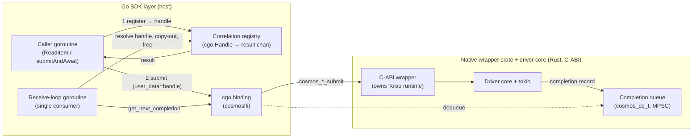
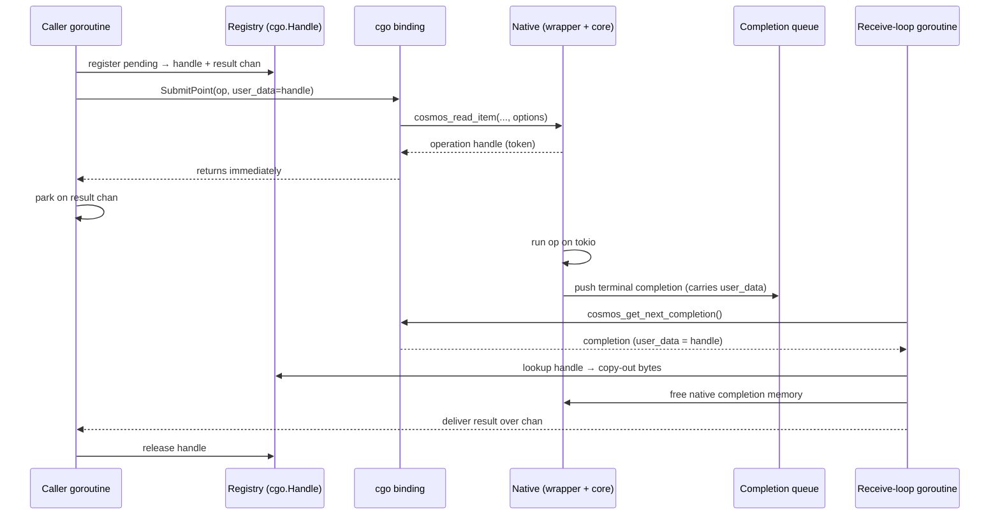

# Go SDK ↔ native async FFI: completion correlation & data transfer

**Source of truth:** Both this document and the Go POC implementation are
derived from the C-ABI spec, `NATIVE_WRAPPER_SPEC.md`
([spec PR #4461](https://github.com/Azure/azure-sdk-for-rust/pull/4461)). Where
this doc describes ABI-level behavior (completion model, ownership, cancellation
semantics), the spec is authoritative and supersedes anything here if the two
drift. Note that the Rust *implementation* ([impl PR #4515](https://github.com/Azure/azure-sdk-for-rust/pull/4515))
does not yet implement every part of the spec — see §11 for where the two
currently differ — so the Go layer is written against the spec, not the current
state of the implementation.

**Scope.** This document covers only the FFI-linking layer: how completions are
correlated back to the right Go caller and how response bytes cross into Go.
Things missing from this document — and coming as we keep working on these POCs —
are support for other operations (e.g. queries/feeds), the linking and
propagation of AAD credentials and telemetry/diagnostics across the boundary, Go SDK public design, among others.

---

## 1. TL;DR

The V2 Go SDK has to solve two *independent* problems at the FFI boundary:

1. **Correlation** — when a completion comes back from Rust, which waiting
   caller does it belong to?
2. **Data transfer** — how do the response bytes Rust produced get into Go?

**Decision:**

- **Correlation → `runtime/cgo.Handle`** (the Go runtime's own handle table).
- **Data transfer → copy-out** (Rust owns the buffer; Go copies the bytes into
  Go-owned memory, then frees the native buffer).
- **`runtime.Pinner` (raw-pointer correlation) is *not* the default.** It is a
  measured micro-optimization whose only real win (fewer bytes on the correlator)
  is swamped by the response copy we must do anyway, and it costs us the race
  detector on the hot path. It is kept behind an opt-in flag and flagged as a
  **revisitable future optimization** (criteria in §10), not permanently rejected.

This combination is safe-by-construction, keeps full Go tooling coverage
(`-race`/`checkptr`), and gives up only sub-microsecond costs against an
operation whose floor is a ~1–2 ms network round trip.

---

## 2. Context: the async FFI model

| Layer | Name used in this doc | Role |
| --- | --- | --- |
| Rust driver core (`azure_data_cosmos_driver`) | **driver core** | the Cosmos client: pipeline, retries, transport. Honors a `deadline`, takes no cancellation token. |
| Rust C-ABI crate (`azure_data_cosmos_driver_native`) | **native wrapper crate** | owns the Tokio runtime, exposes the C ABI (`cosmos_*_submit`, completion queues), implements cancellation. This is what the spec calls "the wrapper". |
| Our Go binding (`azcosmos` / `cosmosffi`) | **Go SDK layer** | calls the C ABI, runs the receive loop, maps results to Go. The subject of *this* document. |

When the spec (or this doc) says work happens "in the wrapper", it means the
**native wrapper crate (Rust/FFI)** — *not* the Go SDK layer.

Every network operation is **asynchronous and non-blocking at the FFI boundary**:

1. The Go SDK layer calls `cosmos_*_submit(...)`. This returns *immediately* with
   a lightweight in-flight handle — **not** the result.
2. It passes an opaque `void *user_data` into the submit call. The native wrapper
   crate **never dereferences it**; it stores the value verbatim and round-trips
   it back on the completion (spec §3.3). This is our correlation hook.
3. The driver core runs the operation on the native wrapper crate's Tokio runtime.
   When it finishes, the wrapper enqueues a **completion record** on a caller-owned
   **completion queue** (`cosmos_cq_t`).
4. The Go SDK layer runs a single **receive-loop** goroutine that waits on the
   queue, dequeues completions, reads the `user_data` back, maps the result into
   Go, frees the native records, and wakes the waiting caller.

In Go terms: a caller goroutine calls `ReadItem`, registers itself, submits, and
parks on a channel. The receive loop later resolves that channel. The caller is
*blocked with no live Go reference to itself* during the network round trip —
that is the crux of both problems below.

```
caller goroutine                 receive-loop goroutine
----------------                 ----------------------
register() -> (token, ch)
submit(req, queue, token)
park on <-ch  .................   queue.WaitBatch()
                                  comp -> token, result
                                  copy bytes out, free native
                                  resolve(token, result) -> ch <- result
wake, return ItemResponse
```

The native contract guarantees **exactly one terminal completion per submit**
(`OK | ERROR | CANCELLED`) — even a cancelled op produces a completion record.
That guarantee is what makes lifetime management tractable; it is also the single
assumption the whole design leans on (see §5.3).

### 2.1 Architecture at a glance

The component view below shows which Go pieces touch the FFI boundary and how
they relate to the native side. Only the **cgo binding** and the **receive loop**
ever cross the boundary; callers never do.



The per-operation happy path (one `ReadItem`) makes the async, token-based flow
explicit — submit returns a token immediately, and a later completion on the
queue is what wakes the parked caller:



These diagrams show the happy path only. Cancellation and deadline behavior
(and their current limitations) are covered in §11.

---

## 3. The two independent axes

The word "pinning" tends to collapse two separate decisions into one. They are
orthogonal, and keeping them apart is what makes the rest of this document
tractable:

| Axis | Question | Options |
| --- | --- | --- |
| **Correlation** | token → which parked waiter? | `sync.Map` ticket · `cgo.Handle` · `Pinner` raw pointer |
| **Data transfer** | Rust's response bytes → Go? | copy-out · zero-copy into a pinned Go buffer |

You can mix any correlation choice with any data choice. This document
recommends `cgo.Handle` (correlation) + copy-out (data), and treats `Pinner` —
on *either* axis — as the opt-in optimization.

---

## 4. Primer: GC, FFI, and why this is subtle in Go

This section is background for reviewers who don't live in Go's memory model. If
you do, skip to §5.

### 4.1 Roots and why a parked waiter looks like garbage

A garbage collector frees anything it cannot reach from a **root** (a stack
variable, a global, etc.). When a caller submits an op and parks, the only thing
"holding" its waiter object is **Rust** — and neither Go's nor .NET's GC scans
memory owned by foreign code. So to both collectors, a waiter that only native
code references looks unreachable, i.e. collectible. The core problem on the
correlation axis is: *keep this object alive and recoverable even though only
foreign code holds a reference to it, then get it back when the completion lands.*

### 4.2 Strong vs weak references

- A **strong** reference keeps the object alive: as long as one exists, the GC
  will not collect the object.
- A **weak** reference does *not* keep it alive: if nothing else holds it
  strongly, the GC may collect it, and the weak reference then reads as "gone"
  (null) instead of dangling.

The relevance: a design where the SDK holds a **strong** ref (so the object lives
as long as the SDK cares) and Rust is given a **weak** ref (so a late completion
for an abandoned op safely reads null instead of corrupting memory) is attractive
for robustness. As we'll see, .NET expresses this directly with one handle type.
Go gained a `weak` package in Go 1.24 (`weak.Pointer[T]`), so the *weak-reference
capability* now exists in the stdlib — but it is a lifetime-observation primitive,
not an FFI bridge: it hands out no stable integer/address to pass through C, so it
does not on its own solve the correlation problem. `Pinner` (the primitive we'd
actually reach for on the zero-lookup path) is still strong-only and cannot
express it.

### 4.3 Go's `runtime.Pinner`

`Pinner` (Go 1.21+) does three things to one object when you `Pin` it:

1. **Roots it** — the GC won't collect it while pinned.
2. **Freezes it in place** — Go's GC can move objects; pinning guarantees the
   address stays valid so you can hand out a raw pointer.
3. **Makes it legal to pass to C** — cgo's pointer-passing rules normally forbid
   handing Go pointers to C; pinned memory is exempt.

You then hand Rust the raw address as `user_data`, and on completion cast it
straight back — **no lookup**. `Pinner` is strong-only and binary: an object is
pinned or it is gone. There is no weak mode and no "is this still valid?" query.

### 4.4 `checkptr` and `//go:nocheckptr`

Go ships a runtime instrumentation, `checkptr`, that flags dangerous
`unsafe.Pointer` usage — notably converting an integer back to a pointer, which
is exactly the `Pinner` round-trip. `checkptr` is **only compiled in under
`-race` (or `-d=checkptr`)**; a production `go build` never runs it. The pin
round-trip is genuinely valid (the object is pinned, alive, unmoved), but
`checkptr` cannot prove provenance through an integer token, so it
false-positives and crashes the test run. Silencing it requires
`//go:nocheckptr` on the resume function. The cost is not a production hazard —
it is the **loss of race-detector coverage on the hottest path in the SDK**.

### 4.5 The .NET contrast: `GCHandle`

.NET ships the single all-in-one primitive Go lacks. `GCHandle.Alloc(obj)` →
`GCHandle.ToIntPtr` hands native code an integer that:

- **roots** the object,
- is a **stable token** that survives even though .NET's GC *moves* objects,
- **translates back** with `GCHandle.FromIntPtr` (no user-side table),
- is **liveness-aware** — after `Free`, dereferencing reads null / throws rather
  than corrupting,
- supports **weak** handles (the strong-SDK / weak-Rust design from §4.2),
- all **without giving up any runtime safety tooling**.

It is an index into a runtime-managed table, which is why it knows liveness and
supports weak refs. That single, supported primitive is what makes the .NET
bridge clean. Go has no *single* equivalent. As of Go 1.24–1.25 the same
capabilities exist, but **split across three separate primitives**: `cgo.Handle`
(root + stable integer token, but a table lookup to translate back),
`runtime.Pinner` (root + stable address, zero-lookup, but `unsafe` and no race
coverage), and `weak.Pointer` (weak refs, new in 1.24). No one of them is the
all-in-one that `GCHandle` is — and that split is exactly what forces the choice
this document is about. (`runtime.AddCleanup`, also new in 1.24, modernizes
finalizers but is orthogonal here.)

---

## 5. Correlation axis: the three options

All three implement the same interface (`register / resolve / unregister /
live`) and are selectable at runtime, so the POC can compare them in the *same*
client machinery.

### 5.1 Comparison

| | `sync.Map` (map) | **`cgo.Handle` (recommended)** | `Pinner` (pin) |
| --- | --- | --- | --- |
| Who owns the table | us | the Go runtime | nobody (raw address) |
| Lookup on completion | yes (our map) | yes (runtime table) | **no** (direct cast) |
| `unsafe` / `//go:nocheckptr` | no | no | **yes** |
| Race detector on hot path | full | full | **forfeited** |
| Liveness-aware | yes (safe-miss) | yes | **no** |
| Weak-ref design possible | n/a | via Delete semantics | **no** |
| Failure mode if exactly-once breaks | benign no-op | **deterministic panic** | **silent use-after-free** |
| Build constraint | any | needs `CGO_ENABLED=1` (falls back to map) | pure Go |

### 5.2 What each one actually is

- **map** — our original POC. We keep a `sync.Map` keyed by a monotonic ticket,
  pass the integer as `user_data`, and `LoadAndDelete` on completion. Simple,
  fully safe, **safe-miss** (a completion for an unknown/already-removed ticket
  is a harmless no-op). Cost: a structure every op touches plus a lookup.

- **`cgo.Handle`** — Go's *runtime-blessed* FFI bridge. `cgo.NewHandle(ch)`
  stores the channel in the **runtime's** table and returns an integer; the
  receive loop does `cgo.Handle(token).Value()` then `.Delete()`. **We write no
  map** — the runtime owns the bookkeeping. It is the closest analog to .NET's
  `GCHandle`: table-backed, liveness-aware, and it **panics deterministically**
  on double-delete (a loud, debuggable failure rather than corruption). Under the
  hood it *is* a `sync.Map` (Go 1.24 stdlib: `NewHandle` = atomic counter +
  `Store`, `Value` = `Load`) — so the "lookup" we pay on this path is the same
  cheap `sync.Map.Load` the map option uses, just owned and disciplined by the
  runtime. The lookup cost is invisible against network latency.

- **`Pinner`** — drops the table entirely. Pin the waiter, hand Rust its raw
  address, cast it back directly on completion. Zero lookup. But: needs `unsafe`
  + `//go:nocheckptr`, forfeits the race detector on the resume path, has no
  liveness check, and cannot express a weak-ref design.

### 5.3 The safety hinge: exactly-once, and what happens if it breaks

All three are correct *as long as* each token is consumed exactly once (resolve
**xor** unregister). The native contract promises this (§2). The graded question
is: **what happens if a misbehaving native core ever violates it** — a
duplicate, a late completion after cancel, a completion for an op we already tore
down? We cannot fully prevent this from Go; it's the Rust core's contract.

- **map** → safe no-op. The bad token simply isn't found.
- **`cgo.Handle`** → deterministic **panic** (`misuse of cgo.Handle`). Loud and
  reproducible, and it points at the bug — but it is **contained**: the receive
  loop recovers per-completion panics (§11), so a bad token fails just that op
  rather than crashing the process.
- **`Pinner`** → **silent use-after-free**. It casts a raw address to memory that
  may have been reclaimed and reused. Non-deterministic corruption, worst blast
  radius, no stack trace — and the receive-loop guard **cannot** save you here,
  because corruption need not raise a recoverable panic. We've *also* given up the
  race detector that would have caught a regression in our own discipline.

This is the core reason to default to `cgo.Handle` over `Pinner`: not that pin is
buggy today (it is verified correct, see §8), but that its *worst case* is the
nightmare class while the alternatives' worst case is benign or loud.

---

## 6. Data axis: copy-out

On completion, the receive loop maps the native response into Go and frees the
native records before waking the caller. The response body is read with
`C.GoBytes` (real binding) / a `copy` (fake), i.e. **copied into Go-owned
memory**, after which the native buffer is freed (`cosmos_bytes_free`). The
returned `ItemResponse` borrows nothing native and is safe to retain forever.

The alternative — pin a Go buffer and have Rust write the response straight into
it (zero-copy) — is rejected for the same reasons as pin correlation, plus extra
cgo-rule friction, and for a decisive additional reason:

**You must copy the response into Go memory anyway for safety.** That copy is a
per-operation, **kilobyte-scale** allocation that happens on every single op
regardless of correlation choice. Against that, pin's correlation win — shaving
the *correlator* from ~56 B to ~16 B — is noise. The GC-pressure argument that is
pin's entire reason to exist **collapses the moment you account for the response
copy you're already doing.** This is the cleanest single argument for not
chasing pin.

---

## 7. Why this is harder in Go than in .NET


| | .NET | Go |
| --- | --- | --- |
| Blessed managed-obj→native primitive | `GCHandle` (one API, all modes) | none — split across `cgo.Handle` / `Pinner` / `weak` |
| Zero-lookup round-trip | yes (`FromIntPtr`) | only via `Pinner` + `unsafe` |
| Liveness-aware token | yes | only `cgo.Handle` (table), not `Pinner` |
| Weak-ref capability | yes (`GCHandleType.Weak`) | yes since Go 1.24 (`weak.Pointer`), but it's a lifetime primitive, not an FFI bridge |
| Zero-lookup **and** full tooling in one primitive | yes | **no** — must pick: zero-lookup *or* race/`checkptr` coverage |

.NET gets zero-lookup **and** full safety from one supported API, picking
normal/pinned/weak per need. Go, even at 1.24/1.25, splits those same
capabilities across three primitives, so it forces a choice: `Pinner` gives
.NET's *speed shape* without its *safety net*; `cgo.Handle`/map give the safety
with a lookup — and that lookup is a `sync.Map.Load` (the very structure
`cgo.Handle` is built on). Since the lookup is free relative to the network,
Go's right answer is the safe one — but the reason we had to think about it at
all is that Go has no *single* `GCHandle`-equivalent that delivers zero-lookup
and full safety together.

---

## 8. Evidence

All numbers are POC measurements (Intel i7-13800H). §8.1–8.3 use an in-memory
fake backend so the *machinery* is the bottleneck, not the network; they
establish relative behavior, not production throughput. §8.4 reports a run
against a **live Azure Cosmos DB account** to confirm the same correctness holds
end-to-end over the real network and under deliberate throttling.

### 8.1 Registry microbenchmark (ns/op · B/op · allocs/op, 3-run avg)

| Benchmark | map | handle | pin |
| --- | --- | --- | --- |
| **Seq** (uncontended) | 157 · 56 · 1 | 176 · 56 · 2 | **134 · 16 · 1** |
| **Churn** (max contention) | 657 · 67 · 2 | 710 · 68 · 2 | **44 · 16 · 1** |
| **SingleConsumer** (real topology) | 752 · 97 · 2 | 776 · 98 · 2 | 824 · 70 · 1 |

Reading: pin is ~15× faster on raw contended registration (Churn) and allocates
less — but in **SingleConsumer**, which mirrors our actual one-receive-loop
topology, all three are within noise (pin is even marginally slower on ns),
because the bottleneck is the single resolver + channel handoff, not the
registry.

### 8.2 End-to-end (load harness, 16 000 write+read ops, simulated latency 0)

This is the **aggregate wall-clock to drive a heavy concurrent workload end-to-end
through the full client path** — submit → native queue → single receive loop →
resolve → caller wake — once per registry. What produces the number:

- **Workload:** 16 worker goroutines × 500 iterations, each iteration doing one
  write and one read = **16 000 operations total**, every one driven through the
  real client path (not a registry microbenchmark).
- **Simulated latency 0:** the in-memory backend completes instantly, on purpose.
  With the network removed, the *only* thing left to time is the SDK machinery —
  registry register/lookup/delete, the response copy-out, the frees, and the
  channel handoff. This is the most hostile possible setting for showing a
  registry difference, because there's no multi-millisecond network cost to hide
  behind.
- **What's timed:** the wall-clock around the *fully-awaited* workload (every
  op's response received and checked) on a fresh client. The same pass also
  records allocation and GC counters and asserts the in-flight count returns to
  zero before and after shutdown.

The figures below are the **total for all 16 000 operations**, not per-op:

| Registry | integrity wall time (all 16 000 ops) |
| --- | --- |
| map | 126–149 ms |
| handle | 142–151 ms |
| pin | 108–114 ms |

The spread (≈108–151 ms) is run-to-run **GC variance**, not a registry signal:
the bands overlap across repeated runs, and the ordering is not stable. Note the
units — these are **totals for 16 000 ops**, so the per-op cost is
≈130 ms ÷ 16 000 ≈ **8 µs/op**; the millisecond figures in the table are just
that microsecond-scale per-op cost summed 16 000 times and drained serially
through one consumer. **End-to-end throughput is consumer-bound, so the
correlation choice is not a latency decision.** This is the load-bearing fact
behind the whole decision: every completion in the system is processed serially
by the single receive-loop goroutine, and each dispatch (a registry lookup, a
kilobyte-scale copy, a few frees, a channel send) costs *microseconds* — and
here, with simulated latency 0, those per-op microseconds are *all there is*, yet
the three registries still land in the same band. The part of that per-op cost
that actually differs between map, handle and pin is *nanoseconds* (§8.1); put
the ~1–2 ms network round trip back in and that gap disappears entirely beneath
it. (See §11 for the consumer-bound ceiling and how it scales.)

### 8.3 Correctness / lifecycle verification (race detector)

The **same workload** is also run for each registry under Go's race detector
(with cgo enabled, so the handle registry is exercised and any pointer/lifetime
misuse is caught), graded for correctness across three phases rather than timed:

- **integrity** — the §8.2 16 000-op workload, but each op carries a unique item
  id echoed in the response body; asserts every completion routed to the *right*
  waiter (no cross-talk).
- **cancellation** — 3 000 ops racing random context deadlines against op latency;
  asserts cancelled ops still release their entry.
- **teardown** — 1 500 in-flight ops + a concurrent shutdown; asserts clean
  shutdown with no leftover entries, with a hang detector.

**Result: all three registries PASS all three phases, the in-flight count returns
to zero (no leaks), zero race/checkptr reports** — *after* applying
`//go:nocheckptr` to the pin resume path. The fact that pin *needs* that opt-out,
while map and handle are checkptr-clean, is itself a recorded finding.

Two real bugs this verification surfaced and we fixed:

1. Pin fataled under the race detector on the `uintptr → *waiter` cast → required
   `//go:nocheckptr`.
2. A close-time submit rejection surfaced a raw native status code instead of a
   clean "client closed" error; now translated, because the closing state is set
   before shutdown begins.

### 8.4 Live-backend validation (real Azure Cosmos DB, throttling on purpose)

§8.1–8.3 isolate the machinery on a fake backend. This run instead drives the
**real native binding against a live Azure Cosmos DB container** to confirm the
async FFI pipeline stays correct and leak-free over the actual network, and to
watch it behave when the workload deliberately exceeds provisioned throughput.

Setup: one warm client on the default **handle** registry; a single container
provisioned at **50,000 RU/s**; an upsert workload where each operation uses a
unique item id (also the partition key) so writes fan out across partitions;
256-byte documents. Concurrency is ramped 512 → 1024 → 2048 → 4096 workers, each
level issuing operations back-to-back for a fixed window. After every level the
harness waits for all in-flight operations to settle and asserts the in-flight
count has returned to zero.

| concurrency | ops/s | peak RU/s | p50 | p99 | max | throttled (429) |
| --- | --- | --- | --- | --- | --- | --- |
| 512 | 3,795 | 37,562 | 112 ms | 1,107 ms | 1,240 ms | 0 |
| 1024 | 6,010 | 61,531 | 111 ms | 1,351 ms | 4,386 ms | 1 |
| 2048 | 5,367 | 54,282 | 127 ms | 5,006 ms | 5,841 ms | 286 |
| 4096 | 5,903 | 57,970 | 247 ms | 6,122 ms | 6,363 ms | 1,178 |

What it establishes:

- **Correct and leak-free under real load.** Across every level — up to **4096
  concurrent operations**, sustained throttling, and RU consumption pushed past
  the provisioned 50,000 RU/s — the in-flight count returned to **zero after each
  level**, with no hangs, no queue-full rejections, and no crashes. The
  `cgo.Handle` correlator routed every completion to its waiter under saturation.
- **Throttling is handled cleanly.** As concurrency climbs past what the container
  will serve, the gateway returns HTTP 429s in growing numbers (1 → 286 → 1,178);
  each surfaces as a typed, retry-after-bearing error and frees its handle like any
  other terminal completion. No corruption, no leak on the throttled path.
- **The wall is the backend, not the drain (§8.2/§11).** Beyond ~1024 workers the
  container is saturated: ops/s plateaus around 5–6k and p99/max latency balloons
  into multiple seconds. That ceiling is **RU throttling on the service side** —
  the gateway returns 429s and the wrapper's retries queue behind them — *not* the
  single receive loop running out of capacity (per-op dispatch is microseconds,
  §8.2). So the live data reinforces rather than contradicts the consumer-bound
  argument: the bottleneck is the network/RU budget, and the correlation choice is
  nowhere near it. The single-consumer ceiling remains a real design limit (§11),
  but this workload never reached it — the backend pushed back first.

---

## 9. Decision

1. **Default correlation = `cgo.Handle`.** Runtime-blessed, liveness-aware, loud
   (panic) failure mode, full race-detector coverage, no `unsafe` in our code.
   Falls back to `map` automatically under `CGO_ENABLED=0`.
2. **Data transfer = copy-out.** Already implemented; matches the spec's
   `take_response` / `bytes_free` ownership model; nothing native escapes the
   receive loop.
3. **`map` stays available** as the pure-Go / no-cgo fallback and as the simplest
   reference implementation.
4. **`Pinner` is opt-in only**, behind `WithRegistry(RegistryPin)` /
   `COSMOS_REGISTRY=pin`, and documented as a revisitable optimization (§10).

Rationale in one line: *the correlation mechanism is sub-microsecond and the
response copy is mandatory, so we optimize for safety and tooling, not for a
GC-pressure win that the response copy erases anyway.* And because completions are
drained serially by one receive loop (§8.2, §11), the correlator's per-op cost is
invisible end-to-end regardless — making this a safety/tooling decision, not a
performance one.

---

## 10. Pin as a revisitable optimization

Pin is **not permanently rejected** — it is shelved with explicit re-entry
criteria. We would revisit making it the default (or offering it as a supported
fast path) only if **all** of these hold:

1. **Profiling shows correlator allocation is a real bottleneck** for a concrete
   workload — i.e. GC pressure attributable to the registry (not the response
   copy) shows up in production traces.
2. The **response-copy cost has itself been addressed** (e.g. buffer pooling), so
   that shaving the correlator is no longer dwarfed by it.
3. The **exactly-once contract is hardened** — ideally fuzzed against
   adversarial native behavior (duplicate / late / post-teardown completions) so
   that pin's silent-corruption worst case is demonstrably unreachable.
4. We accept (and document) the **loss of race-detector coverage** on the resume
   path, or find a way to retain it.

Until then, pin earns its keep only as a measured comparison point.

---

## 11. Known limitations / open issues

- **Cancellation is memory-safe, but cooperative and not a wire-level abort.**
  Cancellation is implemented in the **native wrapper crate (Rust/FFI)**, *not* the
  driver core and *not* the Go SDK layer (spec §3.6.3). The driver core takes no
  cancellation token — it only honors a `deadline` — so the wrapper crate runs the
  driver future inside a `tokio::select!` against a per-op `Notify`. Our Go
  `handle.Cancel()` (on `ctx.Done()`) signals that `Notify`; the wrapper drops the
  driver future and synthesizes a `CANCELLED` completion. Consequences host authors
  must know:
  - **Memory lifecycle is always correct on our side** — we still await the one
    terminal completion and free exactly once.
  - **It is not a protocol-level cancel.** Dropping the `reqwest` future closes the
    TCP connection but sends no cancel to the gateway, which **may still execute
    the request server-side**. For **writes this means a cancelled op may still
    apply** — idempotency considerations are the same as the normal retry path.
  - **Granularity is "drop at the next await point"**, not instantaneous (typically
    a few ms).
  - **Cancel-vs-completion race:** if the op resolves first, you get the natural
    `OK`/`ERROR` and `cosmos_completion_was_cancel_requested` returns `true`. We
    currently collapse `CANCELLED → context.Canceled` and **do not yet surface that
    flag** — a possible future refinement if callers need to distinguish "cancelled"
    from "succeeded but caller walked away".
  - **No diagnostics on a cancelled completion** — the partial diagnostics context
    is dropped with the future.
  - **This piece is not waiting only on us.** Our half is done — the ABI exposes
    `cosmos_operation_handle_cancel`, we already call it on `ctx.Done()` and await
    the terminal completion, and a cancelled op is contractually guaranteed to still
    produce one. The substance that remains lives **Rust-side**: the wrapper
    finishing the `select!`/`Notify`/future-drop path (the current impl surfaces
    `was_cancel_requested` but tends to let the op run to natural completion), and —
    for anything better than future-drop — the **driver core gaining a
    `CancellationToken`** so cancel is cooperative and can carry mid-flight
    diagnostics (spec §3.6.3 flags this as a future driver primitive). So this is a
    cross-layer item, not a Go to-do, and even when complete it is bounded by
    drop-at-next-await semantics — not an FFI gap on our side. It is also lower
    urgency than the deadline work (next items below): a properly propagated
    deadline guarantees an op *terminates* (the property that prevents leaks),
    whereas cancellation only makes that termination *prompter* and frees local
    resources sooner. The two are connected — today a caller's `ctx` deadline
    reaches **only** this cancel path (which the current impl ignores) and is never
    forwarded to the driver, so the single value that ought to bound the operation
    everywhere is effectively dropped. See the deadline item below.

- **Single-consumer throughput ceiling (by design).** One receive-loop goroutine
  serially drains the queue, so completion-*processing* throughput is bounded by
  one core running `dispatch`. In practice this is far from the wall: `dispatch` is
  microseconds while each op's network round trip is ~1–2 ms, so the network — not
  the drain — is the bottleneck, and (as §8.2/§9 note) this is exactly why the
  correlator choice doesn't move end-to-end throughput. If a single queue's drain
  ever *does* become the bottleneck (extreme throughput, or large responses making
  the `memcpy` costly), the native completion queue is multi-producer /
  **single-consumer** by design and the spec supports **one queue per consumer
  thread** for work-stealing. The lever is therefore to **scale consumers
  horizontally (N queues, N receive loops)**, not to change the correlator.

- **No backpressure / unbounded in-flight (open).** The Go SDK layer submits as
  fast as callers call; nothing caps concurrent in-flight ops. Each costs a parked
  goroutine + a registry entry + an eventual completion record, so a sustained
  caller-outruns-drain or backend-slowdown grows memory unbounded — the same
  "unbounded growth" concern raised against the original ticket map, here on the
  goroutine/handle side. Mitigation (not yet implemented): a semaphore bounding max
  in-flight, exposed as a client knob.

- **Operation deadlines are not yet enforced SDK-side (open).** What keeps a hung
  op from parking its waiter forever is that every op eventually *terminates* — and
  today that termination is only *emergent*, not a clean guarantee. We verified all
  three layers: our Go layer passes no per-op options and **does not propagate the
  caller's `context` deadline** into the native op (it uses the ctx only to trigger
  a cancel, which the current Rust impl does not act on — see the cancellation item
  above); the ABI exposes a per-op `end_to_end_timeout_ms` but leaves it unset by
  default; and the **driver core applies no default end-to-end deadline** (the
  deadline is `None` unless an end-to-end latency policy is set, and the enforcement
  check is a no-op when it is `None`). An op is therefore bounded only by the
  driver's per-attempt transport timeouts (data-plane ~6 s by default) times its
  finite retry budget — long and emergent rather than a predictable ceiling. The
  fix is functional, not observational: **translate the caller's `context` deadline
  to `end_to_end_timeout_ms`, and impose a sane default when the caller passes none
  (`context.Background()`)**, so every submit carries a finite end-to-end deadline
  and is guaranteed to produce its one terminal completion. The point is that this
  single value should then **play a role across every layer** — enforced inside the
  driver at each retry boundary (surfacing a clean `CLIENT_OPERATION_TIMEOUT`),
  bounding the Go-side await, and gating cancellation — instead of, as today, only
  tripping a Go-side cancel that the wrapper ignores while the driver runs on with
  no end-to-end bound. This is the real backstop against a hung-op leak; the
  observability item below only *detects* the case where such a backstop is missing.

- **Multi-queue scaling not built (open).** The flip side of the consumer ceiling:
  the POC hardcodes one queue + one receive loop. Scaling consumers later means
  choosing how to shard submissions across queues (round-robin / per-CPU) and
  running a loop per queue. Not implemented; called out so the single-queue
  assumption is explicit.

- **Observability for in-flight/aged handles (open).** A silent leak is *rare by
  construction*: the exactly-once contract (§5.3) resolves every waiter via its one
  terminal completion, and the incremental, verification-first way we are building
  this layer (the `-race` lifecycle suite, the §8.4 live run) is exactly what keeps
  it that way. Observability here is *not* because we expect leaks — it is because
  §5.3 is a contract we **cannot prove from Go**, so the responsible move is to make
  it *monitorable*. `Outstanding()` (the registry `live()` counter) is today only a
  test hook; production would want an in-flight gauge, the **age of the oldest
  in-flight op** (the real leak-vs-load discriminator), and terminal-outcome
  counters — where a non-zero **recovered-panic** count is direct proof the §5.3
  contract was violated. In a correct system every one of these reads healthy; they
  are cheap insurance on the single assumption the design cannot verify itself. Not
  yet wired — and a natural consumer of the deferred telemetry surface.

---

## 12. Next steps

1. Decide whether to bound in-flight ops (backpressure semaphore) and add handle
   observability before any non-fake backend handles real load (see §11).
2. Keep the pluggable-registry seam and the `-race` load harness in the tree so
   the pin decision stays measurable if §10's criteria ever trigger.
3. The real `cosmos_native` binding is wired behind the existing `cosmosffi`
   build tag and **validated against a live account** (§8.4): both single
   operations and a high-concurrency ramp (up to 4096 concurrent ops, throttling
   sustained past 50,000 RU/s) run correct and leak-free. Remaining live work is
   breadth, not proof — exercise read/mixed workloads and the opt-in pin path over
   the network, and add a transient-retry policy so sporadic server 5xx responses
   are retried rather than surfaced raw (§8.4).
