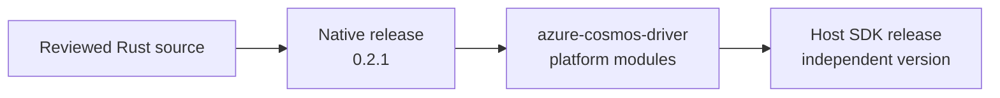
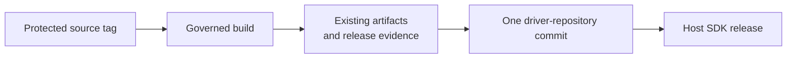
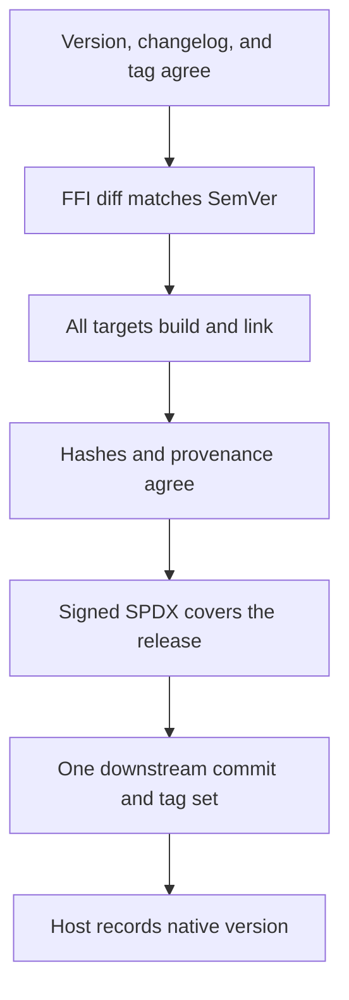

<!--
Copyright (c) Microsoft Corporation. All rights reserved.
Licensed under the MIT License.
-->
<!-- cSpell:ignore cbindgen cose goarch goos glibc MinGW musl rustc -->

# Native driver versioning and releases

## Recommendation

Use `azure_data_cosmos_driver_native` Cargo SemVer as the single version for:

- the native release;
- the shipped binaries; and
- the C FFI compatibility contract.

Do not add a separate ABI version. Host SDKs keep their own versions and record
the native version they ship.



The host manifest records `native_release = 0.2.1`. This is metadata, not a
reverse release flow.

## Goal

Publish one immutable, multi-platform native release that:

- follows one clear SemVer policy;
- is traceable to reviewed source and build inputs;
- is validated for FFI compatibility; and
- reaches host SDKs as one consistent release set.

## Version policy

The version in `Cargo.toml` is authoritative. `cosmos_version()`, the generated
header, changelog, source tag, provenance, and downstream release must match it.

| Change | Required version bump |
| --- | --- |
| Compatible fix with no FFI change | Patch |
| Additive symbol or versioned field | Minor |
| Breaking symbol, layout, signature, or ownership change before `1.0.0` | Minor |
| Breaking FFI change at or after `1.0.0` | Major |
| Add or remove a supported platform | Minor |

Before `1.0.0`, patches preserve the FFI and minors may break it. At and after
`1.0.0`, majors may break the FFI, minors are additive, and patches preserve
it.

Released versions are immutable. Any source, build-input, or artifact change
requires a new version.

## Changelog

Maintained native release history begins with `0.2.0`, the first tracked native
release boundary. Earlier `0.1.0` development is the bootstrap baseline and is
not reconstructed entry by entry.

The pull request that changes the FFI and increments `Cargo.toml` creates or
finalizes that version's `CHANGELOG.md` section. Follow the existing Cosmos
`Release History` format and describe host-visible changes.

```markdown
# Release History

## 0.2.0 (Unreleased)

### Features Added

- Added query entry points to the native C FFI.

### Breaking Changes

- Removed the deprecated v1 request structure.

### Bugs Fixed

- Preserved completion error storage until the completion is released.
```

A release cannot use an `(Unreleased)` entry. The released heading, Cargo
version, runtime version, header version, and tag must agree.

## Source tag

Create a protected annotated tag on the reviewed `main` commit:

```text
azure_data_cosmos_driver_native@X.Y.Z
```

The release builds the tagged commit. The pipeline requires an annotated tag that points to the built commit.

## FFI compatibility check

`Test-NativeRelease.ps1` compares the checked-in C header with the latest
released source tag. It ignores only the package-version macro.

For the current pre-`1.0.0` policy:

- a patch release must have an unchanged FFI header;
- a minor release may change the FFI header.

Before `1.0.0`, add a classifier for additive versus breaking header and layout
changes so the stable minor/major rules can be enforced automatically.

## Existing supply-chain evidence

This design does not change provenance, SPDX generation, checksums, signing, or
the six-file evidence allowlist. Continue using the current flow documented in
`sdk/cosmos/azure_data_cosmos_driver_native/docs/NATIVE_SUPPLY_CHAIN.md`.



## Downstream driver release

`Azure/azure-cosmos-driver` receives one atomic release containing all supported
platform modules, provenance, checksums, and signed evidence.

The platform-prefixed Go module tags and their GitHub releases are the
authoritative release records for these non-crates.io binaries. The Rust
repository remains the source of record, connected through the existing
provenance.

```text
linux/amd64/vX.Y.Z
linux/arm64/vX.Y.Z
linux/amd64-musl/vX.Y.Z
linux/arm64-musl/vX.Y.Z
darwin/arm64/vX.Y.Z
```

If any required platform or tag is missing, the release is incomplete.

## Host SDKs

Host SDK versions remain independent:

```text
host_sdk_version = 4.12.0
native_release = 0.2.1
```

Bundled or statically linked hosts validate the exact native release during the
build. Dynamically loading hosts call `cosmos_version()` before initialization
and require the exact native version selected by the host SDK.

| Host expectation | Loaded native version | Result |
| --- | --- | --- |
| Exact `0.2.1` | `0.2.1` with matching provenance | Accept |
| Exact `0.2.1` | `0.2.2` | Reject |
| Same version, different hash | Any | Reject |

## Release gates



Every gate fails closed. Do not publish a partial target set or substitute a
different toolchain or artifact.

## Adoption

1. **Implemented here:** version agreement, annotated source-tag validation,
   and the pre-`1.0.0` patch FFI gate.
2. **Downstream:** publish one atomic driver release and platform tag set.
3. **Host SDKs:** record and validate the selected native version.
4. **Before `1.0.0`:** add stable additive/breaking FFI classification.

## Acceptance criteria

- One protected source tag identifies one immutable release.
- Cargo, runtime, header, changelog, and downstream versions agree.
- Pre-`1.0.0` patch tags are rejected when the C FFI header changes.
- Stable releases add automated additive/breaking FFI classification before
  `1.0.0`.
- Existing provenance and signed SPDX behavior remains unchanged.
- Each `Azure/azure-cosmos-driver` platform tag and GitHub release is the
  authoritative binary release record for that module.
- All downstream platform tags point to one release commit.
- Host SDKs record the exact native version they use; dynamically loaded
  libraries must match it before initialization.
- The Cosmos SDK team owns the source and downstream release tags.
- Moving to `1.0.0` is an explicit Cosmos SDK compatibility commitment: after
  that release, breaking FFI changes require a new major version.
- Windows AMD64 MSVC remains deferred and joins the same release policy when
  its distribution path is implemented.
