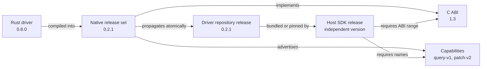
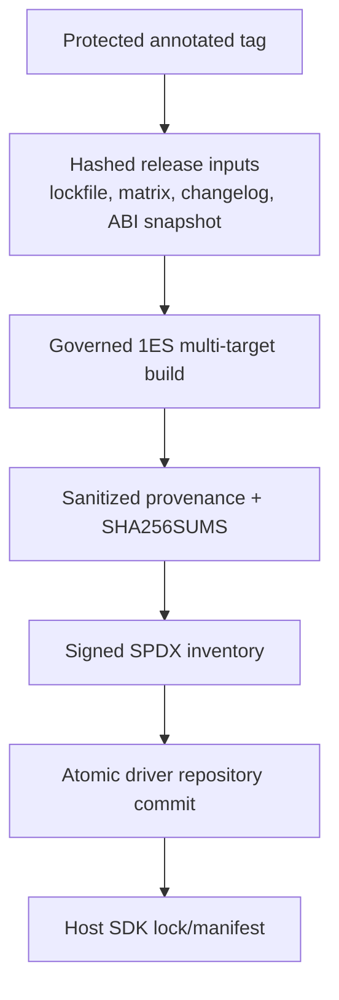
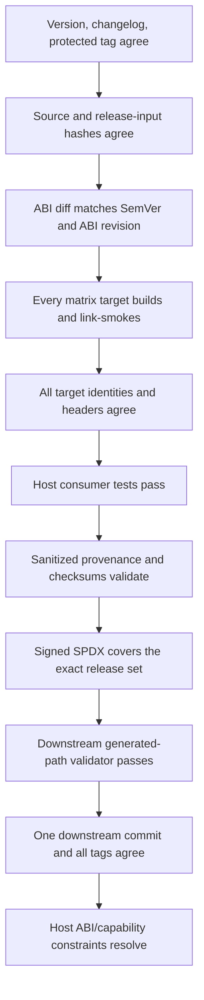

<!--
Copyright (c) Microsoft Corporation. All rights reserved.
Licensed under the MIT License.
-->
<!-- cSpell:ignore cbindgen cdylib cose goarch goos glibc linkable lockfile
     MinGW musl rustc staticlib toolchain -->

# Native driver versioning and releases

## Recommendation

Release the native driver as one immutable, multi-platform release set. Use the
native crate's Cargo SemVer as the release-set identity, and use a separate C
ABI major/minor plus named capabilities to decide whether a host SDK can load
that release.

The short mental model is:

- **Cargo SemVer identifies bytes.** `azure_data_cosmos_driver_native@X.Y.Z`
  names one source commit, changelog entry, build matrix, and set of artifacts.
- **C ABI version identifies binary compatibility.** ABI major changes require
  host adaptation; ABI minor changes are additive within a major.
- **Capabilities identify behavior.** A host checks the named features it
  requires instead of inferring them from package versions.
- **Host SDK versions remain independent.** A host release records the native
  release it carries and the ABI/capabilities it requires.

Everything under [Proposed design](#proposed-design) is a recommendation for
review. It is not implemented today.

## Goals

- Give every published native artifact an immutable, human-readable release
  identity.
- Let host SDKs determine compatibility without guessing from crate or host
  versions.
- Make the source, changelog, ABI surface, build inputs, toolchain, SBOM, and
  shipped bytes independently verifiable.
- Publish one coherent release across all supported targets, never a mixture of
  versions or build inputs.
- Keep public release evidence useful without exposing operational paths,
  verbose tool output, credentials, or internal diagnostics.
- Fit Azure SDK release conventions where they apply, while preserving the
  independent release cadence of each host SDK.

## Non-goals

- Implementing the proposed ABI functions, release automation, or validators.
- Changing the native API, generated header, build matrix, or pipeline.
- Publishing the native crate to crates.io.
- Defining dynamic-library loading or code-signing policy. The current Go path
  ships static libraries.
- Replacing the governed 1ES build, SBOM, or signing systems.
- Forcing Rust driver, native package, downstream driver, and host SDK versions
  to match.

## Verified current state

This section describes repository state observed when this document was
written. It intentionally does not describe recommendations as implemented.

### Current-state map

| Concern | Current path or behavior |
| --- | --- |
| Native package identity | `sdk/cosmos/azure_data_cosmos_driver_native/Cargo.toml` declares version `0.1.0`, sets `publish = false`, and path-pins `azure_data_cosmos_driver`. |
| Runtime version | `sdk/cosmos/azure_data_cosmos_driver_native/src/lib.rs` implements `cosmos_version()` with `CARGO_PKG_VERSION`. |
| Header version | `sdk/cosmos/azure_data_cosmos_driver_native/build.rs` emits `AZURECOSMOSDRIVER_H_VERSION` from `CARGO_PKG_VERSION`. |
| Embedded build identity | `build.rs` embeds package version, source commit, branch, build ID, build number, and wall-clock time in `COSMOS_BUILD_IDENTIFIER`. |
| ABI contract | `sdk/cosmos/azure_data_cosmos_driver_native/include/azurecosmosdriver.h` is generated by cbindgen and checked in. There is no separate ABI version or capability query. |
| Release pipeline | `sdk/cosmos/azure_data_cosmos_driver_native/pipeline/native-driver.yml` coordinates the governed native build and downstream pull request. |
| Per-target build | `pipeline/Build-NativeMatrix.ps1` writes schema 4 target metadata and artifact hashes. |
| Go package generation | `pipeline/New-GoModules.ps1` verifies target agreement, creates nested Go modules, writes `SHA256SUMS`, and emits schema 2 `provenance.json`. |
| Downstream staging | `pipeline/Prepare-GoDriverPullRequest.ps1` validates generated roots, checksums, provenance, and the signed evidence allowlist before staging `Azure/azure-cosmos-driver`. |
| Supply-chain documentation | `docs/NATIVE_SUPPLY_CHAIN.md` describes the current governed build, static-library trust model, and downstream layout. |
| Operational documentation | `pipeline/README.md` describes the build matrix, scripts, local rehearsal, and publication flow. |
| Azure SDK release tags | `eng/scripts/Test-Semver.ps1` discovers package baselines from tags shaped as `<package>@<version>`. |
| Cosmos changelogs | Cosmos crates use `# Release History`, an `(Unreleased)` version section, and standard headings such as `Features Added`, `Breaking Changes`, `Bugs Fixed`, and `Other Changes`. |

The downstream repository currently receives one `provenance.json`,
`SHA256SUMS`, generated platform modules, and the signed `_manifest` evidence.
The public provenance is intentionally detailed for validation, but some fields
can contain operational executable paths and full tool output that are not
needed by customers.

### Problems and risks

1. **Package version is overloaded.** It identifies the Cargo package, header,
   and runtime string, but does not state whether two builds are C ABI
   compatible. A host can compare strings and still load incompatible symbols
   or layouts.
2. **No capability negotiation exists.** Hosts must assume that a symbol,
   request field, or behavior is present. A version range cannot express an
   optional behavior as precisely as a named capability.
3. **The release is not yet bound to an immutable release tag.** A commit SHA
   is strong source identity, but reviewers also need a protected,
   human-readable tag that binds the approved changelog and release inputs.
4. **The build identifier is not reproducible.** Branch names, pipeline run
   identifiers, and wall-clock time make otherwise equivalent builds differ.
   They also mix operational metadata into a customer-visible binary.
5. **Public provenance is broader than customer evidence requires.** Absolute
   executable paths and complete command output increase disclosure and schema
   coupling without improving artifact identity.
6. **Partial target publication could split a release.** If platform modules
   are tagged or consumed independently without an atomic release-set check,
   hosts can receive different native behavior by platform.
7. **Host SDK versioning can be accidentally coupled to native versioning.**
   Matching version numbers would create unnecessary host releases and still
   would not prove ABI compatibility.

These are customer-facing risks: an incompatible library can fail at process
load, corrupt data through a layout mismatch, or expose behavior that differs
by operating system. Missing evidence makes incident response slower because a
binary cannot be traced quickly to one reviewed source and dependency set.

## Proposed design

### Identity and version model

Use five related but independent identities:

| Identity | Example | Purpose |
| --- | --- | --- |
| Rust driver version | `0.8.0` | Identifies the internal Rust implementation dependency. |
| Native package SemVer | `0.2.1` | Immutable identity of one multi-target native release set. |
| C ABI revision | `1.3` | Declares binary compatibility rules for exported C symbols, layouts, and ownership contracts. |
| Downstream driver release | `0.2.1` | Identifies the atomic generated release in `Azure/azure-cosmos-driver`; normally matches the native package SemVer because it redistributes those bytes. |
| Host SDK version | for example, `4.12.0` | Identifies a language SDK release and follows that SDK's own compatibility policy. |



The native SemVer must never be used as a proxy for the ABI revision. Two native
patches can implement the same ABI, and a native major release can retain an
older ABI during migration.

### Native package SemVer rules

The package version in
`sdk/cosmos/azure_data_cosmos_driver_native/Cargo.toml` is the canonical native
release-set version.

| Change | Native SemVer action | ABI action |
| --- | --- | --- |
| Rebuild with no source or input change | No new release. Reproducible bytes are expected where the toolchain permits. | None. |
| Security, correctness, or performance fix with unchanged host contract | Patch. | None. |
| Add optional symbols, fields through versioned structures, or capabilities | Minor. | Increment ABI minor if the additive surface is part of the C contract. |
| Remove or rename a symbol, change a layout/ownership rule, or require host changes | Major. | Increment ABI major. |
| Change only the internal Rust driver dependency without observable host impact | Patch. | None. |
| Change observable behavior that hosts may depend on | Minor, or major when compatibility cannot be preserved. | Add/change a capability contract; increment ABI only when the binary contract changes. |
| Add or remove a supported target | Minor, with explicit changelog entry. | None unless that target has a distinct ABI constraint. |

While the package remains `0.y.z`, every release remains pre-1.0. The release
owner should still apply the table above as the intended compatibility policy:
patches are compatible, minors may add capabilities, and an intentionally
breaking release requires explicit approval and a prominent changelog entry.
Moving to `1.0.0` signals that this policy is a supported contract.

A released version is immutable. Any change to source, lockfile, matrix,
toolchain selection, ABI snapshot, changelog, or artifact bytes requires a new
native package version.

### Changelog design

Add
`sdk/cosmos/azure_data_cosmos_driver_native/CHANGELOG.md` when implementation of
this design begins. It should follow the existing Cosmos release-history shape.
Entries should describe host-observable behavior and compatibility, not pipeline
mechanics.

A realistic future entry would look like:

```markdown
# Release History

## 0.2.0 (Unreleased)

### Features Added

- Added ABI capability discovery and the `query-v1` capability.

### Breaking Changes

- Changed the C ABI major from 0 to 1; hosts must validate ABI compatibility before creating a runtime.

### Bugs Fixed

- Preserved completion error storage until the completion is released.

### Other Changes

- Added Linux ARM64 musl to the atomic native release set.
```

Release automation should fail when the selected version is still marked
`(Unreleased)`, when the version is missing, or when the tag version differs
from `Cargo.toml`, `cosmos_version()`, or the changelog heading.

### Immutable tag-to-source binding

Create a protected, annotated source tag:

```text
azure_data_cosmos_driver_native@X.Y.Z
```

The tag must point to the reviewed commit on `main`. Its annotation should
identify the native version, C ABI revision, and release evidence digest. The
release job must build the peeled tag commit, not an arbitrary branch head.

Before publication, a gate should verify:

- tag name equals the Cargo package name and version;
- tag is annotated, protected, and points to the selected `main` commit;
- the changelog contains a dated `X.Y.Z` release section;
- `Cargo.lock`, build matrix, changelog, checked-in header, and ABI snapshot
  hashes match the values recorded in provenance; and
- no existing release or downstream tag uses the same version with different
  bytes.

This follows the Azure SDK `<package>@<version>` convention already consumed by
`eng/scripts/Test-Semver.ps1`, while allowing the internal, non-crates.io
package to participate in release identity checks.

### C ABI version and capabilities

Expose a stable ABI query that is safe to call before constructing any other
native type. One possible contract is:

```c
typedef struct cosmos_abi_version_t {
    uint32_t major;
    uint32_t minor;
} cosmos_abi_version_t;

cosmos_abi_version_t cosmos_abi_version(void);
bool cosmos_has_capability(const char *name);
```

The exact C shape remains an implementation decision. The required semantics
are:

- **ABI major** changes when an existing host binary must change to load or call
  the native library safely.
- **ABI minor** increases for additive, backward-compatible C surface within a
  major. A host compiled against minor `m` can accept `m` or later when the
  major matches.
- **Capability names** are lowercase, stable, documented tokens such as
  `query-v1`. Names are never redefined. Changed semantics require a new name.
- A host declares one ABI major, a minimum ABI minor, and required
  capabilities. It rejects the library before normal initialization when any
  requirement is missing.
- The native release publishes the same ABI revision and capability set for
  every target in the release set. A platform-specific exception requires an
  explicit capability and compatibility entry.

Failing early gives customers an actionable "native ABI 1.2 is too old" error
instead of a loader failure, missing-symbol crash, or silent structure
misinterpretation.

### ABI snapshot and diff policy

Generate a canonical ABI snapshot from the checked-in header and exported
symbols for every release candidate. Store the human-reviewable snapshot in the
native crate and record its SHA256 in provenance.

The snapshot should normalize ordering and omit timestamps, paths, comments,
and tool-version noise. It should cover:

- exported symbol names and calling conventions;
- enum and constant values;
- structure/union field order, size, alignment, and offsets;
- opaque-handle and ownership/freeing contracts;
- ABI major/minor and capability names; and
- target-specific differences, if any are intentionally supported.

The release diff gate classifies changes:

| Diff | Required result |
| --- | --- |
| No ABI change | ABI revision unchanged. |
| Additive symbol or versioned-structure extension | ABI minor increases; native SemVer minor increases. |
| Removal, rename, signature/layout change, or changed ownership contract | ABI major and native SemVer major increase. |
| Unclassified target difference | Fail release until reviewed and documented. |

The baseline is the snapshot bound to the most recent released native tag, not
an untagged branch build. Reviewers may approve an exception only with a
documented compatibility rationale and corresponding version change.

### Reproducible embedded identity

Replace the current operational `COSMOS_BUILD_IDENTIFIER` contents with stable
release identity only:

```text
package=azure_data_cosmos_driver_native
version=X.Y.Z
abi=M.m
source=<full-git-sha>
```

Do not embed branch, pipeline build ID/number, absolute paths, or wall-clock
time. Those values belong in restricted pipeline records keyed by source SHA
and release tag. Stable identity reduces needless byte differences and avoids
publishing internal operational details.

### Sanitized provenance

Publish a small, versioned provenance schema intended for customers and
automated validators. It should use repository-relative logical names and
normalized toolchain identities, never executable paths or full command output.

Example:

```json
{
  "schema_version": 3,
  "release": {
    "package": "azure_data_cosmos_driver_native",
    "version": "0.2.1",
    "tag": "azure_data_cosmos_driver_native@0.2.1",
    "source_sha": "0123456789abcdef0123456789abcdef01234567",
    "abi": { "major": 1, "minor": 3 },
    "capabilities": ["patch-v2", "query-v1"]
  },
  "inputs": {
    "cargo_lock_sha256": "sha256:...",
    "build_matrix_sha256": "sha256:...",
    "changelog_sha256": "sha256:...",
    "abi_snapshot_sha256": "sha256:..."
  },
  "toolchain": {
    "provider": "microsoft",
    "channel": "ms-prod-1.95",
    "rustc_release": "1.95.0",
    "rustc_commit": "abcdef0123456789abcdef0123456789abcdef01",
    "cargo_release": "1.95.0"
  },
  "targets": [
    {
      "id": "linux-amd64-glibc",
      "triple": "x86_64-unknown-linux-gnu",
      "module": "linux/amd64",
      "artifacts": {
        "azurecosmosdriver.h": "sha256:...",
        "libazurecosmosdriver.a": "sha256:..."
      }
    }
  ]
}
```

The literal hashes would be complete lowercase SHA256 values. The example uses
placeholders to remain readable.

Restricted pipeline records may retain run identifiers, agent images,
installation paths, linker command output, diagnostic logs, and signing-client
logs for operational investigation. They should be correlated by tag and
source SHA, not copied into the public driver repository.

### Signed SBOM and evidence chain

The signed SPDX inventory is the envelope that authenticates the release files
and their hashes. The proposed chain is:



Only the existing six-file signed evidence allowlist should be exported:

```text
manifest.spdx.json
manifest.spdx.json.sha256
manifest.spdx.cose
manifest.cat
bsi.json
bsi.cose
```

Signing-client logs, full tool output, internal diagnostics, and other
operational files remain in restricted pipeline retention. The downstream
validator must reject extra files under the public `_manifest` root.

The SPDX document should inventory the release tag, sanitized provenance,
`SHA256SUMS`, header, ABI snapshot, and every target artifact. This lets a
reviewer move from a host SDK dependency to the exact native bytes, signed
inventory, source, and build inputs without exposing how internal signing
services were invoked.

### Azure SDK central-system integration

The native package is currently `publish = false`, so central systems may not
treat it like a normal crates.io package. Integration should be explicit:

1. Register the native package as an internal release artifact with
   package/version/tag identity.
2. Reuse `<package>@<version>` baseline discovery and version consistency
   checks where possible.
3. Require a changelog release section and link the release record to the
   protected source tag.
4. Attach or index the sanitized provenance, signed SPDX digest, ABI snapshot,
   and supported-target matrix in the central release record.
5. Preserve the native release as one unit; central automation must not mark a
   subset of targets released.
6. Feed dependency and vulnerability results from the signed SBOM into the
   normal Azure SDK inventory and incident-response systems.

Whether existing release-plan tooling can represent a non-crates.io,
multi-target native package is an external decision. The fallback is a small
native-specific release record that uses the same package tag convention and
evidence requirements.

### Downstream driver propagation

`Azure/azure-cosmos-driver` should receive one pull request containing the
complete release set:

- all expected platform modules;
- identical generated header bytes;
- `SHA256SUMS`;
- sanitized `provenance.json`;
- the ABI snapshot or its signed, directly resolvable digest; and
- only the six allowed signed-evidence files.

The downstream validator should compare the incoming release to the source tag
and reject missing, unexpected, mixed-version, or previously published bytes.
All platform modules become releasable only after the one generated commit
merges.

Create one annotated downstream release-set tag on that commit:

```text
native-driver@X.Y.Z
```

Then create Go nested-module tags, all pointing to the same commit:

```text
linux/amd64/vX.Y.Z
linux/arm64/vX.Y.Z
linux/amd64-musl/vX.Y.Z
linux/arm64-musl/vX.Y.Z
darwin/arm64/vX.Y.Z
```

Add a tag only for a target present in the signed release matrix. Never reuse a
tag. The downstream release-set tag and all nested-module tags must agree on
native version, source tag, provenance digest, and commit. If any required tag
cannot be created, the release remains incomplete and host propagation does not
start.

This platform-prefixed strategy follows Go's nested-module tag rules and avoids
pretending that each platform is an independently versioned product.

### Host SDK propagation

Each host SDK keeps its own version and release cadence. Its native dependency
record should contain:

```text
native_release = X.Y.Z
abi_major = M
abi_minimum_minor = m
required_capabilities = [name, ...]
provenance_digest = sha256:...
```

The host build validates these requirements against the selected native
release. At runtime, dynamically loading hosts repeat the ABI/capability check
before creating a runtime. Statically linking hosts expose the same information
in diagnostics and release metadata.

A host may update from native `X.Y.Z` to `X.Y.(Z+1)` without changing its own
major/minor version when the host contract is unchanged. A host release note
should mention customer-visible native fixes and any newly required capability,
but it should not mirror the native version number.

### Compatibility matrix

| Host requirement | Native release | Result |
| --- | --- | --- |
| ABI `1`, minimum minor `2`, capability `query-v1` | ABI `1.3`, has `query-v1` | Compatible. |
| ABI `1`, minimum minor `4` | ABI `1.3` | Reject before initialization; native library is too old. |
| ABI `1`, capability `patch-v2` | ABI `1.3`, lacks `patch-v2` | Reject or disable the host feature according to the host's declared policy. |
| ABI `2` | ABI `1.9` | Reject; ABI major mismatch. |
| ABI `1`, minimum minor `2` | ABI `1.2`, later native package patch | Compatible when required capabilities remain present. |
| Same native version, different artifact hash | Any | Reject as tampered or republished bytes. |
| Same release set, one platform from another source SHA | Any | Reject the entire release set. |

## End-to-end release gates



| Gate | Failure prevented |
| --- | --- |
| Version/changelog/tag agreement | A version that cannot be connected to reviewed release notes or source. |
| Input hash agreement | Rebuilding a tag with a changed lockfile, matrix, ABI contract, or changelog. |
| ABI diff classification | Loader failures, missing symbols, or structure corruption hidden behind a compatible-looking package version. |
| Complete matrix build and link smoke | A release that works in CI but cannot link on a customer platform. |
| Cross-target identity/header agreement | Different behavior or declarations by operating system under one release number. |
| Direct and vendored host tests | Go modules that download but omit or cannot link the native archive. |
| Provenance/checksum validation | Artifacts that cannot be traced to source or whose bytes changed in transit. |
| Signed SPDX coverage | Unsigned evidence being mistaken for governed release evidence. |
| Downstream path validation | Operational logs or unrelated files leaking into the public repository. |
| Atomic downstream commit/tags | Hosts selecting a partial or mixed native release. |
| Host constraint validation | Runtime crashes or silently disabled features after an incompatible upgrade. |

No gate should silently downgrade, substitute a target, or publish a
success-shaped partial result.

## Incremental adoption plan

1. **Document and inventory.** Approve the identity model, public provenance
   boundary, naming, and external decisions in this document.
2. **Add release artifacts without changing runtime behavior.** Add the native
   changelog, canonical ABI snapshot, stable release-input hashes, and sanitized
   provenance alongside the current schema during a transition.
3. **Stabilize embedded identity.** Remove branch, run identifiers, and time
   from `COSMOS_BUILD_IDENTIFIER`; retain them in restricted pipeline records.
4. **Add ABI/capability discovery.** Introduce the query contract, tests, and
   host-side fail-fast checks without removing existing symbols.
5. **Enforce release tagging and ABI diffs.** Require the protected source tag,
   SemVer/ABI classification, and immutable release checks before publication.
6. **Make downstream publication atomic.** Validate one release set, create the
   release-set and nested-module tags, then permit host propagation.
7. **Integrate central inventory.** Register the internal native package and
   signed evidence with Azure SDK release, dependency, and incident-response
   systems.
8. **Retire transitional schemas.** Remove verbose public provenance fields
   only after downstream validators and active hosts consume the sanitized
   schema.

Each phase is independently reviewable and should preserve the current
fail-closed supply-chain behavior.

## Objective acceptance criteria

The design is implemented when all of the following are demonstrably true:

- A protected annotated `azure_data_cosmos_driver_native@X.Y.Z` tag resolves to
  the exact commit built for release.
- Cargo version, runtime version, header package version, changelog release, and
  source tag are equal and validated automatically.
- The C API reports an independently versioned ABI major/minor and immutable
  named capabilities.
- A canonical ABI snapshot is diffed against the previous released tag, and the
  gate rejects an incompatible SemVer or ABI revision.
- Embedded public identity contains only package, native version, ABI revision,
  and source SHA.
- Public provenance contains no absolute paths, branch names, pipeline run
  identifiers, timestamps, full command output, credentials, or private
  endpoints.
- Provenance binds the source tag/SHA, `Cargo.lock`, build matrix, changelog,
  ABI snapshot, normalized toolchain, target list, and artifact hashes.
- The signed SPDX inventory covers provenance, checksums, header, ABI evidence,
  and every shipped target artifact.
- The public `_manifest` tree contains exactly the six allowed evidence files.
- The downstream repository receives one complete release-set commit; its
  release-set and Go nested-module tags all point to that commit.
- A mixed source SHA, version, header, ABI, capability set, target set, or hash
  fails before downstream publication.
- Every host SDK records native release, ABI range, required capabilities, and
  provenance digest independently of its own package version.
- Tests prove compatible load, too-old ABI minor, wrong ABI major, missing
  capability, changed artifact hash, partial matrix, and nested-module
  direct/vendored consumption cases.

## Alternatives considered

### Use only Cargo SemVer

Rejected because package compatibility and C binary compatibility are different
contracts. A host needs to know whether symbols and layouts are safe before it
can use higher-level package behavior.

### Use only an ABI integer

Rejected because one integer cannot identify artifact bytes, source,
dependencies, target matrix, or behavior capabilities. It also encourages ABI
bumps for changes that do not affect binary compatibility.

### Keep host and native versions equal

Rejected because hosts have independent APIs and servicing cadences. Lockstep
versions would create releases with no host change and still would not express
ABI or capability requirements.

### Version each platform independently

Rejected because hosts expect equivalent driver behavior across platforms.
Independent platform versions make partial rollout and mixed source inputs look
valid.

### Publish all pipeline and signing output

Rejected because operational paths, verbose logs, and signing-client
diagnostics do not improve customer verification. Signed, minimal evidence plus
restricted operational retention provides a clearer trust boundary.

### Put operational run metadata in the binary

Rejected because timestamps and run identifiers defeat reproducibility and can
expose internal details. The source tag/SHA and evidence digest are sufficient
public correlation keys.

## Unresolved external decisions

- Which Azure SDK central release record should represent a `publish = false`,
  multi-target native package?
- Which service owns protection and creation of the source and downstream tags?
- Is `native-driver@X.Y.Z` the preferred downstream release-set tag, or should
  the downstream repository use another protected product-level prefix?
- What exact C shape and allocation-free representation should expose ABI
  version and capabilities?
- Which ABI snapshot/diff tool is approved for the supported target matrix, and
  how are intentional target-specific differences represented?
- Is source-tag signing required in addition to an annotated protected tag and
  signed release evidence?
- What retention and access policy applies to restricted operational provenance
  and signing diagnostics?
- How should a host declare an optional capability that disables a feature
  rather than rejecting the native library?
- Which authority approves the move from pre-1.0 native releases to the `1.0.0`
  compatibility commitment?
- What is the approved Windows AMD64 toolchain and target before that platform
  rejoins the atomic release matrix?

These decisions should be resolved before release automation treats this
document as policy.
