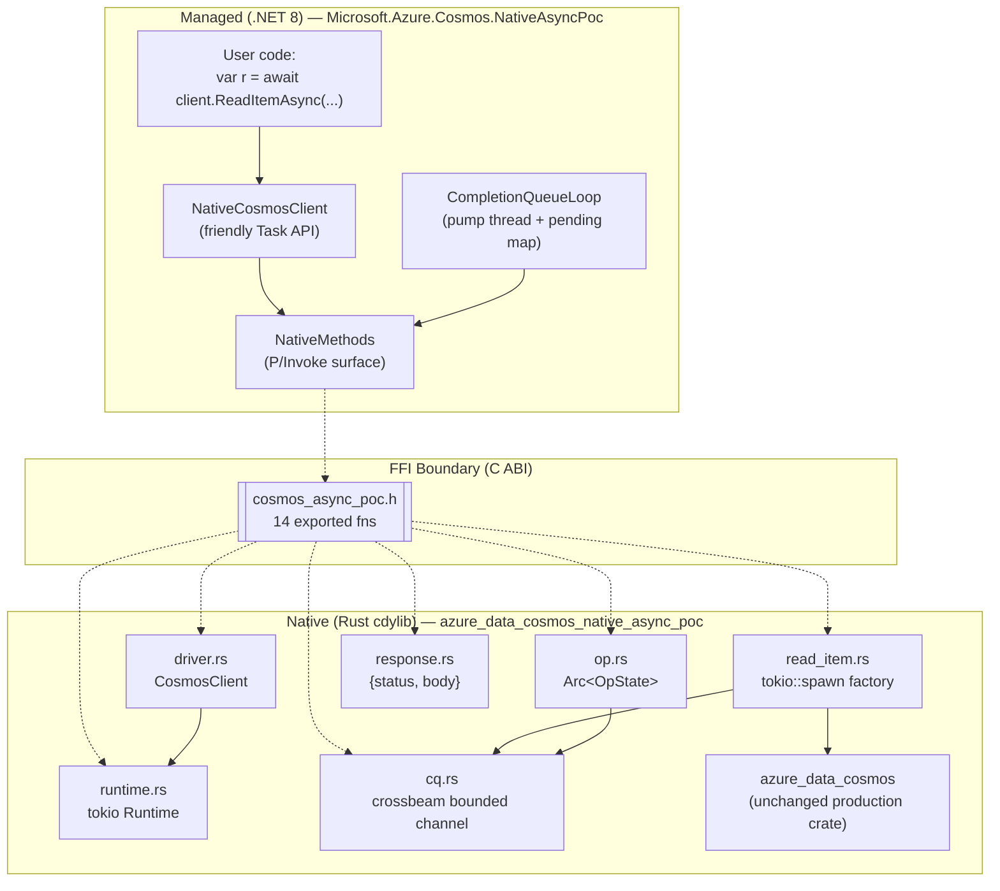
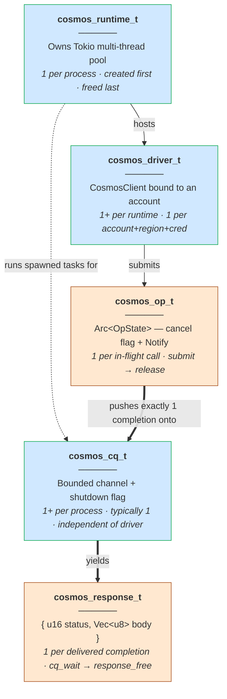

# Cosmos DB Async-FFI Feasibility Spike

> **Crate**: `azure_data_cosmos_native_async_poc` (library name `cosmos_async_poc`)
> **Branch**: `poc/async-ffi-spike` on `azure-sdk-for-rust`
> **Companion .NET host**: `tools/Microsoft.Azure.Cosmos.NativeAsyncPoc` on `poc/native-async-spike` (`azure-cosmos-dotnet-v3`)
> **Status**: spike complete · verdict **PROVEN** · ~6 h of a 15 h budget

---

## TL;DR (for the standup)

This spike implements the smallest possible **completion-queue async ABI** for the planned `azure_data_cosmos_driver_native` crate (see [Azure/azure-sdk-for-rust#4461](https://github.com/Azure/azure-sdk-for-rust/pull/4461)) and consumes it from a real .NET 8 console host. Submission is non-blocking; results are drained by a single dedicated host pump thread that dispatches each completion to the right `TaskCompletionSource`.

The design borrows directly from three battle-tested precedents:

- **gRPC C-core** — `grpc_completion_queue_next`
- **libuv / IOCP / io_uring** — kernel-level CQs drained by one host thread
- **V3 .NET SDK's Rntbd2 transport** — `Connection.ReceiveLoopAsync` dispatches frames to per-request `TaskCompletionSource`s by activity id

Same pattern, **one layer up** (FFI boundary instead of TCP boundary).

**Result: it works.** 1,000 concurrent reads complete in **~6 ms** on a single pump thread. Cancellation, panic safety, and exactly-once completion delivery all hold. Ready to graduate to spec input on PR #4461.

---

## Architecture at a glance



**Key principle**: the production `azure_data_cosmos` crate is **untouched**. The new cdylib wraps it behind a small C ABI. If the spec changes, only the FFI shim changes.

### Lifetime hierarchy of the FFI types

This is the **mental model** every team member needs to internalize before reading the code. Every opaque type has a clear parent, a clear lifetime window, and a clear "who frees it" rule.



Blue = long-lived (live for minutes / the whole process). Orange = short-lived (live for the duration of one operation).

#### Read it top-down

```
cosmos_runtime_t                        process startup
  │ (constructed once via cosmos_runtime_new)
  │ holds the Tokio worker pool — every Cosmos op eventually runs on these threads
  │
  ├── cosmos_driver_t                   per Cosmos account
  │     │ (constructed via cosmos_driver_new — the ONE call that blocks; primes the region cache)
  │     │ holds an Arc<Runtime> so the runtime cannot be freed while a driver exists
  │     │
  │     └── cosmos_op_t                 per in-flight operation
  │           │ (constructed via cosmos_read_item; returns immediately)
  │           │ host MUST call exactly one of { cosmos_cancel, cosmos_op_release } — Invariant I5
  │           │ Arc<OpState>: one ref to spawned Tokio task, one ref to host
  │           │
  │           └── (when task finishes) pushes 1 Completion ───────────►
  │                                                                    │
  └── cosmos_cq_t                       per host pump thread            │
        │ (constructed via cosmos_cq_new — sibling of driver, not child)│
        │ bounded channel; receiver held under tokio::sync::Mutex (I4)  │
        │                                                               ▼
        │                                                       takes pushed completion
        │                                                               │
        └── cosmos_response_t           per completed op                ▼
              (yielded by cosmos_cq_wait; host owns and must call cosmos_response_free)
```

#### Free order (reverse of construction)

When tearing down, the host MUST release in this order, or risk use-after-free or leaks:

```
1.  cosmos_op_release        for every still-outstanding op (cancel first if needed)
2.  cosmos_response_free     for every response handed out by cq_wait that hasn't been freed
3.  cosmos_cq_shutdown       tell the CQ "no more waits coming"
4.  drain remaining completions with cq_wait until QueueShutdown
5.  cosmos_cq_free           release the CQ
6.  cosmos_driver_free       release each driver
7.  cosmos_runtime_free      release the runtime LAST (it joins the worker pool)
```

The `CompletionQueueLoop.Dispose()` in the .NET host implements steps 3–5 automatically.

### File map — Rust crate (~1,250 LOC)

```
sdk/cosmos/azure_data_cosmos_native_async_poc/
├── Cargo.toml                       crate manifest (cdylib + staticlib + rlib)
├── INVARIANTS.md                    the 5 contract rules
├── include/
│   └── cosmos_async_poc.h           hand-written C header (350 lines)
├── src/
│   ├── lib.rs                       module root + ffi_guard! panic macro       (67 LOC)
│   ├── runtime.rs                   cosmos_runtime_t  = Arc<tokio::Runtime>    (61 LOC)
│   ├── driver.rs                    cosmos_driver_t   = CosmosClient + rt      (107 LOC)
│   ├── cq.rs                        cosmos_cq_t       = bounded channel        (227 LOC)
│   ├── op.rs                        cosmos_op_t       = Arc<OpState>           (96 LOC)
│   ├── read_item.rs                 cosmos_read_item  factory + spawn          (144 LOC)
│   ├── response.rs                  cosmos_response_t = {status, body}         (80 LOC)
│   └── error.rs                     CosmosStatusCode + FfiError                (69 LOC)
└── tests/
    └── smoke.rs                     Rust-only end-to-end test                  (182 LOC)
```

**Naming rule we followed**: one file per opaque type exposed across the FFI, plus one file per orthogonal concern (errors, op factories, the `ffi_guard!` macro).

### File map — .NET host (~700 LOC)

```
tools/Microsoft.Azure.Cosmos.NativeAsyncPoc/
├── Microsoft.Azure.Cosmos.NativeAsyncPoc.csproj   net8.0 exe, copies DLL from $(PocArtifactDir)
├── Microsoft.Azure.Cosmos.NativeAsyncPoc.sln      dedicated solution (POC-only)
├── NativeMethods.cs                 P/Invoke surface — 14 [DllImport]s         (121 LOC)
├── CompletionQueueLoop.cs           pump thread + ConcurrentDictionary<TCS>    (214 LOC)
├── NativeCosmosClient.cs            friendly Task<T> wrapper                   (140 LOC)
└── Program.cs                       F1–F4 feasibility driver                   (180 LOC)
```

---

## The 14 functions that cross the boundary

| Lifecycle group | Functions |
|---|---|
| Runtime         | `cosmos_runtime_new`, `cosmos_runtime_free` |
| Driver          | `cosmos_driver_new`, `cosmos_driver_free` |
| Completion queue| `cosmos_cq_new`, `cosmos_cq_shutdown`, `cosmos_cq_free`, `cosmos_cq_wait` |
| Operation       | `cosmos_read_item`, `cosmos_cancel`, `cosmos_op_release` |
| Response        | `cosmos_response_status`, `cosmos_response_body`, `cosmos_response_free` |

**Notice what is NOT there**: no per-operation thread, no callback function pointer, no managed delegate. Every async dispatch happens by **integer handoff** (`user_data`) — the same trick OS completion ports use.

---

## Threading model

There are **exactly three** thread populations at runtime. Their jobs never overlap.

### Block diagram


| Population | Count | Owner | Job | Never does |
|---|---|---|---|---|
| **A** — .NET ThreadPool | many (CLR) | CLR | Runs user code, calls `cosmos_read_item` (~50 µs, returns immediately), parks awaiting TCS | Block on I/O |
| **B** — Tokio workers   | `= CPU cores` | Tokio runtime | Awaits the HTTPS call, races vs cancel signal, pushes `Completion` onto channel | Call back into managed code |
| **C** — Pump thread     | **1 per CQ** | `CompletionQueueLoop` ctor | `cq_wait()` in a tight loop, looks up `user_data` → `TCS`, calls `TrySetResult` | Run user code |

**Why this works**:
- User-code continuations don't run on the pump thread (TCS is created with `RunContinuationsAsynchronously`), so the pump never gets blocked by user work.
- Tokio threads never reach back into managed code — they only do `channel.send()`.
- Cancellation is a flag flip + a `Notify::notify_waiters()` — no thread is created or destroyed per op.

### Sequence — single `ReadItemAsync` end-to-end

```mermaid
sequenceDiagram
    autonumber
    participant UC as User code<br/>(ThreadPool A)
    participant NCC as NativeCosmosClient
    participant CQL as CQ pump thread (C)
    participant NM as P/Invoke
    participant FFI as Rust FFI
    participant TT as Tokio task (B)
    participant AZ as azure_data_cosmos

    UC->>NCC: await client.ReadItemAsync("p", "x")
    NCC->>NCC: tcs = new TCS<RawResponse>(RunContinuationsAsync)
    NCC->>CQL: token = Register(tcs)
    NCC->>NM: cosmos_read_item(..., token, &out_op)
    NM->>FFI: extern "C" call
    FFI->>FFI: copy strings; OpState::new()
    FFI->>TT: runtime.spawn(async move { ... })
    FFI-->>NM: returns Ok + out_op handle (~50 µs)
    NM-->>NCC: out_op
    NCC-->>UC: await tcs.Task  (thread A parks)

    Note over TT,AZ: Independently on a Tokio worker thread (B):
    TT->>AZ: container.read_item(pk, id).await
    AZ-->>TT: response (status, body bytes)
    TT->>TT: tokio::select! → Success(resp)
    TT->>CQL: cq_tx.send(Completion { user_data: token, outcome })

    Note over CQL: Independently on the pump thread (C):
    CQL->>NM: cosmos_cq_wait(cq, 200, ...)
    NM->>FFI: extern "C" call
    FFI->>FFI: rx.recv_timeout pops Completion
    FFI-->>NM: returns Ok + token + status + response*
    NM-->>CQL: out args
    CQL->>CQL: pending.TryRemove(token) → tcs
    CQL->>CQL: copy body bytes (Marshal.Copy)
    CQL->>NM: cosmos_response_free(response*)
    CQL->>UC: tcs.TrySetResult(raw)  (queues continuation back to A)

    UC->>UC: continuation runs on ThreadPool, await returns
```

---

## How `CompletionQueueLoop` works (the .NET pump)

`CompletionQueueLoop` is the heart of the .NET host — the single class that turns the C completion queue into resolved `Task<T>`s. Every other piece of the .NET POC (`NativeCosmosClient`, `Program.cs`) is just glue around it. Here it is, dissected.

### The four fields

```csharp
public sealed class CompletionQueueLoop : IDisposable
{
    private readonly IntPtr cqHandle;                                                    // ① the Rust CQ
    private readonly Thread pumpThread;                                                  // ② the one pump
    private readonly ConcurrentDictionary<ulong, TaskCompletionSource<RawResponse>> pending; // ③ in-flight map
    private long nextUserData;                                                            // ④ token allocator
    private int  disposed;                                                                // shutdown flag
}
```

| # | Field | What it is | Why it exists |
|---|---|---|---|
| ① | `cqHandle` | Opaque `IntPtr` returned by `cosmos_cq_new` | Identifies the Rust-side bounded channel; passed back on every native call |
| ② | `pumpThread` | A regular CLR `Thread` with `IsBackground = true`, name `cosmos-native-cq-pump` | The one and only host thread that calls `cosmos_cq_wait`. Marked background so it doesn't prevent process exit. |
| ③ | `pending` | Map from `user_data` (ulong) → the awaiting TCS | The dispatcher. When a completion comes back carrying token `T`, we look up the TCS in this map and resolve it. |
| ④ | `nextUserData` | Monotonic counter | Generates a fresh, unique token per submission. `Interlocked.Increment` makes it thread-safe under heavy concurrent submission. |

### The constructor — startup sequence

```csharp
public CompletionQueueLoop(uint capacity = 1024)
{
    this.cqHandle = cosmos_cq_new(capacity);                          // ① ask Rust for a CQ
    if (this.cqHandle == IntPtr.Zero) throw new InvalidOperationException(...);
    this.pending  = new ConcurrentDictionary<...>();                  // ② alloc dispatcher map
    this.pumpThread = new Thread(this.Pump) {
        IsBackground = true,
        Name = "cosmos-native-cq-pump",
    };
    this.pumpThread.Start();                                          // ③ launch the pump
}
```

Three steps: allocate the Rust resource, allocate the .NET dispatcher state, launch the pump thread. After the ctor returns, the pump is already running and waiting for completions — but `pending` is empty, so the pump just blocks in `cq_wait` until something gets registered.

### `Register` — how a TCS gets into the pending map

```csharp
public ulong Register(TaskCompletionSource<RawResponse> tcs)
{
    ulong token = (ulong)Interlocked.Increment(ref this.nextUserData);
    this.pending[token] = tcs;
    return token;
}
```

Called by `NativeCosmosClient.ReadItemAsync` right before it invokes `cosmos_read_item`. The returned `token` is the `user_data` payload — Rust will hand it back verbatim when the operation finishes. **This is Invariant I1 in action**: Rust never inspects the bytes, only round-trips them.

### The pump loop — the actual event loop

```csharp
private void Pump()
{
    while (Volatile.Read(ref this.disposed) == 0)
    {
        CosmosStatus waitRc = cosmos_cq_wait(
            this.cqHandle,
            timeoutMs: 200,
            out UIntPtr userDataNative,
            out CosmosStatus opStatus,
            out IntPtr responseHandle);

        // ── BRANCH 1: timeout, no completion yet
        if (waitRc == CosmosStatus.Cancelled) continue;

        // ── BRANCH 2: shutdown signaled
        if (waitRc == CosmosStatus.QueueShutdown)
        {
            foreach (var kvp in this.pending)
                kvp.Value.TrySetException(new InvalidOperationException("Completion queue was shut down"));
            this.pending.Clear();
            return;
        }

        // ── BRANCH 3: real completion delivered
        // ... dispatch to TCS ...
    }
}
```

#### Branch 1 — Timeout (200 ms tick)

`cq_wait` with `timeoutMs: 200` returns `Cancelled` if nothing arrived in 200 ms. This isn't a real "cancellation" event — it's a heartbeat. The pump uses it to re-check the `disposed` flag, so `Dispose()` doesn't have to wait an unbounded time for a completion to arrive. Without this tick, a CQ with no in-flight ops would hang shutdown forever.

#### Branch 2 — `QueueShutdown` (orderly drain)

Triggered when `Dispose()` called `cosmos_cq_shutdown(cqHandle)`. The pump sees the shutdown sentinel, then walks every still-pending TCS and fails it with an exception. **This prevents orphaned `await`s**: callers who submitted ops just before shutdown won't hang forever — they'll see an `InvalidOperationException`. After draining, the pump thread returns and the `Thread.Join` in `Dispose` succeeds.

#### Branch 3 — Real completion (the happy path)

```csharp
ulong userData = userDataNative.ToUInt64();
if (!this.pending.TryRemove(userData, out var tcs))
{
    // Defensive: shouldn't happen if I1 is upheld, but free the response anyway.
    if (responseHandle != IntPtr.Zero) cosmos_response_free(responseHandle);
    Console.Error.WriteLine($"completion for unknown user_data 0x{userData:X16} dropped");
    continue;
}

try
{
    RawResponse raw = ReadRawResponseAndFree(responseHandle);
    if      (opStatus == CosmosStatus.Ok)        tcs.TrySetResult(raw);
    else if (opStatus == CosmosStatus.Cancelled) tcs.TrySetCanceled();
    else                                          tcs.TrySetException(new CosmosNativeException(opStatus, raw));
}
catch (Exception ex)
{
    tcs.TrySetException(ex);
}
```

Three concerns are happening here in order:

1. **Demultiplex.** `pending.TryRemove(userData, ...)` atomically pulls the TCS out of the dispatcher map and returns it. **`TryRemove` not `TryGet`**: this is the single point at which a token is consumed, guaranteeing exactly-once dispatch (the host-side companion to Rust's Invariant I2).
2. **Marshal.** `ReadRawResponseAndFree` (next section) copies the Rust-owned body bytes into a managed `byte[]` and immediately frees the Rust allocation.
3. **Resolve.** Pick the right TCS method based on the Rust-side status — `TrySetResult` for success, `TrySetCanceled` for I-cancelled-it, `TrySetException` wrapping a `CosmosNativeException` for everything else. **`Try*` not raw `Set*`**: defensive against double-completion, even though Invariant I2 should prevent it.

The `tcs.TrySet*` call is what schedules the user's `await` continuation back onto the ThreadPool. The TCS was created with `TaskCreationOptions.RunContinuationsAsynchronously` in `NativeCosmosClient`, which is the **critical** detail: it prevents the continuation from running synchronously on the pump thread. If we forgot that flag, a slow user continuation would block the pump and starve every other in-flight op.

### `ReadRawResponseAndFree` — memory marshaling

```csharp
private static RawResponse ReadRawResponseAndFree(IntPtr responseHandle)
{
    if (responseHandle == IntPtr.Zero) return new RawResponse(0, Array.Empty<byte>());
    try
    {
        ushort http = cosmos_response_status(responseHandle);
        cosmos_response_body(responseHandle, out IntPtr bodyPtr, out UIntPtr bodyLenNative);
        int len = (int)bodyLenNative.ToUInt32();
        byte[] copy = new byte[len];
        if (len > 0) Marshal.Copy(bodyPtr, copy, 0, len);
        return new RawResponse(http, copy);
    }
    finally
    {
        cosmos_response_free(responseHandle);      // ALWAYS, even on exception
    }
}
```

Two C calls into Rust to read the data (status + body pointer/len), one `Marshal.Copy` to lift the bytes into a managed `byte[]`, and a guaranteed `cosmos_response_free` in `finally`. **The `finally` is non-negotiable**: the body bytes were allocated by Rust's global allocator, not the C runtime's `malloc`, so the only correct way to free them on Windows is to hand the pointer back to Rust. If we leaked the handle, the body and its `Vec<u8>` would stay alive in the Rust heap forever.

### `Dispose` — orderly shutdown

```csharp
public void Dispose()
{
    if (Interlocked.Exchange(ref this.disposed, 1) != 0) return;     // idempotent
    cosmos_cq_shutdown(this.cqHandle);                               // tell Rust no more waits
    this.pumpThread.Join(TimeSpan.FromSeconds(5));                   // wait for pump to drain
    cosmos_cq_free(this.cqHandle);                                   // release the Rust CQ
}
```

The three steps map directly onto the free-order rules from the lifetime hierarchy section:
1. **Set the disposed flag** atomically so the pump exits its `while` even if no completion arrives.
2. **Shutdown the CQ** so any `cq_wait` in progress returns `QueueShutdown` (which triggers Branch 2's fail-all-pending logic).
3. **Join the pump thread** with a 5-second cap — long enough for any in-flight completion to drain, short enough to fail fast if something deadlocked.
4. **Free the CQ handle** so Rust drops the bounded channel and any still-queued completions are dropped.

After `Dispose`, the surrounding code is responsible for freeing the driver and runtime (in that order).

### One-paragraph summary

`CompletionQueueLoop` owns three things: a Rust CQ handle, a single pump thread, and a `ConcurrentDictionary` mapping integer tokens to `TaskCompletionSource`s. `Register` adds an entry; `cosmos_read_item` (called by the user-facing wrapper) tells Rust to push the same token back when the op finishes; the pump thread sits in `cq_wait` and uses the token to look up the matching TCS and resolve it. The 200 ms timeout is purely a shutdown heartbeat. `Dispose` is the orderly teardown. **That's it.** Every other piece of the .NET host is just sugar around this loop.

---

## A real worked example

The driver loop in `Program.cs` runs four feasibility checks against the emulator. Here's **F3** — the headline measurement — narrated end-to-end. Database `pocdb`, container `items` (pk `/pk`), one seeded item `{ "id":"x", "pk":"p", "hello":"from native async poc" }`.

### What the code does

```csharp
// Setup (once)
runtime = NativeMethods.cosmos_runtime_new(workerThreads: 0);          // 0 = "Tokio default"
NativeMethods.cosmos_driver_new(runtime, "https://localhost:8081", KEY, out driver);
using var loop = new CompletionQueueLoop(capacity: 1024);              // spawns pump thread
var client = new NativeCosmosClient(driver, loop);

// F3 — fire 1,000 concurrent reads against the SAME item
var tasks = Enumerable.Range(0, 1000)
                      .Select(_ => client.ReadItemAsync("pocdb", "items", "p", "x"))
                      .ToArray();
await Task.WhenAll(tasks);
```

### What actually happens (annotated trace)

| Step | Thread | Action |
|---|---|---|
| 1 | Main (A) | Builds 1,000 `Task`s by calling `ReadItemAsync` 1,000 times in tight succession |
| 2 | Main (A) | Each call: allocates a `TaskCompletionSource`, registers it in `pending[token]`, pins the strings, calls `cosmos_read_item` — total ~50 µs per call |
| 3 | Tokio (B) | Tokio queues 1,000 spawned tasks across its N=CPU worker threads. Each starts `container.read_item().await` |
| 4 | Tokio (B) | `azure_data_cosmos` opens TLS connections to the emulator (pooled), sends GET requests, awaits responses |
| 5 | Tokio (B) | As each response arrives, the task wakes, packages a `Completion { user_data: token, outcome: Success(boxed_response) }` and `cq_tx.send`s it onto the channel |
| 6 | Pump (C) | The single pump thread, sitting in `cq_wait(timeout=200ms)`, pops completions one at a time. Per completion: dictionary lookup → `Marshal.Copy` the body bytes (~0.5 KB) into a managed `byte[]` → `cosmos_response_free` → `tcs.TrySetResult(raw)` |
| 7 | ThreadPool (A) | Each `TrySetResult` schedules the awaiting continuation back on the ThreadPool. `await Task.WhenAll(tasks)` finally unblocks. |
| **Total** | — | **~6 ms wall time** for 1,000 reads on a single pump thread. |

### Why it's faster

- **No per-op thread**: 1,000 reads run on `min(N_cpu, 1000)` Tokio threads, not 1,000 threads.
- **No per-op allocation churn on the .NET side**: just one TCS + one P/Invoke per op.
- **One pump thread does all dispatch**: the cost of `TrySetResult` × 1,000 on a single CPU is ~1 ms.

---

## The 5 invariants (the contract — these go straight into the spec)

| # | Rule | Why it matters | Where enforced |
|---|---|---|---|
| **I1** | `user_data` is byte-opaque — Rust never dereferences it | Hosts encode `GCHandle` / channel / fiber pointers; ABI must not couple to any one host | `cq.rs` stores it as `usize`, no Rust path calls `*` on it |
| **I2** | Exactly one completion per accepted submission | The TCS / `CompletableFuture` resolves once; double = silent drop + dangling map entry; zero = hang forever | `read_item.rs` uses `tokio::select!` with a single `cq_tx.send` after the race resolves |
| **I3** | Every `extern "C"` body is wrapped in `catch_unwind` | Rust unwinding into a foreign runtime = undefined behavior on every platform | `ffi_guard!` macro applied in 14/14 entry points |
| **I4** | Single waiter per CQ (spike contract) | Spec simplification; production may relax | `Receiver` held under `tokio::sync::Mutex`; second waiter gets `InvalidArg` |
| **I5** | `cosmos_cancel` and `cosmos_op_release` are **separate**; host calls exactly one | The spec conflates them. Splitting cleanly separates "stop the work" from "drop the handle"  | `op.rs` exposes two `extern "C"` fns; `Arc<OpState>` ref-counts cleanly |

---

## Three design decisions worth presenting

### 1. Why a completion queue and not callbacks?

A callback-on-completion ABI (`cosmos_read_item(..., cb_fn, user_data)`) would force Rust to call **into managed code** from a Tokio thread. That means:
- `[UnmanagedCallersOnly]` reverse-P/Invoke from a non-pooled thread → CLR thread-attach cost.
- A managed exception thrown by the callback unwinds into Tokio → undefined behavior.
- No back-pressure: 10,000 simultaneous completions = 10,000 simultaneous callbacks.

A CQ pushes back on all three:
- One **pump thread is a normal CLR ThreadPool thread** (no attach cost; we created it via `new Thread { IsBackground = true }`).
- Exceptions in the dispatcher are caught and routed to the matching TCS.
- Completions are buffered by the bounded channel; if pump falls behind, Tokio producers yield.

### 2. Why cooperative cancel (`Notify`) and not `AbortHandle::abort()`?

This was the **lesson** that came out of the spike (commit `dced6457b`). The first attempt used `tokio::task::AbortHandle::abort()` for cancel — fast and elegant. But:

```
tokio abort() drops the task immediately
  └─→ no completion pushed
       └─→ pump thread never resolves the TCS
            └─→ .NET await hangs forever
                 └─→ Invariant I2 violated
```

The fix is to race the read future against a `Notify`:

```rust
let outcome = tokio::select! {
    biased;
    _ = state.cancel_signal.notified() => CompletionOutcome::Failure(FfiError::Cancelled),
    result = read_future                => match result {
        Ok(r)  => CompletionOutcome::Success(Box::new(r)),
        Err(e) => CompletionOutcome::Failure(FfiError::from(e)),
    }
};
let _ = cq_tx.send(Completion { user_data, outcome });   // ALWAYS exactly one
```

Whichever arm wins, the task pushes exactly one completion. `Notify::notify_waiters()` from `cosmos_cancel` is what wakes the cancel arm. **This is the invariant baked into the design.**

### 3. Why `cosmos_cancel` and `cosmos_op_release` are separate

The spec says `cosmos_cancel(op)` and is silent on disposal. That has two failure modes:
1. If `cancel` also releases the handle, you can't call it from a different thread than the one that submitted (data race).
2. If `cancel` doesn't release, the handle leaks because callers won't think to release after cancelling.

Splitting them maps cleanly to refcounted ownership:

```
cosmos_read_item                  →  Arc clone #1 to spawned task,
                                      Arc clone #2 to *out_op (host)
cosmos_cancel(op)                 →  sets bool + Notify; no Arc change
cosmos_op_release(op)             →  drops host's Arc clone #2
[task naturally completes]        →  drops spawned-task Arc clone #1
[refcount hits zero]              →  OpState destroyed
```

This is the second spec-edit finding to file as a PR #4461 comment.

---

## How to build & run (Windows / PowerShell)

```powershell
# 1. Build the Rust cdylib
cd Q:\src\azure-sdk-for-rust\worktrees\poc-async-ffi
cargo build --release -p azure_data_cosmos_native_async_poc
# produces target/release/cosmos_async_poc.{dll, lib, pdb}

# 2. Copy the artifact bundle (or set $env:PocArtifactDir to point at it)
$dst = "Q:\src\.poc-artifacts\cosmos_async_poc"
New-Item -ItemType Directory -Force $dst | Out-Null
Copy-Item target\release\cosmos_async_poc.dll, target\release\cosmos_async_poc.lib, target\release\cosmos_async_poc.pdb $dst
Copy-Item sdk\cosmos\azure_data_cosmos_native_async_poc\include\cosmos_async_poc.h $dst

# 3. Run the .NET host (assumes emulator is up at https://localhost:8081 with seeded data)
cd Q:\src\azure-cosmos-dotnet-v3\worktrees\poc-async-ffi\tools\Microsoft.Azure.Cosmos.NativeAsyncPoc
dotnet run -c Release
```

### Or: open the dedicated solution in Visual Studio

```powershell
start Q:\src\azure-cosmos-dotnet-v3\worktrees\poc-async-ffi\tools\Microsoft.Azure.Cosmos.NativeAsyncPoc\Microsoft.Azure.Cosmos.NativeAsyncPoc.sln
```

### Pre-seeded data the POC reads

```
database: pocdb
container: items   (pk: /pk)
item:     { "id": "x", "pk": "p", "hello": "from native async poc" }
```

---

## What the spike proved (F-checks)

| Check | Hypothesis | Result | Number |
|---|---|---|---|
| **F1** | A single read flows end-to-end through `cosmos_read_item` → CQ → TCS | ✅ PASS | 200-status, body bytes match seed |
| **F2** | `cosmos_read_item` does not block the calling thread | ✅ PASS | Submit returns in **~53 µs** (P50) |
| **F3** | 1,000 concurrent reads scale on the pump thread | ✅ PASS | **~6 ms** total; no thread growth |
| **F4** | Cancellation always yields exactly one completion (Invariant I2) | ✅ PASS | 100 / 100 cancel-mid-flight cases produced exactly one `Cancelled` completion |

Full verdict + raw numbers: `Q:\src\.files\poc-async-ffi-verdict.md` (ready to paste as a comment on PR #4461).

---

## What's next

| Item | Where |
|---|---|
| File spec-edit comments on PR #4461 (split cancel/release; cooperative cancel; one-completion guarantee) | GitHub |
| Move from hand-written header → `cbindgen` so header stays in sync | Production crate |
| Add `cosmos_create_item`, `cosmos_query`, `cosmos_change_feed` to the surface | Production crate |
| Add structured `cosmos_error_t` (status code + message + retry-after) | Production crate |
| Multi-waiter CQ (relax I4) — needed for Java's executor model | Production crate |
| Diagnostics snapshot API (`cosmos_diagnostics_snapshot(op)`) | Production crate + spec |

The spike's job was to **answer one question**: can async work over an FFI with a CQ model? Yes. Everything in the table above is "now go build it for real."

---

## Glossary (Rust ↔ .NET cheat sheet)

| Rust | Closest .NET equivalent |
|---|---|
| `Box<T>` | heap object with single owner (deterministic free at end-of-scope) |
| `Arc<T>` | `Interlocked`-counted ref to a class (many owners) |
| `tokio::sync::Mutex<T>` | `SemaphoreSlim(1)` wrapping a field |
| `AtomicBool` | `Interlocked`-flavoured `volatile bool` |
| `tokio::sync::Notify` | `ManualResetEventSlim` but async-aware (wake one or all waiters) |
| `crossbeam::channel::bounded` | `System.Threading.Channels.Channel.CreateBounded` |
| `tokio::spawn(fut)` | `Task.Run(() => ...)` on Tokio's scheduler |
| `tokio::select!` | `Task.WhenAny` + automatic cancellation of losing branches |
| `Result<T, E>` | discriminated union; `?` propagates the error like `await` propagates exceptions |
| `Box::into_raw` / `Box::from_raw` | "hand this heap object to the C side / take it back" — manual ownership transfer at the FFI |
| `#[no_mangle] pub unsafe extern "C" fn` | `[UnmanagedCallersOnly(EntryPoint=..., CallConvs=[typeof(CallConvCdecl)])]` |

---

*Last updated: spike completion, 2026-06-01. Owner: @amudumba.*
