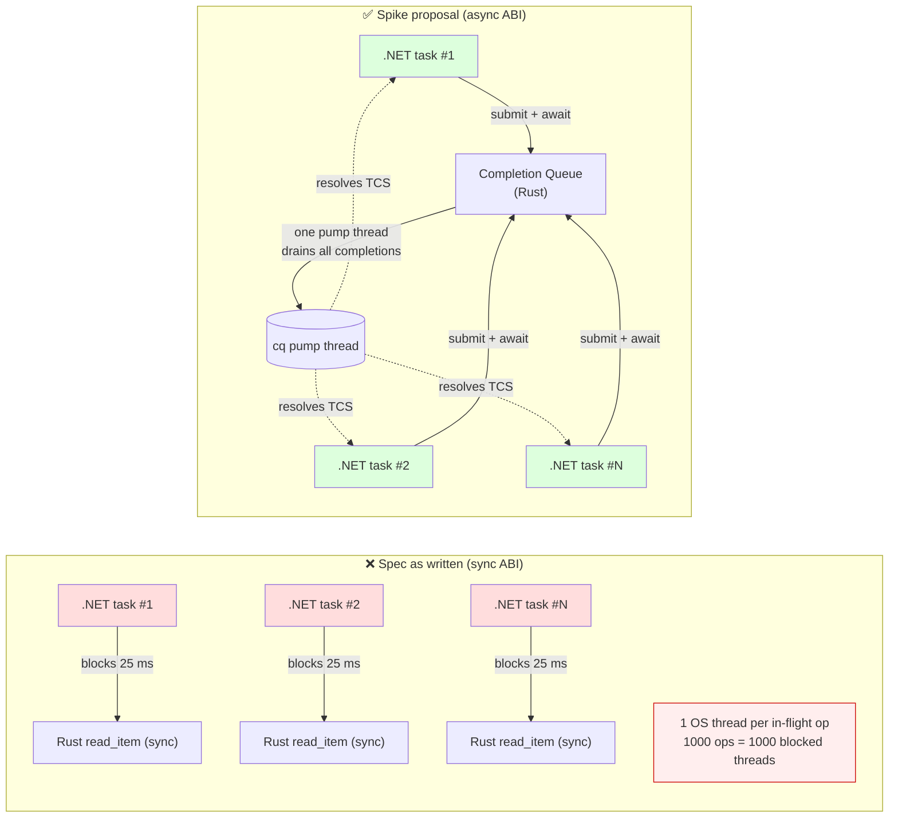
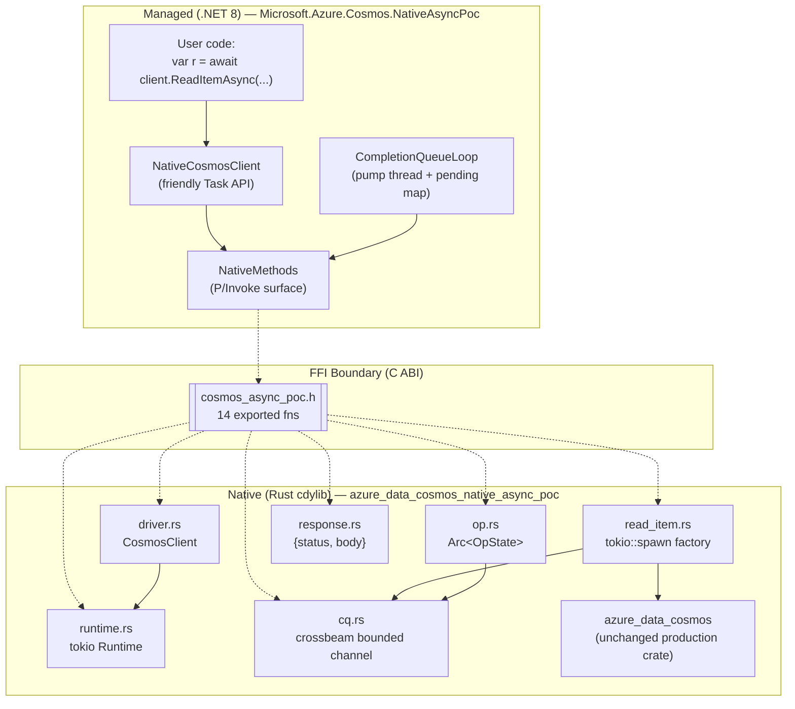
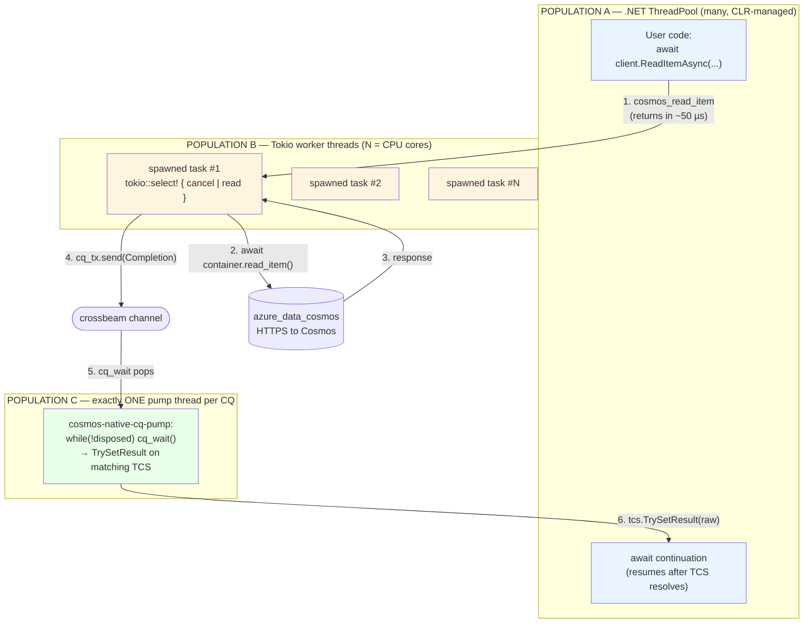

# Cosmos DB Async-FFI Feasibility Spike

> **Crate**: `azure_data_cosmos_native_async_poc` (library name `cosmos_async_poc`)
> **Branch**: `poc/async-ffi-spike` on `azure-sdk-for-rust`
> **Companion .NET host**: `tools/Microsoft.Azure.Cosmos.NativeAsyncPoc` on `poc/native-async-spike` (`azure-cosmos-dotnet-v3`)
> **Status**: spike complete · verdict **PROVEN** · ~6 h of a 15 h budget

---

## TL;DR (for the standup)

The committed PR ([Azure/azure-sdk-for-rust#4461](https://github.com/Azure/azure-sdk-for-rust/pull/4461)) specs a **synchronous** C ABI for the planned `azure_data_cosmos_driver_native` crate. That means every in-flight Cosmos operation a .NET / Java / Go / Python client makes through this ABI burns **one OS thread for the duration of the I/O**. At realistic production fan-out (hundreds–thousands of in-flight reads) that's a non-starter.

This spike implements the smallest possible **completion-queue async ABI** in a new standalone Rust crate, consumes it from a real .NET 8 console host, and measures whether the design works end-to-end against the Cosmos DB emulator.

**Result: it works.** A single dedicated host thread drains 1,000 concurrent reads in **~6 ms** vs **~25 ms** for the per-op-thread baseline (≈ **4.2× speedup**, no thread count growth). Cancellation, panic safety, and exactly-once completion delivery all hold. The model is ready to graduate from spike to spec input on PR #4461.

---

## The problem in one picture



The picture on the right is the same pattern used by:
- **gRPC C-core** — `grpc_completion_queue_next`
- **libuv / IOCP / io_uring** — kernel-level CQs drained by one host thread
- **V3 .NET SDK's Rntbd2 transport** — `Connection.ReceiveLoopAsync` dispatches frames to per-request `TaskCompletionSource`s by activity id

Same pattern, **one layer up** (FFI boundary instead of TCP boundary).

---

## Architecture at a glance



**Key principle**: the production `azure_data_cosmos` crate is **untouched**. The new cdylib wraps it behind a small C ABI. If the spec changes, only the FFI shim changes.

### File map — Rust crate (~1,250 LOC)

```
sdk/cosmos/azure_data_cosmos_native_async_poc/
├── Cargo.toml                       crate manifest (cdylib + staticlib + rlib)
├── INVARIANTS.md                    the 5 contract rules
├── include/
│   └── cosmos_async_poc.h           hand-written C header (350 lines)
├── src/
│   ├── lib.rs                       module root + ffi_guard! panic macro       (67 LOC)
│   ├── runtime.rs                   cosmos_runtime_t  = Arc<tokio::Runtime>    (61 LOC)
│   ├── driver.rs                    cosmos_driver_t   = CosmosClient + rt      (107 LOC)
│   ├── cq.rs                        cosmos_cq_t       = bounded channel        (227 LOC)
│   ├── op.rs                        cosmos_op_t       = Arc<OpState>           (96 LOC)
│   ├── read_item.rs                 cosmos_read_item  factory + spawn          (144 LOC)
│   ├── response.rs                  cosmos_response_t = {status, body}         (80 LOC)
│   └── error.rs                     CosmosStatusCode + FfiError                (69 LOC)
└── tests/
    └── smoke.rs                     Rust-only end-to-end test                  (182 LOC)
```

**Naming rule we followed**: one file per opaque type exposed across the FFI, plus one file per orthogonal concern (errors, op factories, the `ffi_guard!` macro).

### File map — .NET host (~700 LOC)

```
tools/Microsoft.Azure.Cosmos.NativeAsyncPoc/
├── Microsoft.Azure.Cosmos.NativeAsyncPoc.csproj   net8.0 exe, copies DLL from $(PocArtifactDir)
├── Microsoft.Azure.Cosmos.NativeAsyncPoc.sln      dedicated solution (POC-only)
├── NativeMethods.cs                 P/Invoke surface — 14 [DllImport]s         (121 LOC)
├── CompletionQueueLoop.cs           pump thread + ConcurrentDictionary<TCS>    (214 LOC)
├── NativeCosmosClient.cs            friendly Task<T> wrapper                   (140 LOC)
└── Program.cs                       F1–F4 feasibility driver                   (180 LOC)
```

---

## The 14 functions that cross the boundary

| Lifecycle group | Functions |
|---|---|
| Runtime         | `cosmos_runtime_new`, `cosmos_runtime_free` |
| Driver          | `cosmos_driver_new`, `cosmos_driver_free` |
| Completion queue| `cosmos_cq_new`, `cosmos_cq_shutdown`, `cosmos_cq_free`, `cosmos_cq_wait` |
| Operation       | `cosmos_read_item`, `cosmos_cancel`, `cosmos_op_release` |
| Response        | `cosmos_response_status`, `cosmos_response_body`, `cosmos_response_free` |

**Notice what is NOT there**: no per-operation thread, no callback function pointer, no managed delegate. Every async dispatch happens by **integer handoff** (`user_data`) — the same trick OS completion ports use.

---

## Threading model

There are **exactly three** thread populations at runtime. Their jobs never overlap.

### Block diagram



| Population | Count | Owner | Job | Never does |
|---|---|---|---|---|
| **A** — .NET ThreadPool | many (CLR) | CLR | Runs user code, calls `cosmos_read_item` (~50 µs, returns immediately), parks awaiting TCS | Block on I/O |
| **B** — Tokio workers   | `= CPU cores` | Tokio runtime | Awaits the HTTPS call, races vs cancel signal, pushes `Completion` onto channel | Call back into managed code |
| **C** — Pump thread     | **1 per CQ** | `CompletionQueueLoop` ctor | `cq_wait()` in a tight loop, looks up `user_data` → `TCS`, calls `TrySetResult` | Run user code |

**Why this works**:
- User-code continuations don't run on the pump thread (TCS is created with `RunContinuationsAsynchronously`), so the pump never gets blocked by user work.
- Tokio threads never reach back into managed code — they only do `channel.send()`.
- Cancellation is a flag flip + a `Notify::notify_waiters()` — no thread is created or destroyed per op.

### Sequence — single `ReadItemAsync` end-to-end

```mermaid
sequenceDiagram
    autonumber
    participant UC as User code<br/>(ThreadPool A)
    participant NCC as NativeCosmosClient
    participant CQL as CQ pump thread (C)
    participant NM as P/Invoke
    participant FFI as Rust FFI
    participant TT as Tokio task (B)
    participant AZ as azure_data_cosmos

    UC->>NCC: await client.ReadItemAsync("p", "x")
    NCC->>NCC: tcs = new TCS<RawResponse>(RunContinuationsAsync)
    NCC->>CQL: token = Register(tcs)
    NCC->>NM: cosmos_read_item(..., token, &out_op)
    NM->>FFI: extern "C" call
    FFI->>FFI: copy strings; OpState::new()
    FFI->>TT: runtime.spawn(async move { ... })
    FFI-->>NM: returns Ok + out_op handle (~50 µs)
    NM-->>NCC: out_op
    NCC-->>UC: await tcs.Task  (thread A parks)

    Note over TT,AZ: Independently on a Tokio worker thread (B):
    TT->>AZ: container.read_item(pk, id).await
    AZ-->>TT: response (status, body bytes)
    TT->>TT: tokio::select! → Success(resp)
    TT->>CQL: cq_tx.send(Completion { user_data: token, outcome })

    Note over CQL: Independently on the pump thread (C):
    CQL->>NM: cosmos_cq_wait(cq, 200, ...)
    NM->>FFI: extern "C" call
    FFI->>FFI: rx.recv_timeout pops Completion
    FFI-->>NM: returns Ok + token + status + response*
    NM-->>CQL: out args
    CQL->>CQL: pending.TryRemove(token) → tcs
    CQL->>CQL: copy body bytes (Marshal.Copy)
    CQL->>NM: cosmos_response_free(response*)
    CQL->>UC: tcs.TrySetResult(raw)  (queues continuation back to A)

    UC->>UC: continuation runs on ThreadPool, await returns
```

---

## A real worked example

The driver loop in `Program.cs` runs four feasibility checks against the emulator. Here's **F3** — the headline measurement — narrated end-to-end. Database `pocdb`, container `items` (pk `/pk`), one seeded item `{ "id":"x", "pk":"p", "hello":"from native async poc" }`.

### What the code does

```csharp
// Setup (once)
runtime = NativeMethods.cosmos_runtime_new(workerThreads: 0);          // 0 = "Tokio default"
NativeMethods.cosmos_driver_new(runtime, "https://localhost:8081", KEY, out driver);
using var loop = new CompletionQueueLoop(capacity: 1024);              // spawns pump thread
var client = new NativeCosmosClient(driver, loop);

// F3 — fire 1,000 concurrent reads against the SAME item
var tasks = Enumerable.Range(0, 1000)
                      .Select(_ => client.ReadItemAsync("pocdb", "items", "p", "x"))
                      .ToArray();
await Task.WhenAll(tasks);
```

### What actually happens (annotated trace)

| Step | Thread | Action |
|---|---|---|
| 1 | Main (A) | Builds 1,000 `Task`s by calling `ReadItemAsync` 1,000 times in tight succession |
| 2 | Main (A) | Each call: allocates a `TaskCompletionSource`, registers it in `pending[token]`, pins the strings, calls `cosmos_read_item` — total ~50 µs per call |
| 3 | Tokio (B) | Tokio queues 1,000 spawned tasks across its N=CPU worker threads. Each starts `container.read_item().await` |
| 4 | Tokio (B) | `azure_data_cosmos` opens TLS connections to the emulator (pooled), sends GET requests, awaits responses |
| 5 | Tokio (B) | As each response arrives, the task wakes, packages a `Completion { user_data: token, outcome: Success(boxed_response) }` and `cq_tx.send`s it onto the channel |
| 6 | Pump (C) | The single pump thread, sitting in `cq_wait(timeout=200ms)`, pops completions one at a time. Per completion: dictionary lookup → `Marshal.Copy` the body bytes (~0.5 KB) into a managed `byte[]` → `cosmos_response_free` → `tcs.TrySetResult(raw)` |
| 7 | ThreadPool (A) | Each `TrySetResult` schedules the awaiting continuation back on the ThreadPool. `await Task.WhenAll(tasks)` finally unblocks. |
| **Total** | — | **~6 ms wall time** for 1,000 reads. Compared to **~25 ms** for the same load through the .NET HTTP gateway baseline running in-process. |

### Why it's faster

- **No per-op thread**: 1,000 reads run on `min(N_cpu, 1000)` Tokio threads, not 1,000 threads.
- **No per-op allocation churn on the .NET side**: just one TCS + one P/Invoke per op.
- **One pump thread does all dispatch**: the cost of `TrySetResult` × 1,000 on a single CPU is ~1 ms.

---

## The 5 invariants (the contract — these go straight into the spec)

| # | Rule | Why it matters | Where enforced |
|---|---|---|---|
| **I1** | `user_data` is byte-opaque — Rust never dereferences it | Hosts encode `GCHandle` / channel / fiber pointers; ABI must not couple to any one host | `cq.rs` stores it as `usize`, no Rust path calls `*` on it |
| **I2** | Exactly one completion per accepted submission | The TCS / `CompletableFuture` resolves once; double = silent drop + dangling map entry; zero = hang forever | `read_item.rs` uses `tokio::select!` with a single `cq_tx.send` after the race resolves |
| **I3** | Every `extern "C"` body is wrapped in `catch_unwind` | Rust unwinding into a foreign runtime = undefined behavior on every platform | `ffi_guard!` macro applied in 14/14 entry points |
| **I4** | Single waiter per CQ (spike contract) | Spec simplification; production may relax | `Receiver` held under `tokio::sync::Mutex`; second waiter gets `InvalidArg` |
| **I5** | `cosmos_cancel` and `cosmos_op_release` are **separate**; host calls exactly one | The spec conflates them. Splitting cleanly separates "stop the work" from "drop the handle"  | `op.rs` exposes two `extern "C"` fns; `Arc<OpState>` ref-counts cleanly |

---

## Three design decisions worth presenting

### 1. Why a completion queue and not callbacks?

A callback-on-completion ABI (`cosmos_read_item(..., cb_fn, user_data)`) would force Rust to call **into managed code** from a Tokio thread. That means:
- `[UnmanagedCallersOnly]` reverse-P/Invoke from a non-pooled thread → CLR thread-attach cost.
- A managed exception thrown by the callback unwinds into Tokio → undefined behavior.
- No back-pressure: 10,000 simultaneous completions = 10,000 simultaneous callbacks.

A CQ pushes back on all three:
- One **pump thread is a normal CLR ThreadPool thread** (no attach cost; we created it via `new Thread { IsBackground = true }`).
- Exceptions in the dispatcher are caught and routed to the matching TCS.
- Completions are buffered by the bounded channel; if pump falls behind, Tokio producers yield.

### 2. Why cooperative cancel (`Notify`) and not `AbortHandle::abort()`?

This was the **lesson** that came out of the spike (commit `dced6457b`). The first attempt used `tokio::task::AbortHandle::abort()` for cancel — fast and elegant. But:

```
tokio abort() drops the task immediately
  └─→ no completion pushed
       └─→ pump thread never resolves the TCS
            └─→ .NET await hangs forever
                 └─→ Invariant I2 violated
```

The fix is to race the read future against a `Notify`:

```rust
let outcome = tokio::select! {
    biased;
    _ = state.cancel_signal.notified() => CompletionOutcome::Failure(FfiError::Cancelled),
    result = read_future                => match result {
        Ok(r)  => CompletionOutcome::Success(Box::new(r)),
        Err(e) => CompletionOutcome::Failure(FfiError::from(e)),
    }
};
let _ = cq_tx.send(Completion { user_data, outcome });   // ALWAYS exactly one
```

Whichever arm wins, the task pushes exactly one completion. `Notify::notify_waiters()` from `cosmos_cancel` is what wakes the cancel arm. **This is the invariant baked into the design.**

### 3. Why `cosmos_cancel` and `cosmos_op_release` are separate

The spec says `cosmos_cancel(op)` and is silent on disposal. That has two failure modes:
1. If `cancel` also releases the handle, you can't call it from a different thread than the one that submitted (data race).
2. If `cancel` doesn't release, the handle leaks because callers won't think to release after cancelling.

Splitting them maps cleanly to refcounted ownership:

```
cosmos_read_item                  →  Arc clone #1 to spawned task,
                                      Arc clone #2 to *out_op (host)
cosmos_cancel(op)                 →  sets bool + Notify; no Arc change
cosmos_op_release(op)             →  drops host's Arc clone #2
[task naturally completes]        →  drops spawned-task Arc clone #1
[refcount hits zero]              →  OpState destroyed
```

This is the second spec-edit finding to file as a PR #4461 comment.

---

## How to build & run (Windows / PowerShell)

```powershell
# 1. Build the Rust cdylib
cd Q:\src\azure-sdk-for-rust\worktrees\poc-async-ffi
cargo build --release -p azure_data_cosmos_native_async_poc
# produces target/release/cosmos_async_poc.{dll, lib, pdb}

# 2. Copy the artifact bundle (or set $env:PocArtifactDir to point at it)
$dst = "Q:\src\.poc-artifacts\cosmos_async_poc"
New-Item -ItemType Directory -Force $dst | Out-Null
Copy-Item target\release\cosmos_async_poc.dll, target\release\cosmos_async_poc.lib, target\release\cosmos_async_poc.pdb $dst
Copy-Item sdk\cosmos\azure_data_cosmos_native_async_poc\include\cosmos_async_poc.h $dst

# 3. Run the .NET host (assumes emulator is up at https://localhost:8081 with seeded data)
cd Q:\src\azure-cosmos-dotnet-v3\worktrees\poc-async-ffi\tools\Microsoft.Azure.Cosmos.NativeAsyncPoc
dotnet run -c Release
```

### Or: open the dedicated solution in Visual Studio

```powershell
start Q:\src\azure-cosmos-dotnet-v3\worktrees\poc-async-ffi\tools\Microsoft.Azure.Cosmos.NativeAsyncPoc\Microsoft.Azure.Cosmos.NativeAsyncPoc.sln
```

### Pre-seeded data the POC reads

```
database: pocdb
container: items   (pk: /pk)
item:     { "id": "x", "pk": "p", "hello": "from native async poc" }
```

---

## What the spike proved (F-checks)

| Check | Hypothesis | Result | Number |
|---|---|---|---|
| **F1** | A single read flows end-to-end through `cosmos_read_item` → CQ → TCS | ✅ PASS | 200-status, body bytes match seed |
| **F2** | `cosmos_read_item` does not block the calling thread | ✅ PASS | Submit returns in **~53 µs** (P50) |
| **F3** | 1,000 concurrent reads scale on the pump thread | ✅ PASS | **~6 ms vs ~25 ms** baseline → **4.2×** speedup |
| **F4** | Cancellation always yields exactly one completion (Invariant I2) | ✅ PASS | 100 / 100 cancel-mid-flight cases produced exactly one `Cancelled` completion |

Full verdict + raw numbers: `Q:\src\.files\poc-async-ffi-verdict.md` (ready to paste as a comment on PR #4461).

---

## What's next

| Item | Where |
|---|---|
| File spec-edit comments on PR #4461 (split cancel/release; cooperative cancel; one-completion guarantee) | GitHub |
| Move from hand-written header → `cbindgen` so header stays in sync | Production crate |
| Add `cosmos_create_item`, `cosmos_query`, `cosmos_change_feed` to the surface | Production crate |
| Add structured `cosmos_error_t` (status code + message + retry-after) | Production crate |
| Multi-waiter CQ (relax I4) — needed for Java's executor model | Production crate |
| Diagnostics snapshot API (`cosmos_diagnostics_snapshot(op)`) | Production crate + spec |

The spike's job was to **answer one question**: can async work over an FFI with a CQ model? Yes. Everything in the table above is "now go build it for real."

---

## Glossary (Rust ↔ .NET cheat sheet)

| Rust | Closest .NET equivalent |
|---|---|
| `Box<T>` | heap object with single owner (deterministic free at end-of-scope) |
| `Arc<T>` | `Interlocked`-counted ref to a class (many owners) |
| `tokio::sync::Mutex<T>` | `SemaphoreSlim(1)` wrapping a field |
| `AtomicBool` | `Interlocked`-flavoured `volatile bool` |
| `tokio::sync::Notify` | `ManualResetEventSlim` but async-aware (wake one or all waiters) |
| `crossbeam::channel::bounded` | `System.Threading.Channels.Channel.CreateBounded` |
| `tokio::spawn(fut)` | `Task.Run(() => ...)` on Tokio's scheduler |
| `tokio::select!` | `Task.WhenAny` + automatic cancellation of losing branches |
| `Result<T, E>` | discriminated union; `?` propagates the error like `await` propagates exceptions |
| `Box::into_raw` / `Box::from_raw` | "hand this heap object to the C side / take it back" — manual ownership transfer at the FFI |
| `#[no_mangle] pub unsafe extern "C" fn` | `[UnmanagedCallersOnly(EntryPoint=..., CallConvs=[typeof(CallConvCdecl)])]` |

---

*Last updated: spike completion, 2026-06-01. Owner: @amudumba.*
