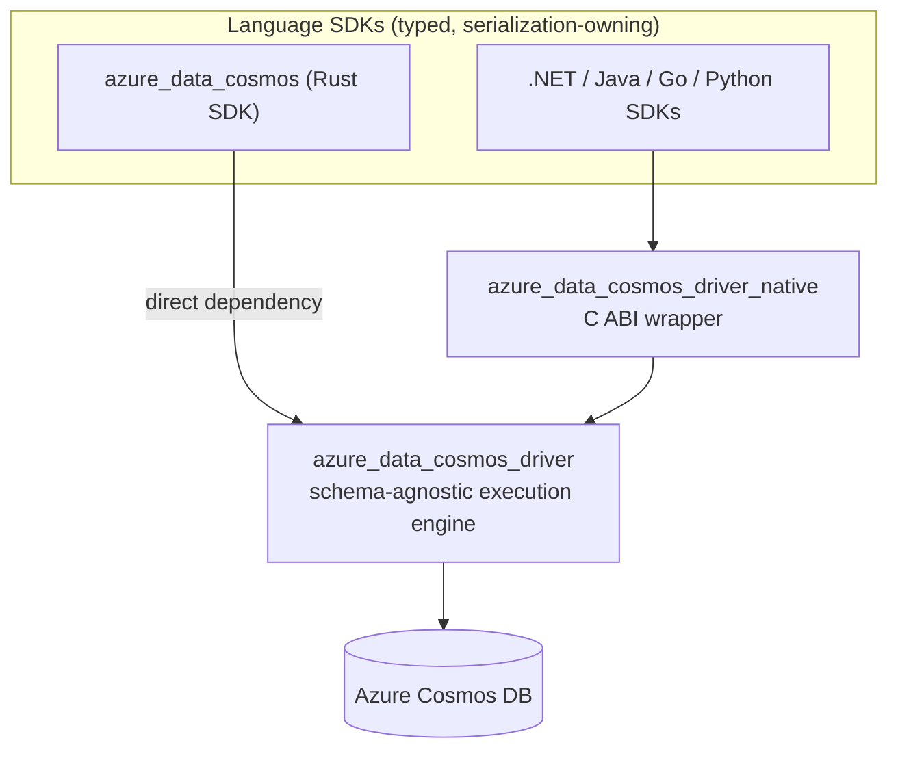

# Azure Cosmos DB SDK for Rust — Architecture Overview

This is an orientation document. It explains the layers, the path a request
takes, and where shared state lives, so you can tell which crate and which
pipeline owns a behavior. It deliberately avoids component inventories, retry
tables, and per-module detail — those live in the numbered [specs](specs/) and
[ADRs](adrs/) linked throughout.

## Layers

The split between SDK, driver, and native wrapper is a finalized decision; see
[adrs/0001-sdk-driver-native-layering.md](adrs/0001-sdk-driver-native-layering.md)
for the alternatives that were rejected.

**`azure_data_cosmos` — the typed SDK.** Owns the public API, `serde`
serialization, typed models and responses, query/feed ergonomics, layered
options, telemetry emission, and feature-gated basic database/container CRUD
([adrs/0013-basic-control-plane-operations.md](adrs/0013-basic-control-plane-operations.md)).
It translates its public types into driver concepts, delegates execution, and
translates results back. Nothing about routing, retries, or transport lives
here; the driver is a required dependency with no legacy fallback path
([adrs/0003-sdk-requires-driver.md](adrs/0003-sdk-requires-driver.md)), and
[specs/0004-sdk-to-driver-cutover.md](specs/0004-sdk-to-driver-cutover.md)
describes the translation pattern every operation follows.

**`azure_data_cosmos_driver` — the engine.** Owns operation execution:
authorization, endpoint routing, region failover, retries and hedging, session
consistency, connection management, query dataflow, and diagnostics collection.
It is deliberately ignorant of item schemas
([adrs/0002-schema-agnostic-driver-boundary.md](adrs/0002-schema-agnostic-driver-boundary.md)).

**`azure_data_cosmos_driver_native` — the interop boundary.** A stable C ABI
over the same engine, using a completion-queue-style async model so callers with
their own runtimes can drive it, with data crossing the boundary as flat
`#[repr(C)]` structs
([adrs/0005-flat-native-abi-data-model.md](adrs/0005-flat-native-abi-data-model.md)).
The Rust SDK does **not** go through this layer. See
[specs/0019-native-wrapper.md](specs/0019-native-wrapper.md) and
[specs/0020-native-async-invocation.md](specs/0020-native-async-invocation.md).

**Supporting crates.** `azure_data_cosmos_macros` generates layered option
types; `azure_data_cosmos_emulator` hosts the driver's in-memory emulator over
real ports for cross-client testing
([specs/0021-in-memory-emulator.md](specs/0021-in-memory-emulator.md),
[specs/0027-hosted-emulator.md](specs/0027-hosted-emulator.md)); the
observability harness, perf CLI, and benchmarks exercise diagnostics, scale, and
driver overhead respectively. None of these are part of the supported surface —
see [Project.md](Project.md).

## Request lifecycle

A typed SDK call becomes bytes on the wire and typed results again:

1. **SDK translation.** The client serializes the item (when there is one),
   converts partition keys, resource references, and options into driver types,
   and builds a `CosmosOperation`.
2. **Driver entry.** `execute_operation` takes the operation plus resolved
   options and enters the execution pipelines. Account and container metadata
   were resolved during fallible async client construction; partition key ranges
   are loaded lazily on the first operation that needs them. See
   [adrs/0010-metadata-resolution-and-client-construction.md](adrs/0010-metadata-resolution-and-client-construction.md).
3. **Planning and pagination.** For feed operations, a dataflow pipeline decides
   which partitions to contact and in what order, and advances one page per call.
   Point operations are a single trivial leaf.
4. **Operation attempt.** The operation pipeline selects a region and endpoint,
   applies session tokens, and issues an attempt — possibly hedged into a second
   region — retrying across regions when the outcome warrants it.
5. **Transport attempt.** The transport pipeline signs the request, applies
   common headers, enforces the deadline, and performs a single attempt against
   one endpoint, retrying locally for throttling and connectivity.
6. **Response assembly.** Raw bytes, headers, and an operation-scoped
   diagnostics record flow back out. The SDK deserializes the payload into typed
   models and hands the diagnostics record to its emission chain. Errors retain
   one HTTP Status/SubStatus classification across driver, SDK, and FFI; see
   [adrs/0011-status-substatus-error-taxonomy.md](adrs/0011-status-substatus-error-taxonomy.md).

## Execution pipelines

The driver separates three concerns that are often tangled together. Each has a
distinct retry scope, and pushing behavior into the wrong one is the most common
architectural mistake in this codebase. The tiering itself is settled — see
[adrs/0004-three-tier-execution-pipeline.md](adrs/0004-three-tier-execution-pipeline.md).

| Pipeline | Scope | Owns |
| --- | --- | --- |
| **Dataflow** | Whole feed operation, across pages and partitions | Query/change-feed plans as a tree of nodes, partition fan-out and ordering, merges, continuation tokens, repair after partition splits |
| **Operation** | One logical request, across regions and attempts | Region selection, cross-region failover, hedging, per-partition failover and circuit breaking, session token resolution, diagnostics aggregation |
| **Transport** | One attempt against one endpoint | Authorization and common headers, throttling and connectivity retry, request-sent tracking, deadline enforcement, per-attempt diagnostics events |

Below the transport pipeline sits an adaptive HTTP layer that picks a
sharded HTTP/2 path or a single HTTP/1.1 client based on the negotiated gateway
flavor. The driver owns those HTTP clients, pools, and Gateway V2 codecs rather
than exposing a public transport pipeline; see
[adrs/0006-internal-http-transport.md](adrs/0006-internal-http-transport.md).

Pipeline stages are plain functions over small, mostly immutable state
components rather than methods on a mutable context, which is what makes each
stage testable in isolation. The full design is in
[specs/0005-operation-and-transport-pipelines.md](specs/0005-operation-and-transport-pipelines.md);
feed semantics are in
[specs/0012-feed-operations-and-dataflow.md](specs/0012-feed-operations-and-dataflow.md)
and [specs/0013-query-engine.md](specs/0013-query-engine.md).

## Shared state

Long-lived state is concentrated in a few areas. The recurring pattern: mutable
state is updated centrally and behind concurrency-safe primitives, while each
execution step reads an **immutable snapshot** so a single attempt sees a
consistent view and cannot be perturbed mid-flight.

- **Routing and endpoints.** A unified location state store holds account
  endpoint state, per-partition overrides, and availability information; each
  operation-loop iteration consumes a point-in-time snapshot of it. Background
  probes and outcome-driven effects update the store rather than mutating a
  live view. The default account endpoint is reserved for topology discovery;
  steady-state operations use regional endpoints. See
  [adrs/0012-regional-endpoint-routing.md](adrs/0012-regional-endpoint-routing.md),
  [specs/0008-partition-level-failover.md](specs/0008-partition-level-failover.md)
  and [specs/0009-cross-region-hedging.md](specs/0009-cross-region-hedging.md).
- **Metadata caches.** Account metadata, container properties, and partition key
  ranges are cached with single-pending-I/O (single-flight) semantics. Account
  and container metadata are resolved eagerly during client construction;
  partition key ranges remain lazy. See
  [adrs/0010-metadata-resolution-and-client-construction.md](adrs/0010-metadata-resolution-and-client-construction.md)
  and
  [specs/0007-partition-key-range-cache.md](specs/0007-partition-key-range-cache.md).
- **Sessions.** Session tokens are captured from responses and resolved per
  request by a session manager, gated on consistency level and on whether the
  operation targets the master (metadata) partition. See
  [specs/0026-session-consistency.md](specs/0026-session-consistency.md).
- **Diagnostics.** Every operation produces exactly one immutable,
  operation-scoped diagnostics record containing per-attempt details — region,
  endpoint, status, charge, timing, execution context. The driver always
  collects it; the SDK decides what to emit. See
  [adrs/0014-diagnostics-collection-and-emission.md](adrs/0014-diagnostics-collection-and-emission.md)
  and
  [specs/0018-diagnostics-contract.md](specs/0018-diagnostics-contract.md).
- **Configuration.** Options resolve across environment, runtime, account, and
  operation layers, with the effective values read as a snapshot at execution
  time. See
  [adrs/0008-layered-operation-configuration.md](adrs/0008-layered-operation-configuration.md),
  [adrs/0009-environment-variables-are-options.md](adrs/0009-environment-variables-are-options.md),
  [specs/0001-configuration-options.md](specs/0001-configuration-options.md)
  and [specs/0002-hierarchical-configuration-model.md](specs/0002-hierarchical-configuration-model.md).

Process-wide resources — connection pools, background tasks, caches — hang off a
runtime that is expensive to create and meant to be created once; per-account
drivers are cheap and share that runtime.

## The serialization boundary

This is the sharpest architectural line in the project.

- **The SDK is typed.** It serializes requests and deserializes responses with
  `serde`, and exposes typed models and responses to applications. Response
  metadata handling is specified in
  [specs/0003-response-metadata.md](specs/0003-response-metadata.md).
- **The driver is bytes.** Data plane request bodies are `&[u8]` and responses
  are buffered `Vec<u8>`. The driver does not know, and must not assume,
  anything about item shape. Payloads may be UTF-8 JSON or the Cosmos binary
  encoding, detected transparently — see
  [specs/0014-binary-encoding-high-level-design.md](specs/0014-binary-encoding-high-level-design.md)
  and [specs/0015-binary-encoding.md](specs/0015-binary-encoding.md).
- **The driver does parse some metadata.** Account and container properties are
  deserialized internally to populate routing caches. That is control plane
  state, not customer data.
- **One deliberate exception.** PATCH is implemented as a driver-side
  read-modify-write loop because the service does not offer the required
  semantics, so a single isolated handler parses a data plane body. Every other
  stage still treats bodies as opaque. See
  [specs/0017-patch-handler.md](specs/0017-patch-handler.md).

## Where to go next

- Error classification and retry behavior:
  [specs/0006-error-codes-and-retries.md](specs/0006-error-codes-and-retries.md)
- Gateway 2.0 protocol support:
  [specs/0011-gateway-v2.md](specs/0011-gateway-v2.md)
- Hub-region routing headers:
  [specs/0010-hub-region-processing-header.md](specs/0010-hub-region-processing-header.md)
- Distributed transactions (preview):
  [specs/0022-distributed-transactions.md](specs/0022-distributed-transactions.md)
- Emulator transport security:
  [specs/0023-emulator-transport-security-and-authentication.md](specs/0023-emulator-transport-security-and-authentication.md)
- Hosted emulator:
  [specs/0027-hosted-emulator.md](specs/0027-hosted-emulator.md)
- Fault injection:
  [specs/0024-fault-injection.md](specs/0024-fault-injection.md)
- Throughput control:
  [specs/0025-throughput-control.md](specs/0025-throughput-control.md)
- Session consistency:
  [specs/0026-session-consistency.md](specs/0026-session-consistency.md)
- Finalized decisions and the alternatives they rejected: [adrs/](adrs/)
- Measurements and investigations: [reports/](reports/)
