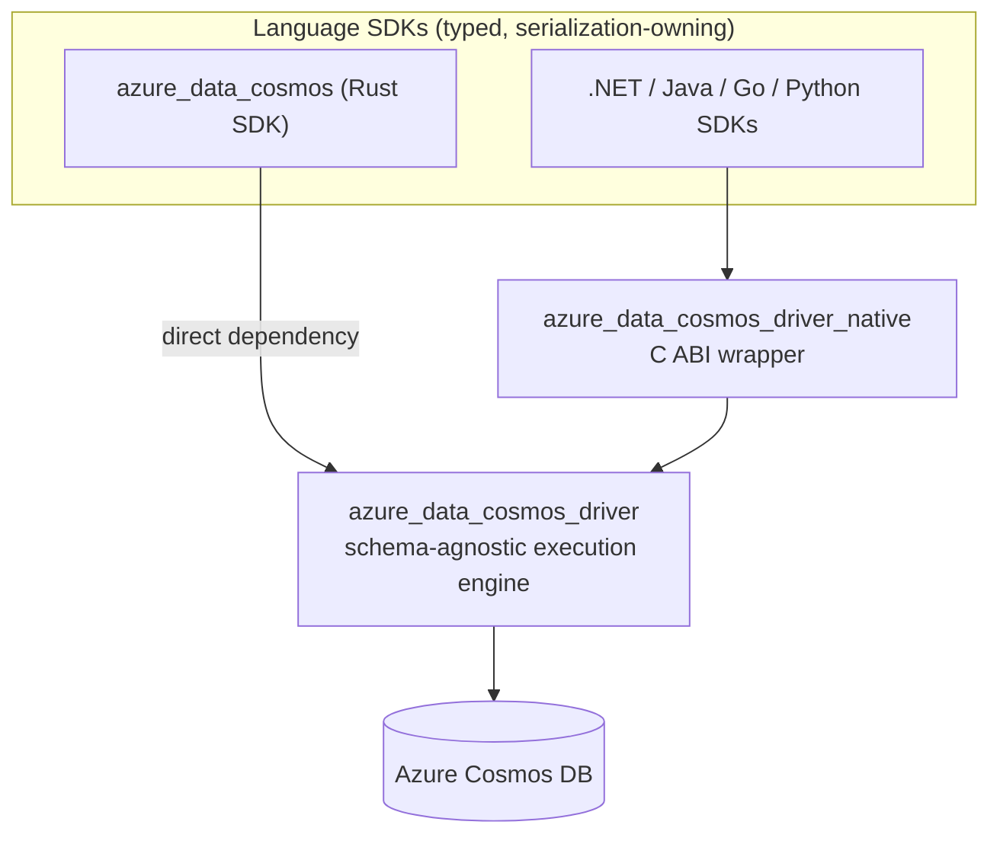

# Azure Cosmos DB SDK for Rust — Architecture Overview

This is an orientation document. It explains the layers, the path a request
takes, and where shared state lives, so you can tell which crate and which
pipeline owns a behavior. It deliberately avoids component inventories, retry
tables, and per-module detail — those live in the numbered specs (`specs/`) and
ADRs (`adrs/`) linked throughout.

## Layers

The split between SDK, driver, and native wrapper is a finalized decision; see
adrs/0001-sdk-driver-native-layering.md (`adrs/0001-sdk-driver-native-layering.md`)
for the alternatives that were rejected.

```mermaid
flowchart TB
    subgraph SDKs["Language SDKs (typed, serialization-owning)"]
        Rust["azure_data_cosmos (Rust SDK)"]
        Other[".NET / Java / Go / Python SDKs"]
    end
    Native["azure_data_cosmos_driver_native<br/>C ABI wrapper"]
    Driver["azure_data_cosmos_driver<br/>schema-agnostic execution engine"]
    Service[("Azure Cosmos DB")]
    Rust -->|direct dependency| Driver
    Other --> Native --> Driver
    Driver --> Service
```

**`azure_data_cosmos` — the typed SDK.** Owns the public API, `serde`
serialization, typed models and responses, query/feed ergonomics, layered
options, telemetry emission, and feature-gated basic database/container CRUD
(adrs/0013-basic-control-plane-operations.md (`adrs/0013-basic-control-plane-operations.md`)).
It translates its public types into driver concepts, delegates execution, and
translates results back. Nothing about routing, retries, or transport lives
here; the driver is a required dependency with no legacy fallback path
(adrs/0003-sdk-requires-driver.md (`adrs/0003-sdk-requires-driver.md`)), and
specs/0004-sdk-to-driver-cutover.md (`specs/0004-sdk-to-driver-cutover.md`)
describes the translation pattern every operation follows.

**`azure_data_cosmos_driver` — the engine.** Owns operation execution:
authorization, endpoint routing, region failover, retries and hedging, session
consistency, connection management, query dataflow, and diagnostics collection.
It is deliberately ignorant of item schemas
(adrs/0002-schema-agnostic-driver-boundary.md (`adrs/0002-schema-agnostic-driver-boundary.md`)).

**`azure_data_cosmos_driver_native` — the interop boundary.** A stable C ABI
over the same engine, using a completion-queue-style async model so callers with
their own runtimes can drive it, with data crossing the boundary as flat
`#[repr(C)]` structs
(adrs/0005-flat-native-abi-data-model.md (`adrs/0005-flat-native-abi-data-model.md`)).
The Rust SDK does **not** go through this layer. See
specs/0019-native-wrapper.md (`specs/0019-native-wrapper.md`) and
specs/0020-native-async-invocation.md (`specs/0020-native-async-invocation.md`).

**Supporting crates.** `azure_data_cosmos_macros` generates layered option
types. `azure_cosmos_change_feed_processor` and
`azure_cosmos_change_feed_processor_engine` are unpublished crates for the
application-facing processor and its execution engine, respectively.
The processor will own configuration, handlers, lifecycle, and state inspection;
the engine will own lease coordination, partition workers, checkpoint persistence, and
load balancing. The initial data-plane path is processor (typed decoding) ->
engine (raw response and continuation) -> driver -> Cosmos DB. Each call reads
LatestVersion or AllVersionsAndDeletes pages with a retained driver plan. A
bounded single-lease coordinator handles delivery, completion, conditional
checkpoint receipts, stop, and ownership-loss handling. A Cosmos-backed session
adds one pre-created lease's acquisition/takeover, independent renewal/watchdog,
and coordinated checkpoint/release. Bounded explicit-plan bootstrap verifies
complete workload coverage and fences readiness; automatic source discovery,
weighted capacity, and a production distributed lifecycle are not implemented.
`azure_data_cosmos_emulator` hosts the driver's in-memory emulator over real
ports for cross-client testing
(specs/0021-in-memory-emulator.md (`specs/0021-in-memory-emulator.md`),
specs/0027-hosted-emulator.md (`specs/0027-hosted-emulator.md`)); the
observability harness, perf CLI, and benchmarks exercise diagnostics, scale, and
driver overhead respectively. None of these are part of the supported surface —
see Project.md (`Project.md`).

## Change feed processor engine

Use six responsibility modules rather than reproducing the Java/.NET class
hierarchy. `ProcessorEngine` is the state owner, not a configuration object.
The fluent builder belongs in the public CFP crate; engine configuration is
plain data with boundary validation.

The public builder consumes independently credential-bound feed and lease
`ContainerBinding` values. One overall preparation deadline covers both
contexts; no processor, bootstrap write, lease authority, or callback is
published on partial failure. Each binding currently uses a fresh runtime/cache
namespace because runtime container-cache keys omit credential identity.
Matching endpoints or cloned templates do not deduplicate credentials.
The engine retains the feed driver/reference, and the public prepared state
retains the lease driver/reference. Polling and lease operations never repeat
CFP-level name resolution; explicit local constructors reuse prepared references.
Driver-managed topology/account refresh and invalidated metadata remain allowed.
Source/group validation prevents a bootstrap plan being applied to a different
prepared RID. Automatic lifecycle supervision and shared live-runtime injection
remain deferred; preparation is not permanent authorization.

| Module | Responsibility | Rust shape |
| --- | --- | --- |
| `processor_engine` | Own validated configuration, running lease tasks, batch delivery and acknowledgments, start/stop, and failure coordination. | One main struct, state types, and async functions. |
| `change_feed_bootstrapper` | Initialize groups and leases safely; reuse reconciliation logic for splits and remapping. | Functions, not a permanent task. |
| `change_feed_poller` | Read a lease's feed through the driver and deliver bounded batches. | Per-lease async loop. |
| `lease_checkpointer` | Persist acknowledged progress with ownership-conditional writes; surface conflicts and failures. | Functions and checkpoint-policy state when needed. |
| `lease_load_balancer` | Decide which leases to acquire or release; the engine applies conditional operations. | Periodic decision function. |
| `lease_renewer` | Renew ownership independently of handler progress; detect ownership loss or an exceeded safety deadline. | Async renewal loop. |

`processor_engine` and `change_feed_poller` now provide connection reuse and a
retained raw reader. `lease_processing` holds one coordinator function, local
owned-lease state, signals, and the minimal source/checkpoint I/O seams. The
public CFP crate independently models and decodes application-facing events;
the core never requires a customer document type.

Only one batch is outstanding. A successful handler acknowledges the batch but
does not advance durable progress; a validated store receipt confirms its
candidate and new revision. Only definitely-not-persisted failures retry,
without rerunning a successful handler. Ambiguous/rejected writes fail with
recovery state. Stop drains within policy; loss revokes completion. An
interrupted write may have committed remotely and must be reconciled.

Current tests include both the fake checkpoint seam and Cosmos-backed ETag
operations from independent runtimes against an in-memory service. The latter
test contention, takeover, stale-owner fencing, and renewal during busy handlers,
but do not prove real-service or multi-writer correctness. A dedicated live test
is gated and requires an existing released test lease and separate authorization.
Automatic bootstrap discovery, weighted balancing, and durable lease
reconciliation remain future work; do not add empty interfaces, factories, or
supervisors to stand in for them. Routing, transport retries, wire codecs, and
feed topology mechanics remain driver responsibilities.

### Lease ownership and progress

`ProcessorEngine` bootstraps or reconciles leases, periodically applies
balancing decisions, and owns one `run_lease(...)` async task per acquired lease.
That function coordinates `read -> deliver -> await acknowledgment -> checkpoint`
while renewal runs independently of handler progress.

Batch completion means actual callback completion plus confirmed durable
checkpointing; batch N+1 cannot begin before both. Callback error, unwinding
panic, or cancellation leaves previous durable progress unchanged. Safe
checkpoint retry does not invoke a successful callback again; uncertain writes
or exhausted authority/budget require stopping and reconciliation. The narrow
callback panic boundary returns a processing failure, not a success fallback.
Whole-task cancellation is observed by its caller; aborting panics remain fatal.
Crash recovery can replay a batch completed by the application but not yet
confirmed in the checkpoint store. Application side effects are not atomically
coupled to that checkpoint.

Each lease has one authoritative local ownership state and store revision.
Renewal and checkpoint writes coordinate their revisions and preserve each
other's fields rather than writing stale independent copies. Store-side
conditional writes enforce ownership across processes. A conflict requires
explicit reconciliation and ownership validation before further writes.

Acknowledgments identify the ownership epoch and delivered batch. Handler
failure or a late acknowledgment must never checkpoint past unfinished work.
On ownership loss or an exceeded ownership-safety deadline, stop admitting
work, revoke delivery, reject obsolete completions, and stop the lease task.

Shutdown drains within the configured policy, attempts conditional release
while ownership is valid, and observes task failures. Interrupted bootstrap or
topology reconciliation preserves recoverable range coverage and progress.
Cover these behaviors with tests as they are implemented; successfully fetching
a page is not evidence that its changes were processed.

If alternate lease stores are required, use one small `LeaseStore` trait.
`Lease`, configuration, and error/state enums are data models, not additional
architectural layers.

### Cosmos-backed authority for one lease

`cosmos_lease_store` owns one pre-created point record addressed by item ID and
partition key. Acquisition and takeover increment a stored generation using
the observed ETag. A contender observes an occupied record unchanged for the
persisted lease interval before takeover; local authority uses a shorter
monotonic safety interval measured from the start of a confirmed write.
Policies require whole-millisecond durations and renewal headroom. Timer drift
must be bounded by the margin; suspension must consume authority time.

The store requires a single-write-region lease account, explicitly acknowledged
by `new_single_writer`; the driver currently has no production public account
capability accessor for automatic verification. Multi-writer conflict resolution
is not a global ownership fence.

A `LeaseSession` owns the authoritative record/revision. Its async mutex
serializes only lease writes, not handlers. The independent watchdog does not
wait for that mutex. Renewal continues during handling and preserves progress;
checkpoint uses the latest session revision and preserves ownership fields.
Failed/ambiguous writes and expiry revoke the session, rather than rebasing
stale authority on another worker's revision. Processing, maintenance, and
conditional release outcomes are separate. Cancellation leaves no detached
maintenance task and may leave an uncertain write requiring reconciliation.

Ownership decisions are functions over focused record/policy/timing inputs:
eligibility, checkpoint/release proposals, authority checks, and write-window
confirmation have no I/O or hidden clock reads. The async shell samples clocks,
executes CAS writes, and publishes the validated state. The canonical record
and ETag produce derived `OwnedLease` snapshots; they are not maintained as
two copies. Internal enums represent active, uncertain-write, or revoked
authority and couple pending processing progress to its phase. Receipt
validation and retry policy are decision functions separate from the async
coordinator. The watchdog's deadline channel remains a deliberate projection
that does not require taking the revision lock.

Bootstrap is separate: its workload-scoped record has the same ID
and partition key for source identity/group, atomic create-if-absent,
immutable mode/start/protocol configuration, initializer generation/revision,
and recoverable starting positions. `Ready` must commit the initialization
generation before work leases are eligible. Non-transactional staged writes
from obsolete initializers cannot activate work or reset checkpoints. Wait,
renewal, takeover, and readiness publication must all respect startup deadlines.
The existing plain pre-created lease path remains separate. Bounded
`bootstrap::ensure_initialized` now persists explicit seed positions/configuration
before creating work. Bootstrap/work records share a `/workload` partition key:
transactional batches fence initializer-owned creation and commit readiness
after ETag-guarded coverage reads. No child checkpoint conversion is performed.

Completeness means coverage of an explicit expected range, not merely that
supplied leases have valid physical mappings. Every startup call rechecks
Ready; failures in discovery/creation cannot publish readiness, and cleanup
does not swallow the original failure. Existing covering parents keep progress;
partial coverage needing token narrowing and unknown generations fail closed.
The winning persisted plan is reused after crashes rather than choosing a new
Now. Callers must establish concrete Now positions before providing seeds.

Bootstrap ownership epochs and initialization generation are distinct.
This bounded protocol retains initialization generation 1 across initializer
takeovers and uses same-partition transactions instead of a cross-partition
staging scheme. `work_lease_store` checks Ready/committed generation atomically
with acquisition; plain stores reject bootstrapped items to prevent bypass.
Automatic source discovery, migration, replacement initialization generations,
continuous background verification, weighted balancing, and topology handoffs remain
future work.

### Equal-count logical-lease balancing

The shared `lease_load_balancer` policy takes explicit lease ownership,
expiry/eligibility, current incarnation, and tie-breaking inputs. It counts
eligible logical leases, not physical partitions. Membership is distinct
non-expired owners plus the current worker; other zero-lease workers are not
globally registered.

The ceiling share is `ceil(L/W)`. Below it, a worker prefers unused/expired work.
Without those candidates, it attempts at most one transfer from a most-loaded
donor whose count is at least two higher. Balanced uneven counts therefore do
not oscillate merely to reach the ceiling.

`LeaseBalancer` reads every inventory page for a Ready workload before planning.
It excludes control records, uncommitted generations, and pending/transitioning/
retired assignments. Page failures are errors, not empty snapshots. Local
liveness history uses unchanged ETags over the persisted observation interval.
One exact-revision pickup or active transfer is attempted; conflicts require
fresh inventory, while uncertain results grant no local processing session.
All ownership changes preserve checkpoints and increment generations.

Confirmed sessions are handed to a prompt work-registration callback. Their
engine renewal/watchdog runs independently of balancing and application work.
Fresh ownership changes revoke known local sessions. Bounded jittered scheduling
has no central dispatcher, weights, or worker registry. Stop requests worker
drain; callers still own/join task handles and inspect release outcomes.
Selection/ETag fencing cannot undo already-running application side effects.
The current workload inventory remains bounded to 32 records and requires the
single-writer/timer assumptions of the lease store.

### Durable topology reconciliation

The shared core's `lease_topology_handler` owns planning durable assignments,
not physical request repair. Startup refreshes topology through
`ProcessorEngine::reconcile_lease_topology`; future bootstrap/runtime callers
must also schedule bounded periodic reconciliation or consume a defined driver
signal. A physical split may be absorbed by `UnorderedMerge` without a 410
reaching CFP.

The current planner keeps logical ranges and their confirmed checkpoints
unchanged across physical splits and merges. This avoids loss of recovery
state, but subdivision for greater lease-level parallelism is deferred. The
public driver has no dedicated checkpoint derivation/composition API for
durable lease handoffs; CFP must not edit opaque tokens or choose a “later”
token from independently advanced ranges.

A future apply/resume function must quiesce parents, conditionally record
`Active -> Transitioning`, idempotently prepare `Pending` replacements, validate
durable coverage, and commit a handoff marker that retires parent authority
before child acquisition is eligible. Preserve retired records/markers until
recovery and activation no longer require them. A merge can retain multiple
logical leases on one physical partition; checkpoint collapse is an optional
separate optimization, not required recovery.

These transition states and durable writes are not implemented by the current
planning-only module. Bootstrap and balancing must reuse this contract rather
than create another hierarchy or acquire pending records prematurely.

## Request lifecycle

A typed SDK call becomes bytes on the wire and typed results again:

1. **SDK translation.** The client serializes the item (when there is one),
   converts partition keys, resource references, and options into driver types,
   and builds a `CosmosOperation`.
2. **Driver entry.** `execute_operation` takes the operation plus resolved
   options and enters the execution pipelines. Account metadata is resolved
   during fallible client construction. Container metadata and, by default, the
   complete partition topology are resolved during fallible container-client
   construction. See
   adrs/0010-metadata-resolution-and-client-construction.md (`adrs/0010-metadata-resolution-and-client-construction.md`)
   and adrs/0015-eager-partition-topology-loading.md
   (`adrs/0015-eager-partition-topology-loading.md`).
3. **Planning and pagination.** For feed operations, a dataflow pipeline decides
   which partitions to contact and in what order, and advances one page per call.
   Point operations are a single trivial leaf.
4. **Operation attempt.** The operation pipeline selects a region and endpoint,
   applies session tokens, and issues an attempt — possibly hedged into a second
   region — retrying across regions when the outcome warrants it.
5. **Transport attempt.** The transport pipeline signs the request, applies
   common headers, enforces the deadline, and performs a single attempt against
   one endpoint, retrying locally for throttling and connectivity.
6. **Response assembly.** Raw bytes, headers, and an operation-scoped
   diagnostics record flow back out. The SDK deserializes the payload into typed
   models and hands the diagnostics record to its emission chain. Errors retain
   one HTTP Status/SubStatus classification across driver, SDK, and FFI; see
   adrs/0011-status-substatus-error-taxonomy.md (`adrs/0011-status-substatus-error-taxonomy.md`).

## Execution pipelines

The driver separates three concerns that are often tangled together. Each has a
distinct retry scope, and pushing behavior into the wrong one is the most common
architectural mistake in this codebase. The tiering itself is settled — see
adrs/0004-three-tier-execution-pipeline.md (`adrs/0004-three-tier-execution-pipeline.md`).

| Pipeline | Scope | Owns |
| --- | --- | --- |
| **Dataflow** | Whole feed operation, across pages and partitions | Query/change-feed plans as a tree of nodes, partition fan-out and ordering, merges, continuation tokens, repair after partition splits |
| **Operation** | One logical request, across regions and attempts | Region selection, cross-region failover, hedging, per-partition failover and circuit breaking, session token resolution, diagnostics aggregation |
| **Transport** | One attempt against one endpoint | Authorization and common headers, throttling and connectivity retry, request-sent tracking, deadline enforcement, per-attempt diagnostics events |

Below the transport pipeline sits an adaptive HTTP layer that picks a
sharded HTTP/2 path or a single HTTP/1.1 client based on the negotiated gateway
flavor. The driver owns those HTTP clients, pools, and Gateway V2 codecs rather
than exposing a public transport pipeline; see
adrs/0006-internal-http-transport.md (`adrs/0006-internal-http-transport.md`).

Pipeline stages are plain functions over small, mostly immutable state
components rather than methods on a mutable context, which is what makes each
stage testable in isolation. The full design is in
specs/0005-operation-and-transport-pipelines.md (`specs/0005-operation-and-transport-pipelines.md`);
feed semantics are in
specs/0012-feed-operations-and-dataflow.md (`specs/0012-feed-operations-and-dataflow.md`)
and specs/0013-query-engine.md (`specs/0013-query-engine.md`).

## Shared state

Long-lived state is concentrated in a few areas. The recurring pattern: mutable
state is updated centrally and behind concurrency-safe primitives, while each
execution step reads an **immutable snapshot** so a single attempt sees a
consistent view and cannot be perturbed mid-flight.

- **Routing and endpoints.** A unified location state store holds account
  endpoint state, per-partition overrides, and availability information; each
  operation-loop iteration consumes a point-in-time snapshot of it. Background
  probes and outcome-driven effects update the store rather than mutating a
  live view. The default account endpoint is reserved for topology discovery;
  steady-state operations use regional endpoints. See
  adrs/0012-regional-endpoint-routing.md (`adrs/0012-regional-endpoint-routing.md`),
  specs/0008-partition-level-failover.md (`specs/0008-partition-level-failover.md`)
  and specs/0009-cross-region-hedging.md (`specs/0009-cross-region-hedging.md`).
- **Metadata caches.** Account metadata, container properties, and partition key
  ranges are cached with single-pending-I/O (single-flight) semantics. Account
  and container metadata are resolved eagerly during client construction.
  Partition key ranges are eagerly loaded during container resolution by
  default; `Lazy` mode defers them until first use as a compatibility escape
  hatch. See
  adrs/0010-metadata-resolution-and-client-construction.md (`adrs/0010-metadata-resolution-and-client-construction.md`)
  and adrs/0015-eager-partition-topology-loading.md
  (`adrs/0015-eager-partition-topology-loading.md`), and
  specs/0007-partition-key-range-cache.md (`specs/0007-partition-key-range-cache.md`).
- **Sessions.** Session tokens are captured from responses and resolved per
  request by a session manager, gated on consistency level and on whether the
  operation targets the master (metadata) partition. See
  specs/0026-session-consistency.md (`specs/0026-session-consistency.md`).
- **Diagnostics.** Every operation produces exactly one immutable,
  operation-scoped diagnostics record containing per-attempt details — region,
  endpoint, status, charge, timing, execution context. The driver always
  collects it; the SDK decides what to emit. See
  adrs/0014-diagnostics-collection-and-emission.md (`adrs/0014-diagnostics-collection-and-emission.md`)
  and
  specs/0018-diagnostics-contract.md (`specs/0018-diagnostics-contract.md`).
- **Configuration.** Options resolve across environment, runtime, account, and
  operation layers, with the effective values read as a snapshot at execution
  time. See
  adrs/0008-layered-operation-configuration.md (`adrs/0008-layered-operation-configuration.md`),
  adrs/0009-environment-variables-are-options.md (`adrs/0009-environment-variables-are-options.md`),
  specs/0001-configuration-options.md (`specs/0001-configuration-options.md`)
  and specs/0002-hierarchical-configuration-model.md (`specs/0002-hierarchical-configuration-model.md`).

Process-wide resources — connection pools, background tasks, caches — hang off a
runtime that is expensive to create and meant to be created once; per-account
drivers are cheap and share that runtime.

## The serialization boundary

This is the sharpest architectural line in the project.

- **The SDK is typed.** It serializes requests and deserializes responses with
  `serde`, and exposes typed models and responses to applications. Response
  metadata handling is specified in
  specs/0003-response-metadata.md (`specs/0003-response-metadata.md`).
- **The driver boundary is byte-oriented and schema-agnostic.** Data plane
  request bodies are `&[u8]` and responses are buffered `Vec<u8>`. The driver
  does not bind application payloads to customer schemas, Rust types, or another
  language SDK's serialization model.
- **Bounded generic processing is allowed.** The driver detects and transcodes
  UTF-8 JSON and Cosmos binary JSON, parses service-defined query envelopes,
  and inspects projected rows for generic operators such as `DISTINCT`. PATCH
  performs a bounded driver-side read-modify-write over a JSON item. These
  stages interpret encoding or JSON structure, but do not acquire knowledge of
  the application's item schema. See
  specs/0014-binary-encoding-high-level-design.md (`specs/0014-binary-encoding-high-level-design.md`),
  specs/0015-binary-encoding.md (`specs/0015-binary-encoding.md`),
  specs/0013-query-engine.md (`specs/0013-query-engine.md`), and
  specs/0017-patch-handler.md (`specs/0017-patch-handler.md`).
- **The driver does parse some metadata.** Account and container properties are
  deserialized internally to populate routing caches. That is control plane
  state, not customer data.

## Where to go next

- Error classification and retry behavior:
  specs/0006-error-codes-and-retries.md (`specs/0006-error-codes-and-retries.md`)
- Gateway 2.0 protocol support:
  specs/0011-gateway-v2.md (`specs/0011-gateway-v2.md`)
- Hub-region routing headers:
  specs/0010-hub-region-processing-header.md (`specs/0010-hub-region-processing-header.md`)
- Distributed transactions (preview):
  specs/0022-distributed-transactions.md (`specs/0022-distributed-transactions.md`)
- Emulator transport security:
  specs/0023-emulator-transport-security-and-authentication.md (`specs/0023-emulator-transport-security-and-authentication.md`)
- Hosted emulator:
  specs/0027-hosted-emulator.md (`specs/0027-hosted-emulator.md`)
- Fault injection:
  specs/0024-fault-injection.md (`specs/0024-fault-injection.md`)
- Throughput control:
  specs/0025-throughput-control.md (`specs/0025-throughput-control.md`)
- Session consistency:
  specs/0026-session-consistency.md (`specs/0026-session-consistency.md`)
- Finalized decisions and the alternatives they rejected: adrs/ (`adrs/`)
- Measurements and investigations: reports/ (`reports/`)
