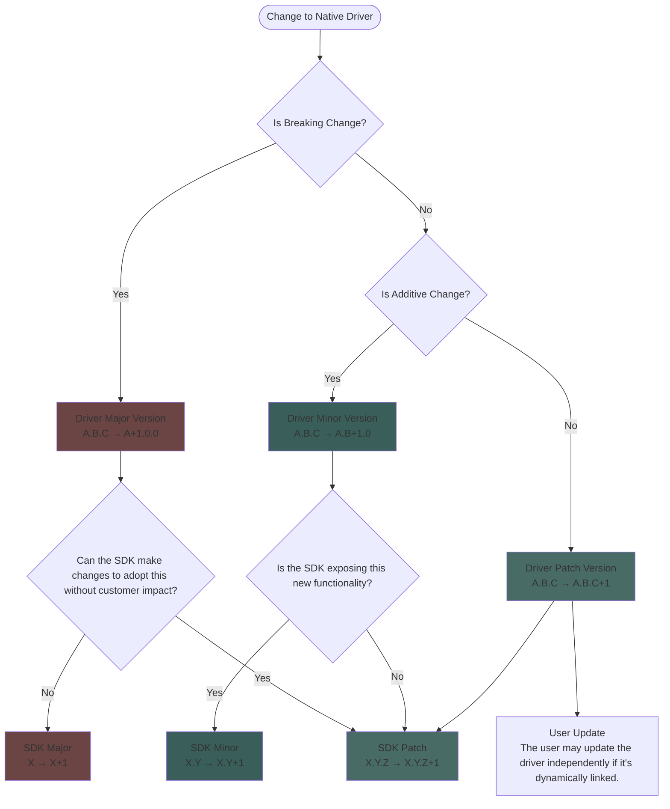

# Native Driver Versioning and Support Policies

## Scope

This document defines the versioning relationship between the Native Driver and wrapping SDKs. It does not cover:
- What constitutes a breaking change in the C FFI API (see Breaking Changes document)
- Specific support lifecycle timelines
- Static vs. dynamic linking deployment decisions (TBD)

## Customer Support Policy

The Native Driver, `azure_data_cosmos_driver`, is considered an **internal** component of the Azure Cosmos DB SDK. It is not _intended_ to be consumed by end-users directly, though nothing prohibits this usage. No formal customer support is provided for direct consumption of the Native Driver.

Internally, the various SDKs are responsible for supporting every version of the Native Driver referenced by an SDK version that is itself supported. However, because the API contract is between the SDK and the Native Driver, the SDK team can align SDKs to newer versions of the Native Driver as needed. 

## Versioning

The Native Driver exposes a C FFI API used by language-specific SDK wrappers, which handle serialization, deserialization, and language-idiomatic interfaces for end-users.

The Native Driver follows Semantic Versioning (SemVer) principles, but as an internal component, it has more flexibility to make breaking changes, as long as those can be adopted by wrapping SDKs without breaking their own versioning guarantees.

Thus, the versioning contract for the Native Driver is between the Native Driver and the wrapping SDKs, not between the Native Driver and end-users. Wrapping SDKs take a dependency on a specific major version of the Native Driver, and can choose when to upgrade to a new major version, as long as the SDK team is willing to take on the support burden of doing so.

Since the SDK is often deployed _with_ a copy of the Native Driver (e.g., via static linking), breaking changes in the Native Driver do not necessarily impact end-users, as long as the wrapping SDK can continue to function correctly. However, there may be dynamic linking scenarios where a user will want to upgrade the Native Driver independently of the SDK (such as for a security patch). Thus we should strive to follow a standard SemVer approach as much as possible. 

So, for any given SDK version (`X.Y`), the native driver major version it depends on (`A`) is fixed. The SDK can choose to upgrade to a new major version of the Native Driver (`B`) in a future SDK release (`X.Z`), but this is not automatic.

### Versioning Rules

1. **Patch releases** of the Native Driver (e.g., `A.B.C` to `A.B.D`) can be adopted by any new version (major, minor, patch) of the wrapping SDK without breaking versioning guarantees. This allows for bug fixes and security patches to be rolled out without requiring SDK upgrades. In **addition**, patch releases of the Native Driver can be installed directly by end-users in dynamic linking scenarios, even if the wrapping SDK is not upgraded. The SDK guarantees that it will continue to function correctly with any patch version of the Native Driver within the same major.minor version.
2. **Minor releases** of the Native Driver (e.g., `A.B` to `A.C`) can introduce new, non-breaking APIs that wrapping SDKs can choose to adopt in future minor or major releases. However, minor releases of the Native Driver may introduce changes that require corresponding changes in the wrapping SDK. As with patches, minor releases of the Native Driver can be installed directly by end-users in dynamic linking scenarios, but the SDK cannot provide new functionality unless it is updated to a version that supports the new Native Driver minor version.
3. **Major releases** of the Native Driver (e.g., `A` to `B`) can introduce breaking changes that require corresponding changes in the wrapping SDK. Wrapping SDKs must explicitly choose to upgrade to a new major version of the Native Driver in a future release. However, the SDK can make this upgrade in any release type (major, minor, patch) as long as there are no customer-visible breaking changes in the SDK itself. Major releases of the Native Driver may not be directly installed by end-users in dynamic linking scenarios unless the wrapping SDK has been updated to support that major version.

**Compatibility Guarantee**: An SDK version `X.Y` that references Driver version `A.B.C` will work correctly with any Driver version `A.B.*` (any patch) and `A.*` (any minor) within that major version, but cannot leverage new APIs introduced in later minor versions until the SDK itself is updated.

### Version Increment Decision Flow

The following diagram illustrates the complete decision process from a change to the Native Driver through to the SDK version increment:

> [!NOTE]
> In the above diagram, a version increment can always be made in a higher component (e.g., a major version increment can always be made instead of a minor or patch increment). The diagram illustrates the minimum required increment based on the change type.
> In addition, the diagram considers only a single change. The highest required increment should be taken if multiple changes are being made at once.

### Cross-SDK Coordination

Since a single team maintains all language SDKs, there is flexibility in coordinating driver version adoption across SDKs. However, different SDKs may reference different major versions of the Native Driver simultaneously, which increases maintenance complexity. The team should consider the testing and support burden when allowing version divergence across SDKs.

In addition, versioning extends BEYOND just the binary itself and into the individual APIs exposed by the Native Driver. Since this is an internal API designed for use by an SDK, the Native Driver can incorporate multiple versions of the same API when that would make it easier to align multiple SDK versions to the same Native Driver.

### Examples

_These are illustrative only; actual version numbers may differ. They also show what **may** be done under this policy, not necessarily what **should** be done. It will be up to the SDK team to decide the right approach whenever changes are needed._

Consider if the Python SDK, version `3.0.0`, ships with version `5.0.0` of the Native Driver. A bug is found in the Native Driver that can be fixed without breaking changes or added APIs. The Native Driver ships version `5.0.1` with the fix. The Python SDK ships a matching `3.0.1` release that includes the Native Driver `5.0.1` fix. If in a dynamic linking scenario, customers using Python SDK `3.0.0` can safely upgrade to Native Driver `5.0.1` without needing to upgrade the SDK itself.

Consider if the Go SDK, version `2.0.0`, shipped with static linkage to Native Driver version `3.0.0`. In order to support a new feature in the Go SDK, the Native Driver adds a new API and ships driver version `3.1.0`. The Go SDK ships a matching `2.1.0` release that statically-links to Native Driver `3.1.0`. Customers using Go SDK `2.0.0` continue to use Native Driver `3.0.0` until they choose to upgrade to Go SDK `2.1.0`.

Consider if the .NET SDK, version `4.0.0`, shipped with dynamic linkage to Native Driver version `11.0.0`. A redesign of Native Driver APIs creates breaking changes to the API between the SDK and the Driver, but no customer-visible breaking changes. The Native Driver ships version `12.0.0` with those breaking changes. The .NET SDK may adopt `12.0.0` when desired, and may do so in a minor release (e.g., `4.1.0`), since there are no customer-visible breaking changes.

Consider if the Java SDK, version `5.0.0`, referenced Native Driver version `23.0.0`. In order to fix a bug, the Native Driver has to break an API. However, the Java SDK can adapt to this API change internally without exposing any breaking changes to its users. The Native Driver ships version `24.0.0` with the breaking change. The Java SDK may adopt this new version in a future major, minor, OR patch release, as long as the SDK team is confident that no customer-visible breaking changes are introduced in the SDK itself when it updates its usage of the Driver API.

Consider if the .NET SDK, version `6.2.0`, referenced Native Driver version `15.0.0`. A potential breaking change in the `cosmos_v1_create_container` API is identified and changing it **does** have customer impact at the SDK level. Instead of forcing a major SDK release, a new API `cosmos_v2_create_container` is added in version `15.1.0` of the Native Driver. The .NET SDK may choose to upgrade to `15.1.0` in a future release of any type, while still using the old `cosmos_v1_create_container` API until it is ready to switch to the new `cosmos_v2_create_container` API in a future major release of the SDK. _This scenario adds significant maintenance burden to the SDK team, so it should be used sparingly and only when absolutely necessary._ 
