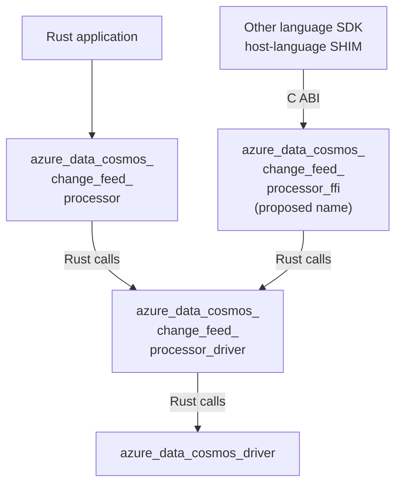

<!-- cspell:ignore checkpointing SHIM SHIMs upcall upcalls reentrancy -->

# Change Feed Processor Package Boundaries

**Status:** Draft; records the proposed package split, not repository approval
**Date:** 2026-10-06
**Updated:** 2026-10-06
**Authors:** Not specified

## Table of Contents

- [1. Context and Scope](#1-context-and-scope)
- [2. Package Split](#2-package-split)
- [3. Responsibility Boundaries](#3-responsibility-boundaries)
- [4. Dependency and API Constraints](#4-dependency-and-api-constraints)
- [5. Alternatives and Consequences](#5-alternatives-and-consequences)
- [6. Integration and Validation](#6-integration-and-validation)
- [7. Open Decisions](#7-open-decisions)
- [8. References](#8-references)

## 1. Context and Scope

The Change Feed Processor needs both an application-facing Rust API and an
execution engine that coordinates distributed processing.

Combining those responsibilities would couple Rust-specific serialization and
callback APIs to lease management and processing coordination. It would also
make reuse by other language SDKs harder.

The design separates processor coordination from ordinary Cosmos DB operations
and avoids making the processor engine depend on the primary Rust SDK. It
extends the existing SDK/driver layering described in
[ADR-0001](../adrs/0001-sdk-driver-native-layering.md), rather than replacing it.

This document records a package split selected in the originating design
discussion. It remains a draft feature specification for repository review:
accepted cross-cutting ADRs remain unchanged.

The scope is package responsibilities, dependency direction, artifact
boundaries, and proposed processing-completion requirements shared by the Rust
and native adapters. A full lease/recovery state machine and native adapter
implementation are outside this document's scope. This proposal does not create
packages, select Cargo features or defaults, establish support guarantees, or
change existing SDK behavior.

## 2. Package Split

Introduce two packages:

- **`azure_data_cosmos_change_feed_processor`**: application-facing Rust API.
- **`azure_data_cosmos_change_feed_processor_driver`**: shared processor
  coordination engine.

These names standardize the earlier design terminology, which referred to the
coordination layer as either an engine or a driver.

### 2.1 Package dependencies

Long package names are explicitly broken across lines to keep diagram nodes
readable. Concatenating each node's lines gives the package name.



The native adapter is a separate architectural surface, not one of the two
packages being introduced here. This document uses
`azure_data_cosmos_change_feed_processor_ffi` as an explicit **proposed package
name**, not an approved third deliverable. Its final name and delivery scope
remain open. It must wrap the processor driver, not the typed processor API.
The arrows between Rust packages represent ordinary Rust dependencies, not FFI
calls.

### 2.2 Why not build the shared engine on `azure_data_cosmos`?

`azure_data_cosmos` (called `azure_cosmos` in earlier discussion) is the
application-facing, typed Rust SDK. For example,
`ContainerClient::query_change_feed<T>` requires
`T: DeserializeOwned + Send + 'static` and returns a typed feed iterator. It is
not the selected baseline for the shared processor engine.

A host-language **SHIM** is the adapter inside a Java, .NET, Go, or Python SDK
that calls the native ABI and translates native results into that language's
API. Raw application payloads must reach this SHIM so it can deserialize using
its own document types, serializers, and change-envelope representation.

An FFI wrapper around a typed Rust API is technically possible, but is rejected
for this design. It would need to choose Rust document representations and then
translate or serialize them again before the host can deserialize. That
introduces a Rust serialization dependency, additional conversion work, and
potential loss of envelope or encoding fidelity. Choosing a generic Rust JSON
value instead of an application struct does not remove that dependency.

The selected baseline is `azure_data_cosmos_driver`, whose `CosmosResponse`
exposes `ResponseBody` payload buffers, status, headers, and diagnostics.
Application document deserialization is not required at this boundary. This
extends [ADR-0002](../adrs/0002-schema-agnostic-driver-boundary.md).

Consequently the two consumption paths are:

```text
Rust:    payload bytes -> Rust processor API -> Rust document types -> callback
Non-Rust: payload bytes -> CFP FFI package -> host SHIM -> host types -> callback
```

Here "raw" means no application-schema deserialization. It does not prohibit
driver-owned wire decoding, bounded envelope processing, or negotiated binary
to text conversion. The SHIM must receive the declared payload shape and
encoding, including change metadata and pre-images where the mode supplies
them; it must not assume every buffer is one text JSON document.

## 3. Responsibility Boundaries

| Package | Responsibilities |
| --- | --- |
| `azure_data_cosmos_change_feed_processor` | Typed change delivery and serialization; application callback API; public request and configuration options; authentication configuration for feed and lease accounts; application-facing diagnostics and error adaptation. |
| `azure_data_cosmos_change_feed_processor_driver` | Workload bootstrap; lease creation, including partition splits and merges; lease ownership lifecycle; coordination between polling, successful processing, and checkpointing. |
| `azure_data_cosmos_driver` (existing) | Database operation execution, including authorization, transport, endpoint routing, region failover, and operation retries. |
| `azure_data_cosmos_change_feed_processor_ffi` (proposed name; separate scope) | Foreign-language ABI, handles, payload ownership, and processing completion adaptation. |

`azure_data_cosmos_driver` is the existing database execution package, not a new
CFP component and not `azure_data_cosmos_driver_native`. The latter exposes the
database driver's C ABI; it does not implement processor lease coordination.
The CFP driver calls the database driver directly in Rust, without going through
that database FFI package.

The processor API accepts authentication configuration; `azure_data_cosmos_driver`
remains responsible for authorization during database execution. Feed
and lease accounts need not be assumed to be the same account.

The processor API owns application-facing diagnostics and error adaptation,
not all diagnostic collection or error classification. It must preserve the
underlying database driver's diagnostic and error information.

Application callbacks belong to the Rust-facing API. The processor driver
nevertheless needs an internal processing contract through which it can observe
completion or failure. That contract, including payload ownership and
cancellation, is outlined as a proposed contract in section 6. The final Rust
trait and C ABI signatures remain unimplemented.

Application document serialization belongs to the consuming SDK. This does not
prohibit the processor driver from serializing engine-owned lease or checkpoint
records; their storage format and compatibility contract remain to be specified.

## 4. Dependency and API Constraints

The following are proposed constraints supporting the package split:

- The processor driver must not depend on the processor API package or
  `azure_data_cosmos`.
- The processor driver must not require application document types or
  Rust-specific application serialization.
- The processor's public API must not inadvertently expose unstable driver
  types and thereby couple their versioning. Use explicit adapters, consistent
  with [ADR-0002](../adrs/0002-schema-agnostic-driver-boundary.md).
- The shared coordination engine must remain callable through ordinary Rust
  interfaces. C ABI concerns belong in the native adapter.
- Database operation execution remains in `azure_data_cosmos_driver`.
  Processor-level recovery must not introduce a parallel HTTP transport or
  duplicate database routing and retry policies.
- Independence from the primary SDK does not mean compatibility with every SDK
  or driver version. Supported dependency ranges must be explicitly defined.

Both packages would be library packages. The Rust-facing package is intended to
provide a publishable Cargo artifact. Whether and when the processor driver is
published, and the support and versioning policies for both packages, remain
open. A future native adapter would have its own ABI and platform-specific
artifact contract.

## 5. Alternatives and Consequences

| Alternative | Tradeoff |
| --- | --- |
| Add the processor directly to `azure_data_cosmos`. | Rejected as the shared baseline: couples delivery to the primary SDK and puts typed Rust serialization below the future FFI boundary rather than leaving application bytes for host SHIMs. |
| Separate processor packages, but have the processor driver depend on `azure_data_cosmos`. | Does not solve the serialization boundary: the shared engine still consumes the typed SDK. Use `azure_data_cosmos_driver` directly instead. |
| One standalone processor package. | Simpler packaging, but combines language-specific APIs with reusable coordination. |
| Separate API and driver packages: selected design direction. | Clear reuse and dependency boundaries, at the cost of adapters, multiple package contracts, and release coordination. |

Separate packages permit independent release policies. They do not automatically
provide compatibility or independent versioning guarantees. Cross-language reuse
also requires a processing and runtime contract; creating a driver package alone
does not provide that capability.

## 6. Integration and Validation

### 6.1 Existing database-driver entry points

The following symbols exist in `azure_data_cosmos_driver`. Their use by the CFP
is **proposed**; the existence of these primitives is not evidence that a
processor or its lease protocol is already implemented.

| CFP need | Existing entry point | Proposed integration and limit |
| --- | --- | --- |
| Feed and lease account access | `CosmosDriverRuntime::create_driver`; `CosmosDriver::resolve_container_by_name` | Resolve each configured account/container through the driver. Separate accounts use their respective credentials and driver instances. No implicit feed-account credentials for the lease account. |
| Scoped change-feed reads | `CosmosOperation::change_feed`; `change_feed_all_versions_and_deletes`; `with_change_feed_start` | Scope an operation to the lease's `FeedRange`. Mode/start support in the driver does not select which modes CFP v1 supports. |
| Feed lifecycle | `CosmosDriver::plan_operation`; `execute_plan` | Retain an `OperationPlan` for the owned range; execute one page at a time. The CFP owns polling cadence and processing admission, not database request retries. |
| Resume position | `OperationPlan::to_continuation_token` | Capture a candidate token at the batch boundary. Persist it only after processing succeeds and the lease update succeeds. It is an opaque plan token, not a substitute raw server ETag. |
| Lease discovery and mutation | `CosmosOperation::query_items`, `read_item`, `create_item`, `replace_item`; `with_body`; `with_precondition`; `Precondition::if_match` | Serialize processor-owned lease records and perform conditional writes via the database driver. Record schema, partition key, fencing, and conflict recovery need a processor protocol. |
| Partition topology | `CosmosDriver::resolve_all_partition_key_ranges` | Map resolved range boundaries into work assignments. `Ok(None)` means topology is unavailable, not that the container has zero work; bootstrap must surface the failure rather than succeed with no leases. |
| Payload and operation evidence | `CosmosResponse::body`, `headers`, `status`, `diagnostics`; `ResponseBody` | Preserve payload shape, encoding, status, and diagnostics at the processor boundary. Only the consuming SDK deserializes application documents. |

Source locations are linked in section 8. Driver dataflow tests already exercise
change-feed continuation/resume and topology behavior. They do not validate CFP
lease acquisition, application acknowledgements, or checkpoint persistence.

### 6.2 Proposed processing-completion contract

Both Rust and FFI consumption need the same distinction between **delivery**,
**processing success**, and **durable checkpoint success**. These are separate
events, not interchangeable meanings of "callback completed."

For each lease, the CFP driver tracks:

- The latest durably committed resume token.
- The delivered batch identity and candidate resume token.
- The current ownership generation and conditional-write version.
- Processing outcome: pending, success, or failure.

Batch identity must bind an acknowledgement to its processor instance, lease,
ownership generation, and delivery attempt. Acknowledgement carries an outcome,
not an arbitrary host-supplied checkpoint token. The driver retains the mapping
to the candidate token.

| Event | Required boundary behavior in the proposed contract |
| --- | --- |
| Driver fetches a batch | Retain payload backing and a candidate token; the durable token remains unchanged. Snapshot failure is explicit and must not silently select a newer position. |
| Rust API or host SHIM receives the batch | Delivery alone cannot authorize a checkpoint. |
| Callback finishes successfully | Mark that batch processed. It becomes checkpoint-eligible only within the current lease ownership generation and without skipping an earlier unprocessed batch. |
| Deserialization or callback fails | Report processing failure; do not persist that batch's candidate token. Application exceptions must be translated into an outcome, not escape across the ABI. |
| Conditional checkpoint write succeeds | Advance the durable token to the associated processed position. |
| Checkpoint write fails or its outcome is uncertain | Do not report a durable commit. Resolve the stored state or resume from the last confirmed checkpoint; successful application side effects may be replayed. |
| Lease ownership is lost | Stop admitting work under that generation. Fence subsequent acknowledgements and writes from the old owner; cancellation cannot undo already performed application side effects. |
| Duplicate, unknown, or old-generation acknowledgement | Return an explicit rejection without advancing progress. |
| Host disconnects or shutdown occurs with processing pending | Do not treat undelivered or unacknowledged work as processed. Cleanup must release retained buffers once no valid host access remains. |

This contract permits replay after processing succeeds but before checkpoint
durability is confirmed. It does not promise exactly-once application side
effects. The final spec must choose retry, draining, and cancellation policies;
those policies may not weaken the processing-before-checkpoint invariant.

### 6.3 Two FFI callback models

The models below are **alternatives, with neither selected**. Both require the
same processing-completion contract. Names such as "acknowledge" below describe
roles, not existing exported CFP functions.

#### Model A: Direct native-to-host upcall

1. The host SHIM registers a C-compatible function pointer and opaque context.
   Neither a Rust closure nor a Java/.NET callback object crosses the ABI.
2. The FFI package invokes that pointer with a batch handle and metadata.
3. The SHIM accesses the raw buffers, deserializes with host serializers, and
   invokes the application callback.
4. For synchronous processing, an agreed return status can report completion.
   For asynchronous processing, returning from the upcall means only that the
   SHIM accepted delivery; it must later acknowledge processing completion.
5. The CFP driver evaluates that outcome against lease ownership before
   persisting an eligible checkpoint.

The SHIM must keep its callback and context alive until callback removal or
shutdown confirms no invocation can still occur. The ABI must define invocation threads
and reentrancy. Java may need thread attachment; .NET delegates must remain
rooted; Go bindings must use permitted callback/context mechanisms rather than
passing arbitrary Go pointers. No host exception or Rust panic may unwind
across the ABI.

Buffers borrowed only for the duration of the upcall cannot be used by an async
callback after return. The ABI must provide retained batch ownership or require
a host copy. Acceptance of an async task is not processing success.

#### Model B: Queue-based delivery and host dispatch

1. The FFI package publishes an owned batch event on a bounded delivery queue.
2. A SHIM receive loop retrieves the event and schedules processing on its own
   language runtime.
3. The SHIM reads the raw buffers, deserializes, and invokes the application
   callback without Rust calling a host function pointer.
4. When the callback's task/future finishes, the SHIM submits success or failure
   for that batch identity through the ABI.
5. The CFP driver checks ownership and progress ordering, then performs an
   eligible conditional checkpoint update.

The completion-queue model in
[`azure_data_cosmos_driver_native`](0020-native-async-invocation.md) is existing
prior art for moving results to a host runtime, not an existing CFP API.
[Specification 0029](0029-native-feed-cursor.md) explicitly says cursor tokens
describe delivery to the wrapper, not application consumption. Reusing its
queue pattern does not supply the new CFP acknowledgement protocol.

The delivery queue must have explicit capacity and admission behavior: a full
or closed queue cannot silently drop a batch or checkpoint it. The host must
retain the event's backing until processing finishes, or copy the payload before
freeing it. Freeing a batch is a memory-management action, not an acknowledgement.

| Concern | Direct upcall | Queue-based delivery |
| --- | --- | --- |
| Callback entry thread | Chosen by native dispatch; attachment and scheduling rules required. | Chosen by the SHIM's receive loop and runtime. |
| Cross-ABI callback lifetime | Function pointer/context registration and quiescent teardown. | Queue, batch, and acknowledgement handles; no function-pointer registration. |
| Asynchronous application processing | Upcall must retain/copy the batch and acknowledge later. | SHIM retains/copies the batch and acknowledges later. |
| Backpressure | Bound outstanding deliveries and prevent callbacks from blocking lease renewal. | Bound queue and in-flight batches; queue saturation must not block lease renewal. |
| Checkpoint authorization | Synchronous processing status or later explicit acknowledgement. | Explicit acknowledgement after host processing. |

Neither model crosses the ABI with a Rust `Future`, host task, application
document type, or Rust trait object. ABI records need explicit versions,
pointer/length or opaque-handle ownership, and release functions. Shutdown must
keep lease liveness work independent of blocked application dispatch.

### 6.4 Planned acceptance scenarios

These tests are requirements for a future implementation, not tests executed by
this documentation change.

| ID | Scenario | Observable assertion |
| --- | --- | --- |
| CFP-01 | Inspect Cargo dependencies. | The processor driver depends on `azure_data_cosmos_driver`, not `azure_data_cosmos` or either processor adapter; no reverse dependency. |
| CFP-02 | Deliver payloads with unknown fields and change metadata through a SHIM harness. | The SHIM receives the declared payload buffers, shape, and encoding without an intervening Rust application-model conversion. Supported pre-images and metadata remain available. |
| CFP-03 | Pause the application callback after batch delivery. | No checkpoint write advances beyond the last processed batch. Merely returning from an async upcall, receiving a queue event, or freeing a buffer cannot advance it. |
| CFP-04 | Fail deserialization or application processing. | Failure is observable; the corresponding candidate token is not persisted. |
| CFP-05 | Complete processing, then fail checkpoint persistence and restart. | Resume uses the last confirmed durable position; replay is allowed, silent skipping is not. |
| CFP-06 | Lose the lease, then submit the old batch acknowledgement. | Old-generation acknowledgement is rejected and cannot authorize a checkpoint write. |
| CFP-07 | Deliver a duplicate or unknown acknowledgement. | Explicit rejection; no second progress transition or unrelated token write. |
| CFP-08 | Return `None` from topology resolution. | Bootstrap reports unavailable topology; it does not declare successful zero-work initialization. |
| CFP-09 | Block host dispatch or fill its delivery capacity. | Admission applies backpressure without dropping work; lease-renewal scheduling remains runnable. Exact timing limits require the final liveness policy. |
| CFP-10 | Shutdown with retained buffers and pending callbacks. | No use-after-free, no new dispatch after quiescent shutdown, and no acknowledgement inferred from teardown. |
| CFP-11 | Lose checkpoint conditional-write ownership. | The processor reports ownership/conflict failure and cannot overwrite the newer owner's state. |

The existing change-feed dataflow tests are reusable evidence for the database
layer only. Processor tests must add controlled callback completions, lease
generation changes, conditional-write failures, and crash/restart fixtures.

## 7. Open Decisions

### 7.1 Established package direction versus proposed contracts

The selected direction from the originating discussion is two processor packages
with the coordination driver below the Rust-facing API. This revision also
records the explicit rationale for selecting `azure_data_cosmos_driver`, not the
typed `azure_data_cosmos`, as the shared execution baseline.

The processing invariants in section 6.2 are proposed reviewable requirements,
not implemented behavior or an accepted ABI. Both FFI delivery models remain
open by explicit author direction. Creating the two packages does not select
either model or approve shipping the third FFI package.

### 7.2 Questions that block specific implementation surfaces

| Decision | Exact unresolved choice | What it blocks |
| --- | --- | --- |
| FFI delivery | Direct upcalls or queue-based delivery; synchronous versus async completion support. | Callback registration or queue ABI, thread rules, and native harness. |
| Public processing contract | Batch identity fields, Rust processing interface, outcome representation, payload encoding/shape contract, and error translation. | Rust API signatures and SHIM adapter implementations. |
| Lease protocol | Lease partition key/schema, ownership generation representation, conditional acquisition/renewal/checkpoint/release rules, and lost-owner fencing. | Durable coordination and checkpoint safety; ETag primitives alone are not a complete protocol. |
| Concurrency and liveness | One or several pending batches per lease; acknowledgement ordering; capacity limits; independent lease-renewal scheduling; poll/renew/expiry timing. | Task layout, backpressure, timing assertions, and retained-memory bounds. |
| Processing failure and shutdown | Retry or stop on callback failure; drain or cancel pending work; timeout/error behavior when the host never acknowledges. | Recovery state machine and quiescent resource cleanup. |
| Feed support | LatestVersion and/or AllVersionsAndDeletes in the first release; allowed fresh starts; empty/idle page handling. | Public configuration validation and change-feed mode tests. |
| Topology and lease evolution | Work assignment granularity, split-child lease initialization, merge handling, and compatibility with existing lease stores. | Bootstrap and rebalance algorithms beyond basic range discovery. |
| Rust runtime ownership | Runtime abstraction for the two Rust packages and who starts/joins background tasks. | Lifecycle APIs; the current database native wrapper's runtime does not settle this choice. |
| Package release | Publication/support policies, versions, supported database-driver dependency ranges, and release-pipeline artifact entries. | Shipping Cargo artifacts, not drafting package responsibilities. |
| Native delivery | Final FFI package name, whether it ships in the first phase, supported targets, and ABI/versioned header contract. | Native library distribution; it is not a prerequisite for a Rust-only first slice. |

Do not read a blank in this table as permission to invent a default. The next
behavioral specification should resolve the processing/lease state machine
before implementing checkpoint persistence. The package split can be reviewed
without pretending those choices are already settled.

## 8. References

- [Project overview](../Project.md)
- [Architecture overview](../Architecture.md)
- [ADR-0001: SDK, driver, and native layering](../adrs/0001-sdk-driver-native-layering.md)
- [ADR-0002: Schema-agnostic driver boundary](../adrs/0002-schema-agnostic-driver-boundary.md)
- [ADR-0003: SDK requires the driver](../adrs/0003-sdk-requires-driver.md)
- [Native async invocation model](0020-native-async-invocation.md)
- [Native feed cursor: delivery versus application consumption](0029-native-feed-cursor.md)
- [Feed operations and dataflow](0012-feed-operations-and-dataflow.md)
- [Typed SDK change-feed API](../../azure_data_cosmos/src/clients/container_client.rs)
- [Database driver planning, execution, container and topology resolution](../../azure_data_cosmos_driver/src/driver/cosmos_driver.rs)
- [Driver runtime and account initialization](../../azure_data_cosmos_driver/src/driver/runtime.rs)
- [Operation factories and preconditions](../../azure_data_cosmos_driver/src/models/cosmos_operation.rs)
- [Conditional-write precondition model](../../azure_data_cosmos_driver/src/models/precondition.rs)
- [Response metadata and raw payload access](../../azure_data_cosmos_driver/src/models/cosmos_response.rs)
- [Response payload shapes](../../azure_data_cosmos_driver/src/models/response_body.rs)
- [Plan continuation snapshots](../../azure_data_cosmos_driver/src/driver/dataflow/pipeline.rs)
- [Existing change-feed resume tests](../../azure_data_cosmos_driver/src/driver/dataflow/integration_tests/change_feed_resume.rs)
