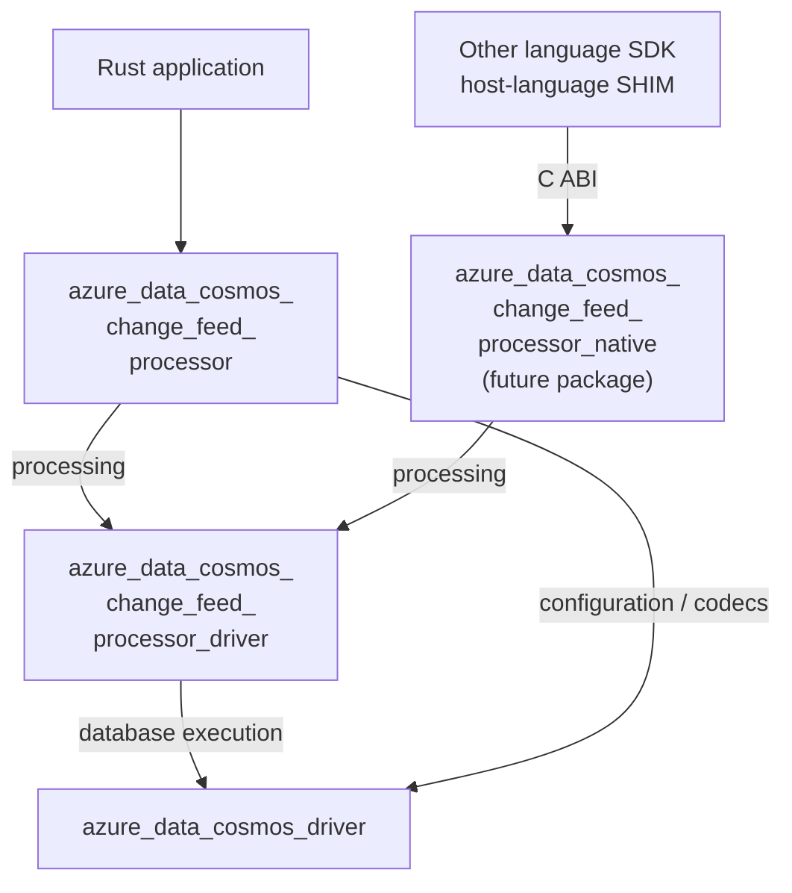

<!-- cspell:ignore SHIM SHIMs checkpointing lockstep -->

# Change Feed Processor Package Boundaries

**Status:** Draft; package decision requested, not repository consensus
**Date:** 2026-10-06
**Updated:** 2026-10-06
**Authors:** Not specified

## Table of Contents

- [1. Motivation and Decision Requested](#1-motivation-and-decision-requested)
- [2. Package Dependencies](#2-package-dependencies)
- [3. Ownership, Reuse, and Duplication](#3-ownership-reuse-and-duplication)
- [4. Callback and Serialization Boundaries](#4-callback-and-serialization-boundaries)
- [5. Alternatives and Compatibility Consequences](#5-alternatives-and-compatibility-consequences)
- [6. Authentication for Feed and Lease Containers](#6-authentication-for-feed-and-lease-containers)

## 1. Motivation and Decision Requested

The Change Feed Processor (CFP) needs an idiomatic Rust API and a shared
coordination engine reusable by other language SDKs. Putting application typing
inside that engine would couple reusable processing to Rust document models and
serialization.

This proposal requests agreement on two library packages:

- **`azure_data_cosmos_change_feed_processor`**: public Rust API.
- **`azure_data_cosmos_change_feed_processor_driver`**: schema-agnostic CFP
  coordination engine.

The engine builds on `azure_data_cosmos_driver`, not the typed
`azure_data_cosmos` SDK. This extends the existing SDK/driver separation to CFP;
it does not establish support or release approval.

This document requests agreement on packages, dependency direction, ownership,
and distribution consequences, including the processing-completion boundary.
It does not detail polling, lease algorithms, checkpoint state machines,
scheduling, an FFI protocol, or implementation tests.

## 2. Package Dependencies



**The public Rust API also directly depends on `azure_data_cosmos_driver`** to
set database request options, associate each feed/lease account with its
credentials, and decode the driver's payload buffers into Rust change events
using its JSON/binary JSON decoding facilities. It reuses these database
capabilities directly instead of adding forwarding APIs to the shared CFP
engine. Processing coordination still belongs to that engine; the public Rust
API does not depend on `azure_data_cosmos`.

`azure_data_cosmos_change_feed_processor_native` is the selected name for a future
Rust FFI wrapper, not an approved third deliverable. It consumes the shared CFP
engine rather than the public Rust API; its placement and distribution remain
open. The existing `azure_data_cosmos_driver_native` wraps database execution,
not CFP coordination. The CFP driver calls `azure_data_cosmos_driver` through
Rust, not through `azure_data_cosmos_driver_native`.

## 3. Ownership, Reuse, and Duplication

Removing a dependency on `azure_data_cosmos` does not remove the capabilities
implemented in `azure_data_cosmos_driver`. Duplication is primarily at the typed
public Rust API, not in transport or database execution.

| Surface | Package ownership and treatment |
| --- | --- |
| Public Rust callback API | `azure_data_cosmos_change_feed_processor` deserializes the change feed response body, invokes the application's `handleChanges` callback, waits for it to finish, and reports success or failure to the shared CFP driver. |
| Shared CFP engine | `azure_data_cosmos_change_feed_processor_driver` owns autonomous polling, bootstrap, lease authority, shared processing-acknowledgement handling, and checkpoint decisions. Rust and native bindings use the same completion operation. It does not invoke the application's typed callback or know the application's document type. |
| Typed change events | For an equivalent SDK event contract, the public Rust API duplicates/adapts `ChangeFeedItem<T>`, `ChangeFeedMetadata`, `ChangeFeedOperationType`, and `LogicalSequenceNumber`, including their custom deserialization behavior. |
| Change-feed-specific public options | The public Rust API provides equivalents/adapters for the relevant `ChangeFeedMode`, `ChangeFeedOptions`, and `FeedOptions` responsibilities, including start-position configuration. Do not copy unrelated options or the entire typed iterator implementation. |
| SDK-only conveniences | Recreate only those the public Rust API promises: for example, `RoutingStrategy::ProximityTo` expansion, SDK binary-option environment/default resolution, and application-facing diagnostics adapters. These are not inherited merely by depending on `azure_data_cosmos_driver`. |
| Database requests | `azure_data_cosmos_driver` sends change-feed reads and lease/checkpoint writes to Cosmos DB. It authenticates each request, selects the endpoint, and handles request retries and regional failover. CFP decides when to issue these operations; it does not duplicate request handling from `azure_data_cosmos_driver`. |
| Wire encoding | Reuse `azure_data_cosmos_driver` binary JSON decoding, encoding, and transcoding facilities. Do not create another codec implementation in either CFP package. |
| Rust FFI wrapper | The proposed `azure_data_cosmos_change_feed_processor_native` exposes a thin C-compatible binding that forwards batch handles and processing outcomes to the shared completion operation. Other language SDKs own application-type decoding and invocation of their application callbacks. |

## 4. Callback and Serialization Boundaries

### 4.1 Callback completion and checkpointing

The consuming SDK owns application callback invocation. The shared CFP driver
owns lease checkpointing. Under this proposed contract, they communicate
through **explicit processing acknowledgements**, following the
consumer-acknowledgement pattern without introducing a message broker.

The driver supplies a raw batch with an opaque batch handle. The SDK
deserializes the changes, invokes the application's `handleChanges` callback,
and waits for the callback's actual work to finish. It then reports success or
failure for that handle. The application still only provides a callback; its
SDK reports the outcome automatically.

```text
CFP driver -> batch + handle -> SDK -> await handleChanges
CFP driver <- handle + processing result <--------------- SDK

Valid success -> conditional checkpoint
Failure or no result -> no checkpoint
```

### 4.2 Why `azure_data_cosmos` is not the shared baseline

`azure_data_cosmos` exposes typed
APIs such as `ContainerClient::query_change_feed<T>`. A host-language SHIM is the
Java/.NET/Go/Python adapter that receives native payloads and invokes its
language's API and serializers. Raw application payloads must reach that SHIM
without first materializing them into Rust application models.

Wrapping a typed Rust API with FFI is technically possible, but is rejected as
this baseline: it would introduce a Rust representation and conversion or
serialization step before host-language decoding. Choosing a generic Rust JSON
value does not remove that coupling. Use `ResponseBody` from `azure_data_cosmos_driver`
buffers and metadata instead.

**Raw means application-schema-agnostic, not text-only or byte-for-byte
untouched.** `azure_data_cosmos_driver` can perform wire decoding, schema-independent
envelope processing, and binary/text conversion. Each consuming Rust API/SHIM
owns application typing and receives the declared payload shape and encoding,
including supported change metadata and previous images.

## 5. Alternatives and Compatibility Consequences

| Alternative | Package tradeoff |
| --- | --- |
| Add CFP to `azure_data_cosmos`, or have the shared CFP engine depend on it. | Couples processor delivery to the typed SDK and places Rust document decoding below the native boundary. Rejected as the shared baseline. |
| Depend on `azure_data_cosmos` only from the public Rust CFP API to reuse event types. | Technically valid without affecting the shared engine or native path, but couples CFP's public types and releases to the primary SDK. Not selected for this draft. |
| One standalone CFP package. | Fewer artifacts, but combines the typed Rust API with reusable coordination and couples their public compatibility surfaces. |
| Two packages over `azure_data_cosmos_driver` (proposed). | Separates typing from coordination and reuses database capabilities; requires adapters and explicit compatible dependency ranges. |
| Route all public Rust API configuration/codec access through the shared CFP engine. | Hides the direct dependency but adds forwarding APIs unrelated to coordination. The proposal instead retains the direct dependency on `azure_data_cosmos_driver`. |

An internal dependency does not require re-exporting its public types. Exposing
a driver option, error, or model in the public Rust API makes that type and
its dependency version part of that API's compatibility contract. Use explicit
adapters by default; any intentional shared public types need a documented
compatibility decision. Package separation alone does not guarantee independent
versioning or compatibility with every version of `azure_data_cosmos` or
`azure_data_cosmos_driver`.

The public Rust API is intended to provide a publishable Cargo source package. Publishing
it to crates.io requires compatible versions of
`azure_data_cosmos_change_feed_processor_driver` and `azure_data_cosmos_driver`
to be available there. A local path dependency is not a distribution substitute. Publication
and release ordering therefore cannot be decided independently, even if support
policies and version cadence differ. A future native package has a separate
platform-library/header and ABI distribution contract.

### 5.1 Why not reuse the typed SDK's types in the public Rust API?

Depending on `azure_data_cosmos` solely from
`azure_data_cosmos_change_feed_processor` could reuse SDK event types and their
deserialization behavior without adding that dependency to the shared CFP
engine or native consumption path. This is a technically valid alternative,
distinct from making the shared engine depend on the typed SDK; FFI does not
make public-Rust-API-only type reuse impossible.

The author-selected direction for this draft instead uses explicit CFP-owned
public models to reduce coupling to the primary SDK's public API and release
lifecycle. Exposing SDK-owned types would make their compatibility part of CFP's
public API contract. Applications and CFP could resolve different SDK versions
or sources, yielding distinct Rust type identities and interoperability problems.
Ordinary diamond dependencies are supported by Cargo: repeated paths to the
same resolved package do not inherently duplicate types, clients, or runtime
instances. The concern is deliberate compatibility coupling, not an intrinsically
unsafe dependency diamond.

Cargo has no special "types-only dependency": using only model APIs still brings
the package's enabled dependency graph. `default-features = false` does not
turn `azure_data_cosmos` into a models-only package, and other dependency paths
may enable additional features.

The cost is maintaining the relevant event types and decoder semantics
identified in the duplication table in section 3. CFP-owned models have distinct
Rust type identities and are not automatically interchangeable with SDK types.
This duplication is a maintenance tradeoff, not a free solution or a guarantee
of complete versioning independence. It is neither repository approval nor a
universal rule for Rust libraries.

## 6. Authentication for Feed and Lease Containers

The application supplies an account endpoint, database name, container name,
and credential for each container. The feed and lease containers may belong to
different accounts and use different credentials.

| Container | Required access |
| --- | --- |
| Feed container | Read changes and the metadata needed to access the change feed. |
| Lease container | Read and write lease documents, including checkpoints. |

The public Rust API uses `azure_data_cosmos_driver` to create a driver with the
supplied account endpoint and credential, then resolve the container by its
database and container names. `azure_data_cosmos_change_feed_processor_driver`
uses these drivers and resolved containers for change-feed reads and lease
writes. If both containers use the same account and credential, they can share
one driver instance. No dependency on `azure_data_cosmos` is required.
