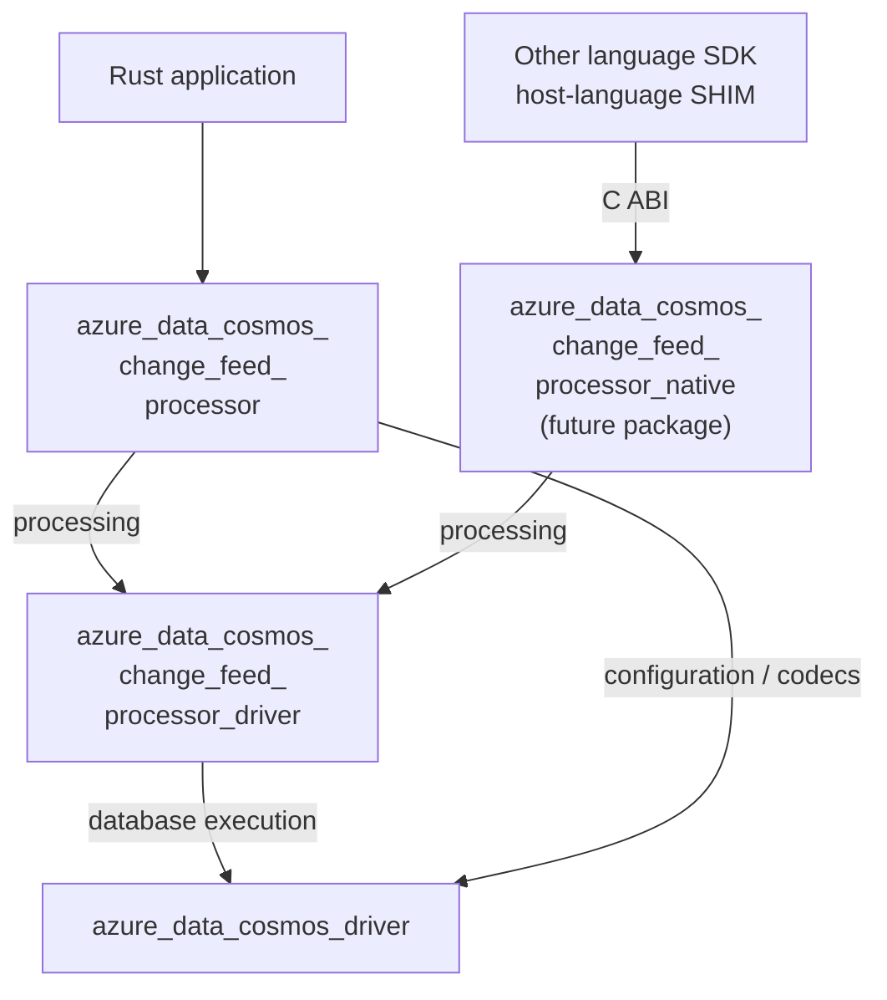

<!-- cspell:ignore SHIM SHIMs -->

# Change Feed Processor Package Boundaries

**Status:** Draft; package decision requested, not repository consensus
**Date:** 2026-10-06
**Updated:** 2026-10-06
**Authors:** Not specified

## Table of Contents

- [1. Motivation and Decision Requested](#1-motivation-and-decision-requested)
- [2. Package Dependencies](#2-package-dependencies)
- [3. Ownership, Reuse, and Duplication](#3-ownership-reuse-and-duplication)
- [4. Callback and Serialization Boundaries](#4-callback-and-serialization-boundaries)
- [5. Alternatives and Compatibility Consequences](#5-alternatives-and-compatibility-consequences)
- [6. Integration Boundary](#6-integration-boundary)
- [7. Package Decisions Still Open](#7-package-decisions-still-open)
- [8. References](#8-references)

## 1. Motivation and Decision Requested

The Change Feed Processor (CFP) needs an idiomatic Rust API and a shared
coordination engine reusable by other language SDKs. Putting application typing
inside that engine would couple reusable processing to Rust document models and
serialization.

This proposal requests agreement on two library packages:

- **`azure_data_cosmos_change_feed_processor`**: typed Rust facade.
- **`azure_data_cosmos_change_feed_processor_driver`**: schema-agnostic CFP
  coordination engine.

The engine builds on `azure_data_cosmos_driver`, not the typed
`azure_data_cosmos` SDK. This applies the existing
[SDK/driver layering decision](../adrs/0001-sdk-driver-native-layering.md) to CFP;
it does not change accepted ADRs or establish support or release approval.

This document requests agreement on packages, dependency direction, ownership,
and distribution consequences. It does not specify polling, lease algorithms,
checkpoint state machines, scheduling, an FFI protocol, or implementation tests.

## 2. Package Dependencies

Concatenating a node's wrapped lines gives its package name. Every package edge
below is a proposed Cargo dependency; only the host-to-FFI edge crosses a C ABI.



**The facade also directly depends on `azure_data_cosmos_driver`** for
configuration, credential binding, and codec access. The author selected this
edge for the proposal; the [prototype manifest][prototype-manifest] already
demonstrates it. This avoids making the CFP driver a forwarding facade for
unrelated database configuration and codecs. It does not move processor
coordination into the facade or introduce a dependency on `azure_data_cosmos`.

`azure_data_cosmos_change_feed_processor_native` is the selected name for a future
separate native adapter, not an approved third deliverable. It consumes the CFP
driver rather than the typed facade; its placement and distribution remain
open. The existing `azure_data_cosmos_driver_native` wraps database execution,
not CFP coordination. The CFP driver calls `azure_data_cosmos_driver` through
Rust, not through that existing database FFI package.

## 3. Ownership, Reuse, and Duplication

Removing a dependency on `azure_data_cosmos` does not remove the capabilities
implemented in `azure_data_cosmos_driver`. Duplication is primarily at the typed
facade, not in transport or database execution.

| Surface | Package ownership and treatment |
| --- | --- |
| Public Rust API and typed application handler | `azure_data_cosmos_change_feed_processor` owns application types, decoding, options, error adaptation, and the handler adapter. |
| CFP coordination | `azure_data_cosmos_change_feed_processor_driver` owns bootstrap, lease coordination, and invocation/completion coordination. It does not know the application's document type. |
| Typed change events | For an equivalent SDK event contract, the facade duplicates/adapts `ChangeFeedItem<T>`, `ChangeFeedMetadata`, `ChangeFeedOperationType`, and `LogicalSequenceNumber`, including their custom deserialization behavior. |
| Change-feed-specific public options | The facade provides equivalents/adapters for the relevant `ChangeFeedMode`, `ChangeFeedOptions`, and `FeedOptions` responsibilities, including start-position configuration. Do not copy unrelated options or the entire typed iterator implementation. |
| SDK-only conveniences | Recreate only those the facade promises: for example, `RoutingStrategy::ProximityTo` expansion, SDK binary-option environment/default resolution, and application-facing diagnostics adapters. These are not inherited merely by depending on the database driver. |
| Request policies and database execution | Reuse `azure_data_cosmos_driver` implementations and driver-owned `OperationOptions`: retries, cross-region routing, hedging, failover, metadata/topology caches, credential binding, and diagnostics data. Public exposure of their types is a separate compatibility decision. |
| Wire encoding | Reuse `azure_data_cosmos_driver` binary JSON decoding, encoding, and transcoding facilities. Do not create another codec implementation in either CFP package. |
| Native adaptation | The proposed `azure_data_cosmos_change_feed_processor_native` owns ABI adaptation between the shared engine and host-language SHIMs, not Rust application typing. |

Copying event declarations alone is insufficient. The
[SDK event decoder](../../azure_data_cosmos/src/models/change_feed_item.rs) distinguishes envelopes
from flat documents, preserves optional metadata and previous images, handles
empty/null delete images, and tolerates unknown operation types. Equivalent
typed behavior requires adapting those semantics as well as the four types.
These copied types have **different Rust type identities**, even when their
definitions match the SDK's; matching wire semantics is not source-level
interchangeability.

## 4. Callback and Serialization Boundaries

### 4.1 The facade adapts typing; the engine coordinates completion

```text
CFP driver -> raw batch -> facade adapter -> typed application callback
CFP driver <- awaited result/error <------- callback completion
```

The facade supplies a raw-batch callable that captures the application handler,
decodes the batch into the facade's event types parameterized by `T`, invokes
the handler, and returns a completion-bearing future. The engine can retain and
invoke that callable and await its result without knowing `T` or depending on
the facade package. The [prototype adapter][prototype-adapter] demonstrates
this boundary; it does not establish a final public signature.

Moving code into a separate crate does not automatically move execution onto
another thread or runtime. This is an ownership and completion boundary, not a
scheduling design. A future native adapter supplies an equivalent raw-payload
and completion/error boundary; its ABI mechanism is not selected here.

### 4.2 Why the typed database SDK is not the shared baseline

`azure_data_cosmos` (called `azure_cosmos` in earlier discussion) exposes typed
APIs such as `ContainerClient::query_change_feed<T>`. A host-language SHIM is the
Java/.NET/Go/Python adapter that receives native payloads and invokes its
language's API and serializers. Raw application payloads must reach that SHIM
without first materializing them into Rust application models.

Wrapping a typed Rust API with FFI is technically possible, but is rejected as
this baseline: it would introduce a Rust representation and conversion or
serialization step before host-language decoding. Choosing a generic Rust JSON
value does not remove that coupling. Use the database driver's `ResponseBody`
buffers and metadata instead, consistent with
[ADR-0002](../adrs/0002-schema-agnostic-driver-boundary.md).

**Raw means application-schema-agnostic, not text-only or byte-for-byte
untouched.** The database driver can perform wire decoding, schema-independent
envelope processing, and binary/text conversion. Each consuming facade/SHIM
owns application typing and receives the declared payload shape and encoding,
including supported change metadata and previous images.

## 5. Alternatives and Compatibility Consequences

| Alternative | Package tradeoff |
| --- | --- |
| Add CFP to `azure_data_cosmos`, or have the shared CFP engine depend on it. | Couples processor delivery to the typed SDK and places Rust document decoding below the native boundary. Rejected as the shared baseline. |
| One standalone CFP package. | Fewer artifacts, but combines the typed Rust API with reusable coordination and couples their public compatibility surfaces. |
| Two packages over `azure_data_cosmos_driver` (proposed). | Separates typing from coordination and reuses database capabilities; requires adapters and explicit compatible dependency ranges. |
| Route all facade configuration/codec access through the CFP driver. | Hides the direct dependency but adds forwarding APIs unrelated to coordination. The proposal instead retains the direct database-driver edge. |

An internal dependency does not require re-exporting its public types. Exposing
a driver option, error, or model in the facade's public API makes that type and
its dependency version part of the facade's compatibility contract. Use explicit
adapters by default; any intentional shared public types need a documented
compatibility decision. Package separation alone does not guarantee independent
versioning or compatibility with every version of the database SDK/driver.

The facade is intended to provide a publishable Cargo source package. Publishing
it to crates.io with a normal dependency on the CFP driver requires a compatible
CFP-driver package available there, as well as its compatible database-driver
dependency. A local path dependency is not a distribution substitute. Publication
and release ordering therefore cannot be decided independently, even if support
policies and version cadence differ. A future native package has a separate
platform-library/header and ABI distribution contract.

## 6. Integration Boundary

Reuse the database driver's feed/dataflow machinery and prepared account/container
bindings rather than copying SDK iterators, database execution, or metadata
caches into CFP. Preserve driver diagnostics data; the facade adapts it for
application-facing diagnostics.

Feed and lease bindings accept independently configured endpoints and credentials.
The CFP retains the prepared driver/container bindings. Database authorization
stays in `azure_data_cosmos_driver`; provider-specific token acquisition and
lifecycle stay with the supplied credential provider. An application may
explicitly reuse a credential authorized for both accounts; there is no implicit
feed-to-lease credential fallback.

`ContainerClient` holds private driver-backed state, not the shared metadata-cache
implementation. Bypassing it does not automatically reuse an existing client's
state. Sharing must use supported, compatible driver/runtime contexts.
`CosmosDriverRuntime::create_driver` creates a fresh driver; compatible drivers
from the same runtime share runtime-owned resources. Retain the required
instances rather than assuming an account singleton.

## 7. Package Decisions Still Open

| Question | Public boundary or distribution consequence |
| --- | --- |
| Which driver types, if any, are exposed by the facade instead of adapted? | Defines source compatibility and constraints on database/CFP-driver dependency upgrades. |
| What typed event and option contract does the facade promise? | Determines which SDK-owned models, decoder semantics, and builder conveniences must be duplicated/adapted. |
| What are each package's publication, support, versioning, and compatible dependency-range policies? | Determines artifacts and coordinated release ordering; facade publication requires its dependency packages to be available. |
| What is the placement and distribution of `azure_data_cosmos_change_feed_processor_native`? | Determines a separate package/ABI artifact boundary without making the typed facade the native baseline; the package name is selected. |

The direct facade-to-database-driver dependency is selected for this proposal,
not an unresolved alternative. Operational CFP behavior and FFI delivery
mechanics are intentionally excluded from this package decision.

## 8. References

- [Project support and package boundaries](../Project.md)
- [Architecture and shared database execution](../Architecture.md)
- [ADR-0001: SDK, driver, and native layering](../adrs/0001-sdk-driver-native-layering.md)
- [ADR-0002: Schema-agnostic driver boundary](../adrs/0002-schema-agnostic-driver-boundary.md)
- [Feed operations and dataflow](0012-feed-operations-and-dataflow.md)
- [Binary encoding](0015-binary-encoding.md)
- [SDK event models and custom decoder](../../azure_data_cosmos/src/models/change_feed_item.rs)
- [SDK option ownership and driver re-exports](../../azure_data_cosmos/src/options/mod.rs)
- [SDK builder adaptation](../../azure_data_cosmos/src/clients/cosmos_client_builder.rs)
- [Container client's private driver-backed state](../../azure_data_cosmos/src/clients/container_client.rs)
- [Driver account and credential binding](../../azure_data_cosmos_driver/src/models/account_reference.rs)
- [Driver runtime and resource sharing](../../azure_data_cosmos_driver/src/driver/runtime.rs)
- [Response payload shapes and codecs](../../azure_data_cosmos_driver/src/models/response_body.rs)
- [Prototype facade dependencies][prototype-manifest]
- [Prototype typed callback adapter][prototype-adapter]

[prototype-manifest]: https://github.com/jeet1995/azure-sdk-for-rust/blob/bbd6dde16ad69e1d4c2c9881d24d5c3a05dff11b/sdk/cosmos/azure_cosmos_change_feed_processor/Cargo.toml
[prototype-adapter]: https://github.com/jeet1995/azure-sdk-for-rust/blob/bbd6dde16ad69e1d4c2c9881d24d5c3a05dff11b/sdk/cosmos/azure_cosmos_change_feed_processor/src/managed_lifecycle.rs#L74-L81
