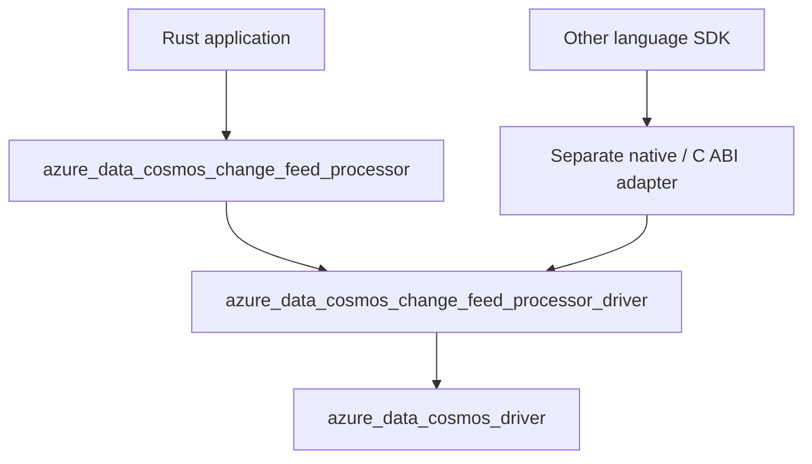

<!-- cspell:ignore checkpointing -->

# Change Feed Processor Package Boundaries

**Status:** Draft; records the proposed package split, not repository approval
**Date:** 2026-10-06
**Authors:** Not specified

## Table of Contents

- [1. Context and Scope](#1-context-and-scope)
- [2. Package Split](#2-package-split)
- [3. Responsibility Boundaries](#3-responsibility-boundaries)
- [4. Dependency and API Constraints](#4-dependency-and-api-constraints)
- [5. Alternatives and Consequences](#5-alternatives-and-consequences)
- [6. Integration and Validation](#6-integration-and-validation)
- [7. Open Decisions](#7-open-decisions)
- [8. References](#8-references)

## 1. Context and Scope

The Change Feed Processor needs both an application-facing Rust API and an
execution engine that coordinates distributed processing.

Combining those responsibilities would couple Rust-specific serialization and
callback APIs to lease management and processing coordination. It would also
make reuse by other language SDKs harder.

The design separates processor coordination from ordinary Cosmos DB operations
and avoids making the processor engine depend on the primary Rust SDK. It
extends the existing SDK/driver layering described in
[ADR-0001](../adrs/0001-sdk-driver-native-layering.md), rather than replacing it.

This document records a package split selected in the originating design
discussion. It remains a draft feature specification for repository review:
accepted cross-cutting ADRs remain unchanged.

The scope is package responsibilities, dependency direction, and artifact
boundaries. Detailed processing behavior and a native adapter implementation are
outside this document's scope. This proposal does not create packages, select
Cargo features or defaults, establish support guarantees, or change existing SDK
behavior.

## 2. Package Split

Introduce two packages:

- **`azure_data_cosmos_change_feed_processor`**: application-facing Rust API.
- **`azure_data_cosmos_change_feed_processor_driver`**: shared processor
  coordination engine.

These names standardize the earlier design terminology, which referred to the
coordination layer as either an engine or a driver.

The intended dependency direction is:

The native adapter is a separate architectural surface, not one of the two
packages being introduced here. Its delivery scope and package name remain open.
The arrows between Rust packages represent ordinary Rust dependencies, not FFI
calls.

## 3. Responsibility Boundaries

| Layer | Responsibilities |
| --- | --- |
| Processor API | Typed change delivery and serialization; application callback API; public request and configuration options; authentication configuration for feed and lease accounts; application-facing diagnostics and error adaptation. |
| Processor driver | Workload bootstrap; lease creation, including partition splits and merges; lease ownership lifecycle; coordination between polling, successful processing, and checkpointing. |
| Existing database driver | Database operation execution, including authorization, transport, endpoint routing, region failover, and operation retries. |
| Separate native adapter | Foreign-language ABI, handles, memory ownership, and callback adaptation. |

The processor API accepts authentication configuration; the existing database
driver remains responsible for authorization during database execution. Feed
and lease accounts need not be assumed to be the same account.

The processor API owns application-facing diagnostics and error adaptation,
not all diagnostic collection or error classification. It must preserve the
underlying database driver's diagnostic and error information.

Application callbacks belong to the Rust-facing API. The processor driver
nevertheless needs an internal processing contract through which it can observe
completion or failure. That contract, including payload ownership and
cancellation, is not defined by this package-boundary specification.

Application document serialization belongs to the consuming SDK. This does not
prohibit the processor driver from serializing engine-owned lease or checkpoint
records; their storage format and compatibility contract remain to be specified.

## 4. Dependency and API Constraints

The following are proposed constraints supporting the package split:

- The processor driver must not depend on the processor API package or
  `azure_data_cosmos`.
- The processor driver must not require application document types or
  Rust-specific application serialization.
- The processor's public API must not inadvertently expose unstable driver
  types and thereby couple their versioning. Use explicit adapters, consistent
  with [ADR-0002](../adrs/0002-schema-agnostic-driver-boundary.md).
- The shared coordination engine must remain callable through ordinary Rust
  interfaces. C ABI concerns belong in the native adapter.
- Database operation execution remains in `azure_data_cosmos_driver`.
  Processor-level recovery must not introduce a parallel HTTP transport or
  duplicate database routing and retry policies.
- Independence from the primary SDK does not mean compatibility with every SDK
  or driver version. Supported dependency ranges must be explicitly defined.

Both packages would be library packages. The Rust-facing package is intended to
provide a publishable Cargo artifact. Whether and when the processor driver is
published, and the support and versioning policies for both packages, remain
open. A future native adapter would have its own ABI and platform-specific
artifact contract.

## 5. Alternatives and Consequences

| Alternative | Tradeoff |
| --- | --- |
| Add the processor directly to `azure_data_cosmos`. | Fewer packages, but couples processor delivery and public API evolution to the primary SDK. |
| One standalone processor package. | Simpler packaging, but combines language-specific APIs with reusable coordination. |
| Separate API and driver packages: selected design direction. | Clear reuse and dependency boundaries, at the cost of adapters, multiple package contracts, and release coordination. |

Separate packages permit independent release policies. They do not automatically
provide compatibility or independent versioning guarantees. Cross-language reuse
also requires a processing and runtime contract; creating a driver package alone
does not provide that capability.

## 6. Integration and Validation

The current Cosmos architecture requires the primary SDK to delegate database
execution to the existing database driver, with no fallback, as recorded in
[ADR-0003](../adrs/0003-sdk-requires-driver.md). The processor should build on
that boundary rather than require a new SDK-to-driver migration.

Implementation requires identifying the database-driver operations needed for
change-feed reads, lease operations, checkpoints, and topology discovery, and
explicitly resolving any missing capabilities. This document does not claim
those capabilities are already sufficient.

Acceptance of the package boundaries should be checked through:

| Requirement | Planned observable check |
| --- | --- |
| Dependency direction | Cargo metadata shows the processor API depending on the processor driver, the processor driver depending on the database driver, and no reverse dependency or processor-driver dependency on the primary SDK. |
| Schema-independent coordination | Driver contract tests exercise processing with opaque application payloads without requiring application document types. |
| Public API isolation | API review checks that public processor signatures do not expose unstable driver types without an explicitly justified exception. |
| Shared database execution | Integration tests exercise change-feed and lease operations through the database driver; inspection confirms there is no processor-owned HTTP execution path. |
| Release contract | Package verification and API review cover the artifacts selected for publication after release policies are agreed. |

These are planned checks, not results of an implementation or test run.

## 7. Open Decisions

- Publication, support, and versioning policies for both new packages.
- Required database-driver operations and their readiness.
- The processor driver's processing-completion and error contracts.
- Async runtime ownership, task cancellation, and shutdown.
- Checkpoint timing, replay guarantees, and behavior after lease loss.
- Lease record compatibility and split/merge handling.
- Native-adapter delivery scope.

The next behavioral specification should define polling, callback completion,
and checkpointing transitions, including failures, lease loss, and shutdown.
Those correctness contracts cannot be established by the package diagram alone.

## 8. References

- [Project overview](../Project.md)
- [Architecture overview](../Architecture.md)
- [ADR-0001: SDK, driver, and native layering](../adrs/0001-sdk-driver-native-layering.md)
- [ADR-0002: Schema-agnostic driver boundary](../adrs/0002-schema-agnostic-driver-boundary.md)
- [ADR-0003: SDK requires the driver](../adrs/0003-sdk-requires-driver.md)
